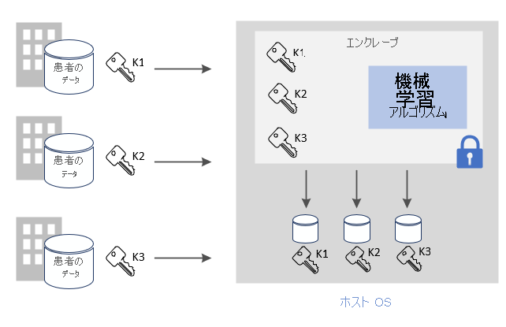
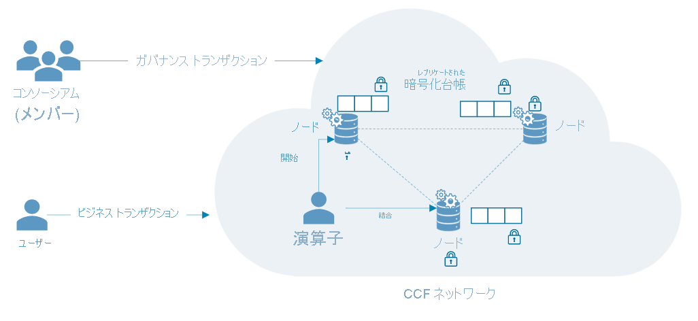

# Azure のコンフィデンシャル コンピューティングの一般的なシナリオ

この記事では、Azure のコンフィデンシャル コンピューティングに関して、いくつかの一般的なシナリオを概説します。 この記事の推奨事項は、コンフィデンシャル コンピューティングのサービスとフレームワークを使用してアプリケーションを開発する際の出発点として利用できます。 

この記事を読むと、次の質問に回答できるようになります。

- Azure のコンフィデンシャル コンピューティングにはどのようなシナリオがあるか。
- マルチパーティーのシナリオで Azure のコンフィデンシャル コンピューティングを使用するとどのような利点があるか。
- ブロックチェーン ネットワークで Azure のコンフィデンシャル コンピューティングを使用するとどのような利点があるか。

## マルチパーティー計算のセキュリティ保護
Azure のコンフィデンシャル コンピューティングでは、入力データが他の当事者に開示されることなく、複数のソースからのデータを処理できます。 マネー ロンダリング対策、不正行為の検出、医療データの安全な分析など、さまざまなシナリオが、この種のセキュアな計算によって可能になります。

こういったデータは、複数のソースから仮想マシン内の 1 つのエンクレーブにアップロードできます。 そのデータに対して計算または処理を実行するよう、いずれかの当事者がエンクレーブに命令します。 どの当事者 (分析を実行している人物でさえ) も、エンクレーブにアップロードされた他の当事者のデータを実際に見ることはできません。 

安全なマルチパーティー計算では、暗号化されたデータがエンクレーブに送信されます。エンクレーブはキーによってそのデータを解読し、分析を実行して、結果を取得します。そして、当事者が指定のキーを使用して解読できるよう暗号化した結果を送り返します。 

**使用中のデータを保護する**: 
- Azure の Intel SGX 対応 DCsv2 シリーズの仮想マシン (VM) を使用します。 これらの VM は、アプリケーションのデータやコードを部分的に保護および分離する、信頼できる実行環境 (TEE) に対応しています。
- エンクレーブ対応 SDK を使用して、仮想マシン内にエンクレーブを作成します。 エンクレーブ内のデータは、VM プロバイダーを含め、だれにも開示されません。 エンクレーブ内のデータは、ハードウェアを利用して暗号化されます。
    - たとえば [OE SDK](https://github.com/openenclave/openenclave) を使用して、サーバー側の処理を実行できます。 

**転送中のデータを保護する** 
- セキュリティ保護チャンネルとして構成証明済みの TLS を使用して、転送中のデータのセキュリティを保証します。
- データはクライアントによって確実に、エンクレーブによって保護された同じサーバーに送信されます。 

**保存データの保護**
- 保存時のデータは、保護された安全なデータ ストアを使用してセキュリティが確保されます。 

### マネー ロンダリング対策
この安全なマルチパーティー計算の例として、複数の銀行が顧客の個人データを開示することなく互いにデータを共有するケースが挙げられます。 銀行は、結合された機密データ セットに対し、合意済みの分析を実行します。 銀行は互いのデータにアクセスすることなく、集約されたデータ セットでの分析によって、あるユーザーが複数の銀行間で行った送金を検出することができます。

コンフィデンシャル コンピューティングを通じて、金融機関は不正行為の検出率を高め、マネー ロンダリングのシナリオに対応できるほか、誤検知を減らし、より大きなデータ セットから継続的に学習することができます。 

### 医薬品の開発
提携する複数の医療施設が、個人の医療データ セットを提供して ML モデルをトレーニングします。 それぞれの施設から見えるのは、その施設のデータ セットだけです。 クラウド プロバイダーも含め、他の施設がデータやトレーニング モデルを見ることはできません。 

トレーニング済みのモデルは、すべての施設に恩恵をもたらします。 モデルの作成に使用するデータを増やせば、モデルの精度は上がります。 モデルのトレーニングに寄与した各施設が、それを使用して有益な結果を得ることが可能です。 

## ブロックチェーン

ブロックチェーン ネットワークは、分散化されたノードのネットワークです。 それらのノードは、ネットワークの状態に関する整合性を確保し、合意形成を執り行うオペレーターまたはバリデーターによって運用、管理されます。 ノードそのものは台帳のレプリカであり、ブロックチェーン トランザクションを追跡する目的で使用されます。 それぞれのノードがトランザクション履歴の完全なコピーを所有することで、分散ネットワークにおける整合性と可用性が確保されます。

コンフィデンシャル コンピューティングを基盤として構築されたブロックチェーン テクノロジでは、ハードウェアベースのプライバシーを使用して、データの秘密保持と安全な計算を実現します。 場合によっては、データ アクセスを保護するために台帳全体が暗号化されます。 ときには、トランザクションそのものが、ノードのエンクレーブ内部にあるコンピューティング モジュール内で実行されることもあります。

### Confidential Consortium Framework (CCF)
[CCF](https://www.microsoft.com/research/project/confidential-consortium-framework/) は、Azure のコンフィデンシャル コンピューティングを基盤として構築された分散ブロックチェーン フレームワークの一例です。 Microsoft Research が指揮を執るこのフレームワークは、信頼できる実行環境 (TEE) の機能を活用して、構成証明用のリモート エンクレーブのネットワークを作成します。 ノードは Azure 仮想マシン ([DCsv2 シリーズ](confidential-computing-enclaves.md)) 上で動作でき、エンクレーブ インフラストラクチャを活用することができます。 ブロックチェーンのユーザーは、構成証明プロトコルを通じて 1 つの CCF ノードの整合性を検証し、実質上、ネットワーク全体を検証することができます。 

CCF では、すべてのネットワーク ノードにわたってレプリケートされるキー値ストアに記録された変更によって分散台帳が成り立っています。 それらの各ノードでは、ブロックチェーンのユーザーが TLS 経由でトリガーできるトランザクション エンジンが稼働します。 エンドポイントをトリガーすると、キー値ストアが変化します。 暗号化された変更は、分散台帳に記録される前に、一定数のノードの承認を得て合意形成されなければなりません。 

## 次の手順
DCsv2 シリーズ仮想マシンを[デプロイ](quick-create-marketplace.md)します。

