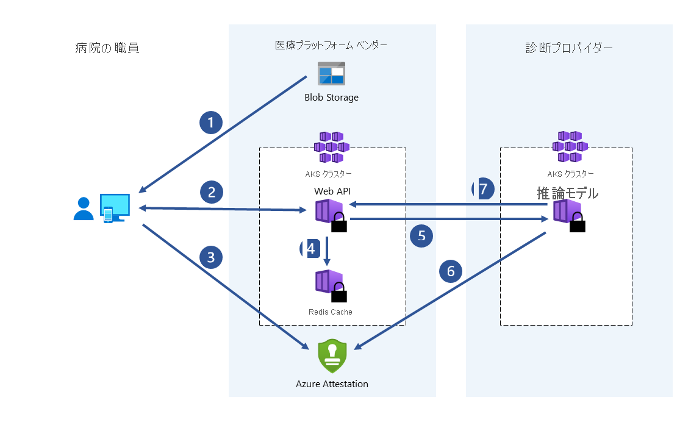

# ユース ケースとシナリオ
コンフィデンシャル コンピューティングは、政府、金融サービス、医療機関などの規制対象業界のデータを保護するために、さまざまなユース ケースに適用されます。 たとえば、機密データへのアクセスを防止することは、機密データを格納するクラウド プロバイダーなど、関係するすべての関係者から市民のデジタル ID を保護するのに役立ちます。 同じ機密データに、児童労働搾取の既知のイメージの検索と削除、人身売買の防止、デジタル フォレンジック捜査の支援に使用される生体認証データが含まれる場合があります。

:::image type="content" source="media/use-cases-scenarios/use-cases.png" alt-text="政府、金融サービス、医療のシナリオなど、Azure コンフィデンシャル コンピューティングのユース ケースのスクリーンショット。":::

この記事では、Azure のコンフィデンシャル コンピューティングに関して、いくつかの一般的なシナリオを概説します。 この記事の推奨事項は、コンフィデンシャル コンピューティングのサービスとフレームワークを使用してアプリケーションを開発する際の出発点として利用できます。

この記事を読むと、次の質問に回答できるようになります。

- Azure Confidential Computing にはどのようなシナリオがありますか?
- Azure Confidential Computing を使用して、複数関係者シナリオ、顧客データのプライバシー、およびブロックチェーン ネットワークを使用する利点は何ですか?

## 動機
Azure Confidential Computing を使用すると、コンフィデンシャル コンピューティングの機能を仮想環境で活用することができます。 安全なハードウェア上で、ツール、ソフトウェア、クラウド インフラストラクチャを使用してビルドを行うことができます。  

**未承認のアクセスを禁止する**: 機密データをクラウドで実行します。 Azure が可能な限り最高のデータ保護を提供し、現在行われているものとほとんどまたはまったく変わらないことを信頼してください。

**法令遵守**:個人情報を保護する政府の規制を満たし、組織 IP をセキュリティで保護するために、クラウドに移行して、データの完全な制御を維持します。

**セキュリティで保護されるものと信頼されていないもののコラボレーション**: 広範なデータ分析と詳細な分析情報を可能にするために、競合他社も含む複数の組織にわたるデータを組み合わせることで、業界全体の作業規模の問題に取り組みます。

**分離された処理**: ブラインド処理によるプライベート データへの負担を除去する新しい機能の製品を提供します。 サービス プロバイダーさえ、ユーザー データを取得できません。 

## マルチパーティー計算のセキュリティ保護

ビジネス取引とプロジェクトの共同作業では、複数の関係者の間で情報を共有する必要があります。 多くの場合、共有されるデータは機密情報です。 データには、個人情報、財務記録、医療記録、プライベート市民データなどがあります。公的および私的な組織では、データが不正アクセスから保護される必要があります。 これらの組織は、コンピューティング インフラストラクチャのオペレーターやエンジニア、セキュリティ アーキテクト、ビジネス コンサルタント、データ科学者からデータを保護する必要がある場合すらあります。

たとえば、医療機器がキャプチャした患者の大規模なデータセットと画像にアクセスできるようになったため、医療サービスへの機械学習の使用は大幅に成長しました。 複数のデータ ソースからの疾病の診断と薬品開発のメリット。 病院と医療機関は、患者の医療記録を一元化された高信頼実行環境 (TEE) で共有し、共同作業を行うことができます。 TEE で実行されている機械学習サービスは、データの集計と分析を行います。 この集計データ分析では、統合データセットのトレーニング モデルにより、より高い予測精度が得られます。 コンフィデンシャル コンピューティングを使用すると、病院は、患者のプライバシーを侵害するリスクを最小限に抑えることができます。

Azure のコンフィデンシャル コンピューティングでは、入力データが他の当事者に開示されることなく、複数のソースからのデータを処理できます。 マネー ロンダリング対策、不正行為の検出、医療データの安全な分析などのシナリオが、この種のセキュアなコンピューティングによって可能になります。

こういったデータは、複数のソースから仮想マシン内の 1 つのエンクレーブにアップロードできます。 そのデータに対して計算または処理を実行するよう、いずれかの当事者がエンクレーブに命令します。 どの当事者 (分析を実行している人物でさえ) も、エンクレーブにアップロードされた他の当事者のデータを見ることはできません。

セキュリティで保護された複数関係者のコンピューティングでは、暗号化されたデータがエンクレーブに入ります。 エンクレーブは、キーを使用してデータを復号化し、分析を実行し、結果を取得して、関係者が指定されたキーを使用して暗号化を解除できる暗号化された結果を返します。

### マネー ロンダリング対策

この安全なマルチパーティー計算の例として、複数の銀行が顧客の個人データを開示することなく互いにデータを共有するケースが挙げられます。 銀行は、結合された機密データ セットに対し、合意済みの分析を実行します。 銀行は互いのデータにアクセスすることなく、集約されたデータ セットでの分析によって、あるユーザーが複数の銀行間で行った送金を検出することができます。

コンフィデンシャル コンピューティングを通じて、金融機関は不正行為の検出率を高め、マネー ロンダリングのシナリオに対応できるほか、誤検知を減らし、より大きなデータ セットから継続的に学習することができます。

:::image type="content" source="media/use-cases-scenarios/mpc-banks.png" alt-text="銀行向けの複数関係者間のデータ共有のグラフィック。コンフィデンシャル コンピューティングによってデータ移動が可能になることが示されています。":::

### 医薬品の開発

提携する複数の医療施設が、個人の医療データ セットを提供して ML モデルをトレーニングします。 それぞれの施設から見えるのは、その施設のデータ セットだけです。 クラウド プロバイダーも含め、他の施設がデータやトレーニング モデルを見ることはできません。 トレーニング済みのモデルは、すべての施設に恩恵をもたらします。 モデルの作成に使用するデータを増やせば、モデルの精度は上がります。 モデルのトレーニングに寄与した各施設が、それを使用して有益な結果を得ることが可能です。

## 強化された顧客データのプライバシー

Microsoft Azure によって提供されるセキュリティ レベルは、クラウド コンピューティング導入を推進する最大の推進力の 1 つになっているにもかかわらず、お客様は、自社のプロバイダーをさまざまな範囲で信頼します。 お客様は次のことを求めています。

- 機密性の高いワークロードのための最小限のハードウェア、ソフトウェア、運用 TCB (信頼されたコンピューティング ベース)。
- ビジネス ポリシーとプロセスだけではなく、技術的な適用。
- 得られる保証、残存リスク、および軽減策についての透明性。

コンフィデンシャル コンピューティングは、クラウドのワークロードを実行するために使用される TCB をお客様が遠隔制御できるようにすることで、この方向性を推進します。 Azure Confidential Computing により、お客様は、ワークロード (データとコード) にアクセスできるすべてのハードウェアとソフトウェアを正確に定義できます。また、この保証を検証して適用するための技術的なメカニズムが提供されます。 つまり、お客様は秘密を完全に制御できます。

### データの主権

政府機関および公的機関では、Azure Confidential Computing は、パブリック クラウドのデータ主権を保護する機能に対する信頼度を高めるためのソリューションです。 さらに、Azure の PaaS サービスには、コンフィデンシャル コンピューティング機能がますます導入されているので、パブリック クラウド サービスが提供するイノベーション機能への影響を軽減することで、この高い信頼性を実現できます。 このような要素の組み合わせにより、Azure Confidential Computing は、政府サービスの主権とデジタル変革のニーズに対して非常に効果的な対応を実現します。

### 信頼チェーンの低減

コンフィデンシャル コンピューティングにおける膨大な投資と革新的なイノベーションにより、クラウド サービス プロバイダーの排除が信頼チェーンから従来にない度合いでできるようになりました。 Azure Confidential Computing は、現在市場で利用可能な最高レベルの主権を提供しています。これにより、お客様および政府は、今日の主権ニーズを満たすことができ、将来もイノベーションを活用できます。

コンフィデンシャル コンピューティングでは、パブリック クラウド デプロイの対象となるワークロードの数を増やすことができます。 これにより、移行と新しいワークロードに対してパブリック サービスが迅速に導入され、顧客のセキュリティ体制が急速に向上し、革新的なシナリオを迅速に実現できます。

### BYOK (Bring Your Own Key) のシナリオ

ハードウェア セキュア モジュール (HSM) を導入することで、保護されたクラウド ストレージ ([Azure Key Vault Managed HSM](\..\key-vault\managed-hsm\overview.md)) へのセキュリティで保護されたキーと証明書を転送できます。このとき、機密情報などへのアクセスがクラウド サービス プロバイダーに許可されることはありません。 転送されるシークレットは、プレーンテキスト形式では HSM の外部に存在することがないため、主権のキーや証明書をクライアントが生成して管理しながらも、クラウドベースの安全な記憶域を使用するシナリオが実現します。

## ブロックチェーンをセキュリティで保護する

ブロックチェーン ネットワークは、分散化されたノードのネットワークです。 それらのノードは、ネットワークの状態に関する整合性を確保し、合意形成を執り行うオペレーターまたはバリデーターによって運用、管理されます。 ノードそのものは台帳のレプリカであり、ブロックチェーン トランザクションを追跡する目的で使用されます。 それぞれのノードがトランザクション履歴の完全なコピーを所有することで、分散ネットワークにおける整合性と可用性が確保されます。

コンフィデンシャル コンピューティングを基盤として構築されたブロックチェーン テクノロジでは、ハードウェアベースのプライバシーを使用して、データの秘密保持と安全な計算を実現します。 場合によっては、データ アクセスを保護するために台帳全体が暗号化されます。 ときには、トランザクションそのものが、ノードのエンクレーブ内部にあるコンピューティング モジュール内で実行されることもあります。
