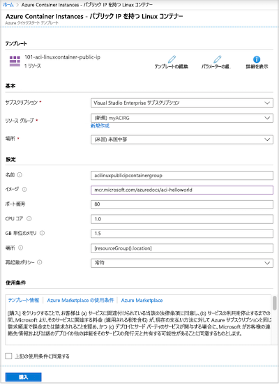
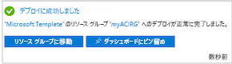
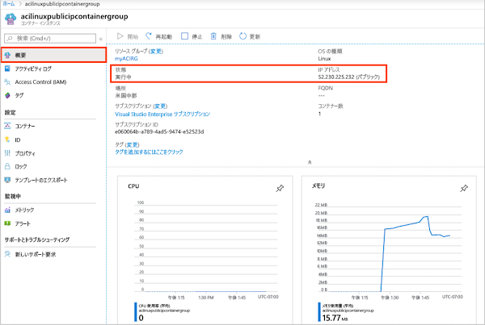
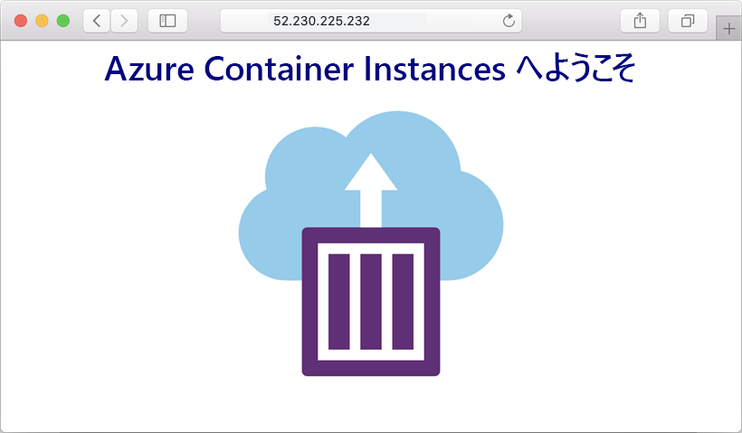
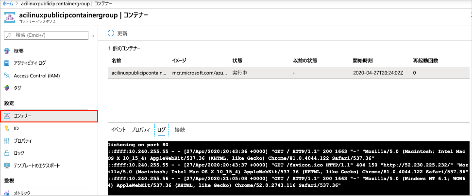

# クイック スタート:Resource Manager テンプレートを使用して Azure にコンテナー インスタンスをデプロイする

サーバーレスの Docker コンテナーを Azure 内で簡単にすばやく実行するには、Azure Container Instances を使用します。 Azure Kubernetes Service のように完全なコンテナー オーケストレーション プラットフォームが不要な場合は、コンテナー インスタンス オンデマンドにアプリケーションをデプロイします。

このクイックスタートでは、Azure Resource Manager テンプレートを使用して、分離された Docker コンテナーをデプロイし、その Web アプリケーションをパブリック IP アドレスを介して使用できるようにします。 

[!INCLUDE [About Azure Resource Manager](../../includes/resource-manager-quickstart-introduction.md)]

Azure サブスクリプションをお持ちでない場合は、開始する前に[無料](https://azure.microsoft.com/free/)アカウントを作成してください。

## 前提条件

[なし] :

## コンテナー インスタンスの作成

### テンプレートを確認する

このクイック スタートで使用されるテンプレートは [Azure クイック スタート テンプレート](https://github.com/Azure/azure-quickstart-templates/tree/master/101-aci-linuxcontainer-public-ip)からのものです。

[!code-json[<Azure Resource Manager template create geo-replicated registry>](~/quickstart-templates/101-aci-linuxcontainer-public-ip/azuredeploy.json)]

テンプレートには、次のリソースが定義されています。

* **[Microsoft.ContainerInstance/containerGroups](/azure/templates/microsoft.containerinstance/containergroups)** : Azure コンテナー グループを作成します。 このテンプレートは、1 つのコンテナー インスタンスから成るグループを定義します。

その他の Azure Container Instances テンプレートのサンプルについては、[クイックスタート テンプレート ギャラリー](https://azure.microsoft.com/resources/templates/?resourceType=Microsoft.Containerinstance&pageNumber=1&sort=Popular)を参照してください。

### テンプレートのデプロイ

 1. Azure にサインインし、テンプレートを開くには次のイメージを選択します。 このテンプレートにより、別の場所にレジストリとレプリカが作成されます。

    

 2. 次の値を選択または入力します。

    * **サブスクリプション**: Azure サブスクリプションを選択します。
    * **リソース グループ**: **[新規作成]** を選択し、リソース グループの一意の名前を入力し、 **[OK]** を選択します。
    * **場所**: リソース グループの場所を選択します。 例:**米国中部**。
    * **名前**: 生成されたインスタンス名を受け入れるか、名前を入力します。
    * **イメージ**: 既定のイメージ名を受け入れます。 このサンプル Linux イメージには、静的な HTML ページを返す、Node.js で作成された小さな Web アプリがパッケージ化されています。 

    残りのプロパティは既定値のままにします。

    使用条件をご確認ください。 同意する場合は **[上記の使用条件に同意する]** を選択します。

    

 3. インスタンスが正常に作成されると、次の通知が表示されます。

    

 テンプレートをデプロイするには Azure portal を使用します。 Azure portal だけでなく、Azure PowerShell、Azure CLI、REST API を使用することもできます。 他のデプロイ方法については、「[テンプレートのデプロイ](../azure-resource-manager/templates/deploy-cli.md)」を参照してください。

## デプロイされているリソースを確認する

Azure portal またはツール ([Azure CLI](container-instances-quickstart.md) など) を使用して、コンテナー インスタンスのプロパティを確認します。

1. ポータルで Container Instances を検索し、作成したコンテナー インスタンスを選択します。

1. **[概要]** ページで、インスタンスの **[状態]** と **[IP アドレス]** を書き留めます。

    

2. 状態が *[実行中]* になったら、ブラウザーでその IP アドレスに移動します。 

    

### コンテナー ログの表示

コンテナー インスタンスのログを表示すると、コンテナーやコンテナーで実行されるアプリケーションの問題をトラブルシューティングする際に役立ちます。

コンテナーのログを表示するには、 **[設定]** で **[コンテナー]**  >  **[ログ]** の順に選択します。 ブラウザーでアプリケーションを表示したときに生成された HTTP GET 要求が表示されます。

## リソースをクリーンアップする

コンテナーを使い終えたら、コンテナー インスタンスの **[概要]** ページで **[削除]** を選択します。 メッセージが表示されたら、削除を確定します。

## 次のステップ

このクイック スタートでは、パブリック Microsoft イメージから Azure コンテナー インスタンスを作成しました。 コンテナー イメージをビルドし、プライベート Azure コンテナー レジストリからデプロイする場合は、Azure Container Instances のチュートリアルに進んでください。

> [!div class="nextstepaction"]
> [チュートリアル:Azure Container Instances へのデプロイに使用するコンテナー イメージを作成する](./container-instances-tutorial-prepare-app.md)

テンプレートの作成手順について説明したチュートリアルについては、次のページを参照してください。

> [!div class="nextstepaction"]
> [チュートリアル:初めての Azure Resource Manager テンプレートを作成およびデプロイする](../azure-resource-manager/templates/template-tutorial-create-first-template.md)