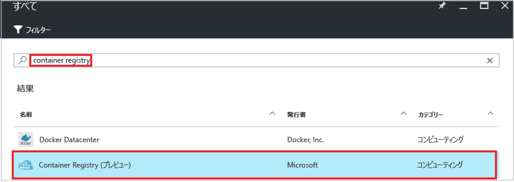
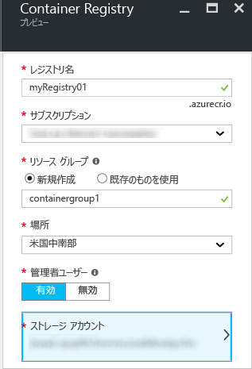
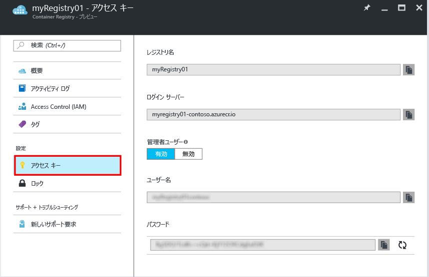

# Azure Portal を使用したプライベート Docker コンテナー レジストリの作成
Azure Portal を使用して、コンテナー レジストリを作成し、その設定を管理します。 コンテナー レジストリの作成と管理は、[Azure CLI 2.0 コマンド](container-registry-get-started-azure-cli.md)を使用するか、Container Registry [REST API](https://go.microsoft.com/fwlink/p/?linkid=834376) を使用してプログラムで行うこともできます。

背景と概念については、[概要](container-registry-intro.md)に関するページを参照してください。

## コンテナー レジストリの作成
1. [Azure Portal](https://portal.azure.com) で、**[+新規]** をクリックします。
2. Marketplace で **Azure コンテナー レジストリ**を検索します。
3. 発行元が **Microsoft** の **[Azure コンテナー レジストリ]** を選択します。
    
4. **[作成]**をクリックします。 **[Azure コンテナー レジストリ]** ブレードが表示されます。

    
5. **[Azure コンテナー レジストリ]** ブレードで、次の情報を入力します。 完了したら、**[作成]** をクリックします。

    a. **[Registry name (レジストリ名)]** - 特定のレジストリのグローバルに一意のトップレベル ドメイン名。 この例のレジストリの名前は *myRegistry01* ですが、独自の一意の名前に置き換えてください。 名前に使用できるのは、アルファベットと数字のみです。

    b. **[リソース グループ]** - 既存の[リソース グループ](../azure-resource-manager/resource-group-overview.md#resource-groups)を選択するか、新しいリソース グループの名前を入力します。

    c. **[場所]** - サービスを[利用可能](https://azure.microsoft.com/regions/services/)な Azure データセンターの場所を選択します (例: **米国中南部**)。

    d. **[Admin user (管理者ユーザー)]** - 必要に応じて、レジストリにアクセスする管理者ユーザーを有効にします。 この設定は、レジストリの作成後に変更できます。

    > [!IMPORTANT]
    > Container Registr では、管理者ユーザー アカウントによるアクセス権の提供だけでなく、Azure Active Directory サービス プリンシパルによる認証もサポートしています。 詳細と考慮事項については、「[Authenticate with a container registry (コンテナー レジストリによる認証)](container-registry-authentication.md)」を参照してください。

    e. **ストレージ アカウント** - 既定の設定を使用して[ストレージ アカウント](../storage/storage-introduction.md)を作成するか、同じ場所にある既存のストレージ アカウントを選択します。 現在、Premium Storage はサポートされていません。

## レジストリ設定の管理
レジストリを作成すると、ポータルの **[Container Registries (コンテナー レジストリ)]** ブレードからレジストリ設定を検索できます。 たとえば、レジストリにログインするための設定が必要な場合や、管理者ユーザーを有効または無効にすることが必要な場合があります。

1. **[Container Registries (コンテナー レジストリ)]** ブレードで、レジストリの名前をクリックします。

    ![[Container Registries (コンテナー レジストリ)] ブレード](./media/container-registry-get-started-portal/container-registry-blade.png)
2. アクセス設定を管理するには、**[アクセス キー]** をクリックします。

    
3. 以下の設定に注意してください。

   * **[Login server (ログイン サーバー)]** - レジストリにログインするために使用する完全修飾名。 この例では `myregistry01.azurecr.io` です。
   * **[Admin user (管理者ユーザー)]** - レジストリの管理者ユーザー アカウントの有効と無効を切り替えます。
   * **[ユーザー名]** と **[パスワード]** - レジストリへのログインに使用できる管理者ユーザー アカウントの資格情報 (有効な場合)。 必要に応じてパスワードを再生成することもできます。 パスワードは 2 つ作成します。これにより、パスワードを再生成している間、もう 1 つのパスワードを使用してレジストリに対する接続を維持することができます。 サービス プリンシパルで認証を行うには、「[プライベート Docker コンテナー レジストリによる認証](container-registry-authentication.md)」を参照してください。

## 次のステップ
* [Docker CLI を使用した最初のイメージのプッシュ](container-registry-get-started-docker-cli.md)

