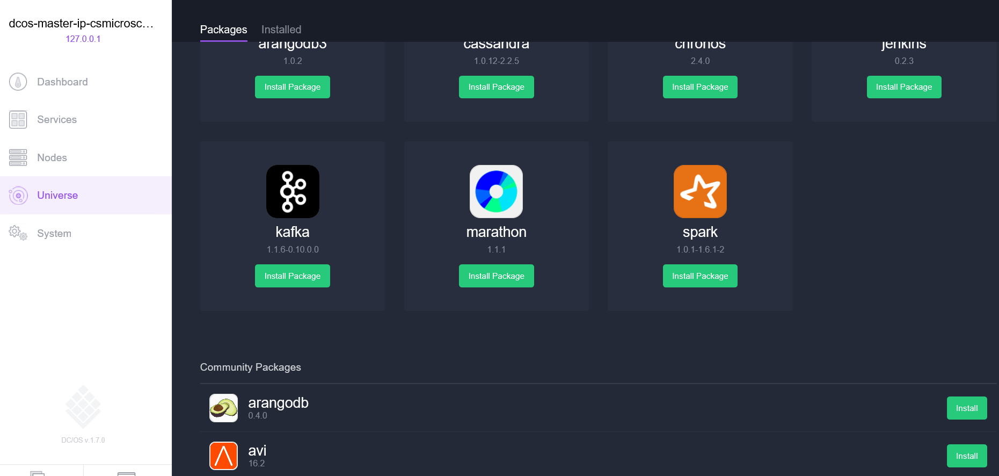
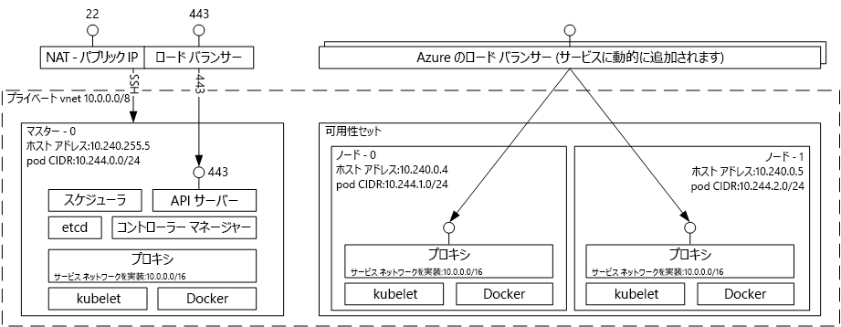

# (非推奨) Azure Container Service を使用した Docker コンテナー ホスティング ソリューションの概要 

[!INCLUDE [ACS deprecation](../../../includes/container-service-deprecation.md)]

Azure Container Service を使用すると、コンテナー化されたアプリケーションを実行するように事前構成されている仮想マシンのクラスターを簡単に作成、構成および管理できます。 Azure Container Service では、評判のよいオープンソースのスケジューリングおよびオーケストレーション ツールの最適化された構成を使用します。 これにより、既存のスキルを使用して、または増え続けている大規模な専門家コミュニティの知恵に頼って、Microsoft Azure にコンテナーベースのアプリケーションをデプロイおよび管理できます。

Azure Container Service では、Docker コンテナー形式を活用し、アプリケーション コンテナーの完全な移植性を保証しています。 また、このようなアプリケーションを何千、何万ものコンテナーに拡張できるように、ユーザーの選択に応じて Marathon と DC/OS、Docker Swarm、または Kubernetes もサポートしています。

Azure Container Service を使用することで、オーケストレーション レイヤーでの移植性も含め、アプリケーションの移植性を維持しながら、エンタープライズ レベルの Azure の機能を活用することができます。

## Azure Container Service の使用
Azure Container Service は、今日お客様に人気のあるオープンソースのツールとテクノロジを使用することで、コンテナー ホスト環境を提供することを目的としています。 これに対応するために、選択したオーケストレーター (DC/OS、Docker Swarm、または Kubernetes) 用の標準 API エンドポイントを公開しています。 これらのエンドポイントを使用することにより、それらのエンドポイントと通信できる任意のソフトウェアを活用できます。 たとえば、Docker Swarm エンドポイントの場合、Docker コマンド ライン インターフェイス (CLI) を使用することができます。 DC/OS の場合は、DCOS CLI を選択できます。 Kubernetes の場合は、`kubectl` を選択できます。

## Azure Container Service を使用した Docker クラスターの作成
Azure Container Service を使用するには、ポータル経由か (Marketplace で **Azure Container Service** を検索)、Azure Resource Manager テンプレート ([Docker Swarm](https://github.com/Azure/azure-quickstart-templates/tree/master/101-acs-swarm)、[DC/OS](https://github.com/Azure/azure-quickstart-templates/tree/master/101-acs-dcos)、または [Kubernetes](https://github.com/Azure/azure-quickstart-templates/tree/master/101-acs-kubernetes)) を使用するか、[Azure CLI](container-service-create-acs-cluster-cli.md) を使用して、Azure Container Service クラスターをデプロイします。 提供されたクイック スタート テンプレートを変更して、Azure の追加または高度な構成を含めることができます。 詳細については、[Azure Container Service クラスターのデプロイ](container-service-deployment.md)に関するページをご覧ください。

## アプリケーションのデプロイ
Azure Container Service では、オーケストレーション用に Docker Swarm、DC/OS、または Kubernetes を選択できます。 アプリケーションをデプロイする方法は、選択したオーケストレーターによって異なります。

### DC/OS の使用
DC/OS は、Apache Mesos 分散システムのカーネルをベースとする分散オペレーティング システムです。 Apache Mesos は、Apache Software Foundation の下で管理されており、そのユーザーや協力会社として [大手 IT 企業](http://mesos.apache.org/documentation/latest/powered-by-mesos/) が名前を連ねています。

DC/OS と Apache Mesos の特筆すべき機能を以下に示します。

* 実証済みのスケーラビリティ
* Apache ZooKeeper を使用したフォールト トレランス機能を備えたレプリケートされたマスターおよびスレーブ
* Docker 形式コンテナーのサポート
* Linux コンテナーを使用したタスク間のネイティブな分離
* (メモリ、CPU、ディスクおよびポートの) マルチリソース スケジューリング
* 新しい並列アプリケーションを開発するための Java、Python、および C++ API
* クラスターの状態を参照するための Web UI

Azure Container Service 上で実行される DC/OS には、ワークロードをスケジューリングするための Marathon オーケストレーション プラットフォームが既定で備わっています。 ただし、ACS の DC/OS のデプロイには、サービスに追加できる Mesosphere Universe サービスが含まれ、 Spark、Hadoop、Cassandra などがこれに含まれます。

#### Marathon の使用
Marathon は、クラスター全体の cgroups (または Azure Container Service の場合は Docker 形式コンテナー) のサービスを、初期化および制御するシステムです。 Marathon には、アプリケーションをデプロイできる Web UI があります。 これには、`http://DNS_PREFIX.REGION.cloudapp.azure.com` のような URL でアクセスできます。
DNS\_PREFIX と REGION はどちらもデプロイ時に定義されます。 独自の DNS 名を作成することも可能です。 Marathon Web UI を使用したコンテナーの実行の詳細については、[Marathon Web UI での DC/OS コンテナー管理](container-service-mesos-marathon-ui.md)に関するページをご覧ください。

Marathon との通信には、REST API を使用することも可能です。 各ツールで利用可能なクライアント ライブラリが多数あります。 さまざまな言語に対応するだけでなく、当然、任意の言語で HTTP プロトコルを使用することもできます。 さらに、Marathon は、多数の人気の DevOps ツールによってもサポートされています。 このため、Azure Container Service クラスターで作業する際に、オペレーション チームに最大限の柔軟性を提供します。 Marathon REST API を使用したコンテナーの実行の詳細については、「[Marathon REST API を使用した DC/OS コンテナー管理](container-service-mesos-marathon-rest.md)」を参照してください。

### Docker Swarm の使用
Docker Swarm は、Docker のネイティブ クラスタリングを提供しています。 Docker Swarm には標準の Docker API があるため、Docker デーモンと既に通信するすべてのツールは Swarm を使用し、Azure Container Service の複数のホストに透過的にスケーリングできます。

[!INCLUDE [container-service-swarm-mode-note](../../../includes/container-service-swarm-mode-note.md)]

Swarm クラスターでコンテナーを管理するためにサポートされているツールには、(これらに限定はされていませんが) 以下があります。

* Dokku
* Docker CLI および Docker Compose
* Krane
* Jenkins

### Kubernetes の使用
Kubernetes は、一般的な運用グレードのオープン ソース コンテナー オーケストレーター ツールです。 この Kubernetes により、コンテナー化されたアプリケーションのデプロイ、スケーリング、および管理が自動化されます。 Kubernetes はオープン ソースのソリューションであり、オープン ソース コミュニティによって推進されているため、Azure Container Service 上でシームレスに実行され、Azure Container Service 上でコンテナーを大規模にデプロイするために使用できます。

Kubernetes には、次に示す豊富な機能セットが用意されています。
* 水平スケーリング
* サービス検出と負荷分散
* シークレットと構成管理
* API ベースの自動化されたロールアウトとロールバック
* 自己復旧

## ビデオ
Azure Container Service の概要 (101):  

> [!VIDEO https://channel9.msdn.com/Shows/Azure-Friday/Azure-Container-Service-101/player]
>
>

Azure Container Service を使用したアプリケーションの構築 (Build 2016)

> [!VIDEO https://channel9.msdn.com/Events/Build/2016/B822/player]
>
>

## 次の手順

[ポータル](container-service-deployment.md)または [Azure CLI](container-service-create-acs-cluster-cli.md) を使用して、コンテナー サービス クラスターをデプロイする。
