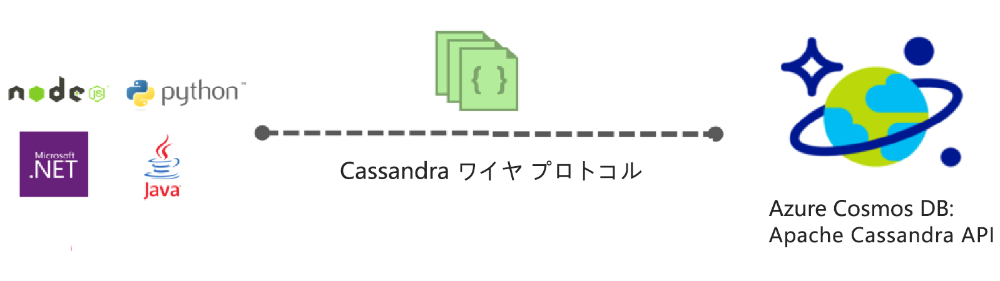
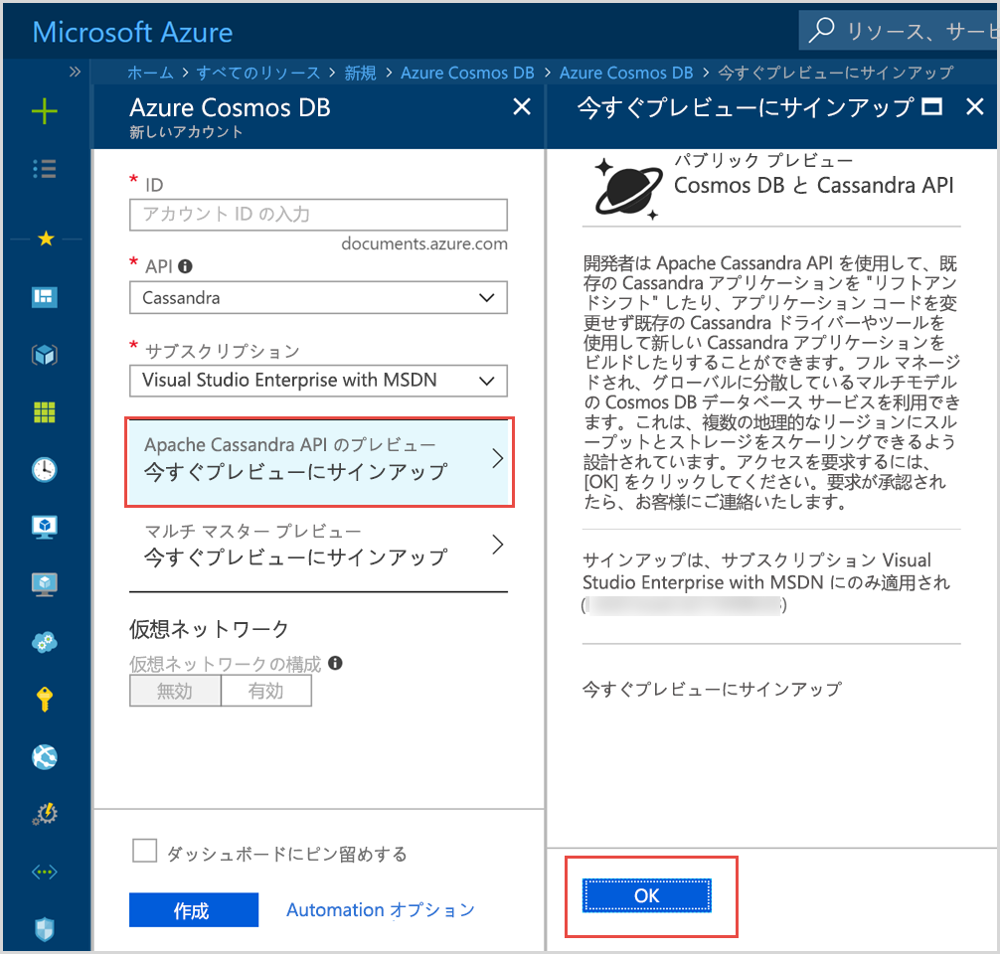

# Azure Cosmos DB の概要: Apache Cassandra API

Azure Cosmos DB には、Apache Cassandra 向けに作成されたアプリケーションの中でも、以下に挙げたような特に高度な機能を必要とするアプリケーションのための Cassandra API (プレビュー) が用意されています。

* [スケーラブルなストレージのサイズとスループット](partition-data.md)。
* [ターンキー グローバル配布](distribute-data-globally.md)
* 99 パーセンタイルで 10 ミリ秒未満の待ち時間。
* [明確に定義された 5 種類の整合性レベル](consistency-levels.md)
* [データのインデックスの自動作成](http://www.vldb.org/pvldb/vol8/p1668-shukla.pdf)。スキーマとインデックスの管理に対処する必要はありません。 
* [業界トップレベルの SLA](https://azure.microsoft.com/support/legal/sla/cosmos-db/) による高可用性の保証

## Azure Cosmos DB の Apache Cassandra API とは

Azure Cosmos DB を [Apache Cassandra](https://cassandra.apache.org/) 向けに作成されたアプリのデータ ストアとして使用するには、Apache Cassandra API を使用します。 つまり、既存の [CQLv4 準拠の Apache ライセンス ドライバー](https://cassandra.apache.org/doc/latest/getting_started/drivers.html?highlight=driver)を使用することで、Cassandra 向けに作成されたアプリケーションが、Azure Cosmos DB の Cassandra API と通信できるようになりました。 多くの場合、接続文字列を変更するだけで、Apache Cassandra の使用から、Azure Cosmos DB の Apache Cassandra API を使用するように切り替えることができます。 この機能を使用すると、既にある Cassandra API のスキルとツールを無駄にすることなく、Azure Cosmos DB のグローバル配布と[包括的な業界トップレベルの SLA](https://azure.microsoft.com/support/legal/sla/cosmos-db) によって、Cassandra API データベース アプリケーションを簡単に作成し、Azure クラウドで実行することができます。

Cassandra API を使用すると、使い慣れた Cassandra クエリ言語ベースのツール (CQLSH など) と Cassandra クライアント ドライバーで、Azure Cosmos DB に格納されたデータを操作できます。 プリンシパル エンジニアリング マネージャー Kirill Gavrylyuk による次の Microsoft Mechanics のビデオで詳細をご覧ください。

> [!VIDEO https://www.youtube.com/embed/1Sf4McGN1AQ]
>

## Azure Cosmos DB 用の Apache Cassandra API を使用するメリット

  **操作の管理が不要**: Cassandra API 管理者は、真のフル マネージド サービスである Azure Cosmos DB により、OS、JVM、および yaml ファイルの他種多様な設定やその相互作用の管理または監視について心配する必要がありません。 Azure Cosmos DB には、スループット、待機時間、ストレージと可用性、および構成可能なアラートの監視機能が用意されています。 

**パフォーマンス管理**: Azure Cosmos DB では、SLA により、99 パーセンタイルで低待機時間の読み取りと書き込みが提供されます。 ユーザーは大きな運用上のオーバーヘッドについて心配せずに、適切な読み取りと書き込み SLA を提供できます。 これには、通常、圧縮のスケジュール設定、廃棄標識の管理、ブルーム フィルター設定、およびレプリカ ラグが含まれます。 Azure Cosmos DB により、こうした問題の管理について心配しなくてもよくなり、アプリケーションの成果物に集中できます。

**自動インデックス作成**: Azure Cosmos DB では、Cassandra API データベースのテーブルの列すべてに対して、インデックスが自動的に作成されます。 Azure Cosmos DB では、クエリの速度を上げるために、セカンダリ インデックスを作成する必要がありません。 一貫性のあるインデックスが自動的に作成され、低待機時間の読み取りと書き込みも実現します。 

**既存のコードとツールを使用可能**: Azure Cosmos DB では、既存の SDK およびツールとのワイヤ プロトコル レベルの互換性が提供されます。 この互換性により、Azure Cosmos DB の Cassandra API を少し変更するだけで、この API を使用して、既存のコードベースを使用できます。

**スループットとストレージの柔軟性**: Azure Cosmos プラットフォームでは、シンプルなポータル、PowerShell、または CLI 操作で、複数のリージョンで保証されたスループットの柔軟性が提供されます。 アプリケーションの成長に合わせて Azure Cosmos DB テーブルのスケールを臨機応変に拡張し、予測したとおりのパフォーマンスをシームレスに確保できます。 Azure Cosmos DB は、実質的に無制限のストレージ サイズにスケールできる Cassandra API テーブルをサポートしています。 

**グローバル配布と可用性**: Azure Cosmos DB では、Azure リージョン全体にデータを配布でき、短い待機時間で可用性が確保されます。 Azure Cosmos DB は、リージョン内では 99.99% の可用性を、リージョン間では 99.999% の読み取り可用性を提供し、操作のオーバーヘッドはありません。 Azure Cosmos DB は、30 を超える [Azure リージョン](https://azure.microsoft.com/regions/services/)で使用できます。 詳細については、[データのグローバル分散](distribute-data-globally.md)に関するページを参照してください。 

**整合性レベルの選択:** Azure Cosmos DB には、整合性とパフォーマンスの最適なトレードオフを実現するために、明確に定義された 5 つの整合性レベルが用意されています。 整合性レベルは、厳密、有界整合性制約、セッション、一貫性のあるプレフィックス、最終的です。 きめ細かな整合性レベルが明確に定義されていることによって、開発者が、整合性、可用性、および待機時間の最適なトレードオフを検討できます。 詳細については、[整合性レベルを使用して可用性とパフォーマンスを最大化する方法](consistency-levels.md)に関するページを参照してください。 

**エンタープライズ グレード**: Azure Cosmos DB は[コンプライアンス認定](https://www.microsoft.com/trustcenter)を提供し、ユーザーが安全にプラットフォームを使用できるようにします。 また、Azure Cosmos DB には、保存時および移動時の暗号化、IP ファイアウォール、およびコントロール プレーン アクティビティの監査ログも用意されています。  

## 今すぐサインアップ 

Azure サブスクリプションを既にお持ちの場合は、[Azure Portal](https://aka.ms/cosmosdb-cassandra-signup) で Cassandra API (プレビュー) プログラムにサインアップして参加できます。  Azure を利用するのが初めての場合は、[無料試用版](https://azure.microsoft.com/free)に新規登録してください。Azure Cosmos DB に 12 か月間無料でアクセスできます。 次の手順を実行して、Cassandra API (プレビュー) プログラムへのアクセスを要求します。

1. [Azure Portal](https://portal.azure.com) で、**[リソースの作成]** > **[データベース]** > **[Azure Cosmos DB]** の順にクリックします。 

2. [新しいアカウント] ページの API ボックスで、**[Cassandra]** を選択します。 

3. **[サブスクリプション]** ボックスで、このアカウントに使用する Azure サブスクリプションを選択します。

4. **[今すぐプレビューにサインアップ]** をクリックします。

    

3. [今すぐプレビューにサインアップ] ウィンドウで、**[OK]** をクリックします。 

    要求を送信すると、[新しいアカウント] ウィンドウの状態が **[承認待ち]** に変わります。 

要求を送信した後、要求が承認されたことを知らせる電子メール通知を待ちます。 大量の要求があるため、通知の受信には 1 週間ほどかかることがあります。 要求を行うためにサポート チケットを作成する必要はありません。 要求は受信された順序で確認されます。 

## ファースト ステップ
プレビュー プログラムに参加できたら、次の 各 Cassandra API クイック スタートに従って、Cassandra API を使用してアプリを作成します。

* [クイック スタート: Node.js と Azure Cosmos DB で Cassandra Web アプリを構築する](create-cassandra-nodejs.md)
* [クイック スタート: Java と Azure Cosmos DB で Cassandra Web アプリを構築する](create-cassandra-java.md)
* [クイック スタート: .NET と Azure Cosmos DB で Cassandra Web アプリを構築する](create-cassandra-dotnet.md)
* [クイック スタート: Python と Azure Cosmos DB で Cassandra Web アプリを構築する](create-cassandra-python.md)

## 次の手順

Azure Cosmos DB の Cassandra API に関する情報は、Azure Cosmos DB ドキュメント全体に組み込まれていますが、開始するためのヒントをいくつか次に示します。

* [クイック スタート](create-cassandra-nodejs.md)に従って、Git サンプルを使用して、アカウントと新しいアプリを作成します
* [チュートリアル](tutorial-develop-cassandra-java.md)に従って、プログラムで新しいアプリを作成します。
* [Cassandra データをインポートするためのチュートリアル](cassandra-import-data.md)に従って、既存のデータを Azure Cosmos DB にインポートします。
* [FAQ](faq.md#cassandra) を読みます。
