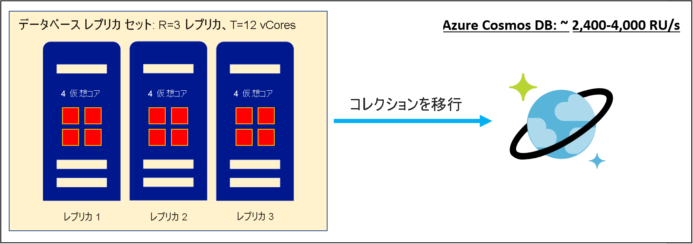
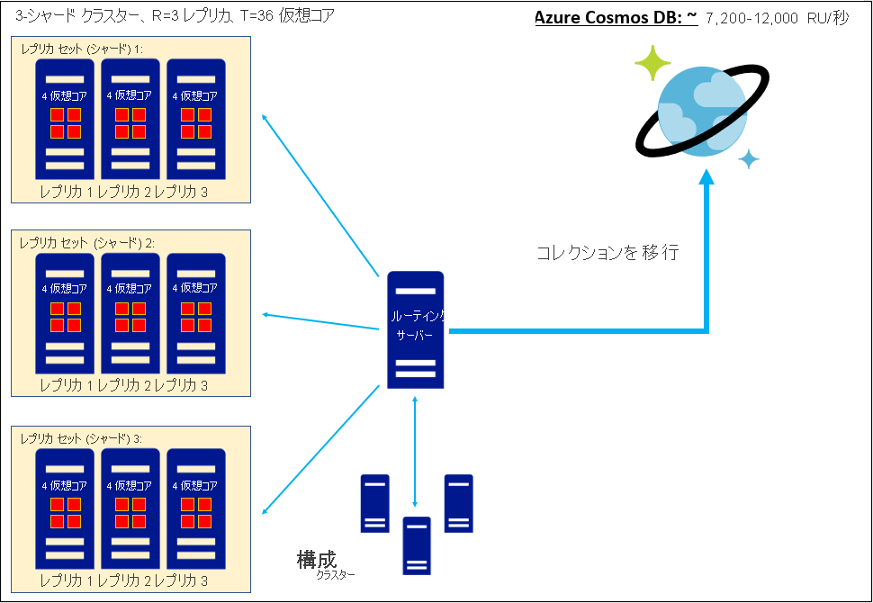
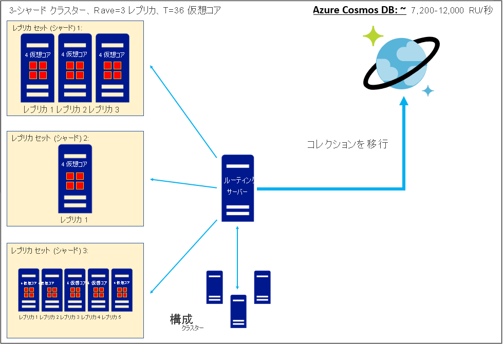

# 非リレーショナル データベースの仮想コア数または vCPU 数を Azure Cosmos DB の RU/秒に変換する
[!INCLUDE[appliesto-sql-api](includes/appliesto-sql-api.md)]
[!INCLUDE[appliesto-mongodb-api](includes/appliesto-mongodb-api.md)]

この記事では、データの移行を検討していて、既存のデータベース レプリカ セットの合計仮想コア数または vCPU 数のみを把握している場合に、Azure Cosmos DB の要求ユニット (RU/秒) を見積もる方法について説明します。 1 つ以上のレプリカ セットを Azure Cosmos DB に移行すると、これらのレプリカ セットに保持されている各コレクションは、4 倍のレプリケーション係数を持つシャード クラスターで構成された Azure Cosmos DB コレクションとして格納されます。 アーキテクチャの詳細については、この[パーティション分割とスケーリングに関するガイド](partitioning-overview.md)を参照してください。 要求ユニットは、コレクションでスループット容量がどのようにプロビジョニングされるかを示します。詳細については、[要求ユニットに関するガイド](request-units.md)と、RU/秒の[プロビジョニングに関するガイド](set-throughput.md)を参照してください。 コレクションを移行すると、Azure Cosmos DB は、プロビジョニングされた要求ユニットを処理してデータを格納するために、十分なシャードをプロビジョニングします。 したがって、コレクションの RU/秒を見積もることは、移行前に計画された Azure Cosmos DB データ資産の範囲を把握するうえで重要な手順です。 この数式は、何千もの顧客の経験に基づいており、仮想コアまたは vCPU からのおおよその開始点の RU/秒を推定するのに役立ちます。 

`
Provisioned RU/s = C*T/R
`

* *T*: 既存のデータベースの **データ関連** レプリカ セットの仮想コア数と vCPU 数の合計。 
* *R*: 既存の **データ関連** レプリカ セットのレプリケーション係数。 
* *C*: 仮想コアまたは vCPU ごとにプロビジョニングする RU/秒の推奨値。 この値は Azure Cosmos DB のアーキテクチャに基づいています。
    * Azure Cosmos DB SQL API の場合は "*C = 600 RU/秒/仮想コア*"
    * MongoDB 用 Azure Cosmos DB API v4.0 の場合は "*C = 1000 RU/秒/仮想コア*"
    * Cassandra API、Gremlin API、またはその他の API に対する *C* の見積もりは現在使用できません

*C* の値は上記のように指定されます。 ***T* は、既存のデータベースのデータ関連の各レプリカ セットの仮想コア数または vCPU 数を調べ、合計を計算することで決定する必要があります。** *T* を見積もることができない場合は、このガイドではなく、[Azure Cosmos DB Capacity Planner を使用した要求ユニットの見積もりに関するガイド](estimate-ru-with-capacity-planner.md)に従ってください。 既存のデータベースのルーティング サーバーまたは構成クラスターに関連付けられている "*仮想コア*" または *vCPU* がある場合、*T* にこれらのコンポーネントを含めることはできません。 

*R* では、データベース レプリカ セットの平均レプリケーション係数を算出することをお勧めします。この情報を利用できない場合は、*R=3* を使用することをお勧めします。 

Azure Cosmos DB 相互運用 API は、SQL API 上で実行され、独自のアーキテクチャを実装しています。このため、MongoDB 用 Azure Cosmos DB API v4.0 の *C* 値は、Azure Cosmos DB SQL API の値とは異なります。

## 作業例: 単一レプリカ セットの移行での RU/秒を見積もる

4 コア サーバー SKU に基づく、レプリケーション係数が *R=3* の単一レプリカ セットについて検討します。 THEN
* *T* = 12 の仮想コア
* *R* = 3

その場合、Azure Cosmos DB SQL API で推奨される要求ユニットは次のようになります

`
Provisioned RU/s, SQL API = (600 RU/s/vCore) * (12 vCores) / (3) = 2,400 RU/s
`

また、MongoDB 用 Azure Cosmos DB API で推奨される要求ユニットは、次のようになります

`
Provisioned RU/s, API for MongoDB = (1,000 RU/s/vCore) * (12 vCores) / (3) = 4,000 RU/s
`

## 作業例: 同種のレプリカ セットのクラスターを移行するときの RU/秒を見積もる

4 コア SKU の各サーバーを使用し、レプリケーション係数 3 の 3 つのレプリカ セットを構成する、シャード化およびレプリケートされたクラスターについて検討します。 THEN
* *T* = 36 の仮想コア
* *R* = 3

その場合、Azure Cosmos DB SQL API で推奨される要求ユニットは次のようになります

`
Provisioned RU/s, SQL API = (600 RU/s/vCore) * (36 vCores) / (3) = 7,200 RU/s
`

また、MongoDB 用 Azure Cosmos DB API で推奨される要求ユニットは、次のようになります

`
Provisioned RU/s, API for MongoDB = (1,000 RU/s/vCore) * (36 vCores) / (3) = 12,000 RU/s
`

## 作業例: 異種レプリカ セットのクラスターを移行するときの RU/秒を見積もる

4 コア SKU に基づく各サーバーを使用し、3 つのレプリカ セットを構成するシャード化およびレプリケートされたクラスターについて検討します。 レプリカ セットが "異種" であるとは、それぞれが異なるレプリケーション係数 (3 倍、1 倍、5 倍) を持つことを意味します。 要求ユニットを計算するときは、平均レプリケーション係数を使用することをお勧めします。 THEN
* *T* = 36 の仮想コア
* *Ravg* = (3+1+5)/3 = 3

その場合、Azure Cosmos DB SQL API で推奨される要求ユニットは次のようになります

`
Provisioned RU/s, SQL API = (600 RU/s/vCore) * (36 vCores) / (3) = 7,200 RU/s
`

また、MongoDB 用 Azure Cosmos DB API で推奨される要求ユニットは、次のようになります

`
Provisioned RU/s, API for MongoDB = (1,000 RU/s/vCore) * (36 vCores) / (3) = 12,000 RU/s
`

## 最も正確な RU/秒の見積もりを取得するためのヒント

"*クラウドで管理されたデータベースからの移行:* " 現在、クラウドで管理されたデータベースを使用している場合、これらのサービスは "*仮想コア*" または *vCPU* のユニット (つまり *T*) でプロビジョニングされているように見えますが、実際にはプロビジョニングするコア数によって、*R* ノードのレプリカ セットの "*仮想コア/レプリカ*" または "*vCPU/レプリカ*" の値 (*T/R*) が設定されます。実際のコア数は、明示的にプロビジョニングしたものよりも *R* 倍多くなります。 この説明が現在のクラウドで管理されたデータベースに当てはまるかどうかを確認することをお勧めします。当てはまる場合は、正確な *T* の推定値を取得するために、プロビジョニング済みの "*仮想コア*" または *vCPU* の公称数に *R* を乗算する必要があります。

"*仮想コアと vCPU:* " この記事では、"仮想コア" と "vCPU" を同義として扱います。そのため、*C* は "*RU/秒/仮想コア*" または "*RU/秒/vCPU*" のユニットを持ち、区別されません。 ただし、実際にはこの簡略化は、状況によっては正確ではない場合があります。 これらの用語は、意味が異なる場合があります。たとえば、物理 CPU でハイパースレッディングがサポートされている場合、"*1 vCPU = 2 仮想コア*" などになる可能性があります。 一般に、"*仮想コア*/*vCPU*" のリレーションシップはハードウェアに依存しているため、既存のクラスター ハードウェアのリレーションシップと、クラスター コンピューティングが "*仮想コア*" と *vCPU* のどちらでプロビジョニングされているかを調査することをお勧めします。 *vCPU* と "*仮想コア*" がハードウェアで異なる意味を持つ場合は、上記の *C* の推定値を "*RU/秒/仮想コア*" のユニットとして扱い、必要に応じて、ハードウェアに適した変換係数を使用して *T* を vCPU から仮想コアに変換することをお勧めします。

## まとめ

"*仮想コア*" または *vCPU* から RU/秒を見積もるには、既存のデータベース レプリカ セットから "*仮想コア*/*vCPU*" の合計とレプリケーション係数に関する情報を収集する必要があります。 その後、"*仮想コア*/*vCPU*" とスループットの間の既知のリレーションシップを使用して、Azure Cosmos DB の要求ユニット (RU/秒) を見積もることができます。 この要求ユニットの推定値を求めることは、移行後の Azure Cosmos DB データ資産のスケールを予測するうえで重要な手順になります。

次の表は、Azure Cosmos DB SQL API および MongoDB 用 API v4.0 の "*仮想コア*" と *vCPU* のリレーションシップをまとめたものです。

| 仮想コア | RU/秒 (SQL API)  (レプリケーション係数 = 3) | RU/秒 (MongoDB 用 API v4.0)  (レプリケーション係数 = 3) |
|-------------|----------------|------------------|
| 3           | 600            |            1000  |
| 6           | 1200            |            2000  |
| 12           | 2400            |            4000  |
| 24           | 4800            |            8000  |
| 48           | 9600            |            16000  |
| 96           | 19200            |            32000  |
| 192           | 38400            |            64000  |
| 384           | 76800            |            128000  |

## 次のステップ
* [Azure Cosmos DB の価格について](https://azure.microsoft.com/pricing/details/cosmos-db/)
* [Azure Cosmos DB のコストを計画および管理する方法について](plan-manage-costs.md)
* [Azure Cosmos DB への移行のオプションを確認する](cosmosdb-migrationchoices.md)
* [Azure Cosmos DB SQL API に移行する](import-data.md)
* [MongoDB 用 Azure Cosmos DB API への移行を計画する](mongodb/pre-migration-steps.md)。 このドキュメントには、計画の完了後に使用できるさまざまな移行ツールへのリンクが含まれています。

[regions]: https://azure.microsoft.com/regions/