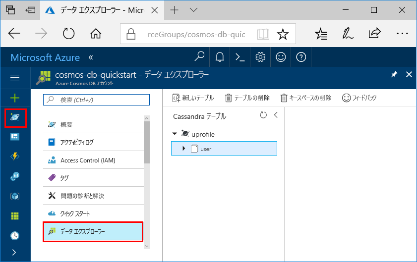

# <a name="quickstart-build-a-cassandra-app-with-java-and-azure-cosmos-db"></a>クイック スタート: Java と Azure Cosmos DB を使用して Cassandra アプリをビルドする

> [!div class="op_single_selector"]
> * [.NET](create-cassandra-dotnet.md)
> * [Java](create-cassandra-java.md)
> * [Node.js](create-cassandra-nodejs.md)
> * [Python](create-cassandra-python.md)
>  

このクイック スタートは、GitHub から例を複製することで、Java と Azure Cosmos DB の [Cassandra API](cassandra-introduction.md) を使用してプロファイル アプリを作成する方法を示します。 このクイック スタートでは、Web ベースの Azure portal を使用して Azure Cosmos DB アカウントを作成する方法も示します。

Azure Cosmos DB は、Microsoft のグローバルに分散されたマルチモデル データベース サービスです。 Azure Cosmos DB の中核をなすグローバルな分散と水平方向のスケール機能を利用して、ドキュメント、テーブル、キーと値、およびグラフ データベースをすばやく作成およびクエリできます。 

## <a name="prerequisites"></a>前提条件

[!INCLUDE [quickstarts-free-trial-note](../../includes/quickstarts-free-trial-note.md)]または、Azure サブスクリプションを使わず、課金も契約もなしで [Azure Cosmos DB を無料で試す](https://azure.microsoft.com/try/cosmosdb/)ことができます。

さらに、次のものが必要です。

* [Java Development Kit (JDK) 1.7 以降](https://aka.ms/azure-jdks)
    * Ubuntu で `apt-get install default-jdk` を実行して JDK をインストールします。
    * 必ず、JDK のインストール先フォルダーを指すように JAVA_HOME 環境変数を設定してください。
* [Maven](https://maven.apache.org/) バイナリ アーカイブの[ダウンロード](https://maven.apache.org/download.cgi)と[インストール](https://maven.apache.org/install.html)
    * Ubuntu で `apt-get install maven` を実行して Maven をインストールします。
* [Git](https://www.git-scm.com/)
    * Ubuntu で `sudo apt-get install git` を実行して Git をインストールします。

## <a name="create-a-database-account"></a>データベース アカウントの作成

ドキュメント データベースを作成するには、Azure Cosmos DB を含んだ Cassandra アカウントを事前に作成しておく必要があります。

[!INCLUDE [cosmos-db-create-dbaccount-cassandra](../../includes/cosmos-db-create-dbaccount-cassandra.md)]

## <a name="clone-the-sample-application"></a>サンプル アプリケーションの複製

次は、コードを使った作業に移りましょう。 GitHub から Cassandra アプリの複製を作成し、接続文字列を設定して実行します。 プログラムでデータを処理することが非常に簡単であることがわかります。 

1. コマンド プロンプトを開きます。 `git-samples` という名前の新しいフォルダーを作成します。 その後、コマンド プロンプトを閉じます。

    ```bash
    md "C:\git-samples"
    ```

2. git bash などの git ターミナル ウィンドウを開いて、`cd` コマンドを使用して、サンプル アプリをインストールする新しいフォルダーに変更します。

    ```bash
    cd "C:\git-samples"
    ```

3. 次のコマンドを実行して、サンプル レポジトリを複製します。 このコマンドは、コンピューター上にサンプル アプリのコピーを作成します。

    ```bash
    git clone https://github.com/Azure-Samples/azure-cosmos-db-cassandra-java-getting-started.git
    ```

## <a name="review-the-code"></a>コードの確認

この手順は省略可能です。 コードでデータベース リソースを作成する方法に関心がある場合は、次のスニペットで確認できます。 関心がない場合は、「[接続文字列の更新](#update-your-connection-string)」に進んでください。 これらのスニペットはすべて `src/main/java/com/azure/cosmosdb/cassandra/util/CassandraUtils.java` ファイルからのものです。  

* Cassandra ホスト、ポート、ユーザー名、パスワード、および SSL オプションが設定されます。 接続文字列情報は、Azure Portal の [接続文字列] ページから取得されます。

   ```java
   cluster = Cluster.builder().addContactPoint(cassandraHost).withPort(cassandraPort).withCredentials(cassandraUsername, cassandraPassword).withSSL(sslOptions).build();
   ```

* `cluster` は Azure Cosmos DB Cassandra API に接続し、アクセスするセッションを返します。

    ```java
    return cluster.connect();
    ```

次のスニペットは、`src/main/java/com/azure/cosmosdb/cassandra/repository/UserRepository.java` ファイルからのものです。

* 新しいキースペースを作成します。

    ```java
    public void createKeyspace() {
        final String query = "CREATE KEYSPACE IF NOT EXISTS uprofile WITH replication = {'class': 'SimpleStrategy', 'replication_factor': '3' } ";
        session.execute(query);
        LOGGER.info("Created keyspace 'uprofile'");
    }
    ```

* 新しいテーブルを作成します。

   ```java
   public void createTable() {
        final String query = "CREATE TABLE IF NOT EXISTS uprofile.user (user_id int PRIMARY KEY, user_name text, user_bcity text)";
        session.execute(query);
        LOGGER.info("Created table 'user'");
   }
   ```

* 準備されたステートメント オブジェクトを使用してユーザー エンティティを挿入します。

    ```java
    public PreparedStatement prepareInsertStatement() {
        final String insertStatement = "INSERT INTO  uprofile.user (user_id, user_name , user_bcity) VALUES (?,?,?)";
        return session.prepare(insertStatement);
    }

    public void insertUser(PreparedStatement statement, int id, String name, String city) {
        BoundStatement boundStatement = new BoundStatement(statement);
        session.execute(boundStatement.bind(id, name, city));
    }
    ```

* すべてのユーザー情報を取得するクエリを実行します。

    ```java
   public void selectAllUsers() {
        final String query = "SELECT * FROM uprofile.user";
        List<Row> rows = session.execute(query).all();

        for (Row row : rows) {
            LOGGER.info("Obtained row: {} | {} | {} ", row.getInt("user_id"), row.getString("user_name"), row.getString("user_bcity"));
        }
    }
    ```

* 単一ユーザーの情報を取得するクエリを実行します。

    ```java
    public void selectUser(int id) {
        final String query = "SELECT * FROM uprofile.user where user_id = 3";
        Row row = session.execute(query).one();

        LOGGER.info("Obtained row: {} | {} | {} ", row.getInt("user_id"), row.getString("user_name"), row.getString("user_bcity"));
    }
    ```

## <a name="update-your-connection-string"></a>接続文字列を更新する

ここで Azure Portal に戻り、接続文字列情報を取得し、アプリにコピーします。 アプリはこの接続文字列の詳細によって、ホストされているデータベースと通信できます。

1. [Azure portal](https://portal.azure.com/) で **[接続文字列]** を選択します。 

    ![Azure Portal の [接続文字列] ページからユーザー名を表示してコピー](./media/create-cassandra-java/keys.png)

2. 画面右側の  ボタンを使用して [CONTACT POINT]\(コンタクト ポイント\) の値をコピーします。

3. `C:\git-samples\azure-cosmosdb-cassandra-java-getting-started\java-examples\src\main\resources` フォルダーの `config.properties` ファイルを開きます。 

3. 2 行目の `<Cassandra endpoint host>` にポータルのコンタクト ポイントの値を貼り付けます。

    config.properties の 2 行目は次のようになります。 

    `cassandra_host=cosmos-db-quickstart.cassandra.cosmosdb.azure.com`

3. ポータルに戻り、[ユーザー名] の値をコピーします。 4 行目の `<cassandra endpoint username>` にポータルの [ユーザー名] の値を貼り付けます。

    config.properties の 4 行目は次のようになります。 

    `cassandra_username=cosmos-db-quickstart`

4. ポータルに戻り、[パスワード] の値をコピーします。 5 行目の `<cassandra endpoint password>` にポータルの [パスワード] の値を貼り付けます。

    config.properties の 5 行目は次のようになります。 

    `cassandra_password=2Ggkr662ifxz2Mg...==`

5. 特定の SSL 証明書を使用する場合は、6 行目の `<SSL key store file location>` を SSL 証明書の場所に置き換えます。 値が指定されない場合、<JAVA_HOME>/jre/lib/security/cacerts にインストールされている JDK 証明書が使用されます。 

6. 特定の SSL 証明書を使用するように 6 行目を変更した場合は、その証明書のパスワードを使用するように 7 行目を更新します。 

7. `config.properties` ファイルを保存します。

## <a name="run-the-java-app"></a>Java アプリを実行する

1. Git ターミナル ウィンドウで、`azure-cosmosdb-cassandra-java-getting-started\java-examples` フォルダーに `cd` します。

    ```git
    cd "C:\git-samples\azure-cosmosdb-cassandra-java-getting-started\java-examples"
    ```

2. Git ターミナル ウィンドウで、次のコマンドを使用して、`cosmosdb-cassandra-examples.jar` ファイルを生成します。

    ```git
    mvn clean install
    ```

3. git ターミナル ウィンドウで、次のコマンドを実行して Java アプリケーションを起動します。

    ```git
    java -cp target/cosmosdb-cassandra-examples.jar com.azure.cosmosdb.cassandra.examples.UserProfile
    ```

    ターミナル ウィンドウに、キースペースとテーブルが作成されたという通知が表示されます。 その後、テーブル内のすべてのユーザーが選択されて戻されます。次に、出力が表示され、ID で行が選択されて値が表示されます。  

    Ctrl + C キーを押してプログラムの実行を停止し、コンソール ウィンドウを閉じます。

4. Azure portal で **Data Explorer** を開き、この新しいデータのクエリ、変更、操作を行います。 

    

## <a name="review-slas-in-the-azure-portal"></a>Azure Portal での SLA の確認

[!INCLUDE [cosmosdb-tutorial-review-slas](../../includes/cosmos-db-tutorial-review-slas.md)]

## <a name="clean-up-resources"></a>リソースのクリーンアップ

[!INCLUDE [cosmosdb-delete-resource-group](../../includes/cosmos-db-delete-resource-group.md)]

## <a name="next-steps"></a>次の手順

このクイックスタートでは、データ エクスプローラーを使って Azure Cosmos DB アカウント、Cassandra データベース、コンテナーを作成する方法について説明しました。また、同じことを行うアプリをプログラムから実行する方法についても説明しました。 これで、Azure Cosmos DB コンテナーに追加のデータをインポートできます。 

> [!div class="nextstepaction"]
> [Azure Cosmos DB への Cassandra データのインポート](cassandra-import-data.md)
