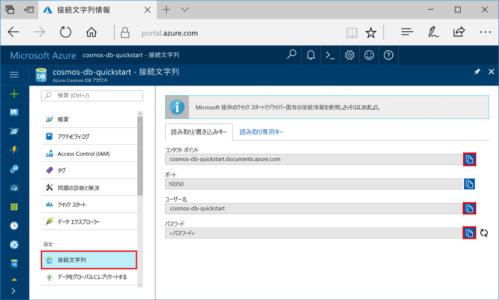
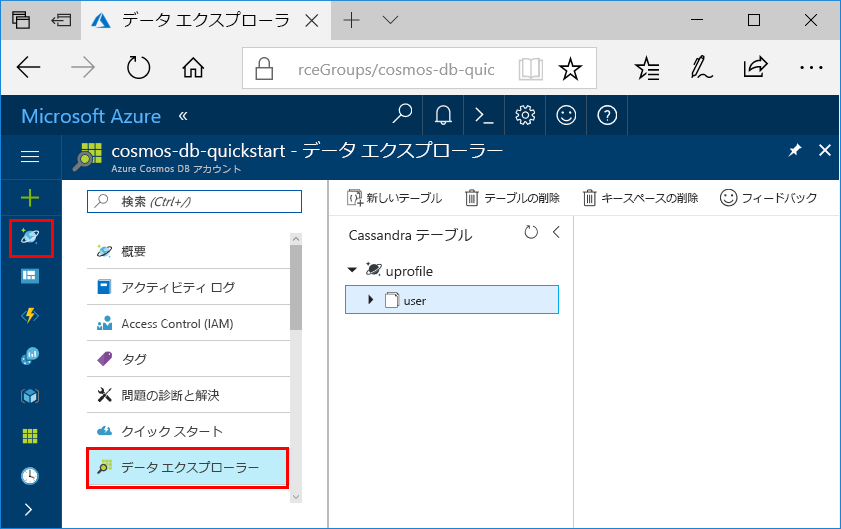

# <a name="quickstart-build-a-cassandra-app-with-python-and-azure-cosmos-db"></a>クイック スタート:Python と Azure Cosmos DB で Cassandra アプリを構築する

> [!div class="op_single_selector"]
> * [.NET](create-cassandra-dotnet.md)
> * [Java](create-cassandra-java.md)
> * [Node.js](create-cassandra-nodejs.md)
> * [Python](create-cassandra-python.md)
>  

このクイックスタートでは、GitHub から例を複製することで、Python と Azure Cosmos DB の [Cassandra API](cassandra-introduction.md) を使ってプロファイル アプリを作成する方法を示します。 このクイック スタートでは、Web ベースの Azure portal を使用して Azure Cosmos DB アカウントを作成する方法も示します。

Azure Cosmos DB は、Microsoft のグローバルに分散されたマルチモデル データベース サービスです。 Azure Cosmos DB の中核をなすグローバルな分散と水平方向のスケール機能を利用して、ドキュメント、テーブル、キーと値、およびグラフ データベースをすばやく作成およびクエリできます。

## <a name="prerequisites"></a>前提条件

[!INCLUDE [quickstarts-free-trial-note](../../includes/quickstarts-free-trial-note.md)]または、Azure サブスクリプションを使わず、課金も契約もなしで [Azure Cosmos DB を無料で試す](https://azure.microsoft.com/try/cosmosdb/)ことができます。

さらに、次のものが必要です。
* [Python](https://www.python.org/downloads/) バージョン v2.7.14
* [Git](https://git-scm.com/)
* [Apache Cassandra 用 Python ドライバー](https://github.com/datastax/python-driver)

## <a name="create-a-database-account"></a>データベース アカウントの作成

ドキュメント データベースを作成するには、Azure Cosmos DB を含んだ Cassandra アカウントを事前に作成しておく必要があります。

[!INCLUDE [cosmos-db-create-dbaccount-cassandra](../../includes/cosmos-db-create-dbaccount-cassandra.md)]

## <a name="clone-the-sample-application"></a>サンプル アプリケーションの複製

GitHub から Cassandra API アプリを複製し、接続文字列を設定して実行します。 プログラムでデータを処理することが非常に簡単であることがわかります。 

1. コマンド プロンプトを開きます。 `git-samples` という名前の新しいフォルダーを作成します。 その後、コマンド プロンプトを閉じます。

    ```bash
    md "C:\git-samples"
    ```

2. git bash などの git ターミナル ウィンドウを開いて、`cd` コマンドを使用して、サンプル アプリをインストールする新しいフォルダーに変更します。

    ```bash
    cd "C:\git-samples"
    ```

3. 次のコマンドを実行して、サンプル レポジトリを複製します。 このコマンドは、コンピューター上にサンプル アプリのコピーを作成します。

    ```bash
    git clone https://github.com/Azure-Samples/azure-cosmos-db-cassandra-python-getting-started.git
    ```

## <a name="review-the-code"></a>コードの確認

この手順は省略可能です。 コードでデータベース リソースを作成する方法に関心がある場合は、次のスニペットで確認できます。 スニペットはすべて pyquickstart.py ファイルから取得します。 関心がない場合は、「[接続文字列の更新](#update-your-connection-string)」に進んでください。 

* ユーザー名とパスワードの値は、Azure portal の接続文字列ページを使って設定されています。 `path\to\cert` では、X509 証明書へのパスを指定します。 

   ```python
    ssl_opts = {
            'ca_certs': 'path\to\cert',
            'ssl_version': ssl.PROTOCOL_TLSv1_2
            }
    auth_provider = PlainTextAuthProvider( username=cfg.config['username'], password=cfg.config['password'])
    cluster = Cluster([cfg.config['contactPoint']], port = cfg.config['port'], auth_provider=auth_provider, ssl_options=ssl_opts)
    session = cluster.connect()
   
   ```

* `cluster` は、contactPoint の情報で初期化されます。 ContactPoint は、Azure Portal から取得されます。

    ```python
   cluster = Cluster([cfg.config['contactPoint']], port = cfg.config['port'], auth_provider=auth_provider)
    ```

* `cluster` は、Azure Cosmos DB の Cassandra API に接続します。

    ```python
    session = cluster.connect()
    ```

* 新しいキースペースが作成されます。

    ```python
   session.execute('CREATE KEYSPACE IF NOT EXISTS uprofile WITH replication = {\'class\': \'NetworkTopologyStrategy\', \'datacenter1\' : \'1\' }')
    ```

* 新しいテーブルが作成されます。

   ```
   session.execute('CREATE TABLE IF NOT EXISTS uprofile.user (user_id int PRIMARY KEY, user_name text, user_bcity text)');
   ```

* キー/値エンティティが挿入されます。

    ```Python
    insert_data = session.prepare("INSERT INTO  uprofile.user  (user_id, user_name , user_bcity) VALUES (?,?,?)")
    session.execute(insert_data, [1,'Lybkov','Seattle'])
    session.execute(insert_data, [2,'Doniv','Dubai'])
    session.execute(insert_data, [3,'Keviv','Chennai'])
    session.execute(insert_data, [4,'Ehtevs','Pune'])
    session.execute(insert_data, [5,'Dnivog','Belgaum'])
    ....
    
    ```

* クエリを実行して、すべてのキー値を取得します。

    ```Python
    rows = session.execute('SELECT * FROM uprofile.user')
    ```  
    
* クエリを実行して、キーの値を取得します。

    ```Python
    
    rows = session.execute('SELECT * FROM uprofile.user where user_id=1')
    ```  

## <a name="update-your-connection-string"></a>接続文字列を更新する

ここで Azure Portal に戻り、接続文字列情報を取得し、アプリにコピーします。 アプリはこの接続文字列によって、ホストされているデータベースと通信できます。

1. [Azure portal](https://portal.azure.com/) で **[接続文字列]** を選択します。 

    画面右側の  ボタンを使って、一番上にある [CONTACT POINT]\(コンタクト ポイント\) の値をコピーします。

    

2. `config.py` ファイルを開きます。 

3. 10 行目の `<FILLME>` にポータルのコンタクト ポイントの値を貼り付けます。

    10 行目は次のようになります。 

    `'contactPoint': 'cosmos-db-quickstarts.cassandra.cosmosdb.azure.com:10350'`

4. ポータルの [USERNAME]\(ユーザー名\) の値をコピーし、6 行目の `<FILLME>` に貼り付けます。

    6 行目は次のようになります。 

    `'username': 'cosmos-db-quickstart',`
    
5. ポータルの [PASSWORD]\(パスワード\) の値をコピーし、8 行目の `<FILLME>` に貼り付けます。

    8 行目は次のようになります。

    `'password' = '2Ggkr662ifxz2Mg==`';`

6. config.py ファイルを保存します。
    
## <a name="use-the-x509-certificate"></a>X509 証明書を使う

1. Baltimore CyberTrust Root 証明書を [https://cacert.omniroot.com/bc2025.crt](https://cacert.omniroot.com/bc2025.crt) からローカルにダウンロードします。 ファイル拡張子 `.cer` を使用して、ファイルの名前を変更します。

   証明書のシリアル番号は `02:00:00:b9`、SHA1 フィンガープリントは `d4🇩🇪20:d0:5e:66:fc:53:fe:1a:50:88:2c:78:db:28:52:ca:e4:74` です。

2. `pyquickstart.py` を開き、`path\to\cert` を新しい証明書を指すように変更します。

3. `pyquickstart.py` を保存します。

## <a name="run-the-python-app"></a>Python のアプリを実行する

1. Git ターミナルで cd コマンドを使用して、`azure-cosmos-db-cassandra-python-getting-started` フォルダーに変更します。 

2. 次のコマンドを実行して、必要なモジュールをインストールします。

    ```python
    python -m pip install cassandra-driver
    python -m pip install prettytable
    python -m pip install requests
    python -m pip install pyopenssl
    ```

2. 次のコマンドを実行して、node アプリケーションを開始します。

    ```
    python pyquickstart.py
    ```

3. コマンド ラインから予想される結果を確認します。

    Ctrl + C キーを押してプログラムの実行を停止し、コンソール ウィンドウを閉じます。 

    
    
4. Azure portal で **Data Explorer** を開き、この新しいデータのクエリ、変更、操作を行います。 

    

## <a name="review-slas-in-the-azure-portal"></a>Azure Portal での SLA の確認

[!INCLUDE [cosmosdb-tutorial-review-slas](../../includes/cosmos-db-tutorial-review-slas.md)]

## <a name="clean-up-resources"></a>リソースのクリーンアップ

[!INCLUDE [cosmosdb-delete-resource-group](../../includes/cosmos-db-delete-resource-group.md)]

## <a name="next-steps"></a>次の手順

このクイック スタートでは、Azure Cosmos DB アカウントを作成し、データ エクスプローラーを使用してコンテナーを作成し、アプリを実行する方法を説明しました。 これで、Cosmos DB アカウントに追加のデータをインポートできます。 

> [!div class="nextstepaction"]
> [Azure Cosmos DB への Cassandra データのインポート](cassandra-import-data.md)

