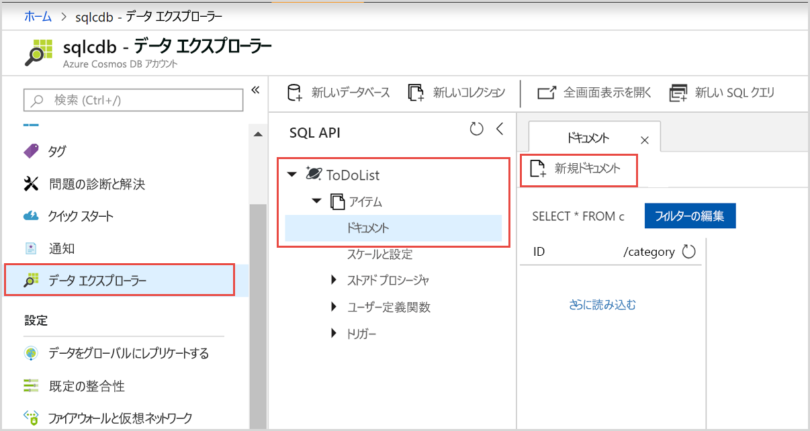

# <a name="quickstart-create-an-azure-cosmos-account-container-and-items-with-the-azure-portal"></a>クイック スタート:Azure portal を使用して Azure Cosmos のアカウント、コンテナー、および項目を作成する

> [!div class="op_single_selector"]
> * [Azure Portal](create-cosmosdb-resources-portal.md)
> * [.NET](create-sql-api-dotnet.md)
> * [Java](create-sql-api-java.md)
> * [Node.js](create-sql-api-nodejs.md)
> * [Python](create-sql-api-python.md)
> * [Xamarin](create-sql-api-xamarin-dotnet.md)
>  

Azure Cosmos DB、Microsoft のグローバルに配布されるマルチモデル データベース サービスです。 Azure Cosmos DB を使用して、キー/値データベース、ドキュメント データベース、およびグラフ データベースをすばやく作成し、クエリを実行できます。そのすべてで、Azure Cosmos DB の中核をなすグローバル配布と水平方向のスケール機能を活用します。 

このクイック スタートでは、Azure portal を使用して、Azure Cosmos DB [SQL API](sql-api-introduction.md) アカウント、ドキュメント データベース、コレクションを作成し、データをコレクションに追加する方法を説明します。 

## <a name="prerequisites"></a>前提条件

Azure サブスクリプションまたは Azure Cosmos DB の無料試用版アカウント
- [!INCLUDE [quickstarts-free-trial-note](../../includes/quickstarts-free-trial-note.md)] 

- [!INCLUDE [cosmos-db-emulator-docdb-api](../../includes/cosmos-db-emulator-docdb-api.md)]  

<a id="create-account"></a>
## <a name="create-an-azure-cosmos-db-account"></a>Azure Cosmos DB アカウントを作成する

[!INCLUDE [cosmos-db-create-dbaccount](../../includes/cosmos-db-create-dbaccount.md)]

<a id="create-collection-database"></a>
## <a name="add-a-database-and-a-collection"></a>データベースとコレクションの追加 

Azure portal のデータ エクスプローラーを使用してデータベースとコレクションを作成できます。 

1.  ご使用の Azure Cosmos DB アカウント ページの左側のナビゲーションで **[データ エクスプローラー]** を選択し、 **[新しいコンテナー]** を選択します。 
    
    **[コンテナーの追加]** ウィンドウを表示するために、右へスクロールする必要がある場合があります。
    
    ![Azure portal の [データ エクスプローラー] の [コレクションの追加] ウィンドウ](./media/create-sql-api-dotnet/azure-cosmosdb-data-explorer-dotnet.png)
    
1.  **[コンテナーの追加]** ウィンドウで、新しいコレクションの設定を入力します。
    
    |Setting|推奨値|説明
    |---|---|---|
    |**[データベース ID]**|ToDoList|新しいデータベースの名前として *ToDoList* を入力します。 データベース名は 1 文字以上 255 文字以内にする必要があります。`/, \\, #, ?` は使えず、末尾にスペースを入れることもできません。 **[Provision database throughput]\(データベース スループットをプロビジョニングする\)** オプションをオンにすると、データベースにプロビジョニングされたスループットをデータベース内のすべてのコンテナーにわたって共有できます。 このオプションは、コストの削減にも役立ちます。 |
    |**スループット**|400|スループットを 400 要求ユニット/秒 (RU/秒) のままにします。 待ち時間を短縮する場合、後でスループットをスケールアップできます。| 
    |**コンテナー ID**|項目|新しいコレクションの名前として*項目*を入力します。 コレクション ID には、データベース名と同じ文字要件があります。|
    |**パーティション キー**| /category| この記事で説明するサンプルでは、 */category* をパーティション キーとして使用します。|

    
    この例では、**一意のキー**を追加しません。 一意のキーを使用すると、パーティション キーごとに 1 つまたは複数の値の一意性を確保して、データベースにデータ整合性のレイヤーを追加できます。 詳細については、[Azure Cosmos DB における一意のキー](unique-keys.md)に関するページをご覧ください。
    
1.  **[OK]** を選択します。 作成した新しいデータベースとコンテナーがデータ エクスプローラーに表示されます。

## <a name="add-data-to-your-database"></a>ご自分のデータベースにデータを追加する

データ エクスプローラーを使用して、ご自分の新しいデータベースにデータを追加します。

1. **データ エクスプローラー**で、**ToDoList** データベースを展開し、**Items** コンテナーを展開します。 次に、 **[項目]** を選択し、 **[新しい項目]** を選択します。 
   
   
   
1. **[ドキュメント]** ウィンドウの右側でドキュメントに次の構造を追加します。

     ```json
     {
         "id": "1",
         "category": "personal",
         "name": "groceries",
         "description": "Pick up apples and strawberries.",
         "isComplete": false
     }
     ```

1. **[保存]** を選択します。
   
   ![json データをコピーし、Azure portal のデータ エクスプローラーで [保存] を選択する](./media/create-sql-api-dotnet/azure-cosmosdb-save-document.png)
   
1. **[新しいドキュメント]** をもう一度選択し、一意の `id` に加え、必要なその他のプロパティと値を指定したもう 1 つのドキュメントを作成して保存します。 Azure Cosmos DB では、データにスキーマが課されないため、ご自分のドキュメントは任意の構造にすることができます。

## <a name="query-your-data"></a>データのクエリ

[!INCLUDE [cosmos-db-create-sql-api-query-data](../../includes/cosmos-db-create-sql-api-query-data.md)] 

## <a name="clean-up-resources"></a>リソースのクリーンアップ

[!INCLUDE [cosmosdb-delete-resource-group](../../includes/cosmos-db-delete-resource-group.md)]

## <a name="next-steps"></a>次の手順

このクイック スタートでは、Azure Cosmos DB アカウントを作成し、データ エクスプローラーを使用してデータベースとコンテナーを作成する方法を説明しました。 これで、Azure Cosmos DB アカウントに追加のデータをインポートできるようになりました。 

> [!div class="nextstepaction"]
> [Azure Cosmos DB へのデータのインポート](import-data.md)