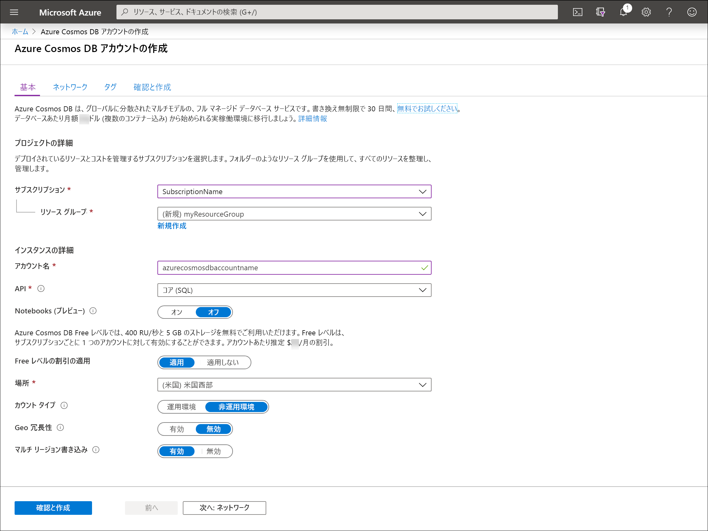
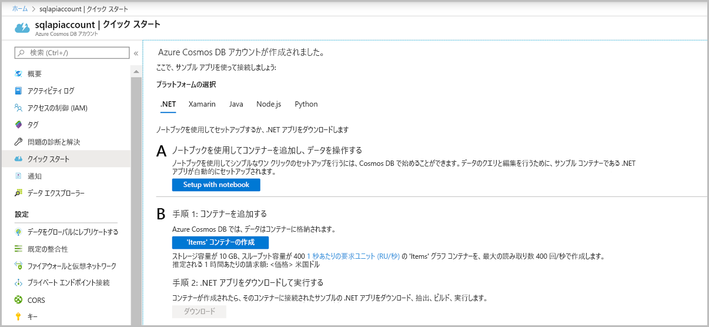

# <a name="quickstart-create-an-azure-cosmos-account-database-container-and-items-from-the-azure-portal"></a>クイック スタート:Azure portal を使用して Azure Cosmos のアカウント、データベース、コンテナー、および項目を作成する

> [!div class="op_single_selector"]
> * [Azure Portal](create-cosmosdb-resources-portal.md)
> * [.NET](create-sql-api-dotnet.md)
> * [Java](create-sql-api-java.md)
> * [Node.js](create-sql-api-nodejs.md)
> * [Python](create-sql-api-python.md)
> * [Xamarin](create-sql-api-xamarin-dotnet.md)
>  

Azure Cosmos DB は、Microsoft のグローバルに分散されたマルチモデル データベース サービスです。 Azure Cosmos DB を使用して、キー/値データベース、ドキュメント データベース、およびグラフ データベースをすばやく作成し、クエリを実行できます。そのすべてで、Azure Cosmos DB の中核をなすグローバル配布と水平方向のスケール機能を活用します。 

このクイックスタートでは、Azure portal を使用して、Azure Cosmos DB [SQL API](sql-api-introduction.md) アカウント、ドキュメント データベース、コンテナーを作成し、データをコンテナーに追加する方法を説明します。 

## <a name="prerequisites"></a>前提条件

Azure サブスクリプションまたは Azure Cosmos DB の無料試用版アカウント
- [!INCLUDE [quickstarts-free-trial-note](../../includes/quickstarts-free-trial-note.md)] 

- [!INCLUDE [cosmos-db-emulator-docdb-api](../../includes/cosmos-db-emulator-docdb-api.md)]  

<a id="create-account"></a>
## <a name="create-an-azure-cosmos-db-account"></a>Azure Cosmos DB アカウントを作成する

[Azure portal](https://portal.azure.com/) に移動して、Azure Cosmos DB アカウントを作成します。 **[Azure Cosmos DB]** を検索して、選択します。

   ![Azure Portal の [データベース] ウィンドウ](./media/create-cosmosdb-resources-portal/find-nosql-cosmosdb-marketplace.png)

1. **[追加]** を選択します。
1. **[Azure Cosmos DB アカウントの作成]** ページで、新しい Azure Cosmos アカウントの基本的な設定を入力します。 

    |設定|値|説明 |
    |---|---|---|
    |サブスクリプション|サブスクリプション名|この Azure Cosmos アカウントに使用する Azure サブスクリプションを選択します。 |
    |リソース グループ|リソース グループ名|リソース グループを選択するか、 **[新規作成]** を選択し、新しいリソース グループの一意の名前を入力します。 |
    |アカウント名|一意の名前|自分の Azure Cosmos アカウントを識別するための名前を入力します。 指定した名前に *documents.azure.com* が付加されて URI が作成されるので、一意の名前を使用してください。<br><br>名前に含めることができるのは、英小文字、数字、ハイフン (-) のみです。 長さは 3 文字から 31 文字でなければなりません。|
    |API|作成するアカウントの種類。|ドキュメント データベースを作成し、SQL 構文を使用してクエリを実行するには、 **[コア (SQL)]** を選択します。 <br><br>API によって、作成するアカウントの種類が決まります。 Azure Cosmos DB には、5 種類の API が用意されています。ドキュメント データ用のコア (SQL) と MongoDB、グラフ データ用の Gremlin、Azure Table、Cassandra です。 現在は、API ごとに別のアカウントを作成する必要があります。 <br><br>[SQL API について詳しくは、こちらをご覧ください](introduction.md)。|
    |Apply Free Tier Discount (Free レベルの割引の適用)|[適用] または [適用しない]|Azure Cosmos DB Free レベルのアカウントでは、最初の 400 RU/秒と 5 GB のストレージを無料でご利用いただけます。 [Free レベル](https://azure.microsoft.com/pricing/details/cosmos-db/)の詳細を確認してください。|
    |場所|ユーザーに最も近いリージョン|Azure Cosmos DB アカウントをホストする地理的な場所を選択します。 データに最も高速にアクセスできるよう、お客様のユーザーに最も近い場所を使用します。|
    |アカウントの種類|[運用] または [Non-Production]\(非運用\)|アカウントが運用ワークロードに使用される場合は、 **[運用]** を選択します。 アカウントが非運用環境 (開発、テスト、QA、ステージングなど) に使用される場合は、 **[Non-Production]\(非運用\)** を選択します。 これは、ポータルでの操作を調整する Azure リソース タグの設定ですが、基になる Azure Cosmos DB アカウントには影響しません。 この値は、いつでも変更できます。|


> [!NOTE]
> Azure サブスクリプションにつき所有できる Free レベルの Azure Cosmos DB アカウントは 1 つまでです。また、アカウントの作成時にオプトインする必要があります。 Free レベルの割引を適用するオプションが表示されない場合は、サブスクリプション内の別のアカウントが Free レベルで既に有効になっていることを意味します。
   
   

1. **[Review + create]\(レビュー + 作成\)** を選択します。 **[ネットワーク]** セクションと **[タグ]** セクションはスキップできます。

1. アカウントの設定を確認し、 **[作成]** を選択します。 アカウントの作成には数分かかります。 ポータル ページに "**デプロイが完了しました**" と表示されるまで待ちます。 

    ![Azure Portal の [通知] ウィンドウ](./media/create-cosmosdb-resources-portal/azure-cosmos-db-account-deployment-successful.png)

1. **[リソースに移動]** を選択し、Azure Cosmos DB アカウント ページに移動します。 

    

<a id="create-container-database"></a>
## <a name="add-a-database-and-a-container"></a>データベースとコンテナーを追加する 

Azure portal のデータ エクスプローラーを使用してデータベースとコンテナーを作成できます。 

1.  ご使用の Azure Cosmos DB アカウント ページの左側のナビゲーションで **[データ エクスプローラー]** を選択し、 **[新しいコンテナー]** を選択します。 
    
    **[コンテナーの追加]** ウィンドウを表示するために、右へスクロールする必要がある場合があります。
    
    ![Azure portal の [データ エクスプローラー] の [コンテナーの追加] ウィンドウ](./media/create-sql-api-dotnet/azure-cosmosdb-data-explorer-dotnet.png)
    
1.  **[コンテナーの追加]** ウィンドウで、新しいコンテナーの設定を入力します。
    
    |設定|推奨値|説明
    |---|---|---|
    |**データベース ID**|ToDoList|新しいデータベースの名前として *ToDoList* を入力します。 データベース名は 1 文字以上 255 文字以内にする必要があります。`/, \\, #, ?` は使えず、末尾にスペースを入れることもできません。 **[Provision database throughput]\(データベース スループットをプロビジョニングする\)** オプションをオンにすると、データベースにプロビジョニングされたスループットをデータベース内のすべてのコンテナーにわたって共有できます。 このオプションは、コストの削減にも役立ちます。 |
    |**スループット**|400|スループットを 400 要求ユニット/秒 (RU/秒) のままにします。 待ち時間を短縮する場合、後でスループットをスケールアップできます。| 
    |**コンテナー ID**|アイテム|新しいコンテナーの名前として「*項目*」と入力します。 コンテナー ID には、データベース名と同じ文字要件があります。|
    |**パーティション キー**| /category| この記事で説明するサンプルでは、 */category* をパーティション キーとして使用します。|

    
    この例では、**一意のキー**を追加しません。 一意のキーを使用すると、パーティション キーごとに 1 つまたは複数の値の一意性を確保して、データベースにデータ整合性のレイヤーを追加できます。 詳細については、[Azure Cosmos DB における一意のキー](unique-keys.md)に関するページをご覧ください。
    
1.  **[OK]** を選択します。 作成した新しいデータベースとコンテナーがデータ エクスプローラーに表示されます。

## <a name="add-data-to-your-database"></a>ご自分のデータベースにデータを追加する

データ エクスプローラーを使用して、ご自分の新しいデータベースにデータを追加します。

1. **[データ エクスプローラー]** で、 **[ToDoList]** データベースを展開し、 **[アイテム]** コンテナーを展開します。 次に、 **[項目]** を選択し、 **[新しい項目]** を選択します。 
   
   
   
1. **[ドキュメント]** ウィンドウの右側でドキュメントに次の構造を追加します。

     ```json
     {
         "id": "1",
         "category": "personal",
         "name": "groceries",
         "description": "Pick up apples and strawberries.",
         "isComplete": false
     }
     ```

1. **[保存]** を選択します。
   
   ![json データをコピーし、Azure portal のデータ エクスプローラーで [保存] を選択する](./media/create-sql-api-dotnet/azure-cosmosdb-save-document.png)
   
1. **[新しいドキュメント]** をもう一度選択し、一意の `id` に加え、必要なその他のプロパティと値を指定したもう 1 つのドキュメントを作成して保存します。 Azure Cosmos DB では、データにスキーマが課されないため、ご自分のドキュメントは任意の構造にすることができます。

## <a name="query-your-data"></a>データのクエリ

[!INCLUDE [cosmos-db-create-sql-api-query-data](../../includes/cosmos-db-create-sql-api-query-data.md)] 

## <a name="clean-up-resources"></a>リソースをクリーンアップする

[!INCLUDE [cosmosdb-delete-resource-group](../../includes/cosmos-db-delete-resource-group.md)]

データベースのみを削除し、今後 Azure Cosmos アカウントを使用する場合は、次の手順でデータベースを削除できます。

* 自分の Azure Cosmos アカウントにアクセスします。
* **データ エクスプローラー**を開き、削除するデータベースを右クリックして、 **[データベースを削除する]** を選択します。
* データベース ID またはデータベース名を入力して、削除操作を確認します。 

## <a name="next-steps"></a>次のステップ

このクイック スタートでは、Azure Cosmos DB アカウントを作成し、データ エクスプローラーを使用してデータベースとコンテナーを作成する方法を説明しました。 これで、Azure Cosmos DB アカウントに追加のデータをインポートできるようになりました。 

> [!div class="nextstepaction"]
> [Azure Cosmos DB へのデータのインポート](import-data.md)
