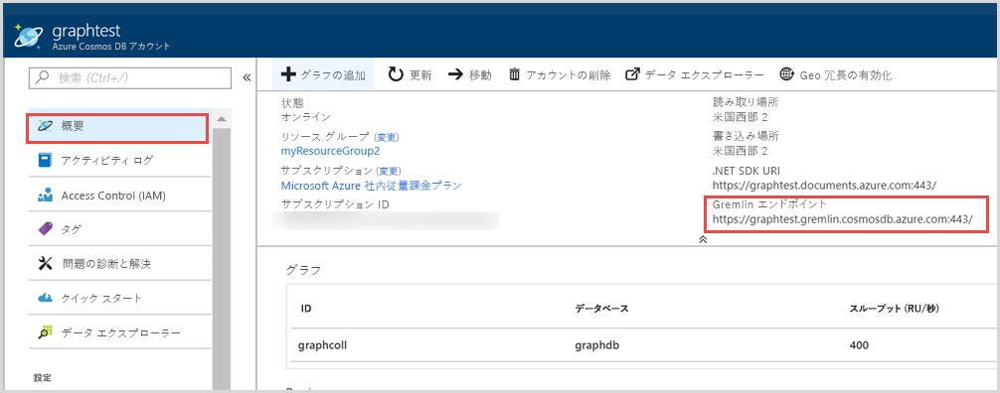
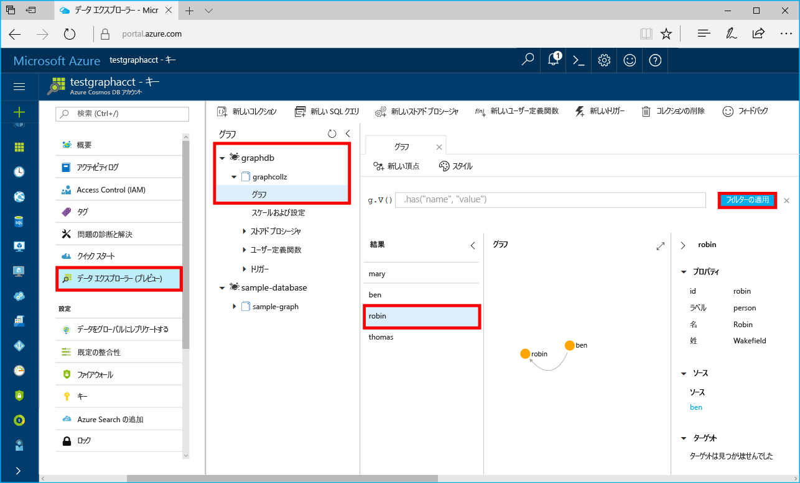

# <a name="quickstart-build-a-net-framework-or-core-application-using-the-azure-cosmos-db-gremlin-api-account"></a>クイック スタート:Azure Cosmos DB Gremlin API アカウントを使用して .NET Framework アプリケーションまたは Core アプリケーションを構築する

> [!div class="op_single_selector"]
> * [Gremlin コンソール](create-graph-gremlin-console.md)
> * [.NET](create-graph-dotnet.md)
> * [Java](create-graph-java.md)
> * [Node.js](create-graph-nodejs.md)
> * [Python](create-graph-python.md)
> * [PHP](create-graph-php.md)
>  

Azure Cosmos DB は、Microsoft のグローバルに分散されたマルチモデル データベース サービスです。 Azure Cosmos DB の中核をなすグローバル配布と水平方向のスケール機能を活用して、ドキュメント、キー/値、およびグラフ データベースをすばやく作成および照会できます。 

このクイックスタートでは、Azure portal を使用した Azure Cosmos DB [Gremlin API](graph-introduction.md) アカウント、データベース、およびグラフ (コンテナー) の作成方法を説明します。 その後、オープンソース ドライバーの [Gremlin.Net](https://tinkerpop.apache.org/docs/3.2.7/reference/#gremlin-DotNet) を使用して、コンソール アプリを構築し実行します。  

## <a name="prerequisites"></a>前提条件

まだ Visual Studio 2019 をインストールしていない場合は、**無料**の [Visual Studio 2019 Community エディション](https://www.visualstudio.com/downloads/)をダウンロードして使用できます。 Visual Studio のセットアップ中に、必ず **[Azure の開発]** を有効にしてください。

[!INCLUDE [quickstarts-free-trial-note](../../includes/quickstarts-free-trial-note.md)]

## <a name="create-a-database-account"></a>データベース アカウントの作成

[!INCLUDE [cosmos-db-create-dbaccount-graph](../../includes/cosmos-db-create-dbaccount-graph.md)]

## <a name="add-a-graph"></a>グラフの追加

[!INCLUDE [cosmos-db-create-graph](../../includes/cosmos-db-create-graph.md)]

## <a name="clone-the-sample-application"></a>サンプル アプリケーションの複製

GitHub から Gremlin API アプリの複製を作成し、接続文字列を設定して実行します。 プログラムでデータを処理することが非常に簡単であることがわかります。 

1. コマンド プロンプトを開いて git-samples という名前の新しいフォルダーを作成し、コマンド プロンプトを閉じます。

    ```bash
    md "C:\git-samples"
    ```

2. git bash などの git ターミナル ウィンドウを開いて、`cd` コマンドを使用して、サンプル アプリをインストールする新しいフォルダーに変更します。

    ```bash
    cd "C:\git-samples"
    ```

3. 次のコマンドを実行して、サンプル レポジトリを複製します。 このコマンドは、コンピューター上にサンプル アプリのコピーを作成します。

    ```bash
    git clone https://github.com/Azure-Samples/azure-cosmos-db-graph-gremlindotnet-getting-started.git
    ```

4. 次に、Visual Studio を開いてソリューション ファイルを開きます。

5. プロジェクト内の NuGet パッケージを復元します。 これには、Gremlin.Net ドライバーと Newtonsoft.Json パッケージを含める必要があります。


6. また、Nuget パッケージ マネージャーまたは [nuget コマンド ライン ユーティリティ](https://docs.microsoft.com/nuget/install-nuget-client-tools)を使用して、Gremlin.Net ドライバーを手動でインストールすることもできます。 

    ```bash
    nuget install Gremlin.Net
    ```

## <a name="review-the-code"></a>コードの確認

この手順は省略可能です。 コード内のデータベース リソースの作成方法に関心がある場合は、次のスニペットを確認できます。 関心がない場合は、「[接続文字列の更新](#update-your-connection-string)」に進んでください。 

次のスニペットはすべて Program.cs ファイルからのものです。

* 上で作成したアカウントに基づいて接続パラメーターを設定します。 

   :::code language="csharp" source="~/azure-cosmosdb-graph-dotnet/GremlinNetSample/Program.cs" id="configureConnectivity":::

* 実行される Gremlin コマンドの一覧は、Dictionary に記述されています。

   :::code language="csharp" source="~/azure-cosmosdb-graph-dotnet/GremlinNetSample/Program.cs" id="defineQueries":::

* 上で指定したパラメーターを使用して、新しい `GremlinServer` および `GremlinClient` 接続オブジェクトを作成します。

   :::code language="csharp" source="~/azure-cosmosdb-graph-dotnet/GremlinNetSample/Program.cs" id="defineClientandServerObjects":::

* 非同期タスクを持つ `GremlinClient` オブジェクトを使用して、各 Gremlin クエリを実行します。 前の手順で定義したディクショナリから Gremlin クエリを読み取り、実行することができます。 後で結果を取得し、値を読み取ります。これらの値は、Newtonsoft.Json パッケージの `JsonSerializer` クラスを使用して、ディクショナリとして書式設定されています。

   :::code language="csharp" source="~/azure-cosmosdb-graph-dotnet/GremlinNetSample/Program.cs" id="executeQueries":::

## <a name="update-your-connection-string"></a>接続文字列を更新する

ここで Azure Portal に戻り、接続文字列情報を取得し、アプリにコピーします。

1. [Azure portal](https://portal.azure.com/) でグラフ データベース アカウントに移動します。 **[概要]** タブで、2 つのエンドポイントを確認できます。 
 
   **.NET SDK URI** - この値は、Microsoft.Azure.Graphs ライブラリを使用してグラフ アカウントに接続する場合に使用されます。 

   **Gremlin エンドポイント** - この値は、Gremlin.Net ライブラリを使用してグラフ アカウントに接続する場合に使用されます。

    

   このサンプルを実行するには、 **[Gremlin エンドポイント]** の値をコピーして最後のポート番号を削除します。つまり、URI は `https://<your cosmos db account name>.gremlin.cosmosdb.azure.com` になります。 エンドポイントの値は `testgraphacct.gremlin.cosmosdb.azure.com` のようになります

1. 次に、 **[キー]** タブに移動し、Azure portal から **[主キー]** 値をコピーします。 

1. お使いのアカウントの URI と主キーをコピーしたら、アプリケーションを実行しているローカル コンピューター上の新しい環境変数に保存します。 環境変数を設定するには、コマンド プロンプト ウィンドウを開き、次のコマンドを実行します。 <Your_Azure_Cosmos_account_URI> と <Your_Azure_Cosmos_account_PRIMARY_KEY> の値を必ず置き換えてください。

   ```console
   setx EndpointUrl "https://<your cosmos db account name>.gremlin.cosmosdb.azure.com"
   setx PrimaryKey "<Your_Azure_Cosmos_account_PRIMARY_KEY>"
   ```

1. *Program.cs* ファイルを開き、上記で作成したデータベース名およびコンテナー名 (グラフ名でもあります) を使用して "database" および "container" 変数を更新します。

    `private static string database = "your-database-name";` `private static string container = "your-container-or-graph-name";`

1. Program.cs ファイルを保存します。 

これで、Azure Cosmos DB と通信するために必要なすべての情報でアプリを更新しました。 

## <a name="run-the-console-app"></a>コンソール アプリの実行

Ctrl + F5 キーを押してアプリケーションを実行します。 アプリケーションによって、Gremlin クエリ コマンドと結果の両方がコンソールに出力されます。

   コンソール ウィンドウには、グラフに追加されている頂点と辺が表示されます。 スクリプトが完了したら、Enter キーを押してコンソール ウィンドウを閉じます。

## <a name="browse-using-the-data-explorer"></a>データ エクスプローラーを使用した参照

次に、Azure Portal のデータ エクスプローラーに戻り、新しいグラフ データを参照しクエリできます。

1. データ エクスプローラーで新しいデータベースが [グラフ] ウィンドウに表示されます。 データベースとコンテナーのノードを展開し、 **[グラフ]** をクリックします。

2. **[フィルターの適用]** をクリックし、既定のクエリを使用してグラフのすべての頂点を表示します。 サンプル アプリで生成されたデータは、[グラフ] ウィンドウに表示されます。

    グラフは拡大または縮小できます。また、グラフ表示領域の拡大、頂点の追加、表示画面上での頂点の移動が可能です。

    

## <a name="review-slas-in-the-azure-portal"></a>Azure Portal での SLA の確認

[!INCLUDE [cosmosdb-tutorial-review-slas](../../includes/cosmos-db-tutorial-review-slas.md)]

## <a name="clean-up-resources"></a>リソースをクリーンアップする

[!INCLUDE [cosmosdb-delete-resource-group](../../includes/cosmos-db-delete-resource-group.md)]

## <a name="next-steps"></a>次のステップ

このクイック スタートでは、Azure Cosmos DB アカウントを作成し、データ エクスプローラーを使用してグラフを作成し、アプリを実行する方法を説明しました。 これで Gremlin を使用して、さらに複雑なクエリを作成し、強力なグラフ トラバーサル ロジックを実装できます。 

> [!div class="nextstepaction"]
> [Gremlin を使用したクエリ](tutorial-query-graph.md)

