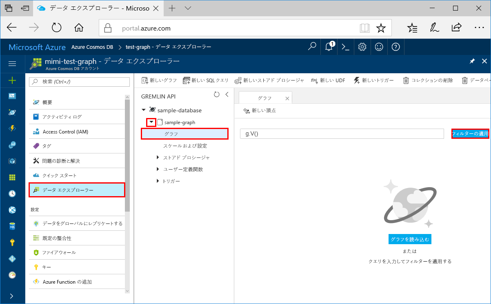
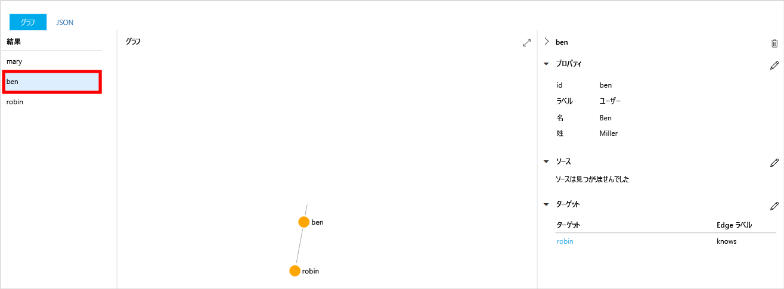
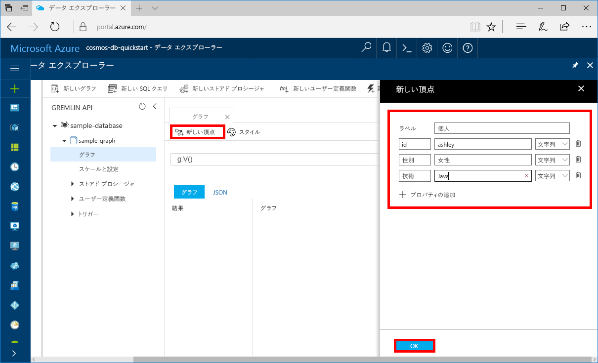
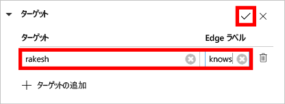
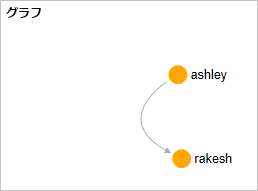

# <a name="azure-cosmos-db-create-a-graph-database-using-java-and-the-azure-portal"></a>Azure Cosmos DB: グラフ データベースを Java と Azure Portal で作成する

Azure Cosmos DB は、Microsoft のグローバルに配布されるマルチモデル データベース サービスです。 Azure Cosmos DB を使用すると、管理対象のドキュメントやテーブル、グラフのデータベースを迅速に作成しクエリできます。 

このクイックスタートでは、Azure Cosmos DB 用の Azure Portal ツールを使って簡単なグラフ データベースを作成します。 また、[Graph API](graph-introduction.md) データベースを使った Java コンソール アプリを OSS [Apache TinkerPop](http://tinkerpop.apache.org/) ドライバーですばやく作成する方法も紹介します。 このクイックスタートの手順は、Java を実行できる任意のオペレーティング システムで使用できます。 このクイックスタートに従うと、UI とプログラムのどちらか好きな方法で、グラフの作成と変更を行うことができるようになります。 

## <a name="prerequisites"></a>前提条件
[!INCLUDE [quickstarts-free-trial-note](../../includes/quickstarts-free-trial-note.md)]

加えて次の作業を行います。

* [Java Development Kit (JDK) 1.7 以降](http://www.oracle.com/technetwork/java/javase/downloads/jdk8-downloads-2133151.html)
    * Ubuntu で `apt-get install default-jdk` を実行して JDK をインストールします。
    * 必ず、JDK のインストール先フォルダーを指すように JAVA_HOME 環境変数を設定してください。
* [Maven](http://maven.apache.org/) バイナリ アーカイブの[ダウンロード](http://maven.apache.org/download.cgi)と[インストール](http://maven.apache.org/install.html)
    * Ubuntu で `apt-get install maven` を実行して Maven をインストールします。
* [Git](https://www.git-scm.com/)
    * Ubuntu で `sudo apt-get install git` を実行して Git をインストールします。

## <a name="create-a-database-account"></a>データベース アカウントの作成

グラフ データベースを作成するには、Azure Cosmos DB を含んだ Gremlin (グラフ) データベース アカウントを事前に作成しておく必要があります。

[!INCLUDE [cosmos-db-create-dbaccount-graph](../../includes/cosmos-db-create-dbaccount-graph.md)]

## <a name="add-a-graph"></a>グラフの追加

[!INCLUDE [cosmos-db-create-graph](../../includes/cosmos-db-create-graph.md)]

## <a name="clone-the-sample-application"></a>サンプル アプリケーションの複製

次は、コードを使った作業に移りましょう。 GitHub から Graph API アプリの複製を作成し、接続文字列を設定して実行します。 プログラムでデータを処理することが非常に簡単であることがわかります。  

1. コマンド プロンプトを開いて git-samples という名前の新しいフォルダーを作成し、コマンド プロンプトを閉じます。

    ```bash
    md "C:\git-samples"
    ```

2. git bash などの git ターミナル ウィンドウを開き、`cd` コマンドを使用して、サンプル アプリをインストールするフォルダーに変更します。  

    ```bash
    cd "C:\git-samples"
    ```

3. 次のコマンドを実行して、サンプル レポジトリを複製します。 このコマンドは、コンピューター上にサンプル アプリのコピーを作成します。 

    ```bash
    git clone https://github.com/Azure-Samples/azure-cosmos-db-graph-java-getting-started.git
    ```

## <a name="review-the-code"></a>コードの確認

この手順は省略可能です。 コード内のデータベース リソースの作成方法に関心がある場合は、次のスニペットを確認できます。 関心がない場合は、「[接続文字列の更新](#update-your-connection-information)」に進んでください。

以降のスニペットはすべて、C:\git-samples\azure-cosmos-db-graph-java-getting-started\src\GetStarted\Program.java ファイルから取得されます。

* Gremlin `Client` は、C:\git-samples\azure-cosmos-db-graph-java-getting-started\src\remote.yaml ファイルの構成から初期化されます。

    ```java
    cluster = Cluster.build(new File("src/remote.yaml")).create();
    ...
    client = cluster.connect();
    ```

* Gremlin の一連の手順は、`client.submit` メソッドを使用して実行されます。

    ```java
    ResultSet results = client.submit(gremlin);

    CompletableFuture<List<Result>> completableFutureResults = results.all();
    List<Result> resultList = completableFutureResults.get();

    for (Result result : resultList) {
        System.out.println(result.toString());
    }
    ```

## <a name="update-your-connection-information"></a>接続情報の更新

ここで Azure Portal に戻り、接続情報を取得して、アプリにコピーします。 これらの設定により、アプリはホストされているデータベースと通信できるようになります。

1. [Azure Portal](http://portal.azure.com/) で **[キー]** をクリックします。 

    URI の値の最初の部分をコピーします。

    ![Azure Portal の [キー] ページでアクセス キーを表示およびコピーする](./media/create-graph-java/keys.png)
2. src/remote.yaml ファイルを開き、`hosts: [$name$.graphs.azure.com]` の `$name$` に一意の ID 値を貼り付けます。

    remote.yaml の 1 行目は次のようになります。 

    `hosts: [test-graph.graphs.azure.com]`

3. `endpoint` 値の `graphs` を `gremlin.cosmosdb` に変更します。 (グラフ データベース アカウントを 2017 年 12 月 20 日より前に作成した場合は、エンドポイント値に変更を行わず、次の手順に進んでください。)

    endpoint の値は次のようになります。

    `"endpoint": "https://testgraphacct.gremlin.cosmosdb.azure.com:443/"`

4. Azure Portal でコピー ボタンを使って PRIMARY KEY をコピーし、`password: $masterKey$` の `$masterKey$` に貼り付けます。

    remote.yaml の 4 行目は次のようになります。 

    `password: 2Ggkr662ifxz2Mg==`

5. remote.yaml の 3 行目

    `username: /dbs/$database$/colls/$collection$`

    to 

    `username: /dbs/sample-database/colls/sample-graph`

    サンプルのデータベースまたはグラフに一意の名前を使用した場合は、適宜値を更新してください。

6. remote.yaml ファイルを保存します。

## <a name="run-the-console-app"></a>コンソール アプリの実行

1. git ターミナル ウィンドウで、azure-cosmos-db-graph-java-getting-started フォルダーに `cd` で移動します。

    ```git
    cd "C:\git-samples\azure-cosmos-db-graph-java-getting-started"
    ```

2. git ターミナル ウィンドウで、次のコマンドを実行して 必要な Java パッケージをインストールします。

   ```
   mvn package
   ```

3. git ターミナル ウィンドウで、次のコマンドを実行して Java アプリケーションを起動します。
    
    ```
    mvn exec:java -D exec.mainClass=GetStarted.Program
    ```

    グラフに追加される頂点がターミナル ウィンドウに表示されます。 
    
    タイムアウト エラーが発生した場合は、[[Update your connection information]\(接続情報の更新\)](#update-your-connection-information) で接続情報が適切に更新されていることを確認し、最後のコマンドを再試行してください。 
    
    プログラムが停止したら、Enter キーを押して、インターネット ブラウザーで Azure Portal に切り替えます。 

<a id="add-sample-data"></a>
## <a name="review-and-add-sample-data"></a>サンプル データの確認と追加

今度はデータ エクスプローラーに戻って、グラフに追加された頂点を確認し、さらにデータ ポイントを追加してみましょう。

1. **[データ エクスプローラー]** をクリックし、**sample-graph** を展開して、**[グラフ]**、**[フィルターの適用]** の順にクリックします。 

   

2. **[結果]** リストを見ると、新しいユーザーがグラフに追加されていることがわかります。 **ben** を選択すると、ユーザーが robin に接続されていることがわかります。 ドラッグ アンド ドロップで頂点を移動したり、マウスのホイールを回して拡大および縮小したり、双方向矢印でグラフのサイズを大きくしたりできます。 

   

3. 新しいユーザーを何人か追加してみます。 グラフにデータを追加するには、**[New Vertex]\(新しい頂点\)** ボタンをクリックします。

   

4. ラベル ボックスに「*person*」と入力します。

5. **[プロパティの追加]** をクリックして、次の各プロパティを追加します。 グラフ内の person ごとに一意のプロパティを作成できることに注目してください。 必須のキーは id のみです。

    key|value|メモ
    ----|----|----
    id|ashley|頂点の一意の識別子。 id を指定しなかった場合は、自動的に生成されます。
    gender|female| 
    tech | java | 

    > [!NOTE]
    > このクイック スタートでは、パーティション分割されていないコレクションを作成します。 ただし、コレクションの作成段階でパーティション キーを指定することによって、パーティション分割されたコレクションを作成した場合は、新たに作成する各頂点のキーとして、パーティション キーを追加する必要があります。 

6. Click **OK**. 画面サイズを大きくしないと、画面下部の **[OK]** が見えない場合があります。

7. もう一度 **[New Vertex]\(新しい頂点\)** をクリックして、新しいユーザーを追加します。 

8. 「*person*」というラベルを入力します。

9. **[プロパティの追加]** をクリックして、次の各プロパティを追加します。

    key|value|メモ
    ----|----|----
    id|rakesh|頂点の一意の識別子。 id を指定しなかった場合は、自動的に生成されます。
    gender|male| 
    school|MIT| 

10. Click **OK**. 

11. 既定の `g.V()` フィルターで **[フィルターの適用]** ボタンをクリックして、グラフ内のすべての値を表示します。 すると、**[結果]** リストにすべてのユーザーが表示されます。 

    追加したデータが多くなってきたら、フィルターを使って結果を制限することができます。 既定では、データ エクスプローラーは `g.V()` を使ってグラフのすべての頂点を取得します。 `g.V().count()` などの他の[グラフ クエリ](tutorial-query-graph.md)に変更して、グラフ内のすべての頂点の数を JSON 形式で取得できます。 フィルターを変更した場合、フィルターを `g.V()` に戻して **[フィルターの適用]** をクリックし、もう一度すべての結果を表示します。

12. これで rakesh と ashley を接続できる状態になりました。 **[結果]** リストで **[ashley]** が選択されていることを確認し、右下の **[Targets]\(ターゲット\)** の横にある ![[Change the target of a vertex in a graph]\(グラフ内の頂点のターゲットを変更します\)](./media/create-graph-java/edit-pencil-button.png) をクリックします。 ウィンドウの幅を広げないとボタンが見えない場合があります。

   

13. **[Target]\(ターゲット\)** ボックスに「*rakesh*」と入力し、**[Edge label]\(辺ラベル\)** ボックスに「*knows*」と入力して、チェック ボックスをオンにします。

   

14. 結果リストから **[rakesh]** を選択すると、ashley と rakesh が接続されていることがわかります。 

   

   以上で、このチュートリアルのリソース作成部分は完了です。 引き続き、グラフへの頂点の追加、既存の頂点の変更、またはクエリの変更を行うことができます。 次に、Azure Cosmos DB が提供するメトリックを確認し、リソースをクリーンアップします。 

## <a name="review-slas-in-the-azure-portal"></a>Azure Portal での SLA の確認

[!INCLUDE [cosmosdb-tutorial-review-slas](../../includes/cosmos-db-tutorial-review-slas.md)]

## <a name="clean-up-resources"></a>リソースのクリーンアップ

[!INCLUDE [cosmosdb-delete-resource-group](../../includes/cosmos-db-delete-resource-group.md)]

## <a name="next-steps"></a>次の手順

このクイック スタートでは、Azure Cosmos DB アカウントを作成し、データ エクスプローラーを使用してグラフを作成し、アプリを実行する方法を説明しました。 これで Gremlin を使用して、さらに複雑なクエリを作成し、強力なグラフ トラバーサル ロジックを実装できます。 

> [!div class="nextstepaction"]
> [Gremlin を使用したクエリ](tutorial-query-graph.md)

