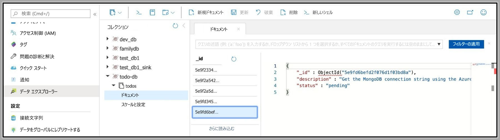

# <a name="quickstart-connect-a-go-application-to-azure-cosmos-dbs-api-for-mongodb"></a>クイック スタート:Azure Cosmos DB の MongoDB 用 API に Go アプリケーションを接続する

> [!div class="op_single_selector"]
> * [.NET](create-mongodb-dotnet.md)
> * [Java](create-mongodb-java.md)
> * [Node.js](create-mongodb-nodejs.md)
> * [Python](create-mongodb-flask.md)
> * [Xamarin](create-mongodb-xamarin.md)
> * [Golang](create-mongodb-go.md)
>  

Azure Cosmos DB は、マルチモデル データベース サービスです。グローバルな分散と水平方向のスケーリング機能により、ドキュメント データベースやテーブル データベース、キーと値のデータベース、グラフ データベースをすばやく作成し、クエリを実行することができます。 このクイック スタートでは、Azure Cloud Shell を利用して Azure Cosmos DB アカウントを作成し、管理し、GitHub から既存のサンプル アプリケーションを複製し、Azure Cosmos DB と連動するようにそれを構成します。 

サンプル アプリケーションは、Go で記述されたコマンドライン ベースの `todo` 管理ツールです。 Azure Cosmos DB の MongoDB 用 API は [MongoDB ワイヤ プロトコルと互換性があり](https://docs.microsoft.com/azure/cosmos-db/mongodb-introduction#wire-protocol-compatibility)、あらゆる MongoDB クライアント ドライバーでそれと接続できるようになります。 このアプリケーションでは、Azure Cosmos DB データベースにデータが格納されることがアプリケーションでは意識されないよう、[MongoDB 用 Go ドライバー](https://github.com/mongodb/mongo-go-driver)が使用されます。

## <a name="prerequisites"></a>前提条件
- アクティブなサブスクリプションが含まれる Azure アカウント。 [無料で作成できます](https://azure.microsoft.com/free)。 または、Azure サブスクリプションなしで、[Azure Cosmos DB を無料で試す](https://azure.microsoft.com/try/cosmosdb/)こともできます。 [Azure Cosmos DB Emulator](https://aka.ms/cosmosdb-emulator) を使用することもできます。接続文字列には、`.mongodb://localhost:C2y6yDjf5/R+ob0N8A7Cgv30VRDJIWEHLM+4QDU5DE2nQ9nDuVTqobD4b8mGGyPMbIZnqyMsEcaGQy67XIw/Jw==@localhost:10255/admin?ssl=true` を使用してください。
- お使いのコンピューターに [Go](https://golang.org/) がインストールされていること。Go の実用的知識。
- [Git](https://git-scm.com/downloads).
- [Azure CLI 2.0 以上](/cli/azure/install-azure-cli) (Azure Cloud Shell を使用したくない場合)。

[!INCLUDE [cloud-shell-try-it](../../includes/cloud-shell-try-it.md)]

## <a name="clone-the-sample-application"></a>サンプル アプリケーションの複製

次のコマンドを実行して、サンプル リポジトリを複製します。

1. コマンド プロンプトを開いて `git-samples` という名前の新しいフォルダーを作成し、コマンド プロンプトを閉じます。

    ```bash
    mkdir "C:\git-samples"
    ```

2. git bash などの git ターミナル ウィンドウを開いて、`cd` コマンドを使用して、サンプル アプリをインストールする新しいフォルダーに変更します。

    ```bash
    cd "C:\git-samples"
    ```

3. 次のコマンドを実行して、サンプル レポジトリを複製します。 このコマンドは、コンピューター上にサンプル アプリのコピーを作成します。 

    ```bash
    git clone https://github.com/Azure-Samples/cosmosdb-go-mongodb-quickstart
    ```

## <a name="review-the-code"></a>コードの確認

この手順は省略可能です。 このアプリケーションのしくみに関心をお持ちの場合は、次のスニペットをご確認ください。 それ以外の場合は、「[アプリケーションの実行](#run-the-application)」に進んでください。 アプリケーションのレイアウトは次のようになっています。

```bash
.
├── go.mod
├── go.sum
└── todo.go
```

次のスニペットはすべて、`todo.go` ファイルからのものです。

### <a name="connecting-the-go-app-to-azure-cosmos-db"></a>Azure Cosmos DB への Go アプリの接続

[`clientOptions`](https://pkg.go.dev/go.mongodb.org/mongo-driver@v1.3.2/mongo/options?tab=doc#ClientOptions) によって Azure Cosmos DB の接続文字列がカプセル化され、環境変数を使用して渡されます (後続のセクションで詳細を説明します)。 接続は [`mongo.NewClient`](https://pkg.go.dev/go.mongodb.org/mongo-driver@v1.3.2/mongo?tab=doc#NewClient) を利用して初期化されます。これには `clientOptions` インスタンスが渡されます。 [`Ping` 関数](https://pkg.go.dev/go.mongodb.org/mongo-driver@v1.3.2/mongo?tab=doc#Client.Ping)が呼び出され、接続の成功が確認されます (フェイルファスト方式です)

```go
    ctx, cancel := context.WithTimeout(context.Background(), time.Second*10)
    defer cancel()

    clientOptions := options.Client().ApplyURI(mongoDBConnectionString).SetDirect(true)
    
    c, err := mongo.NewClient(clientOptions)
    err = c.Connect(ctx)
    if err != nil {
        log.Fatalf("unable to initialize connection %v", err)
    }

    err = c.Ping(ctx, nil)
    if err != nil {
        log.Fatalf("unable to connect %v", err)
    }
```

> [!NOTE] 
> [`SetDirect(true)`](https://pkg.go.dev/go.mongodb.org/mongo-driver@v1.3.2/mongo/options?tab=doc#ClientOptions.SetDirect) 構成の使用は重要です。これがないと、接続エラー `unable to connect connection(cdb-ms-prod-<azure-region>-cm1.documents.azure.com:10255[-4]) connection is closed` が発生します
>

### <a name="create-a-todo-item"></a>`todo` 項目を作成する

`todo` を作成するため、[`mongo.Collection`](https://pkg.go.dev/go.mongodb.org/mongo-driver@v1.3.2/mongo?tab=doc#Collection) のハンドルを取得し、[`InsertOne`](https://pkg.go.dev/go.mongodb.org/mongo-driver@v1.3.2/mongo?tab=doc#Collection.InsertOne) 関数を呼び出します。 

```go
func create(desc string) {
    c := connect()
    ctx := context.Background()
    defer c.Disconnect(ctx)

    todoCollection := c.Database(database).Collection(collection)
    r, err := todoCollection.InsertOne(ctx, Todo{Description: desc, Status: statusPending})
    if err != nil {
        log.Fatalf("failed to add todo %v", err)
    }
```

説明と状態 (これは初め `pending` に設定されています) を含む `Todo` 構造体を渡します。

```go
type Todo struct {
    ID          primitive.ObjectID `bson:"_id,omitempty"`
    Description string             `bson:"description"`
    Status      string             `bson:"status"`
}
```
### <a name="list-todo-items"></a>`todo` 項目を一覧表示する

条件に基づいて TODO を一覧表示できます。 フィルター条件をカプセル化する目的で [`bson.D`](https://pkg.go.dev/go.mongodb.org/mongo-driver@v1.3.2/bson?tab=doc#D) が作成されます

```go
func list(status string) {
    .....
    var filter interface{}
    switch status {
    case listAllCriteria:
        filter = bson.D{}
    case statusCompleted:
        filter = bson.D{{statusAttribute, statusCompleted}}
    case statusPending:
        filter = bson.D{{statusAttribute, statusPending}}
    default:
        log.Fatal("invalid criteria for listing todo(s)")
    }
```

[`Find`](https://pkg.go.dev/go.mongodb.org/mongo-driver@v1.3.2/mongo?tab=doc#Collection.Find) はフィルターに基づいてドキュメントを検索するために使用され、結果は `Todo` のスライスに変換されます。

```go
    todoCollection := c.Database(database).Collection(collection)
    rs, err := todoCollection.Find(ctx, filter)
    if err != nil {
        log.Fatalf("failed to list todo(s) %v", err)
    }
    var todos []Todo
    err = rs.All(ctx, &todos)
    if err != nil {
        log.Fatalf("failed to list todo(s) %v", err)
    }
```

最後に、情報は表形式で表示されます。

```go
    todoTable := [][]string{}

    for _, todo := range todos {
        s, _ := todo.ID.MarshalJSON()
        todoTable = append(todoTable, []string{string(s), todo.Description, todo.Status})
    }

    table := tablewriter.NewWriter(os.Stdout)
    table.SetHeader([]string{"ID", "Description", "Status"})

    for _, v := range todoTable {
        table.Append(v)
    }
    table.Render()
```

### <a name="update-a-todo-item"></a>`todo` 項目を更新する

`todo` はその `_id` に基づいて更新できます。 [`bson.D`](https://pkg.go.dev/go.mongodb.org/mongo-driver@v1.3.2/bson?tab=doc#D) フィルターが `_id` に基づいて作成され、更新された情報に対して別のフィルターが作成されます。更新された情報とは、この場合、新しい状態です (`completed` または `pending`)。 最後に、フィルターと更新後のドキュメントを指定して [`UpdateOne`](https://pkg.go.dev/go.mongodb.org/mongo-driver@v1.3.2/mongo?tab=doc#Collection.UpdateOne) 関数が呼び出されます

```go
func update(todoid, newStatus string) {
....
    todoCollection := c.Database(database).Collection(collection)
    oid, err := primitive.ObjectIDFromHex(todoid)
    if err != nil {
        log.Fatalf("failed to update todo %v", err)
    }
    filter := bson.D{{"_id", oid}}
    update := bson.D{{"$set", bson.D{{statusAttribute, newStatus}}}}
    _, err = todoCollection.UpdateOne(ctx, filter, update)
    if err != nil {
        log.Fatalf("failed to update todo %v", err)
    }
```

### <a name="delete-a-todo"></a>`todo` を削除する

`todo` はその `_id` に基づいて削除され、[`bson.D`](https://pkg.go.dev/go.mongodb.org/mongo-driver@v1.3.2/bson?tab=doc#D) インスタンスの形式でカプセル化されます。 ドキュメントを削除する目的で [`DeleteOne`](https://pkg.go.dev/go.mongodb.org/mongo-driver@v1.3.2/mongo?tab=doc#Collection.DeleteOne) が呼び出されます。

```go
func delete(todoid string) {
....
    todoCollection := c.Database(database).Collection(collection)
    oid, err := primitive.ObjectIDFromHex(todoid)
    if err != nil {
        log.Fatalf("invalid todo ID %v", err)
    }
    filter := bson.D{{"_id", oid}}
    _, err = todoCollection.DeleteOne(ctx, filter)
    if err != nil {
        log.Fatalf("failed to delete todo %v", err)
    }
}
```

## <a name="build-the-application"></a>アプリケーションのビルド

アプリケーションを複製したディレクトリに移動し、アプリケーションをビルドします (`go build` を使用)。

```bash
cd monogdb-go-quickstart
go build -o todo
```

アプリケーションが適切にビルドされたことを確認します。

```bash
./todo --help
```

## <a name="setup-azure-cosmos-db"></a>Azure Cosmos DB を設定する

### <a name="sign-in-to-azure"></a>Azure へのサインイン

CLI をローカルにインストールして使用する場合、このトピックでは、Azure CLI バージョン 2.0 以降を実行していることが要件です。 バージョンを確認するには、`az --version` を実行します。 インストールまたはアップグレードする必要がある場合は、[Install Azure CLI] のインストールに関するページを参照してください。 

インストールされた Azure CLI を使用する場合は、[az login](/cli/azure/reference-index#az-login) コマンドで Azure サブスクリプションにサインインし、画面上の指示に従います。 Azure Cloud Shell を使用する場合は、この手順を省略できます。

```azurecli
az login 
``` 
   
### <a name="add-the-azure-cosmos-db-module"></a>Azure Cosmos DB モジュールを追加する

インストールされた Azure CLI を使用する場合は、`az` コマンドを実行して、`cosmosdb` コンポーネントが既にインストールされているかどうかを調べます。 `cosmosdb` が基本コマンドの一覧にある場合は、次のコマンドに進みます。 Azure Cloud Shell を使用する場合は、この手順を省略できます。

`cosmosdb` が基本コマンドの一覧にない場合は、[Azure CLI](/cli/azure/install-azure-cli) を再インストールします。

### <a name="create-a-resource-group"></a>リソース グループを作成する

[az group create](/cli/azure/group#az-group-create) で[リソース グループ](../azure-resource-manager/management/overview.md)を作成します。 Azure リソース グループとは、Web アプリ、データベース、ストレージ アカウントなどの Azure リソースのデプロイと管理に使用する論理コンテナーです。 

次の例は、西ヨーロッパ リージョンにリソース グループを作成します。 リソース グループには一意の名前を選択します。

Azure Cloud Shell を使用する場合は、 **[試してみる]** を選択し、画面のプロンプトに従ってログインしてから、コマンドをコマンド プロンプトにコピーします。

```azurecli-interactive
az group create --name myResourceGroup --location "West Europe"
```

### <a name="create-an-azure-cosmos-db-account"></a>Azure Cosmos DB アカウントを作成する

[az cosmosdb create](/cli/azure/cosmosdb#az-cosmosdb-create) コマンドを使用して、Cosmos アカウントを作成します。

次のコマンドの `<cosmosdb-name>` プレースホルダーを独自の一意の Cosmos アカウント名に置き換えます。 この一意の名前は、Cosmos DB エンドポイント (`https://<cosmosdb-name>.documents.azure.com/`) の一部として使用されます。そのため、この名前は Azure 内のすべての Cosmos アカウントで一意である必要があります。 

```azurecli-interactive
az cosmosdb create --name <cosmosdb-name> --resource-group myResourceGroup --kind MongoDB
```

`--kind MongoDB` パラメーターにより、MongoDB のクライアント接続が有効になります。

Azure Cosmos DB アカウントが作成されると、Azure CLI によって次の例のような情報が表示されます。 

> [!NOTE]
> この例では、Azure CLI の出力形式として JSON を使用しています (既定)。 別の出力形式を使用する場合は、「[Azure CLI コマンドの出力形式](https://docs.microsoft.com/cli/azure/format-output-azure-cli)」を参照してください。

```json
{
  "databaseAccountOfferType": "Standard",
  "documentEndpoint": "https://<cosmosdb-name>.documents.azure.com:443/",
  "id": "/subscriptions/00000000-0000-0000-0000-000000000000/resourceGroups/myResourceGroup/providers/Microsoft.Document
DB/databaseAccounts/<cosmosdb-name>",
  "kind": "MongoDB",
  "location": "West Europe",
  "name": "<cosmosdb-name>",
  "readLocations": [
    {
      "documentEndpoint": "https://<cosmosdb-name>-westeurope.documents.azure.com:443/",
      "failoverPriority": 0,
      "id": "<cosmosdb-name>-westeurope",
      "locationName": "West Europe",
      "provisioningState": "Succeeded"
    }
  ],
  "resourceGroup": "myResourceGroup",
  "type": "Microsoft.DocumentDB/databaseAccounts",
  "writeLocations": [
    {
      "documentEndpoint": "https://<cosmosdb-name>-westeurope.documents.azure.com:443/",
      "failoverPriority": 0,
      "id": "<cosmosdb-name>-westeurope",
      "locationName": "West Europe",
      "provisioningState": "Succeeded"
    }
  ]
} 
```

### <a name="retrieve-the-database-key"></a>データベース キーの取得

Cosmos データベースに接続するには、データベース キーが必要です。 [az cosmosdb keys list](/cli/azure/cosmosdb/keys#az-cosmosdb-keys-list) コマンドを使用して、プライマリ キーを取得します。

```azurecli-interactive
az cosmosdb keys list --name <cosmosdb-name> --resource-group myResourceGroup --query "primaryMasterKey"
```

Azure CLI によって次の例のような情報が出力されます。 

```json
"RUayjYjixJDWG5xTqIiXjC..."
```

## <a name="configure-the-application"></a>アプリケーションの構成 

<a name="devconfig"></a>
### <a name="export-the-connection-string-mongodb-database-and-collection-names-as-environment-variables"></a>接続文字列、MongoDB データベース、コレクション名を環境変数としてエクスポートします。 

```bash
export MONGODB_CONNECTION_STRING="mongodb://<COSMOSDB_ACCOUNT_NAME>:<COSMOSDB_PASSWORD>@<COSMOSDB_ACCOUNT_NAME>.mongo.cosmos.azure.com:10255/?ssl=true&replicaSet=globaldb&maxIdleTimeMS=120000&appName=@<COSMOSDB_ACCOUNT_NAME>@"
```

> [!NOTE] 
> Cosmos DB の要件上、`ssl=true` オプションは重要です。 詳細については、「[接続文字列の要件](connect-mongodb-account.md#connection-string-requirements)」を参照してください。
>

`MONGODB_CONNECTION_STRING` 環境変数については、`<COSMOSDB_ACCOUNT_NAME>` と `<COSMOSDB_PASSWORD>` のプレースホルダーを置き換えます。

1. `<COSMOSDB_ACCOUNT_NAME>`:作成した Azure Cosmos DB アカウントの名前
2. `<COSMOSDB_PASSWORD>`:前の手順で抽出したデータベース キー

```bash
export MONGODB_DATABASE=todo-db
export MONGODB_COLLECTION=todos
```

`MONGODB_DATABASE` と `MONGODB_COLLECTION` の値は自分で選択できます。あるいはそのままにすることもできます。

## <a name="run-the-application"></a>アプリケーションの実行

`todo` を作成するには

```bash
./todo --create "Create an Azure Cosmos DB database account"
```

成功した場合、新しく作成したドキュメントの MongoDB `_id` で出力が表示されるはずです。

```bash
added todo ObjectID("5e9fd6befd2f076d1f03bd8a")
```

別の `todo` を作成します

```bash
./todo --create "Get the MongoDB connection string using the Azure CLI"
```

すべての `todo` を一覧表示します

```bash
./todo --list all
```

追加したものが次のような表形式で表示されるはずです。

```bash
+----------------------------+--------------------------------+-----------+
|             ID             |          DESCRIPTION           |  STATUS   |
+----------------------------+--------------------------------+-----------+
| "5e9fd6b1bcd2fa6bd267d4c4" | Create an Azure Cosmos DB      | pending   |
|                            | database account               |           |
| "5e9fd6befd2f076d1f03bd8a" | Get the MongoDB connection     | pending   |
|                            | string using the Azure CLI     |           |
+----------------------------+--------------------------------+-----------+
```

`todo` の状態を更新するには (たとえば、`completed` 状態に変更する)、`todo` ID を使用します

```bash
./todo --update 5e9fd6b1bcd2fa6bd267d4c4,completed
```

完了した `todo` のみを一覧表示します

```bash
./todo --list completed
```

更新したばかりのものが表示されるはずです

```bash
+----------------------------+--------------------------------+-----------+
|             ID             |          DESCRIPTION           |  STATUS   |
+----------------------------+--------------------------------+-----------+
| "5e9fd6b1bcd2fa6bd267d4c4" | Create an Azure Cosmos DB      | completed |
|                            | database account               |           |
+----------------------------+--------------------------------+-----------+
```

### <a name="view-data-in-data-explorer"></a>データ エクスプローラーにデータを表示する

Azure Cosmos DB に格納されているデータは、Azure portal で表示したり、照会したりできます。

前の手順で作成されたユーザー データを、表示、クエリ、操作するには、Web ブラウザーで [Azure Portal](https://portal.azure.com) にログインします。

上部の検索ボックスに、「**Azure Cosmos DB**」と入力します。 Cosmos アカウントのブレードが開いたら、自分の Cosmos アカウントを選択します。 左側のナビゲーションで、 **[データ エクスプローラー]** を選択します。 [コレクション] ウィンドウでコレクションを展開します。これで、コレクション内のドキュメントの表示とデータのクエリを実行でき、ストアド プロシージャ、トリガー、および UDF の作成と実行も行うことができます。 




ID を利用して `todo` を削除します

```bash
./todo --delete 5e9fd6b1bcd2fa6bd267d4c4,completed
```

確認する `todo` を一覧表示します

```bash
./todo --list all
```

削除した `todo` は表示から消えているはずです

```bash
+----------------------------+--------------------------------+-----------+
|             ID             |          DESCRIPTION           |  STATUS   |
+----------------------------+--------------------------------+-----------+
| "5e9fd6befd2f076d1f03bd8a" | Get the MongoDB connection     | pending   |
|                            | string using the Azure CLI     |           |
+----------------------------+--------------------------------+-----------+
```

## <a name="clean-up-resources"></a>リソースをクリーンアップする

[!INCLUDE [cosmosdb-delete-resource-group](../../includes/cosmos-db-delete-resource-group.md)]

## <a name="next-steps"></a>次のステップ

このクイックスタートでは、Azure Cloud Shell を使用して Azure Cosmos DB MongoDB API アカウントを作成し、Go コマンドライン アプリを作成して実行し、`todo` を管理する方法について説明しました。 これで、Azure Cosmos DB アカウントに追加のデータをインポートできるようになりました。

> [!div class="nextstepaction"]
> [MongoDB データを Azure Cosmos DB にインポートする](mongodb-migrate.md)
