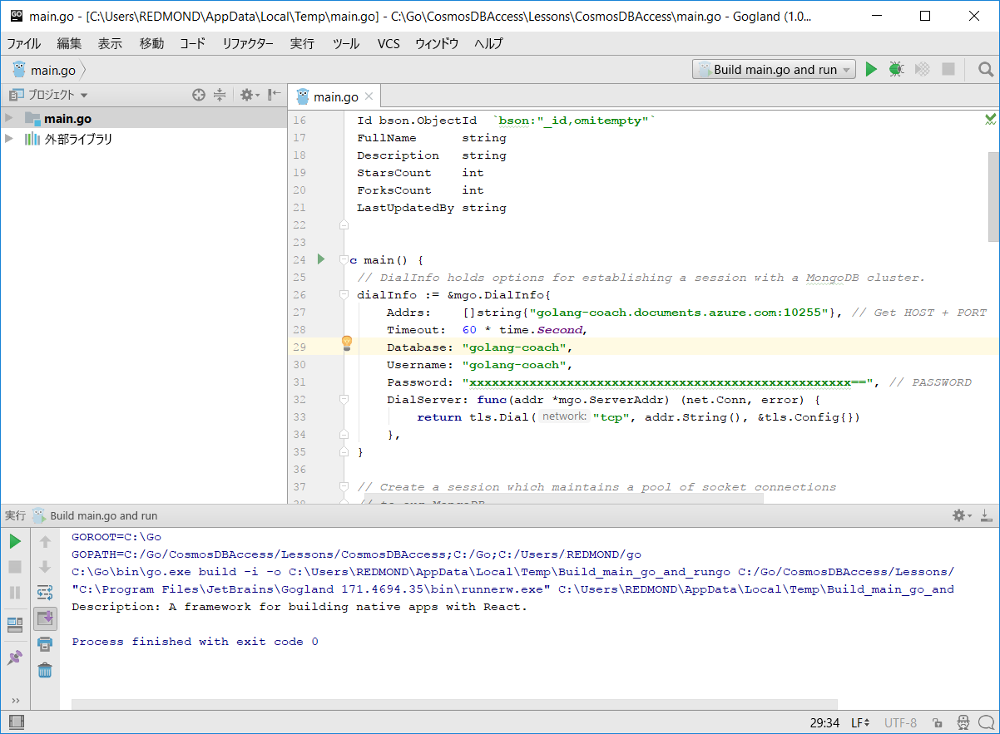
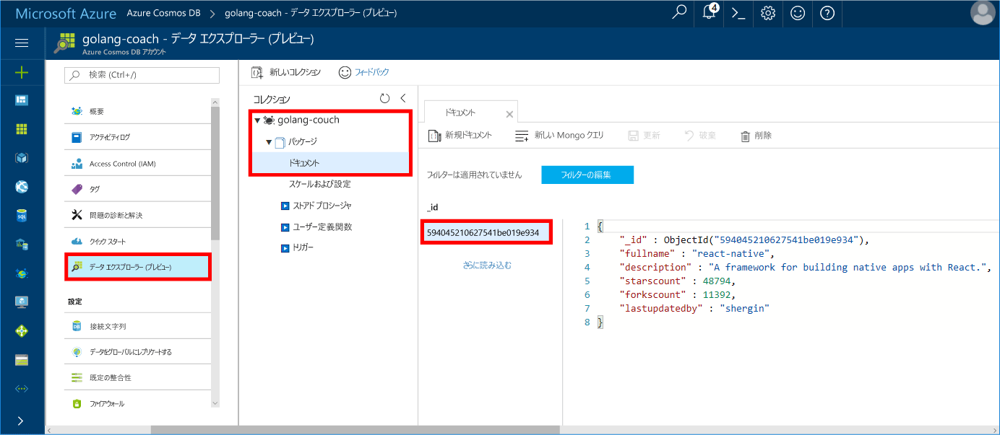

# <a name="build-a-console-app-using-azure-cosmos-dbs-api-for-mongodb-and-golang-sdk"></a>Azure Cosmos DB の MongoDB 用 API と Golang SDK を使用してコンソール アプリを構築する

> [!div class="op_single_selector"]
> * [.NET](create-mongodb-dotnet.md)
> * [Java](create-mongodb-java.md)
> * [Node.js](create-mongodb-nodejs.md)
> * [Python](create-mongodb-flask.md)
> * [Xamarin](create-mongodb-xamarin.md)
> * [Golang](create-mongodb-golang.md)
>  

Azure Cosmos DB は、Microsoft のグローバルに配布されるマルチモデル データベース サービスです。 ドキュメント、キー/値、およびグラフ データベースをすばやく作成したり、クエリを実行したりでき、そのすべてで、Cosmos DB の中核にあるグローバル配信および水平スケール機能が活用されます。

このクイック スタートでは、[Golang](https://golang.org/) で記述された既存の MongoDB アプリを使用する方法と、そのアプリを Azure Cosmos DB の MongoDB 用 API を使用して Cosmos データベースに接続する方法を示します。

言い換えると、Golang アプリケーションは、MongoDB クライアントを使用して接続していることだけを認識します。 Cosmos データベースへのデータの格納は、アプリケーションでは意識されません。

## <a name="prerequisites"></a>前提条件

- Azure サブスクリプション。 Azure サブスクリプションがない場合は、開始する前に[無料アカウント](https://azure.microsoft.com/free)を作成してください。 

  [!INCLUDE [cosmos-db-emulator-mongodb](../../includes/cosmos-db-emulator-mongodb.md)]

- [Go](https://golang.org/dl/) と、[Go](https://golang.org/) 言語の基本的な知識。
- IDE - Jetbrains 提供の [GoLand](https://www.jetbrains.com/go/)、Microsoft 提供の [Visual Studio Code](https://code.visualstudio.com/)、または [Atom](https://atom.io/)。 このチュートリアルでは、GoLand を使用しています。

<a id="create-account"></a>
## <a name="create-a-database-account"></a>データベース アカウントの作成

[!INCLUDE [cosmos-db-create-dbaccount](../../includes/cosmos-db-create-dbaccount-mongodb.md)]

## <a name="clone-the-sample-application"></a>サンプル アプリケーションの複製

サンプル アプリケーションを複製し、必要なパッケージをインストールします。

1. 既定では C:\Go\ にある GOROOT\src フォルダー内に、CosmosDBSample という名前のフォルダーを作成します。
2. git bash などの git ターミナル ウィンドウを使用して次のコマンドを実行し、CosmosDBSample フォルダーにサンプル リポジトリを複製します。 

    ```bash
    git clone https://github.com/Azure-Samples/azure-cosmos-db-mongodb-golang-getting-started.git
    ```
3.  次のコマンドを実行して、mgo パッケージを取得します。 

    ```
    go get gopkg.in/mgo.v2
    ```

[mgo](https://labix.org/mgo) ドライバーは、[Go 言語](https://golang.org/)用の [MongoDB](https://www.mongodb.com/) ドライバーです。標準的な Go 記法に準拠したごく単純な API の下で、十分にテストされた豊富な一連の機能が実装されています。

<a id="connection-string"></a>

## <a name="update-your-connection-string"></a>接続文字列を更新する

ここで Azure Portal に戻り、接続文字列情報を取得し、アプリにコピーします。

1. 左側のナビゲーション メニューで **[クイック スタート]** をクリックし、**[その他]** をクリックして、Go アプリケーションに必要な接続文字列情報を表示します。

2. Goglang で GOROOT\CosmosDBSample ディレクトリの main.go ファイルを開き、下のスクリーンショットに示されている、Azure Portal の接続文字列情報を使用して次のコード行を更新します。 

    データベース名は、Azure Portal の接続文字列ウィンドウにある **[ホスト]** 値のプレフィックスです。 下の画像で示されているアカウントの場合、データベース名は golang-coach になります。

    ```go
    Database: "The prefix of the Host value in the Azure portal",
    Username: "The Username in the Azure portal",
    Password: "The Password in the Azure portal",
    ```

    ![接続文字列情報を示している、Azure Portal の [クイック スタート] ウィンドウの [その他] タブ](./media/create-mongodb-golang/cosmos-db-golang-connection-string.png)

3. main.go ファイルを保存します。

## <a name="review-the-code"></a>コードの確認

この手順は省略可能です。 コード内のデータベース リソースの作成方法に関心がある場合は、次のスニペットを確認できます。 それ以外の場合は、「[アプリの実行](#run-the-app)」に進んでください。 

次のスニペットはすべて main.go ファイルからのものです。

### <a name="connecting-the-go-app-to-cosmos-db"></a>Cosmos DB への Go アプリの接続

Azure Cosmos DB の MongoDB 用 API では、SSL 対応の接続がサポートされています。 接続を行うには、[mgo.DialInfo](https://godoc.org/gopkg.in/mgo.v2#DialInfo) で **DialServer** 関数を定義し、接続の際に [tls.*Dial*](https://golang.org/pkg/crypto/tls#Dial) 関数を使用する必要があります。

次の Golang コード スニペットでは、Go アプリが Azure Cosmos DB の MongoDB 用 API に接続されます。 *DialInfo* クラスには、セッションを確立するためのオプションがあります。

```go
// DialInfo holds options for establishing a session.
dialInfo := &mgo.DialInfo{
    Addrs:    []string{"golang-couch.documents.azure.com:10255"}, // Get HOST + PORT
    Timeout:  60 * time.Second,
    Database: "database", // It can be anything
    Username: "username", // Username
    Password: "Azure database connect password from Azure Portal", // PASSWORD
    DialServer: func(addr *mgo.ServerAddr) (net.Conn, error) {
        return tls.Dial("tcp", addr.String(), &tls.Config{})
    },
}

// Create a session which maintains a pool of socket connections
// to Cosmos database (using Azure Cosmos DB's API for MongoDB).
session, err := mgo.DialWithInfo(dialInfo)

if err != nil {
    fmt.Printf("Can't connect, go error %v\n", err)
    os.Exit(1)
}

defer session.Close()

// SetSafe changes the session safety mode.
// If the safe parameter is nil, the session is put in unsafe mode, 
// and writes become fire-and-forget,
// without error checking. The unsafe mode is faster since operations won't hold on waiting for a confirmation.
// 
session.SetSafe(&mgo.Safe{})
```

**mgo.Dial()** メソッドは、SSL 接続がない場合に使用されます。 SSL 接続では、**mgo.DialWithInfo()** メソッドが必要です。

**DialWIthInfo{}** オブジェクトのインスタンスは、セッション オブジェクトの作成に使用されます。 セッションが確立されたら、次のコード スニペットを使用してコレクションにアクセスすることができます。

```go
collection := session.DB("database").C("package")
```

<a id="create-document"></a>

### <a name="create-a-document"></a>ドキュメントの作成

```go
// Model
type Package struct {
    Id bson.ObjectId  `bson:"_id,omitempty"`
    FullName      string
    Description   string
    StarsCount    int
    ForksCount    int
    LastUpdatedBy string
}

// insert Document in collection
err = collection.Insert(&Package{
    FullName:"react",
    Description:"A framework for building native apps with React.",
    ForksCount: 11392,
    StarsCount:48794,
    LastUpdatedBy:"shergin",

})

if err != nil {
    log.Fatal("Problem inserting data: ", err)
    return
}
```

### <a name="query-or-read-a-document"></a>ドキュメントの照会または読み取り

Cosmos DB では、各コレクションに格納されたデータに対する豊富なクエリがサポートされています。 次のサンプル コードは、コレクションでドキュメントに対して実行できるクエリを示しています。

```go
// Get a Document from the collection
result := Package{}
err = collection.Find(bson.M{"fullname": "react"}).One(&result)
if err != nil {
    log.Fatal("Error finding record: ", err)
    return
}

fmt.Println("Description:", result.Description)
```


### <a name="update-a-document"></a>ドキュメントの更新

```go
// Update a document
updateQuery := bson.M{"_id": result.Id}
change := bson.M{"$set": bson.M{"fullname": "react-native"}}
err = collection.Update(updateQuery, change)
if err != nil {
    log.Fatal("Error updating record: ", err)
    return
}
```

### <a name="delete-a-document"></a>ドキュメントの削除

Cosmos DB では、ドキュメントの削除がサポートされています。

```go
// Delete a document
query := bson.M{"_id": result.Id}
err = collection.Remove(query)
if err != nil {
   log.Fatal("Error deleting record: ", err)
   return
}
```
    
## <a name="run-the-app"></a>アプリの実行

1. Golang で、gopkg がインストールされた場所 (既定では USERPROFILE\go) が、GOPATH (**[ファイル]**、**[設定]**、**[Go]**、**[GOPATH]** にあります) に含まれていることを確認します。 
2. ドキュメントを削除する行 (103 から 107 行目) をコメントアウトし、アプリの実行後にドキュメントを参照できるようにします。
3. Golang で **[実行]** をクリックし、**[Run 'Build main.go and run']\('main.go をビルドして実行' を実行\)** をクリックします。

    アプリが終了し、「[ドキュメントの作成](#create-document)」で作成したドキュメントの説明が表示されます。
    
    ```
    Description: A framework for building native apps with React.
    
    Process finished with exit code 0
    ```

    
    
## <a name="review-your-document-in-data-explorer"></a>データ エクスプローラーでのドキュメントの確認

Azure Portal に戻り、データ エクスプローラーでドキュメントを表示します。

1. 左側のナビゲーション メニューで **[データ エクスプローラー (プレビュー)]** をクリックし、**[golang-coach]**、**[パッケージ]** の順に展開して、**[ドキュメント]** をクリックします。 **[ドキュメント]** タブで [\_id] をクリックすると、右側のウィンドウにドキュメントが表示されます。 

    
    
2. ドキュメントの作業をインラインで行い、**[更新]** をクリックしてドキュメントを保存します。 また、ドキュメントを削除したり、新しいドキュメントやクエリを作成したりすることもできます。

## <a name="review-slas-in-the-azure-portal"></a>Azure Portal での SLA の確認

[!INCLUDE [cosmosdb-tutorial-review-slas](../../includes/cosmos-db-tutorial-review-slas.md)]

## <a name="clean-up-resources"></a>リソースのクリーンアップ

[!INCLUDE [cosmosdb-delete-resource-group](../../includes/cosmos-db-delete-resource-group.md)]

## <a name="next-steps"></a>次の手順

このクイック スタートでは、Cosmos アカウントを作成して、Golang アプリを実行する方法を学習しました。 これで、Cosmos データベースに追加のデータをインポートできます。 

> [!div class="nextstepaction"]
> [MongoDB データを Azure Cosmos DB にインポートする](mongodb-migrate.md)
