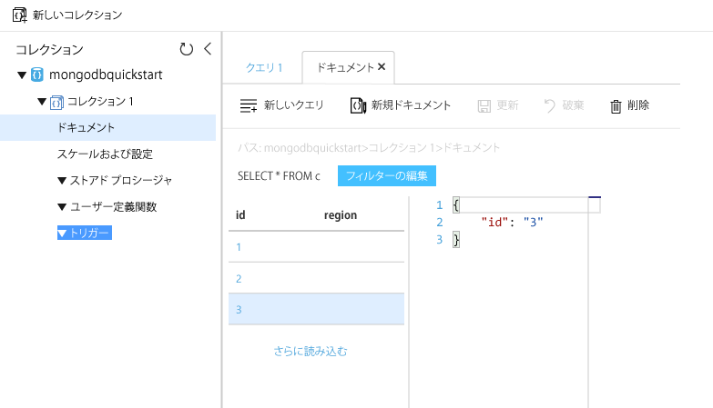

# <a name="migrate-an-existing-mongodb-nodejs-web-app-to-azure-cosmos-db"></a>既存の MongoDB Node.js Web アプリを Azure Cosmos DB に移行する 

> [!div class="op_single_selector"]
> * [.NET](create-mongodb-dotnet.md)
> * [Java](create-mongodb-java.md)
> * [Node.js](create-mongodb-nodejs.md)
> * [Python](create-mongodb-flask.md)
> * [Xamarin](create-mongodb-xamarin.md)
> * [Golang](create-mongodb-golang.md)
>  

Azure Cosmos DB は、Microsoft のグローバルに配布されるマルチモデル データベース サービスです。 Cosmos DB の中核であるグローバル配布と水平スケーリングの機能を利用して、ドキュメント、キー/値、グラフの各データベースの作成とクエリをすばやく行うことができます。 

このクイック スタートでは、Node.js で記述された既存の MongoDB アプリを使用する方法と、MongoDB クライアントをサポートする Cosmos データベースにこのアプリを接続する方法を説明します。 言い換えると、Cosmos データベースへのデータの格納は、アプリケーションでは意識されません。

操作を完了すると、MEAN アプリケーション (MongoDB、Express、Angular、および Node.js) が [Cosmos DB](https://azure.microsoft.com/services/cosmos-db/) で実行されます。 


[!INCLUDE [cloud-shell-try-it](../../includes/cloud-shell-try-it.md)]

CLI をローカルにインストールして使用する場合、このトピックでは、Azure CLI バージョン 2.0 以降を実行していることが要件です。 バージョンを確認するには、`az --version` を実行します。 インストールまたはアップグレードする必要がある場合は、[Azure CLI のインストール]( /cli/azure/install-azure-cli)に関するページを参照してください。 

## <a name="prerequisites"></a>前提条件 
Azure サブスクリプションをお持ちでない場合は、開始する前に [無料アカウント](https://azure.microsoft.com/free/?WT.mc_id=A261C142F) を作成してください。 
[!INCLUDE [cosmos-db-emulator-mongodb](../../includes/cosmos-db-emulator-mongodb.md)]

`npm` コマンドと `git` コマンドを実行するには、Azure CLI に加えて、[Node.js](https://nodejs.org/) と [Git](https://www.git-scm.com/downloads) がローカルにインストールされていることが必要です。

Node.js の実用的な知識が必要です。 このクイック スタートは、一般的な Node.js アプリケーションの開発を支援するためのものではありません。

## <a name="clone-the-sample-application"></a>サンプル アプリケーションの複製

次のコマンドを実行して、サンプル リポジトリを複製します。 このサンプル レポジトリには、既定の [MEAN.js](https://meanjs.org/) アプリケーションが含まれています。

1. コマンド プロンプトを開いて git-samples という名前の新しいフォルダーを作成し、コマンド プロンプトを閉じます。

    ```bash
    md "C:\git-samples"
    ```

2. git bash などの git ターミナル ウィンドウを開いて、`cd` コマンドを使用して、サンプル アプリをインストールする新しいフォルダーに変更します。

    ```bash
    cd "C:\git-samples"
    ```

3. 次のコマンドを実行して、サンプル レポジトリを複製します。 このコマンドは、コンピューター上にサンプル アプリのコピーを作成します。 

    ```bash
    git clone https://github.com/prashanthmadi/mean
    ```

## <a name="run-the-application"></a>アプリケーションの実行

必要なパッケージをインストールし、アプリケーションを起動します。

```bash
cd mean
npm install
npm start
```
アプリケーションは、MongoDB ソースに接続しようとして失敗しますが、そのまま続けてください。出力結果から "[MongoError: connect ECONNREFUSED 127.0.0.1:27017]" が返されたらアプリケーションを終了します。

## <a name="log-in-to-azure"></a>Azure にログインする

インストールされた Azure CLI を使用する場合は、[az login](/cli/azure/reference-index#az-login) コマンドで Azure サブスクリプションにログインし、画面上の指示に従います。 Azure Cloud Shell を使用する場合は、この手順を省略できます。

```azurecli
az login 
``` 
   
## <a name="add-the-azure-cosmos-db-module"></a>Azure Cosmos DB モジュールを追加する

インストールされた Azure CLI を使用する場合は、`az` コマンドを実行して、`cosmosdb` コンポーネントが既にインストールされているかどうかを調べます。 `cosmosdb` が基本コマンドの一覧にある場合は、次のコマンドに進みます。 Azure Cloud Shell を使用する場合は、この手順を省略できます。

`cosmosdb` が基本コマンドの一覧にない場合は、[Azure CLI]( /cli/azure/install-azure-cli) を再インストールします。

## <a name="create-a-resource-group"></a>リソース グループの作成

[az group create](/cli/azure/group#az-group-create) で[リソース グループ](../azure-resource-manager/resource-group-overview.md)を作成します。 Azure リソース グループとは、Web アプリ、データベース、ストレージ アカウントなどの Azure リソースのデプロイと管理に使用する論理コンテナーです。 

次の例は、西ヨーロッパ リージョンにリソース グループを作成します。 リソース グループには一意の名前を選択します。

Azure Cloud Shell を使用する場合は、**[試してみる]** をクリックし、画面のプロンプトに従ってログインしてから、コマンドをコマンド プロンプトにコピーします。

```azurecli-interactive
az group create --name myResourceGroup --location "West Europe"
```

## <a name="create-an-azure-cosmos-db-account"></a>Azure Cosmos DB アカウントを作成する

[az cosmosdb create](/cli/azure/cosmosdb#az-cosmosdb-create) コマンドを使用して、Cosmos アカウントを作成します。

次のコマンドの `<cosmosdb-name>` プレースホルダーを独自の一意の Cosmos アカウント名に置き換えます。 この一意の名前は、Cosmos DB エンドポイント (`https://<cosmosdb-name>.documents.azure.com/`) の一部として使用されます。そのため、この名前は Azure 内のすべての Cosmos アカウントで一意である必要があります。 

```azurecli-interactive
az cosmosdb create --name <cosmosdb-name> --resource-group myResourceGroup --kind MongoDB
```

`--kind MongoDB` パラメーターにより、MongoDB のクライアント接続が有効になります。

Azure Cosmos DB アカウントが作成されると、Azure CLI によって次の例のような情報が表示されます。 

> [!NOTE]
> この例では、Azure CLI の出力形式として JSON を使用しています (既定)。 別の出力形式を使用する場合は、「[Azure CLI コマンドの出力形式](https://docs.microsoft.com/cli/azure/format-output-azure-cli)」を参照してください。

```json
{
  "databaseAccountOfferType": "Standard",
  "documentEndpoint": "https://<cosmosdb-name>.documents.azure.com:443/",
  "id": "/subscriptions/00000000-0000-0000-0000-000000000000/resourceGroups/myResourceGroup/providers/Microsoft.Document
DB/databaseAccounts/<cosmosdb-name>",
  "kind": "MongoDB",
  "location": "West Europe",
  "name": "<cosmosdb-name>",
  "readLocations": [
    {
      "documentEndpoint": "https://<cosmosdb-name>-westeurope.documents.azure.com:443/",
      "failoverPriority": 0,
      "id": "<cosmosdb-name>-westeurope",
      "locationName": "West Europe",
      "provisioningState": "Succeeded"
    }
  ],
  "resourceGroup": "myResourceGroup",
  "type": "Microsoft.DocumentDB/databaseAccounts",
  "writeLocations": [
    {
      "documentEndpoint": "https://<cosmosdb-name>-westeurope.documents.azure.com:443/",
      "failoverPriority": 0,
      "id": "<cosmosdb-name>-westeurope",
      "locationName": "West Europe",
      "provisioningState": "Succeeded"
    }
  ]
} 
```

## <a name="connect-your-nodejs-application-to-the-database"></a>データベースに Node.js アプリケーションを接続する

この手順では、MEAN.js サンプル アプリケーションを、先ほど作成した Cosmos データベースに接続します。 

<a name="devconfig"></a>
## <a name="configure-the-connection-string-in-your-nodejs-application"></a>Node.js アプリケーションでの接続文字列の構成

MEAN.js リポジトリにある `config/env/local-development.js` を開きます。

このファイルの内容を次のコードに置き換えます。 さらに、2 つの `<cosmosdb-name>` プレースホルダーを実際の Cosmos アカウント名に置き換えます。

```javascript
'use strict';

module.exports = {
  db: {
    uri: 'mongodb://<cosmosdb-name>:<primary_master_key>@<cosmosdb-name>.documents.azure.com:10255/mean-dev?ssl=true&sslverifycertificate=false'
  }
};
```

## <a name="retrieve-the-key"></a>キーを取得する

Cosmos データベースに接続するには、データベース キーが必要です。 [az cosmosdb list-keys](/cli/azure/cosmosdb#az-cosmosdb-list-keys) コマンドを使用して、プライマリ キーを取得します。

```azurecli-interactive
az cosmosdb list-keys --name <cosmosdb-name> --resource-group myResourceGroup --query "primaryMasterKey"
```

Azure CLI によって次の例のような情報が出力されます。 

```json
"RUayjYjixJDWG5xTqIiXjC..."
```

`primaryMasterKey` の値をコピーします。 これを `local-development.js` の `<primary_master_key>` に上書きする形で貼り付けます。

変更を保存します。

### <a name="run-the-application-again"></a>アプリケーションをもう一度実行する

`npm start` をもう一度実行します。 

```bash
npm start
```

開発環境が稼働したことを通知するコンソール メッセージが表示されます。 

ブラウザーで `http://localhost:3000` にアクセスします。 上部のメニューの **[Sign Up (サインアップ)]** をクリックし、ダミー ユーザーを 2 人作成します。 

MEAN.js サンプル アプリケーションでは、ユーザー データをデータベースに格納します。 操作が成功し、MEAN.js が作成されたユーザーに自動的にサインインすれば、Azure Cosmos DB 接続は機能しています。 


## <a name="view-data-in-data-explorer"></a>データ エクスプローラーにデータを表示する

Cosmos データベースの格納データは、Azure portal で表示したり、クエリしたりできます。

前の手順で作成されたユーザー データを、表示、クエリ、操作するには、Web ブラウザーで [Azure Portal](https://portal.azure.com) にログインします。

上部の検索ボックスに、「Azure Cosmos DB」と入力します。 Cosmos アカウントのブレードが開いたら、自分の Cosmos アカウントを選択します。 左側のナビゲーションで、[データ エクスプローラー] をクリックします。 [コレクション] ウィンドウでコレクションを展開します。これで、コレクション内のドキュメントの表示とデータのクエリを実行でき、ストアド プロシージャ、トリガー、および UDF の作成と実行も行うことができます。 




## <a name="deploy-the-nodejs-application-to-azure"></a>Azure に Node.js アプリケーションをデプロイする

この手順では、Node.js アプリケーションを Cosmos DB にデプロイします。

先ほど変更した構成ファイルは開発環境用であることにお気付きかもしれません (`/config/env/local-development.js`)。 アプリケーションを App Service にデプロイすると、既定では運用環境で実行されます。 したがって、ここで、同じ変更を該当する構成ファイルに対して行う必要があります。

MEAN.js リポジトリにある `config/env/production.js` を開きます。

次の例に示すように、`db` オブジェクトの `uri` の値を置き換えます。 前と同じように、必ずプレースホルダーを置き換えます。

```javascript
'mongodb://<cosmosdb-name>:<primary_master_key>@<cosmosdb-name>.documents.azure.com:10255/mean?ssl=true&sslverifycertificate=false',
```

> [!NOTE] 
> [Cosmos DB では SSL が必須](connect-mongodb-account.md#connection-string-requirements)なので、`ssl=true` オプションは重要です。 
>
>

ターミナルで、すべての変更を Git にコミットします。 両方のコマンドをコピーして、それらをまとめて実行することができます。

```bash
git add .
git commit -m "configured MongoDB connection string"
```
## <a name="clean-up-resources"></a>リソースのクリーンアップ

[!INCLUDE [cosmosdb-delete-resource-group](../../includes/cosmos-db-delete-resource-group.md)]

## <a name="next-steps"></a>次の手順

このクイック スタートでは、Cosmos アカウントを作成し、コレクションを作成して、コンソール アプリを実行する方法を学習しました。 これで、Cosmos データベースに追加のデータをインポートできます。 

> [!div class="nextstepaction"]
> [MongoDB データを Azure Cosmos DB にインポートする](mongodb-migrate.md)
