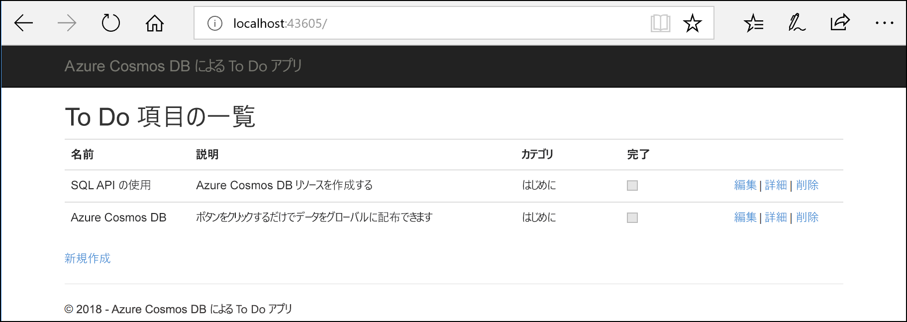
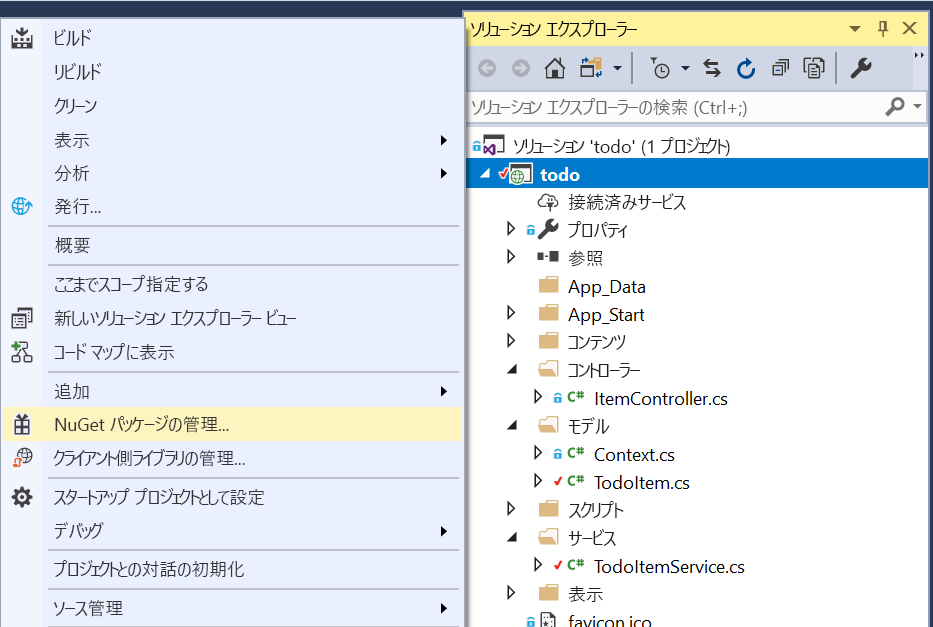

# <a name="quickstart-build-an-aspnet-web-app-with-azure-cosmos-db-using-the-sql-api-and-the-azure-portal"></a>クイック スタート: Azure Cosmos DB SQL API と Azure portal を使用して ASP.NET Web アプリをビルドする

> [!div class="op_single_selector"]
> * [.NET (プレビュー)](create-sql-api-dotnet-preview.md)
> * [.NET](create-sql-api-dotnet.md)
> * [Java](create-sql-api-java.md)
> * [Node.js](create-sql-api-nodejs.md)
> * [Python](create-sql-api-python.md)
> * [Xamarin](create-sql-api-xamarin-dotnet.md)
>  
> 

Azure Cosmos DB は、Microsoft のグローバルに分散された高可用性を持つマルチモデル データベース サービスです。 Azure Cosmos DB の中核をなすグローバル配布と水平方向のスケール機能を活用して、ドキュメント、キー/値、およびグラフ データベースをすばやく作成および照会できます。 

このクイック スタートでは、Azure portal を使用して、Azure Cosmos DB の [SQL API](sql-api-introduction.md) アカウント、データベース、およびコンテナーを作成する方法を示します。 さらに、[SQL .NET API](sql-api-sdk-dotnet.md) を使用して、次のスクリーンショットに示す ASP.NET Web アプリ (To Do リスト) をビルドしてデプロイします。 

このクイック スタートでは、バージョン 3.0 以降の Azure Cosmos DB .NET SDK を使用します。 



## <a name="prerequisites"></a>前提条件

まだ Visual Studio 2017 をインストールしていない場合は、**無料**の [Visual Studio 2017 Community エディション](https://www.visualstudio.com/downloads/)をダウンロードして使用できます。 Visual Studio のセットアップ中に、必ず **[Azure の開発]** ワークロードを有効にしてください。

[!INCLUDE [quickstarts-free-trial-note](../../includes/quickstarts-free-trial-note.md)] 
[!INCLUDE [cosmos-db-emulator-docdb-api](../../includes/cosmos-db-emulator-docdb-api.md)]  

<a id="create-account"></a>
## <a name="create-a-database-account"></a>データベース アカウントの作成

[!INCLUDE [cosmos-db-create-dbaccount-preview](../../includes/cosmos-db-create-dbaccount-preview.md)]

<a id="create-collection"></a>
## <a name="add-a-collection"></a>コレクションの追加

[!INCLUDE [cosmos-db-create-collection-preview](../../includes/cosmos-db-create-collection-preview.md)]

<a id="add-sample-data"></a>
## <a name="add-sample-data"></a>サンプル データの追加

[!INCLUDE [cosmos-db-create-sql-api-add-sample-data](../../includes/cosmos-db-create-sql-api-add-sample-data.md)]

## <a name="query-your-data"></a>データのクエリ

[!INCLUDE [cosmos-db-create-sql-api-query-data](../../includes/cosmos-db-create-sql-api-query-data.md)]

## <a name="clone-the-sample-application"></a>サンプル アプリケーションの複製

次は、コードを使った作業に移りましょう。 [GitHub から SQL API アプリ](https://github.com/Azure-Samples/cosmos-dotnet-todo-app)の複製を作成し、接続文字列を設定して実行します。 

1. コマンド プロンプトを開いて git-samples という名前の新しいフォルダーを作成し、コマンド プロンプトを閉じます。

    ```bash
    md "C:\git-samples"
    ```

2. git bash などの git ターミナル ウィンドウを開いて、`cd` コマンドを使用して、サンプル アプリをインストールする新しいフォルダーに変更します。

    ```bash
    cd "C:\git-samples"
    ```

3. 次のコマンドを実行して、サンプル レポジトリを複製します。 このコマンドは、コンピューター上にサンプル アプリのコピーを作成します。

    ```bash
    git clone https://github.com/Azure-Samples/cosmos-dotnet-todo-app.git
    ```

4. Visual Studio で **todo.sln** ソリューション ファイルを開きます。 

## <a name="review-the-code"></a>コードの確認

この手順は省略可能です。 コード内のデータベース リソースの作成方法に関心がある場合は、次のスニペットを確認できます。 関心がない場合は、「[接続文字列の更新](#update-your-connection-string)」に進んでください。 

以前のバージョンの .NET SDK に精通している場合は、"コレクション" や "ドキュメント" という用語をよく目にしたことに注意してください。 Azure Cosmos DB では複数の API モデルをサポートしているため、バージョン 3.0 以降の .NET SDK では、"コンテナー" と "項目" という一般的な用語が使用されています。 コンテナーは、コレクション、グラフ、またはテーブルを表します。 項目は、ドキュメント、エッジ/頂点、行など、コンテナー内の内容を表します。 データベース、コンテナー、および項目の詳細については[こちら](databases-containers-items.md)を参照してください。

次のスニペットはすべて ToDoItemService.cs ファイルからのものです。

* 行 68 から 69 で、CosmosClient が初期化されます。

    ```csharp
    CosmosConfiguration config = new CosmosConfiguration(Endpoint, PrimaryKey);
    client = new CosmosClient(config);
    ```

* 行 71 で、新しいデータベースが作成されます。

    ```csharp
    CosmosDatabase database = await client.Databases.CreateDatabaseIfNotExistsAsync(DatabaseId);
    ```

* 行 72 で、パーティション キー "/category" を使用して新しいコンテナーが作成されます。

    ```csharp
    CosmosContainer container = await database.Containers.CreateContainerIfNotExistsAsync(ContainerId, "/category");
    ```

## <a name="update-your-connection-string"></a>接続文字列を更新する

ここで Azure Portal に戻り、接続文字列情報を取得し、アプリにコピーします。

1. [Azure portal](https://portal.azure.com/) の Azure Cosmos DB アカウントで、左のナビゲーションの **[キー]** を選択してから **[読み取り/書き込みキー]** を選択します。 次の手順では、画面の右側のコピー ボタンを使用して、URI とプライマリ キーを web.config ファイルにコピーします。

    ![Azure Portal の [キー] ブレードでアクセス キーを表示およびコピーする](./media/create-sql-api-dotnet/keys.png)

2. Visual Studio 2017 で、**web.config** ファイルを開きます。 

3. ポータルから (コピー ボタンを使用して) URI 値をコピーし、web.config 内の ``endpoint`` キーの値に設定します。 

    `<add key="endpoint" value="FILLME" />`

4. 次に、ポータルから [主キー] 値をコピーし、web.config 内の ``primarykey`` の値に設定します。 

    `<add key="primaryKey" value="FILLME" />`
    
5. 次に、先ほど作成したデータベースとコンテナーの名前に合うように database と container の値を更新します。 これで、Azure Cosmos DB と通信するために必要なすべての情報でアプリを更新しました。 

    `<add key="database" value="Tasks" />`

    `<add key="container" value="Items" />`
    
## <a name="run-the-web-app"></a>Web アプリの実行

1. **ソリューション エクスプローラー**で、Visual Studio ソリューションの下にある新しいコンソール アプリケーション プロジェクトを右クリックし、**[NuGet パッケージの管理]** をクリックします。
    
    
1. **[NuGet]** タブの **[参照]** をクリックし、検索ボックスに「**Microsoft.Azure.Cosmos**」と入力します。
1. 結果の中から **Microsoft.Azure.Cosmos** を探し、**[インストール]** をクリックします。
   Azure Cosmos DB SQL API クライアント ライブラリのパッケージ ID は [Microsoft Azure Cosmos DB クライアント ライブラリ](https://www.nuget.org/packages/Microsoft.Azure.Cosmos/) です。

   

    ソリューションの変更の確認に関するメッセージが表示されたら、**[OK]** をクリックします。 ライセンスの同意に関するメッセージが表示されたら、**[同意する]** をクリックします。

1. Ctrl + F5 キーを押してアプリケーションを実行します。 ブラウザーにアプリが表示されます。 

1. ブラウザーで **[新規作成]** を選択し、to-do アプリでいくつかの新しいタスクを作成します。 [[サンプル データの追加]](#add-sample-data) で作成したタスクも表示されます。

   

これで、データ エクスプローラーに戻って、この新しいデータの表示、クエリ、変更、操作を行うことができます。 

## <a name="review-slas-in-the-azure-portal"></a>Azure Portal での SLA の確認

[!INCLUDE [cosmosdb-tutorial-review-slas](../../includes/cosmos-db-tutorial-review-slas.md)]

## <a name="clean-up-resources"></a>リソースのクリーンアップ

[!INCLUDE [cosmosdb-delete-resource-group](../../includes/cosmos-db-delete-resource-group.md)]

## <a name="next-steps"></a>次の手順

このクイック スタートでは、Azure Cosmos DB アカウントを作成し、コンテナーを作成し、データ エクスプローラーを使用して項目を追加した後、Web アプリを実行する方法を説明しました。 これで、Cosmos DB アカウントに追加のデータをインポートできます。 

> [!div class="nextstepaction"]
> [Azure Cosmos DB へのデータのインポート](import-data.md)


