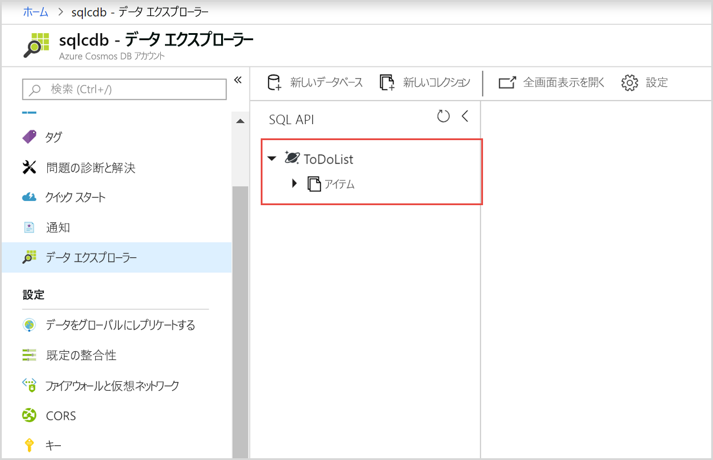

# <a name="quickstart-build-a-net-web-app-using-sql-api-account-in-azure-cosmos-db"></a>クイック スタート:Azure Cosmos DB の SQL API アカウントを使用して .NET Web アプリをビルドする

> [!div class="op_single_selector"]
> * [.NET](create-sql-api-dotnet.md)
> * [.NET (プレビュー)](create-sql-api-dotnet-preview.md)
> * [Java](create-sql-api-java.md)
> * [Node.js](create-sql-api-nodejs.md)
> * [Python](create-sql-api-python.md)
> * [Xamarin](create-sql-api-xamarin-dotnet.md)
>  
> 

Azure Cosmos DB は、Microsoft のグローバルに配布されるマルチモデル データベース サービスです。 Azure Cosmos DB を使用して、キー/値データベース、ドキュメント データベース、およびグラフ データベースをすばやく作成し、クエリを実行できます。そのすべてで、Azure Cosmos DB の中核をなすグローバル配布と水平方向のスケール機能を活用します。 

このクイック スタートでは、Azure portal を使用して、Azure Cosmos DB [SQL API](sql-api-introduction.md) アカウント、ドキュメント データベース、コレクションを作成し、データをコレクションに追加する方法を説明します。 その後、[SQL .NET SDK](sql-api-sdk-dotnet.md) Web アプリを使用して、コレクションにデータをさらに追加します。 

このクイック スタートでは、Azure portal のデータ エクスプローラーを使用してデータベースとコレクションを作成します。 また、.NET サンプル コードを使用してデータベースとコレクションを作成することもできます。 詳細については、「[.NET コードの確認](#review-the-net-code)」を参照してください。 

## <a name="prerequisites"></a>前提条件

Azure 開発ワークフローがインストールされている Visual Studio 2017
- **無料**の [Visual Studio 2017 Community Edition](https://www.visualstudio.com/downloads/) をダウンロードして使用できます。 Visual Studio のセットアップ中に、必ず **[Azure の開発]** を有効にしてください。 

Azure サブスクリプションまたは Azure Cosmos DB の無料試用版アカウント
- [!INCLUDE [quickstarts-free-trial-note](../../includes/quickstarts-free-trial-note.md)] 
- [!INCLUDE [cosmos-db-emulator-docdb-api](../../includes/cosmos-db-emulator-docdb-api.md)]  

<a id="create-account"></a>
## <a name="create-an-azure-cosmos-db-account"></a>Azure Cosmos DB アカウントを作成する

[!INCLUDE [cosmos-db-create-dbaccount](../../includes/cosmos-db-create-dbaccount.md)]

<a id="create-collection-database"></a>
## <a name="add-a-database-and-a-collection"></a>データベースとコレクションの追加 

Azure portal のデータ エクスプローラーを使用してデータベースとコレクションを作成できます。 

1.  ご使用の Azure Cosmos DB アカウント ページの左側のナビゲーションから **[データ エクスプローラー]** を選択してから **[新しいコレクション]** を選択します。 
    
    **[コレクションの追加]** 領域を表示するために、右へスクロールする必要がある場合があります。
    
    ![Azure portal の [データ エクスプローラー] の [コレクションの追加] ウィンドウ](./media/create-sql-api-dotnet/azure-cosmosdb-data-explorer-dotnet.png)
    
1.  **[コレクションの追加]** ページで、新しいコレクションの設定を入力します。
    
    |設定|推奨値|説明
    |---|---|---|
    |**データベース ID**|ToDoList|新しいデータベースの名前として *ToDoList* を入力します。 データベース名は 1 文字以上 255 文字以内にする必要があります。`/, \\, #, ?` は使えず、末尾にスペースを入れることもできません。|
    |**コレクション ID**|項目|新しいコレクションの名前として*項目*を入力します。 コレクション ID には、データベース名と同じ文字要件があります。|
    |**パーティション キー**| /category| この記事で説明するサンプルでは、*/category* をパーティション キーとして使用します。|
    |**スループット**|400|スループットを 400 要求ユニット/秒 (RU/秒) のままにします。 待ち時間を短縮する場合、後でスループットをスケールアップできます。| 
    
    この例では、**一意のキー**を追加しません。 一意のキーを使用すると、パーティション キーごとに 1 つまたは複数の値の一意性を確保して、データベースにデータ整合性のレイヤーを追加できます。 詳細については、[Azure Cosmos DB における一意のキー](unique-keys.md)に関するページをご覧ください。
    
1.  **[OK]** を選択します。 
    新しいデータベースとコレクションがデータ エクスプローラーに表示されます。
    
    

## <a name="add-data-to-your-database"></a>ご自分のデータベースにデータを追加する

データ エクスプローラーを使用して、ご自分の新しいデータベースにデータを追加します。

1. **データ エクスプローラー**の **[コレクション]** ウィンドウに新しいデータベースが表示されます。 **[ToDoList]** データベースを展開し、**[項目]** コレクションを展開して、**[ドキュメント]** を選択し、**[新しいドキュメント]** を選択します。 
   
   
   
1. **[ドキュメント]** ウィンドウの右側でドキュメントに次の構造を追加します。

     ```json
     {
         "id": "1",
         "category": "personal",
         "name": "groceries",
         "description": "Pick up apples and strawberries.",
         "isComplete": false
     }
     ```

1. **[保存]** を選択します。
   
   ![json データをコピーし、Azure portal のデータ エクスプローラーで [保存] を選択する](./media/create-sql-api-dotnet/azure-cosmosdb-save-document.png)
   
1. **[新しいドキュメント]** をもう一度選択し、一意の `id` に加え、必要なその他のプロパティと値を指定したもう 1 つのドキュメントを作成して保存します。 Azure Cosmos DB では、データにスキーマが課されないため、ご自分のドキュメントは任意の構造にすることができます。

## <a name="query-your-data"></a>データのクエリ

[!INCLUDE [cosmos-db-create-sql-api-query-data](../../includes/cosmos-db-create-sql-api-query-data.md)]

## <a name="use-the-net-web-app-to-manage-data"></a>.NET Web アプリを使用してデータを管理する

プログラムを使って Azure Cosmos DB データを操作するのがいかに簡単かを確認するために、GitHub からサンプルの SQL API .NET Web アプリを複製し、接続文字列を更新し、アプリを実行してご自分のデータを更新します。 

また、.NET サンプル コードを使用してデータベースとコレクションを作成することもできます。 詳細については、「[.NET コードの確認](#review-the-net-code)」を参照してください。

### <a name="clone-the-sample-app"></a>サンプル アプリの複製

まず、GitHub から C# [SQL API アプリ](https://github.com/Azure-Samples/documentdb-dotnet-todo-app)を複製します。 

1. Git ターミナル ウィンドウ (Git Bash など) を開き、*git-samples* という名前の新しいディレクトリを作成し、そのディレクトリに変更します。 
   
   ```bash
   mkdir /c/git-samples/
   cd /c/git-samples/
   ```
   
1. 次のコマンドを実行して、サンプル リポジトリを複製し、サンプル アプリのコピーをご使用のコンピューター上に作成します。
   
   ```bash
   git clone https://github.com/Azure-Samples/documentdb-dotnet-todo-app.git
   ```

### <a name="update-the-connection-string"></a>接続文字列を更新する 

1. ご自分の複製したアプリの *todo.sln* ファイルに移動し、Visual Studio で開きます。 

1. Visual Studio の**ソリューション エクスプローラー**から *web.config* ファイルを開きます。 

1. Azure portal に戻り、ご自分の接続文字列情報をコピーし、*web.config* に貼り付けます。
   
   1. ご使用の Azure Cosmos DB アカウントの左側のナビゲーションにある **[キー]** を選択します。
      
      ![Azure Portal の [キー] ブレードでアクセス キーを表示およびコピーする](./media/create-sql-api-dotnet/keys.png)
      
   1. **[読み取り/書き込みキー]** の下にある **[URI]** の値を右側にあるコピー ボタンを使用してコピーし、*web.config* 内の `endpoint` キーに貼り付けます。例:  
      
      `<add key="endpoint" value="https://mysqlapicosmosdb.documents.azure.com:443/" />`
      
   1. **[プライマリ キー]** の値をコピーし、*web.config* 内の `authKey` キーに貼り付けます。例: 
      
      `<add key="authKey" value="19ZDNJAiYL26tmnRvoez6hmtIfBGwjun50PWRjNYMC2ig8Ob9hYk7Fq1RYSv8FcIYnh1TdBISvCh7s6yyb0000==" />`

       
1. *web.config* 内のデータベースとコレクションの値が以前に作成した名前と一致していることを確認します。 

   ```csharp
   <add key="database" value="ToDoList"/>
   <add key="collection" value="Items"/>
   ```
 
1. *web.config* を保存します。これで、Azure Cosmos DB と通信するために必要なすべての情報でアプリを更新しました。

### <a name="run-the-web-app"></a>Web アプリの実行

1. Visual Studio の**ソリューション エクスプローラー**で **todo** プロジェクトを右クリックし、**[NuGet パッケージの管理]** を選択します。 

1. NuGet の **[参照]** ボックスに「*DocumentDB*」と入力します。

1. 結果から、**Microsoft.Azure.DocumentDB** ライブラリをインストールします (まだインストールしていない場合)。 これにより、[Microsoft.Azure.DocumentDB](https://www.nuget.org/packages/Microsoft.Azure.DocumentDB/) パッケージとすべての依存関係がインストールされます。
   
   NuGet パッケージ マネージャーに、いくつかのパッケージがソリューションに不足していることを示すメッセージが表示された場合は、**[復元]** を選択して、内部ソースからそれらのパッケージをインストールします。 

1. **Ctrl**+**F5** キーを押して、ご使用のブラウザーでアプリを実行します。 

1. todo アプリで **[Create New]\(新規作成\)** を選択し、いくつかの新しいタスクを作成します。

   

Azure portal のデータ エクスプローラーに戻り、ご自分の新しいデータの表示、クエリ、変更、操作を行うことができます。 

## <a name="review-the-net-code"></a>.NET コードの確認

この手順は省略可能です。 このクイック スタートでは、Azure portal 内でデータベースとコレクションを作成し、.NET サンプルを使用してサンプル データを追加しました。 ただし、.NET サンプルを使用してデータベースとコレクションを作成することもできます。 コード内のデータベース リソースの作成方法に関心がある場合は、次のスニペットを確認してください。 スニペットはすべて **todo** プロジェクトの *DocumentDBRepository.cs* ファイルからのものです。

* このコードは `DocumentClient` を初期化します。 

    ```csharp
    client = new DocumentClient(new Uri(ConfigurationManager.AppSettings["endpoint"]), ConfigurationManager.AppSettings["authKey"]);
    ```

* このコードは `CreateDatabaseAsync` メソッドを使用して、新しいデータベースを作成します。

    ```csharp
    await client.CreateDatabaseAsync(new Database { Id = DatabaseId });
    ```

* 次のコードは `CreateDocumentCollectionAsync` メソッドを使用して、新しいコレクションを作成します。

    ```csharp
    private static async Task CreateCollectionIfNotExistsAsync()
    {
        try
        {
           await client.ReadDocumentCollectionAsync(UriFactory.CreateDocumentCollectionUri(DatabaseId, CollectionId));
        }
        catch (DocumentClientException e)
        {
           if (e.StatusCode == System.Net.HttpStatusCode.NotFound)
           {
              await client.CreateDocumentCollectionAsync(
              UriFactory.CreateDatabaseUri(DatabaseId),
              new DocumentCollection
              {
                  Id = CollectionId
              },
              new RequestOptions { OfferThroughput = 400 });
           }
           else
           {
             throw;
           }
        }
    }
    ```

## <a name="clean-up-resources"></a>リソースのクリーンアップ

[!INCLUDE [cosmosdb-delete-resource-group](../../includes/cosmos-db-delete-resource-group.md)]

## <a name="next-steps"></a>次の手順

このクイック スタートでは、Azure Cosmos DB アカウントを作成し、データ エクスプローラーを使用してデータベースとコレクションを作成し、.NET Web アプリを実行してご自分のデータを更新する方法を説明しました。 これで、Azure Cosmos DB アカウントに追加のデータをインポートできるようになりました。 

> [!div class="nextstepaction"]
> [Azure Cosmos DB へのデータのインポート](import-data.md)

