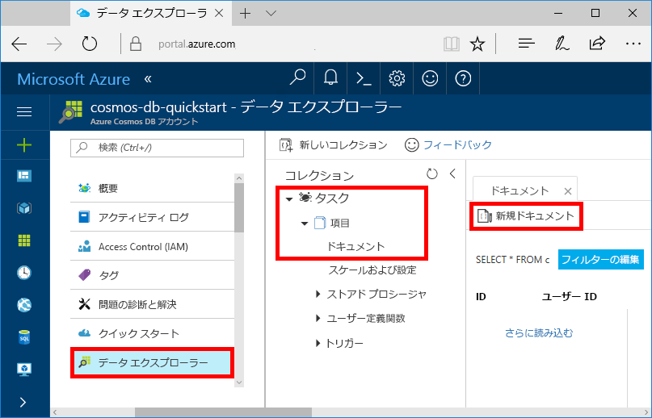

# <a name="quickstart-build-a-net-web-app-with-azure-cosmos-db-using-the-sql-api-and-the-azure-portal"></a>クイック スタート: SQL API と Azure Portal を使って Azure Cosmos DB による .NET Web アプリを作る

[!INCLUDE [cosmos-db-sql-api](../../includes/cosmos-db-sql-api.md)] 

Azure Cosmos DB は、Microsoft のグローバルに配布されるマルチモデル データベース サービスです。 Azure Cosmos DB の中核をなすグローバル配布と水平方向のスケール機能を活用して、ドキュメント、キー/値、およびグラフ データベースをすばやく作成および照会できます。 

このクイック スタートでは、Azure Portal を使用して、Azure Cosmos DB アカウント、ドキュメント データベース、コレクションを作成する方法を説明します。 さらに、次のスクリーンショットに示すように、[SQL .NET API](sql-api-sdk-dotnet.md) 上に todo リスト Web アプリをビルドしてデプロイします。 


## <a name="prerequisites"></a>前提条件

まだ Visual Studio 2017 をインストールしていない場合は、**無料**の [Visual Studio 2017 Community エディション](https://www.visualstudio.com/downloads/)をダウンロードして使用できます。 Visual Studio のセットアップ中に、必ず **[Azure の開発]** を有効にしてください。

[!INCLUDE [quickstarts-free-trial-note](../../includes/quickstarts-free-trial-note.md)] 
[!INCLUDE [cosmos-db-emulator-docdb-api](../../includes/cosmos-db-emulator-docdb-api.md)]  

<a id="create-account"></a>
## <a name="create-a-database-account"></a>データベース アカウントの作成

[!INCLUDE [cosmos-db-create-dbaccount](../../includes/cosmos-db-create-dbaccount.md)]

<a id="create-collection"></a>
## <a name="add-a-collection"></a>コレクションの追加

[!INCLUDE [cosmos-db-create-collection](../../includes/cosmos-db-create-collection.md)]

<a id="add-sample-data"></a>
## <a name="add-sample-data"></a>サンプル データの追加

これで、データ エクスプローラーを使用して、新しいコレクションにデータを追加できます。

1. データ エクスプローラーで新しいデータベースが [コレクション] ウィンドウに表示されます。 **[タスク]** データベースを展開し、**[項目]** コレクションを展開して、**[ドキュメント]** をクリックし、**[新しいドキュメント]** をクリックします。 

   
  
2. ここで、次の構造のドキュメントをコレクションに追加します。

     ```json
     {
         "id": "1",
         "category": "personal",
         "name": "groceries",
         "description": "Pick up apples and strawberries.",
         "isComplete": false
     }
     ```

3. json を **[ドキュメント]** タブに追加したら、**[保存]** をクリックします。

    ![json データをコピーし、Azure Portal のデータ エクスプローラーで [保存] をクリックします。](./media/create-sql-api-dotnet/azure-cosmosdb-data-explorer-save-document.png)

4.  もう 1 つドキュメントを作成して保存します。`id` プロパティには一意の値を挿入し、その他のプロパティについては適宜変更してください。 Azure Cosmos DB では、データにスキーマを課さないため、新しいドキュメントは必要な任意の構造にすることができます。

     これで、データ エクスプローラーでクエリを使用して、データを取得できるようになりました。 既定では、データ エクスプローラーにより `SELECT * FROM c` を使用してコレクション内のすべてのドキュメントが取得されますが、[SQL クエリ](sql-api-sql-query.md)を `SELECT * FROM c ORDER BY c._ts DESC` のように変更すると、すべてのドキュメントをそのタイムスタンプの降順で取得できます。
 
     さらに、データ エクスプローラーを使用して、ストアド プロシージャ、UDF、トリガーを作成し、サーバー側ビジネス ロジックを実行できるほか、スループットをスケールすることもできます。 データ エクスプローラーでは、API で使用可能な、組み込みのプログラムによるデータ アクセスがすべて公開されていますが、Azure Portal でデータに簡単にアクセスできます。

## <a name="clone-the-sample-application"></a>サンプル アプリケーションの複製

次は、コードを使った作業に移りましょう。 GitHub から SQL API アプリの複製を作成し、接続文字列を設定して実行します。 プログラムでデータを処理することが非常に簡単であることがわかります。 

1. git ターミナル ウィンドウ (git bash など) を開き、`CD` を実行して作業ディレクトリに移動します。  

2. 次のコマンドを実行して、サンプル レポジトリを複製します。 

    ```bash
    git clone https://github.com/Azure-Samples/documentdb-dotnet-todo-app.git
    ```

3. 次に、Visual Studio で todo ソリューション ファイルを開きます。 

## <a name="review-the-code"></a>コードの確認

アプリで何が行われているかを簡単に確認してみましょう。 DocumentDBRepository.cs ファイルを開くと、これらのコード行によって、Azure Cosmos DB リソースが作成されることがわかります。 

* 76 行目では、DocumentClient が初期化されます。

    ```csharp
    client = new DocumentClient(new Uri(ConfigurationManager.AppSettings["endpoint"]), ConfigurationManager.AppSettings["authKey"]);
    ```

* 91 行目では、新しいデータベースが作成されます。

    ```csharp
    await client.CreateDatabaseAsync(new Database { Id = DatabaseId });
    ```

* 110 行目では、新しいコレクションが作成されます。

    ```csharp
    await client.CreateDocumentCollectionAsync(
        UriFactory.CreateDatabaseUri(DatabaseId),
        new DocumentCollection { Id = CollectionId },
        new DocumentCollection
            {
               Id = CollectionId
            },
        new RequestOptions { OfferThroughput = 400 });
    ```

## <a name="update-your-connection-string"></a>接続文字列を更新する

ここで Azure Portal に戻り、接続文字列情報を取得し、アプリにコピーします。

1. [Azure Portal](http://portal.azure.com/) で、Azure Cosmos DB アカウントの左のナビゲーションから、**[キー]** をクリックしてから **[読み取り/書き込みキー]** をクリックします。 次の手順では、画面の右側のコピー ボタンを使用して、URI とプライマリ キーを web.config ファイルにコピーします。

    ![Azure Portal の [キー] ブレードでアクセス キーを表示およびコピーする](./media/create-sql-api-dotnet/keys.png)

2. Visual Studio 2017 で web.config ファイルを開きます。 

3. ポータルから (コピー ボタンを使用して) URI 値をコピーし、web.config の endpoint キーの値に設定します。 

    `<add key="endpoint" value="FILLME" />`

4. ポータルから PRIMARY KEY 値をコピーし、web.config の authKey の値に設定します。これで、Azure Cosmos DB と通信するために必要なすべての情報でアプリを更新しました。 

    `<add key="authKey" value="FILLME" />`
    
## <a name="run-the-web-app"></a>Web アプリの実行
1. Visual Studio の**ソリューション エクスプローラー**でプロジェクトを右クリックし、**[NuGet パッケージの管理]** をクリックします。 

2. NuGet の **[参照]** ボックスに「*DocumentDB*」と入力します。

3. 結果から、**Microsoft.Azure.DocumentDB** ライブラリをインストールします。 これにより、Microsoft.Azure.DocumentDB パッケージとすべての依存関係がインストールされます。

4. Ctrl + F5 キーを押してアプリケーションを実行します。 ブラウザーにアプリが表示されます。 

5. ブラウザーで、**[新規作成]** をクリックし、to-do アプリで、いくつか新しいタスクを作成します。

   

これで、データ エクスプローラーに戻って、この新しいデータの表示、クエリ、変更、操作を行うことができます。 

## <a name="review-slas-in-the-azure-portal"></a>Azure Portal での SLA の確認

[!INCLUDE [cosmosdb-tutorial-review-slas](../../includes/cosmos-db-tutorial-review-slas.md)]

## <a name="clean-up-resources"></a>リソースのクリーンアップ

このアプリの使用を続けない場合は、以下の手順に従い、Azure Portal でこのクイック スタートで作成したすべてのリソースを削除してください。

1. Azure Portal の左側のメニューで、**[リソース グループ]** をクリックし、作成したリソースの名前をクリックします。 
2. リソース グループのページで **[削除]** をクリックし、削除するリソースの名前をテキスト ボックスに入力してから **[削除]** をクリックします。

## <a name="next-steps"></a>次の手順

このクイックスタートでは、Azure Cosmos DB アカウントを作成し、データ エクスプローラーを使用してコレクションを作成し、Web アプリを実行する方法を説明しました。 これで、Cosmos DB アカウントに追加のデータをインポートできます。 

> [!div class="nextstepaction"]
> [Azure Cosmos DB へのデータのインポート](import-data.md)


