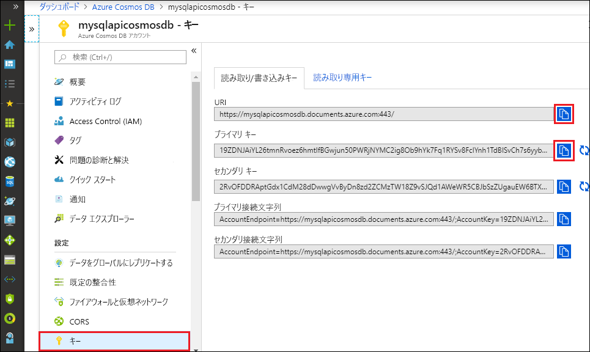

# <a name="quickstart-build-a-python-application-using-an-azure-cosmos-db-sql-api-account"></a>クイック スタート:Azure Cosmos DB SQL API アカウントを使用して Python アプリケーションを構築する

> [!div class="op_single_selector"]
> * [.NET V3](create-sql-api-dotnet.md)
> * [.NET V4](create-sql-api-dotnet-V4.md)
> * [Java](create-sql-api-java.md)
> * [Node.js](create-sql-api-nodejs.md)
> * [Python](create-sql-api-python.md)
> * [Xamarin](create-sql-api-xamarin-dotnet.md)

このクイック スタートでは、Azure portal を使用して、Azure Cosmos DB [SQL API](sql-api-introduction.md) アカウント、ドキュメント データベース、コンテナーを作成する方法を説明します。 その後、[SQL API](sql-api-sdk-python.md) 用の Python SDK で構築されたコンソール アプリを構築して実行します。

Azure Cosmos DB、Microsoft のグローバルに配布されるマルチモデル データベース サービスです。 ドキュメント、キー/値、ワイド カラム、およびグラフ データベースをすばやく作成し、クエリを実行できます。 そのすべての操作に、Azure Cosmos DB が備える分散とスケールは利益をもたらします。

このクイックスタートでは、[Python SDK](https://pypi.org/project/azure-cosmos/#history) のバージョン 4 を使用します。

[!INCLUDE [quickstarts-free-trial-note](../../includes/quickstarts-free-trial-note.md)] [!INCLUDE [cosmos-db-emulator-docdb-api](../../includes/cosmos-db-emulator-docdb-api.md)]

## <a name="prerequisites"></a>前提条件

* [Python 3.6 以降](https://www.python.org/downloads/) (`python` 実行可能ファイルが `PATH` に設定されていること)。
* [Visual Studio Code](https://code.visualstudio.com/)
* [Visual Studio Code 用の Python 拡張機能](https://marketplace.visualstudio.com/items?itemName=ms-python.python#overview)

## <a name="create-a-database-account"></a>データベース アカウントの作成

[!INCLUDE [cosmos-db-create-dbaccount](../../includes/cosmos-db-create-dbaccount.md)]

## <a name="add-a-container"></a>コンテナーの追加

Azure portal でデータ エクスプローラー ツールを使用してデータベースとコンテナーを作成できるようになりました。 

1. **[データ エクスプローラー]**  >  **[新しいコンテナー]** の順に選択します。 
    
    **[コンテナーの追加]** 領域が右端に表示されます。表示するには、右へスクロールする必要がある場合があります。

    ![Azure portal の [データ エクスプローラー] の [コンテナーの追加] ウィンドウ](./media/create-sql-api-python/azure-cosmosdb-data-explorer.png)

2. **[コンテナーの追加]** ページで、新しいコンテナーの設定を入力します。

    |設定|推奨値|[説明]
    |---|---|---|
    |**[データベース ID]**|処理手順|新しいデータベースの名前として *ToDoList* を入力します。 データベース名は 1 文字以上 255 文字以内にする必要があります。`/, \\, #, ?` は使えず、末尾にスペースを入れることもできません。 **[Provision database throughput]\(データベース スループットをプロビジョニングする\)** オプションをオンにすると、データベースにプロビジョニングされたスループットをデータベース内のすべてのコンテナーにわたって共有できます。 このオプションは、コストの削減にも役立ちます。 |
    |**スループット**|400|スループットを 400 要求ユニット/秒 (RU/秒) のままにします。 待ち時間を短縮する場合、後でスループットをスケールアップできます。| 
    |**コンテナー ID**|アイテム|新しいコンテナーの名前として「*アイテム*」と入力します。 コンテナー ID には、データベース名と同じ文字要件があります。|
    |**パーティション キー**| /category| この記事で説明するサンプルでは、 */category* をパーティション キーとして使用します。|
    
    上記の設定に加え、必要に応じて、このコンテナー用に**一意なキー**を追加できます。 この例では、このフィールドを空のままにしましょう。 一意なキーを使用すると、開発者はデータベースにデータ整合性のレイヤーを追加できます。 コンテナーの作成中に一意キー ポリシーを作成すると、パーティション キーごとに 1 つ以上の値の一意性が保証されます。 詳細については、記事「[Azure Cosmos DB における一意なキー](unique-keys.md)」を参照してください。
    
    **[OK]** を選択します。 新しいデータベースとコンテナーがデータ エクスプローラーに表示されます。

## <a name="add-sample-data"></a>サンプル データの追加

[!INCLUDE [cosmos-db-create-sql-api-add-sample-data](../../includes/cosmos-db-create-sql-api-add-sample-data.md)]

## <a name="query-your-data"></a>データのクエリ

[!INCLUDE [cosmos-db-create-sql-api-query-data](../../includes/cosmos-db-create-sql-api-query-data.md)]

## <a name="clone-the-sample-application"></a>サンプル アプリケーションの複製

では、GitHub から SQL API アプリを複製し、接続文字列を設定して実行しましょう。

1. コマンド プロンプトを開いて git-samples という名前の新しいフォルダーを作成し、コマンド プロンプトを閉じます。

    ```cmd
    md "git-samples"
    ```
   bash プロンプトを使用している場合は、代わりに次のコマンドを使用する必要があります。

   ```bash
   mkdir "git-samples"
   ```

2. git bash などの git ターミナル ウィンドウを開いて、`cd` コマンドを使用して、サンプル アプリをインストールする新しいフォルダーに変更します。

    ```bash
    cd "git-samples"
    ```

3. 次のコマンドを実行して、サンプル レポジトリを複製します。 このコマンドは、コンピューター上にサンプル アプリのコピーを作成します。 

    ```bash
    git clone https://github.com/Azure-Samples/azure-cosmos-db-python-getting-started.git
    ```  

## <a name="update-your-connection-string"></a>接続文字列を更新する

ここで Azure Portal に戻り、接続文字列情報を取得し、アプリにコピーします。

1. [Azure portal](https://portal.azure.com/) で Azure Cosmos アカウントにアクセスし、左側のナビゲーションにある **[キー]** を選択します。 次の手順では、画面の右側にあるコピー ボタンを使用して、 **[URI]** と **[主キー]** を `cosmos_get_started.py` ファイルにコピーします。

    

2. Visual Studio Code で \git-samples\azure-cosmos-db-python-getting-started 内の `cosmos_get_started.py` ファイルを開きます。

3. ポータルから (コピー ボタンを使用して) **URI** 値をコピーし、それを ``cosmos_get_started.py`` 内の **endpoint** 変数の値にします。 

    `endpoint = 'https://FILLME.documents.azure.com',`

4. 次に、ポータルから **PRIMARY KEY** 値をコピーし、``cosmos_get_started.py`` 内の **key** の値に設定します。 これで、Azure Cosmos DB と通信するために必要なすべての情報でアプリを更新しました。 

    `key = 'FILLME'`

5. ``cosmos_get_started.py`` ファイルを保存します。

## <a name="review-the-code"></a>コードの確認

この手順は省略可能です。 コードで作成されたデータベース リソースについて確認するか、または省略して「[接続文字列を更新する](#update-your-connection-string)」に進んでください。

次のスニペットはすべて、`cosmos_get_started.py` ファイルからのものです。

* CosmosClient が初期化されます。 「[接続文字列を更新する](#update-your-connection-string)」セクションの説明に従って "endpoint" と "key" の値を更新します。 

    [!code-python[](~/azure-cosmos-db-python-getting-started/cosmos_get_started.py?name=create_cosmos_client)]

* 新しいデータベースが作成されます。

    [!code-python[](~/azure-cosmos-db-python-getting-started/cosmos_get_started.py?name=create_database_if_not_exists)]

* 新しいコンテナーが、400 RU/秒の[プロビジョニング スループット](request-units.md)で作成されます。 [パーティション キー](partitioning-overview.md#choose-partitionkey)として `lastName` を選択します。こうすることで、このプロパティでフィルター処理を行う効率的なクエリを実行できます。 

    [!code-python[](~/azure-cosmos-db-python-getting-started/cosmos_get_started.py?name=create_container_if_not_exists)]

* いくつかの項目がコンテナーに追加されます。 コンテナーは、さまざまなスキーマを持つことができる項目 (JSON ドキュメント) のコレクションです。 ヘルパー メソッド ```get_[name]_family_item``` は、JSON ドキュメントとして Azure Cosmos DB に格納されているファミリの表現を返します。

    [!code-python[](~/azure-cosmos-db-python-getting-started/cosmos_get_started.py?name=create_item)]

* ポイント読み取り (キー値の検索) は、`read_item` メソッドを使用して実行されます。 各操作の [RU 料金](request-units.md)が出力されます。
    [!code-python[](~/azure-cosmos-db-python-getting-started/cosmos_get_started.py?name=read_item)]

* SQL クエリ構文を使用して、クエリが実行されます。 WHERE 句で ```lastName``` のパーティション キー値を使用しているため、Azure Cosmos DB は、このクエリを適切なパーティションに効率的にルーティングし、パフォーマンスを向上させます。

    [!code-python[](~/azure-cosmos-db-python-getting-started/cosmos_get_started.py?name=query_items)]
   
## <a name="run-the-app"></a>アプリを実行する

1. Visual Studio Code で、 **[ビュー]**  >  **[コマンド パレット]** の順に選択します。 

2. プロンプトで「**Python: Select Interpreter**」と入力し、使用する Python のバージョンを選択します。

    Visual Studio Code のフッターが、選択されているインタープリターを示すように更新されます。 

3. **[表示]**  >  **[統合ターミナル]** の順に選択して、Visual Studio Code 統合ターミナルを開きます。

4. 統合ターミナル ウィンドウで、azure-cosmos-db-python-getting-started フォルダー内にいることを確認します。 そうでない場合は、次のコマンドを実行して、サンプル フォルダーに切り替えます。 

    ```cmd
    cd "\git-samples\azure-cosmos-db-python-getting-started"`
    ```

5. 次のコマンドを実行して、azure-cosmos パッケージをインストールします。 

    ```python
    pip install --pre azure-cosmos
    ```

    azure-cosmos をインストールしようとしたときにアクセスが拒否されたことを示すエラーが表示される場合は、[管理者として VS Code を実行する](https://stackoverflow.com/questions/37700536/visual-studio-code-terminal-how-to-run-a-command-with-administrator-rights)必要があります。

6. 次のコマンドを実行してサンプルを実行し、新しいドキュメントを作成して Azure Cosmos DB に保存します。

    ```python
    python cosmos_get_started.py
    ```

7. 新しい項目が作成および保存されたことを確認するには、Azure portal で **[データ エクスプローラー]**  >  **[AzureSampleFamilyDatabase]**  >  **[Items]\(項目\)** の順に選択します。 作成された項目を表示します。 例として、Andersen ファミリのサンプル JSON ドキュメントを次に示します。

```json
{
    "id": "Andersen-1569479288379",
    "lastName": "Andersen",
    "district": "WA5",
    "parents": [
        {
            "familyName": null,
            "firstName": "Thomas"
        },
        {
            "familyName": null,
            "firstName": "Mary Kay"
        }
    ],
    "children": null,
    "address": {
        "state": "WA",
        "county": "King",
        "city": "Seattle"
    },
    "registered": true,
    "_rid": "8K5qAIYtZXeBhB4AAAAAAA==",
    "_self": "dbs/8K5qAA==/colls/8K5qAIYtZXc=/docs/8K5qAIYtZXeBhB4AAAAAAA==/",
    "_etag": "\"a3004d78-0000-0800-0000-5d8c5a780000\"",
    "_attachments": "attachments/",
    "_ts": 1569479288
}
```

## <a name="review-slas-in-the-azure-portal"></a>Azure Portal での SLA の確認

[!INCLUDE [cosmosdb-tutorial-review-slas](../../includes/cosmos-db-tutorial-review-slas.md)]

## <a name="clean-up-resources"></a>リソースをクリーンアップする

[!INCLUDE [cosmosdb-delete-resource-group](../../includes/cosmos-db-delete-resource-group.md)]

## <a name="next-steps"></a>次のステップ

このクイックスタートでは、Azure Cosmos アカウントを作成し、データ エクスプローラーを使用してコンテナーを作成し、アプリを実行する方法を説明しました。 これで、Cosmos DB アカウントに追加のデータをインポートできます。 

> [!div class="nextstepaction"]
> [SQL API 用に Azure Cosmos DB にデータをインポートする](import-data.md)


