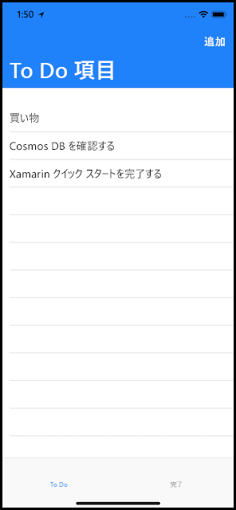
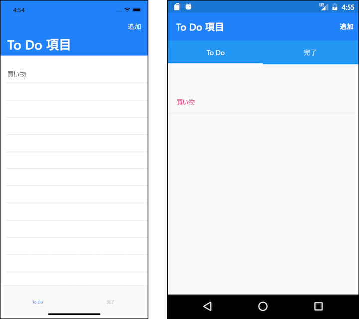
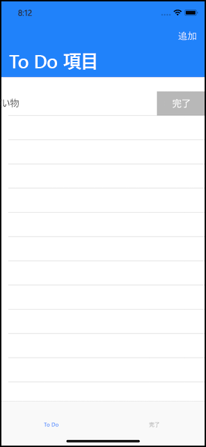
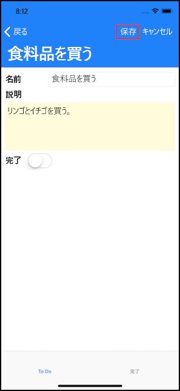
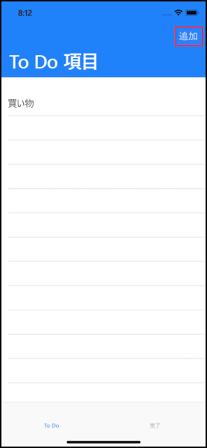

# <a name="azure-cosmos-db-build-a-todo-app-with-xamarin"></a>Azure Cosmos DB: Xamarin を使用した todo アプリの構築

Azure Cosmos DB は、Microsoft のグローバルに配布されるマルチモデル データベース サービスです。 Azure Cosmos DB の中核をなすグローバル配布と水平方向のスケール機能を活用して、ドキュメント、キー/値、およびグラフ データベースをすばやく作成および照会できます。

> [!NOTE]
> CosmosDB を含め、さまざまな Azure プランを表示する基本的なサンプル Xamarin アプリのサンプル コードは、[こちら](https://github.com/xamarinhq/app-geocontacts)の GitHub でご覧いただけます。 このアプリでは、地理的に分散した連絡先を確認し、それらの連絡先がその場所を更新できるようにする方法が紹介されています。

このクイック スタートでは、Azure Portal を使用して、Azure Cosmos DB SQL API アカウント、ドキュメント データベース、コレクションを作成する方法を説明します。 次に、[SQL .NET API](sql-api-sdk-dotnet.md) と [Xamarin](https://docs.microsoft.com/xamarin/#pivot=platforms&panel=Cross-Platform) を基盤に [Xamarin.Forms](https://docs.microsoft.com/xamarin/#pivot=platforms&panel=XamarinForms) と [MVVM アーキテクチャ パターン](https://docs.microsoft.com/xamarin/xamarin-forms/xaml/xaml-basics/data-bindings-to-mvvm)を使用して、todo リスト Web アプリを構築およびデプロイします。



## <a name="prerequisites"></a>前提条件

Windows 上で開発していて、まだ Visual Studio 2017 をインストールしていない場合は、**無料**の [Visual Studio 2017 Community エディション](https://www.visualstudio.com/downloads/)をダウンロードして使用できます。 Visual Studio のセットアップ中に、必ず **[Azure の開発]** と **[.NET によるモバイル開発]** ワークロードを有効にしてください。

Mac を使用している場合は、**無料**の [Visual Studio for Mac](https://www.visualstudio.com/vs/mac/) をダウンロードできます。

[!INCLUDE [quickstarts-free-trial-note](../../includes/quickstarts-free-trial-note.md)]
[!INCLUDE [cosmos-db-emulator-docdb-api](../../includes/cosmos-db-emulator-docdb-api.md)]

## <a name="create-a-database-account"></a>データベース アカウントの作成

[!INCLUDE [cosmos-db-create-dbaccount](../../includes/cosmos-db-create-dbaccount.md)]

## <a name="add-a-collection"></a>コレクションの追加

[!INCLUDE [cosmos-db-create-collection](../../includes/cosmos-db-create-collection.md)]

## <a name="add-sample-data"></a>サンプル データの追加

[!INCLUDE [cosmos-db-create-sql-api-add-sample-data](../../includes/cosmos-db-create-sql-api-add-sample-data.md)]

## <a name="query-your-data"></a>データのクエリ

[!INCLUDE [cosmos-db-create-sql-api-query-data](../../includes/cosmos-db-create-sql-api-query-data.md)]

## <a name="clone-the-sample-application"></a>サンプル アプリケーションの複製

ここでは、GitHub から Xamarin SQL API アプリを複製し、コードを確認した後、API キーを入手して実行します。 プログラムでデータを処理することが非常に簡単であることがわかります。

1. コマンド プロンプトを開いて git-samples という名前の新しいフォルダーを作成し、コマンド プロンプトを閉じます。

    ```bash
    md "C:\git-samples"
    ```

2. git bash などの git ターミナル ウィンドウを開いて、`cd` コマンドを使用して、サンプル アプリをインストールする新しいフォルダーに変更します。

    ```bash
    cd "C:\git-samples"
    ```

3. 次のコマンドを実行して、サンプル レポジトリを複製します。 このコマンドは、コンピューター上にサンプル アプリのコピーを作成します。

    ```bash
    git clone https://github.com/Azure-Samples/azure-cosmos-db-sql-xamarin-getting-started.git
    ```

4. 次に、Visual Studio の samples/xamarin/ToDoItems フォルダーにある ToDoItems.sln ファイルを開きます。

## <a name="obtain-your-api-keys"></a>API キーの取得

ここで Azure Portal に戻り、API キー情報を取得して、アプリにコピーします。

1. [Azure Portal](http://portal.azure.com/) で、Azure Cosmos DB SQL API アカウントの左のナビゲーションから、**[キー]** をクリックし、**[読み取り/書き込みキー]** をクリックします。 次の手順では、画面の右側のコピー ボタンを使用して、URI と主キーを APIKeys.cs ファイルにコピーします。

    ![Azure Portal の [キー] ブレードでアクセス キーを表示およびコピーする](./media/create-sql-api-xamarin-dotnet/keys.png)

2. Visual Studio 2017 または Visual Studio for Mac で、azure-documentdb-dotnet/samples/xamarin/ToDoItems/ToDoItems.Core/Helpers フォルダーにある APIKeys.cs ファイルを開きます。

3. ポータルから (コピー ボタンを使用して) [URI] 値をコピーし、APIKeys.cs 内の `CosmosEndpointUrl` 変数の値に設定します。

    `public static readonly string CosmosEndpointUrl = "{Azure Cosmos DB account URL}";`

4. 次に、ポータルから [主キー] 値をコピーし、APIKeys.cs 内の `Cosmos Auth Key` の値に設定します。

    `public static readonly string CosmosAuthKey = "{Azure Cosmos DB secret}";`

[!INCLUDE [cosmos-db-auth-key-info](../../includes/cosmos-db-auth-key-info.md)]

## <a name="review-the-code"></a>コードの確認

このソリューションでは、Azure Cosmos DB SQL API および Xamarin.Forms を使用して ToDo アプリを作成する方法を示します。 このアプリには 2 つのタブがあります。最初のタブには、未完了の todo 項目を表示するリスト ビューが含まれています。 2 番目のタブには、完了した todo 項目が表示されます。 最初のタブでは、未完了の todo 項目が表示されることに加え、新しい todo 項目を追加したり、既存の todo 項目を編集したりできます。また、項目を "完了" としてマークすることもできます。

![json データをコピーし、Azure Portal のデータ エクスプローラーで [保存] をクリックします。](./media/create-sql-api-xamarin-dotnet/android-todo-screen.png)

ToDoItems ソリューションのコードには、次の項目が含まれています。

* ToDoItems.Core: Xamarin.Forms プロジェクトと Azure Cosmos DB 内に todo 項目を保持する共有アプリケーション ロジックのコードを含む .NET Standard プロジェクトです。
* ToDoItems.Android: このプロジェクトには、Android アプリが含まれています。
* ToDoItems.iOS: このプロジェクトには、iOS アプリが含まれています。

次に、アプリが Azure Cosmos DB とどのようにやり取りするかを簡単に見ていきましょう。

* [Microsoft.Azure.DocumentDb.Core](https://www.nuget.org/packages/Microsoft.Azure.DocumentDB.Core/) NuGet パッケージは、すべてのプロジェクトに追加する必要があります。
* azure-documentdb-dotnet/samples/xamarin/ToDoItems/ToDoItems.Core/Models フォルダーの `ToDoItem` クラスは、上記で作成した **Items** コレクションのドキュメントをモデル化します。 プロパティ名の大文字と小文字が区別されることに注意してください。
* azure-documentdb-dotnet/samples/xamarin/ToDoItems/ToDoItems.Core/Services フォルダー内の `CosmosDBService` クラスは、Azure Cosmos DB への通信をカプセル化します。
* `CosmosDBService` クラス内には、`DocumentClient` 型変数があります。 `DocumentClient` は、Azure Cosmos DB アカウントに対する要求を構成および実行するために使用され、31 行目でインスタンス化されます。

    ```csharp
    docClient = new DocumentClient(new Uri(APIKeys.CosmosEndpointUrl), APIKeys.CosmosAuthKey);
    ```

* ドキュメントのコレクションに対するクエリを実行するときは、次の `CosmosDBService.GetToDoItems` 関数に示されているように `DocumentClient.CreateDocumentQuery<T>` メソッドを使用します。

    ```csharp
    public async static Task<List<ToDoItem>> GetToDoItems()
    {
        var todos = new List<ToDoItem>();

        var todoQuery = docClient.CreateDocumentQuery<ToDoItem>(
                                UriFactory.CreateDocumentCollectionUri(databaseName, collectionName),
                                .Where(todo => todo.Completed == false)
                                .AsDocumentQuery();

        while (todoQuery.HasMoreResults)
        {
            var queryResults = await todoQuery.ExecuteNextAsync<ToDoItem>();

            todos.AddRange(queryResults);
        }

        return todos;
    }
    ```

    `CreateDocumentQuery<T>` は、前のセクションで作成されたコレクションを指す URI を受け取ります。 また、`Where` 句のような LINQ 演算子を指定することもできます。 このケースでは、完了していない todo 項目のみが返されます。

    `CreateDocumentQuery<T>` 関数は、同期的に実行され、`IQueryable<T>` を返します。 ただし、`AsDocumentQuery` メソッドは、`IQueryable<T>` を、非同期的に実行できる `IDocumentQuery<T>` オブジェクトに変換します。 これにより、モバイル アプリケーションの UI スレッドがブロックされなくなります。

    `IDocumentQuery<T>.ExecuteNextAsync<T>` 関数は、Azure Cosmos DB から結果のページを取得します。このとき、`HasMoreResults` を使用して、取得する必要がある結果がまだ残っていないかどうかを確認しています。

> [!TIP]
> Azure Cosmos DB のコレクションとドキュメントを操作するいくつかの関数は、コレクションまたはドキュメントのアドレスを指定する URI をパラメーターとして受け取ります。 この URI は、`URIFactory` クラスを使用して構築されます。 データベース、コレクション、およびドキュメントの URI は、すべてこのクラスを使用して作成できます。

* 107 行目の `ComsmosDBService.InsertToDoItem` 関数は、新しいドキュメントを挿入する方法を示しています。

    ```csharp
    public async static Task InsertToDoItem(ToDoItem item)
    {
        ...
        await docClient.CreateDocumentAsync(UriFactory.CreateDocumentCollectionUri(databaseName, collectionName), item);
        ...
    }
    ```

    ドキュメント コレクション URI が、挿入される項目と共に指定されています。

* 124 行目の `CosmosDBService.UpdateToDoItem` 関数は、既存のドキュメントを新しいドキュメントで置き換える方法を示しています。

    ```csharp
    public async static Task UpdateToDoItem(ToDoItem item)
    {
        ...
        var docUri = UriFactory.CreateDocumentUri(databaseName, collectionName, item.Id);

        await docClient.ReplaceDocumentAsync(docUri, item);
    }
    ```

    ここでは、置き換えるドキュメントを一意に識別するために新しい URI が必要です。これを取得するために、`UriFactory.CreateDocumentUri` を使用し、これにデータベースおよびコレクション名とドキュメント ID を渡しています。

    `DocumentClient.ReplaceDocumentAsync` は、URI で識別されたドキュメントを、パラメーターとして指定されたドキュメントで置き換えます。

* 項目を削除する方法は、115 行目の `CosmosDBService.DeleteToDoItem` 関数に示されています。

    ```csharp
    public async static Task DeleteToDoItem(ToDoItem item)
    {
        ...
        var docUri = UriFactory.CreateDocumentUri(databaseName, collectionName, item.Id);

        await docClient.DeleteDocumentAsync(docUri);
    }
    ```

    ここでも、一意のドキュメント URI が作成されて `DocumentClient.DeleteDocumentAsync` 関数に渡されていることに注目してください。

## <a name="run-the-app"></a>アプリの実行

これで、Azure Cosmos DB と通信するために必要なすべての情報でアプリを更新しました。

次の手順に、Visual Studio for Mac のデバッガーを使用してアプリを実行する方法を示します。

> [!NOTE]
> Android バージョンのアプリも使い方はまったく同じです。違いがある場合は以降の手順に示します。 Windows 上で Visual Studio を使用してデバッグする場合は、[iOS 用](https://docs.microsoft.com/xamarin/ios/deploy-test/debugging-in-xamarin-ios?tabs=vswin)と [Android 用](https://docs.microsoft.com/xamarin/android/deploy-test/debugging/)のドキュメントを参照してください。

1. 最初に、強調表示されているドロップダウンをクリックし、ToDoItems.iOS (iOS の場合) または ToDoItems.Android (Android の場合) を選択して、ターゲットとするプラットフォームを選択します。

    

2. アプリのデバッグを開始するには、cmd キーを押しながら Enter キーを押すか、再生ボタンをクリックします。

    

3. iOS シミュレーターまたは Android エミュレーターの起動が完了すると、アプリの画面の下部 (iOS 版) または上部 (Android 版) に 2 つのタブが表示されます。 最初のタブには完了していない todo 項目が表示され、2 番目のタブには完了した todo 項目が表示されます。

    

4. iOS 上で todo 項目を "完了" と設定するには、項目を左にスライドし、**[Complete]** ボタンをタップします。 Android 上で todo 項目を "完了" と設定するには、項目を長押しし、[Complete] ボタンをタップします。

    

5. todo 項目を編集するには、項目をタップし、新しい画面が表示されたら新しい値を入力します。 [save] ボタンをタップして、変更を Azure Cosmos DB に保存します。

    

6. todo 項目を追加するには、ホーム画面の右上にある **[Add]** ボタンをタップします。すると、新しい空白の編集ページが表示されます。

    

## <a name="review-slas-in-the-azure-portal"></a>Azure Portal での SLA の確認

[!INCLUDE [cosmosdb-tutorial-review-slas](../../includes/cosmos-db-tutorial-review-slas.md)]

## <a name="clean-up-resources"></a>リソースのクリーンアップ

[!INCLUDE [cosmosdb-delete-resource-group](../../includes/cosmos-db-delete-resource-group.md)]

## <a name="next-steps"></a>次の手順

このクイックスタートでは、Azure Cosmos DB アカウントを作成し、データ エクスプローラーを使用してコレクションを作成し、Xamarin アプリを構築およびデプロイする方法を説明しました。 これで、Azure Cosmos DB アカウントに追加のデータをインポートできるようになりました。

> [!div class="nextstepaction"]
> [Azure Cosmos DB へのデータのインポート](import-data.md)
