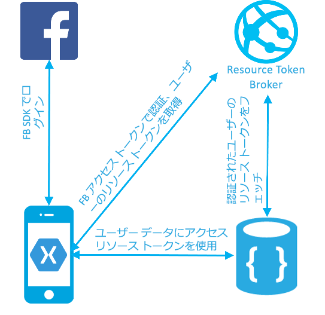

# <a name="azure-cosmos-db-build-a-web-app-with-net-xamarin-and-facebook-authentication"></a>Azure Cosmos DB: .NET、Xamarin、Facebook 認証を使用した Web アプリの構築

[!INCLUDE [cosmos-db-sql-api](../../includes/cosmos-db-sql-api.md)]

Azure Cosmos DB は、Microsoft のグローバルに配布されるマルチモデル データベース サービスです。 Azure Cosmos DB の中核をなすグローバル配布と水平方向のスケール機能を活用して、ドキュメント、キー/値、およびグラフ データベースをすばやく作成および照会できます。

> [!NOTE]
> CosmosDB を含め、さまざまな Azure プランを表示する基本的なサンプル Xamarin アプリのサンプル コードは、[こちら](https://github.com/xamarinhq/app-geocontacts)の GitHub でご覧いただけます。 このアプリでは、地理的に分散した連絡先を確認し、それらの連絡先がその場所を更新できるようにする方法が紹介されています。

このクイック スタートでは、Azure Portal を使用して、Azure Cosmos DB アカウント、ドキュメント データベース、コレクションを作成する方法を説明します。 次に、[SQL .NET API](sql-api-sdk-dotnet.md)、[Xamarin](https://www.xamarin.com/)、および Azure Cosmos DB 認証エンジンで構築された ToDo リストの Web アプリケーションを構築およびデプロイします。 ToDo リストの Web アプリでは、ユーザーが Facebook 認証を使用してログインし、独自の ToDo 項目を管理できるようにする、ユーザーごとのデータ パターンを実装します。

## <a name="prerequisites"></a>前提条件

まだ Visual Studio 2017 をインストールしていない場合は、**無料**の [Visual Studio 2017 Community エディション](https://www.visualstudio.com/downloads/)をダウンロードして使用できます。 Visual Studio のセットアップ中に、必ず **[Azure の開発]** を有効にしてください。

[!INCLUDE [quickstarts-free-trial-note](../../includes/quickstarts-free-trial-note.md)]
[!INCLUDE [cosmos-db-emulator-docdb-api](../../includes/cosmos-db-emulator-docdb-api.md)]

## <a name="create-a-database-account"></a>データベース アカウントの作成

[!INCLUDE [cosmos-db-create-dbaccount](../../includes/cosmos-db-create-dbaccount.md)]

## <a name="add-a-collection"></a>コレクションの追加

[!INCLUDE [cosmos-db-create-collection](../../includes/cosmos-db-create-collection.md)]

## <a name="clone-the-sample-application"></a>サンプル アプリケーションの複製

ここで、GitHub から SQL API アプリの複製を作成し、接続文字列を設定して実行します。 プログラムでデータを処理することが非常に簡単であることがわかります。 

1. git ターミナル ウィンドウ (git bash など) を開き、`cd` を実行して作業ディレクトリに移動します。

2. 次のコマンドを実行して、サンプル レポジトリを複製します。 

    ```bash
    git clone https://github.com/Azure/azure-documentdb-dotnet.git
    ```

3. 次に、Visual Studio の samples/xamarin/UserItems/xamarin.forms フォルダーから DocumentDBTodo.sln ファイルを開きます。

## <a name="review-the-code"></a>コードの確認

Xamarin フォルダーのコードには以下が含まれています。

* Xamarin アプリ。 このアプリは、UserItems という名前のパーティション分割されたコレクションにユーザーの ToDo 項目を格納します。
* リソース トークン ブローカー API。 アプリのログインしているユーザーに Azure Cosmos DB リソース トークンを仲介する簡単な ASP.NET Web API です。 リソース トークンは、ログインしているユーザーのデータにアプリがアクセスできるようにする、有効期間の短いアクセス トークンです。

次の図に認証とデータ フローを示します。

* UserItems コレクションは、パーティション キー '/userid' で作成されます。 コレクションのパーティション キーを指定すると、ユーザーと項目の数の増加に応じて Azure Cosmos DB を無限に拡張できます。
* Xamarin アプリを使用すると、ユーザーは Facebook の資格情報でログインできます。
* Xamarin アプリでは、Facebook アクセス トークンを使用して、ResourceTokenBroker API で認証を行います。
* リソース トークン ブローカー API は、App Service の認証機能を使用して要求を認証し、認証されたユーザーのパーティション キーを共有するすべてのドキュメントに対する読み取り/書き込みアクセス権のある Azure Cosmos DB リソース トークンを要求します。
* リソース トークン ブローカーは、クライアント アプリにリソース トークンを返します。
* クライアント アプリは、リソース トークンを使用してユーザーの ToDo 項目にアクセスします。



## <a name="update-your-connection-string"></a>接続文字列を更新する

ここで Azure Portal に戻り、接続文字列情報を取得し、アプリにコピーします。

1. [Azure Portal](http://portal.azure.com/) で、Azure Cosmos DB アカウントの左のナビゲーションから、**[キー]** をクリックしてから **[読み取り/書き込みキー]** をクリックします。 次の手順では、画面の右側のコピー ボタンを使用して、URI とプライマリ キーを Web.config ファイルにコピーします。

    ![Azure Portal の [キー] ブレードでアクセス キーを表示およびコピーする](./media/create-sql-api-xamarin-dotnet/keys.png)

2. Visual Studio 2017 で、azure-documentdb-dotnet/samples/xamarin/UserItems/ResourceTokenBroker/ResourceTokenBroker フォルダーにある Web.config ファイルを開きます。 

3. ポータルの URI 値をコピーし (コピー ボタンを使用して)、Web.config の accountUrl の値に設定します。 

    `<add key="accountUrl" value="{Azure Cosmos DB account URL}"/>`

4. 次に、ポータルから PRIMARY KEY 値をコピーし、Web.config の accountKey の値に設定します。

    `<add key="accountKey" value="{Azure Cosmos DB secret}"/>`

これで、Azure Cosmos DB と通信するために必要なすべての情報でアプリを更新しました。 

## <a name="build-and-deploy-the-web-app"></a>Web アプリの構築およびデプロイ

1. Azure Portal で、App Service の Web サイトを作成し、リソース トークン ブローカー API をホストします。
2. Azure Portal で、リソース トークン ブローカー API の Web サイトの [App Settings] \(アプリの設定) ブレードを開きます。 次のアプリ設定を入力します。

    * accountUrl - Azure Cosmos DB アカウントの [Keys] \(キー) タブの Azure Cosmos DB アカウント URL。
    * accountKey - Azure Cosmos DB アカウントの [Keys] \(キー) タブの Azure Cosmos DB アカウント マスター キー。
    * 作成したデータベースとコレクションの databaseId と collectionId

3. 作成した Web サイトに ResourceTokenBroker ソリューションを公開します。

4. Xamarin プロジェクトを開き、TodoItemManager.cs に移動します。 accountURL、collectionId、databaseId の値を入力し、リソース トークン ブローカーの Web サイトの基本 https URL として resourceTokenBrokerURL の値を入力します。

5. [[How to configure your App Service application to use Facebook login]\(Facebook ログインを使用するように App Service アプリケーションを構成する方法\)](../app-service/app-service-mobile-how-to-configure-facebook-authentication.md) チュートリアルを完了し、Facebook 認証をセットアップして ResourceTokenBroker の Web サイトを構成します。

    Xamarin アプリを実行します。

## <a name="review-slas-in-the-azure-portal"></a>Azure Portal での SLA の確認

[!INCLUDE [cosmosdb-tutorial-review-slas](../../includes/cosmos-db-tutorial-review-slas.md)]

## <a name="clean-up-resources"></a>リソースのクリーンアップ

このアプリの使用を続けない場合は、以下の手順に従い、Azure Portal でこのクイック スタートで作成したすべてのリソースを削除してください。

1. Azure Portal の左側のメニューで、**[リソース グループ]** をクリックし、作成したリソースの名前をクリックします。
2. リソース グループのページで **[削除]** をクリックし、削除するリソースの名前をテキスト ボックスに入力してから **[削除]** をクリックします。

## <a name="next-steps"></a>次の手順

このクイックスタートでは、Azure Cosmos DB アカウントを作成し、データ エクスプローラーを使用してコレクションを作成し、Xamarin アプリを構築およびデプロイする方法を説明しました。 これで、Cosmos DB アカウントに追加のデータをインポートできます。

> [!div class="nextstepaction"]
> [Azure Cosmos DB へのデータのインポート](import-data.md)
