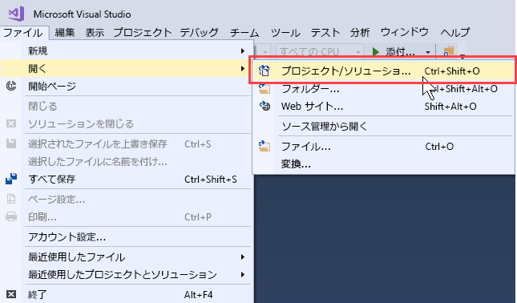
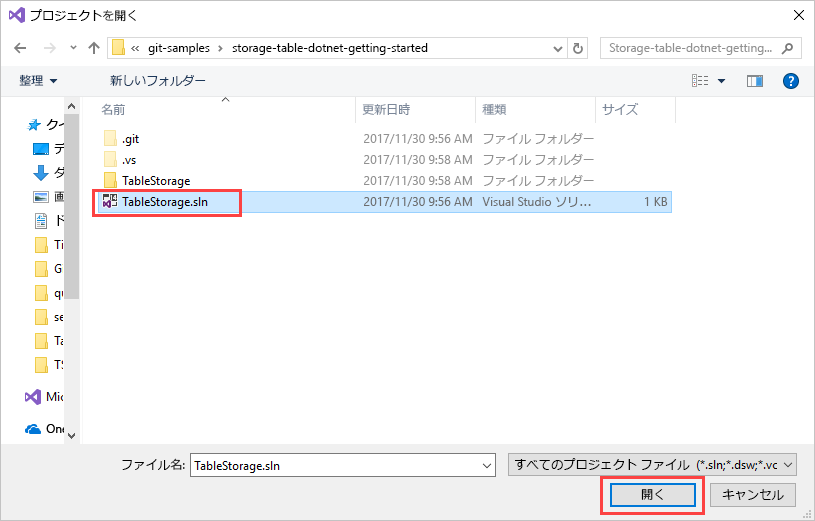
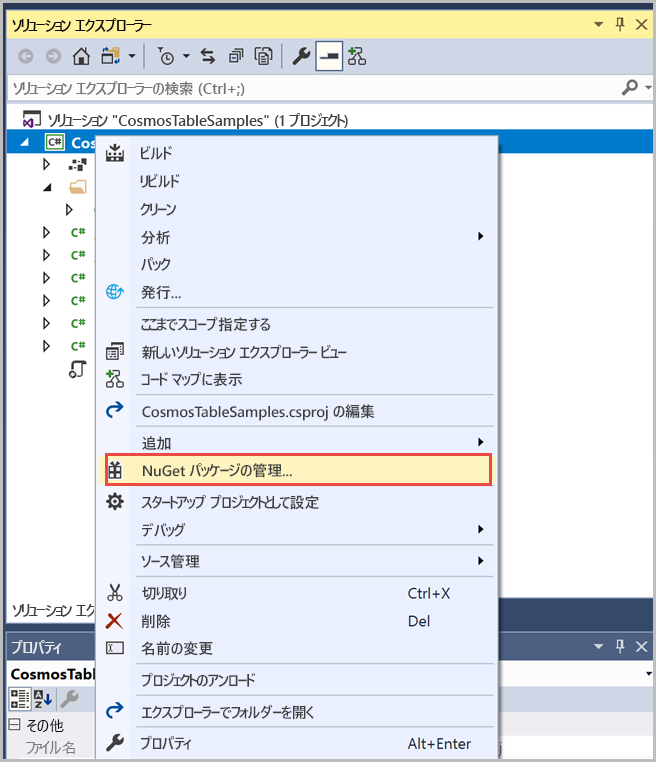
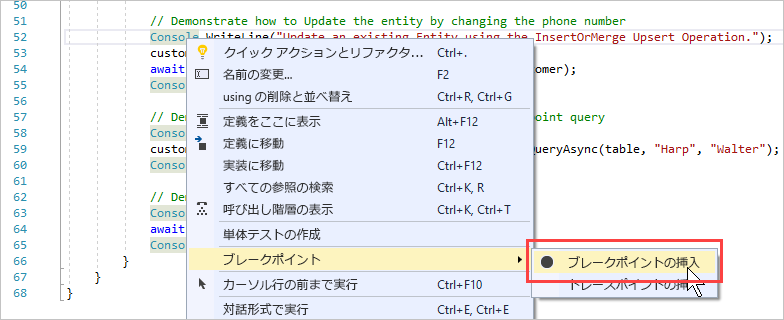
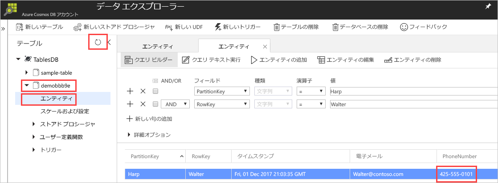

# <a name="quickstart-build-a-table-api-app-with-net-and-azure-cosmos-db"></a>クイックスタート: .NET と Azure Cosmos DB での Table API アプリの構築 

このクイックスタートでは、GitHub から例を複製することで、.NET と Azure Cosmos DB の [Table API](table-introduction.md) を使用してアプリを構築する方法を示します。 このクイックスタートでは、Web ベースの Azure Portal で Azure Cosmos DB アカウントを作成する方法、およびデータ エクスプローラーを使用してテーブルとエンティティを作成する方法も説明します。

Azure Cosmos DB は、Microsoft のグローバルに配布されるマルチモデル データベース サービスです。 Azure Cosmos DB の中核をなすグローバル配布と水平方向のスケール機能を活用して、ドキュメント、キー/値、およびグラフ データベースをすばやく作成および照会できます。 

## <a name="prerequisites"></a>前提条件

まだ Visual Studio 2017 をインストールしていない場合は、**無料**の [Visual Studio 2017 Community エディション](https://www.visualstudio.com/downloads/)をダウンロードして使用できます。 Visual Studio のセットアップ中に、必ず **[Azure の開発]** を有効にしてください。

[!INCLUDE [quickstarts-free-trial-note](../../includes/quickstarts-free-trial-note.md)]

## <a name="create-a-database-account"></a>データベース アカウントの作成

> [!IMPORTANT] 
> 新しいテーブル API アカウントを作成して一般公開のテーブル API SDK を操作する必要があります。 プレビュー期間中に作成されたテーブル API アカウントは、一般公開の SDK ではサポートされません。
>

[!INCLUDE [cosmos-db-create-dbaccount-table](../../includes/cosmos-db-create-dbaccount-table.md)]

## <a name="add-a-table"></a>テーブルの追加

[!INCLUDE [cosmos-db-create-table](../../includes/cosmos-db-create-table.md)]

## <a name="add-sample-data"></a>サンプル データの追加

[!INCLUDE [cosmos-db-create-table-add-sample-data](../../includes/cosmos-db-create-table-add-sample-data.md)]

## <a name="clone-the-sample-application"></a>サンプル アプリケーションの複製

GitHub で Table アプリの複製を作成し、接続文字列を設定して実行します。 プログラムでデータを処理することが非常に簡単であることがわかります。 

1. コマンド プロンプトを開いて git-samples という名前の新しいフォルダーを作成し、コマンド プロンプトを閉じます。

    ```bash
    md "C:\git-samples"
    ```

2. git bash などの git ターミナル ウィンドウを開いて、`cd` コマンドを使用して、サンプル アプリをインストールする新しいフォルダーに変更します。

    ```bash
    cd "C:\git-samples"
    ```

3. 次のコマンドを実行して、サンプル レポジトリを複製します。 このコマンドは、コンピューター上にサンプル アプリのコピーを作成します。

    ```bash
    git clone https://github.com/Azure-Samples/storage-table-dotnet-getting-started.git
    ```
## <a name="open-the-sample-application-in-visual-studio"></a>Visual Studio でサンプル アプリケーションを開く

1. Visual Studio で、**[ファイル]** メニューから **[開く]** を選択して、**[プロジェクト/ソリューション]** を選択します。 

    

2. サンプル アプリケーションを複製したフォルダーに移動し、TableStorage.sln ファイルを開きます。

    

## <a name="update-your-connection-string"></a>接続文字列を更新する

ここで Azure Portal に戻り、接続文字列情報を取得し、アプリにコピーします。 これでアプリが、ホストされているデータベースと通信できます。 

1. [Azure Portal](http://portal.azure.com/) で **[接続文字列]** をクリックします。 

    ウィンドウの右側にある [コピー] ボタンを使って**プライマリ接続文字列**をコピーします。

    ![[接続文字列] ウィンドウでプライマリ接続文字列を確認してコピーする](./media/create-table-dotnet/connection-string.png)

2. Visual Studio で App.config ファイルを開きます。 

3. このチュートリアルでは Azure SDK Storage Emulator を使用しないため、8 行目の StorageConnectionString のコメントを解除し、7 行目の StorageConnectionString をコメント アウトします。 7 行目と 8 行目は次のようになります。

    ```
    <!--key="StorageConnectionString" value="UseDevelopmentStorage=true;" />-->
    <add key="StorageConnectionString" value="DefaultEndpointsProtocol=https;AccountName=[AccountName];AccountKey=[AccountKey]" />
    ```

4. ポータルの**プライマリ接続文字列**を、8 行目の StorageConnectionString に貼り付けます。 引用符の内側に文字列を貼り付けます。 

    > [!IMPORTANT]
    > エンドポイントで documents.azure.com を使用している場合は、プレビュー アカウントを持っていることになるため、[新しいテーブル API](#create-a-database-account) アカウントを作成して、一般公開のテーブル API SDK を操作する必要があります。 
    > 

    8 行目は次のようになります。

    ```
    <add key="StorageConnectionString" value="DefaultEndpointsProtocol=https;AccountName=<account name>;AccountKey=<account-key>;TableEndpoint=https://<account name>.table.cosmosdb.azure.com;" />
    ```

5. Ctrl + S キーを押して、App.config ファイルを保存します。

これで、Azure Cosmos DB と通信するために必要なすべての情報でアプリを更新しました。 

## <a name="build-and-deploy-the-app"></a>アプリを構築してデプロイする

1. Visual Studio の**ソリューション エクスプローラー**で **TableStorage** プロジェクトを右クリックし、**[NuGet パッケージの管理]** をクリックします。 

   
2. NuGet の **[参照]** ボックスに「*Microsoft.Azure.CosmosDB.Table*」と入力します。 これで、Cosmos DB テーブル API のクライアント ライブラリが見つかります。
   
   ![NuGet の [参照] タブ](media/create-table-dotnet/azure-cosmosdb-nuget-browse.png)

3. **[インストール]** をクリックして **Microsoft.Azure.CosmosDB.Table** ライブラリをインストールします。 これにより、Azure Cosmos DB Table API パッケージとすべての依存関係がインストールされます。

    ![[インストール] をクリックします。](media/create-table-dotnet/azure-cosmosdb-nuget-install.png)

4. BasicSamples.cs を開きます。 52 行目を右クリックし、**[ブレークポイント]** と **[ブレークポイントの挿入]** を順に選択します。 55 行目にもブレークポイントを挿入します。

    

5. F5 キーを押してアプリケーションを実行します。

    コンソール ウィンドウに、Azure Cosmos DB の新しいテーブル データベースの名前 (この場合は demo91ab4) が表示されます。 
    
    

    依存関係に関するエラーが発生する場合は、「[トラブルシューティング](table-sdk-dotnet.md#troubleshooting)」をご覧ください。

    最初のブレークポイントにヒットしたら、Azure Portal のデータ エクスプローラーに戻ります。 **[最新の情報に更新]** ボタンをクリックし、demo* table を展開して **[エンティティ]** をクリックします。 右側の **[エンティティ]** タブに、追加された Walter Harp の新しいエンティティが表示されます。 新しいエンティティの電話番号が 425-555-0101 であることを確認します。

    
    
6. データ エクスプローラーの **[エンティティ]** タブを閉じます。
    
7. F5 キーを押して、次のブレークポイントまでアプリを実行します。 

    ブレークポイントにヒットしたら、Azure Portal に戻り、**[エンティティ]** を再びクリックして **[エンティティ]** タブを開き、電話番号が 425-555-0105 に更新されていることを確認します。

8. F5 キーを押して、アプリを実行します。 
 
   アプリによって高度なサンプル アプリで使用するためのエンティティが追加されますが、これらはテーブル API では現在サポートされていません。 その後、アプリは、サンプル アプリによって作成されたテーブルを削除します。

9. コンソール ウィンドウで Enter キーを押してアプリの実行を終了します。 
  

## <a name="review-slas-in-the-azure-portal"></a>Azure Portal での SLA の確認

[!INCLUDE [cosmosdb-tutorial-review-slas](../../includes/cosmos-db-tutorial-review-slas.md)]

## <a name="clean-up-resources"></a>リソースのクリーンアップ

[!INCLUDE [cosmosdb-delete-resource-group](../../includes/cosmos-db-delete-resource-group.md)]

## <a name="next-steps"></a>次の手順

このクイック スタートでは、Azure Cosmos DB アカウントを作成し、データ エクスプローラーを使用してテーブルを作成し、アプリを実行する方法を説明しました。  これで、Table API を使用して、データをクエリできます。  

> [!div class="nextstepaction"]
> [テーブル データを Table API にインポートする](table-import.md)

