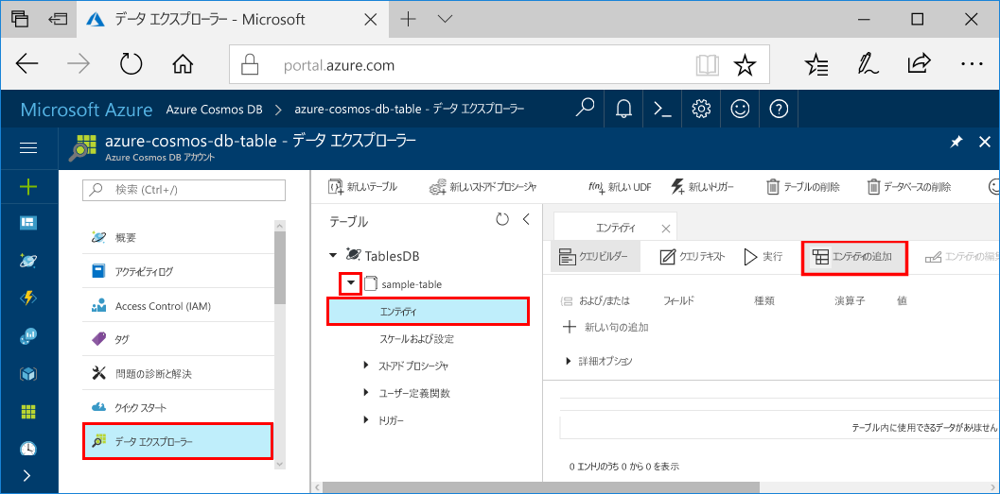
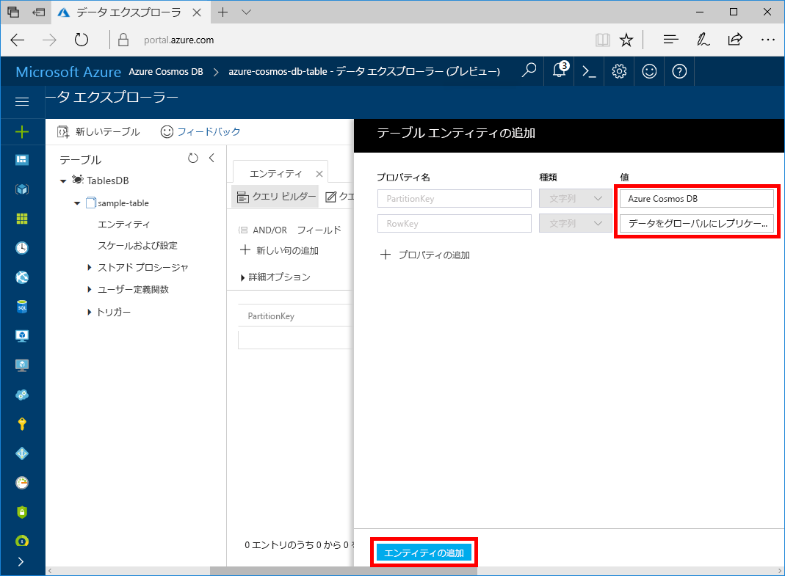

# <a name="quickstart-build-a-table-api-app-with-python-and-azure-cosmos-db"></a>クイックスタート: Python と Azure Cosmos DB で Table API アプリを構築する

このクイックスタートでは、GitHub から例を複製することで、Python と Azure Cosmos DB の [Table API](table-introduction.md) を使用してアプリを構築する方法を示します。 このクイックスタートでは、Web ベースの Azure Portal で Azure Cosmos DB アカウントを作成する方法、およびデータ エクスプローラーを使用してテーブルとエンティティを作成する方法も説明します。

Azure Cosmos DB は、Microsoft のグローバルに分散されたマルチモデル データベース サービスです。 Azure Cosmos DB の中核をなすグローバルな分散と水平方向のスケール機能を利用して、ドキュメント、キー/値、ワイドカラム、およびグラフ データベースをすばやく作成およびクエリできます。 

## <a name="prerequisites"></a>前提条件

[!INCLUDE [quickstarts-free-trial-note](../../includes/quickstarts-free-trial-note.md)]
[!INCLUDE [cosmos-db-emulator-docdb-api](../../includes/cosmos-db-emulator-docdb-api.md)]

加えて次の作業を行います。

* まだ Visual Studio 2017 をインストールしていない場合は、**無料**の [Visual Studio 2017 Community エディション](https://www.visualstudio.com/downloads/)をダウンロードして使用できます。 Visual Studio のセットアップ中に、必ず **[Azure の開発]** を有効にしてください。
* Python Tools for Visual Studio ( [GitHub](http://microsoft.github.io/PTVS/)から入手できます)。 このチュートリアルでは、Python Tools for VS 2015 を使用します。
* Python 2.7 ([python.org](https://www.python.org/downloads/release/python-2712/) から入手できます)

## <a name="create-a-database-account"></a>How to create a DocumentDB account (DocumentDB アカウントの作成方法)

[!INCLUDE [cosmos-db-create-dbaccount-table](../../includes/cosmos-db-create-dbaccount-table.md)]

## <a name="add-a-table"></a>テーブルの追加

[!INCLUDE [cosmos-db-create-table](../../includes/cosmos-db-create-table.md)]

## <a name="add-sample-data"></a>サンプル データの追加

これで、データ エクスプローラーを使用して、新しいテーブルにデータを追加できます。

1. データ エクスプローラーで、**sample-table** を展開し、**[エンティティ]**、**[エンティティの追加]** の順にクリックします。

   
2. PartitionKey 値ボックスと RowKey 値ボックスにデータを追加し、**[エンティティの追加]** をクリックします。

   
  
    これで、テーブルにさらにエンティティを追加したり、エンティティを編集したり、データ エクスプローラーでデータをクエリしたりできます。 データ エクスプローラーでは、スループットを拡張し、ストアド プロシージャ、ユーザー定義関数、およびトリガーをテーブルに追加することもできます。

## <a name="clone-the-sample-application"></a>サンプル アプリケーションの複製

github で Table アプリの複製を作成し、接続文字列を設定して実行します。 プログラムでデータを処理することが非常に簡単であることがわかります。 

1. git bash などの git ターミナル ウィンドウを開き、`cd` コマンドを使用して、サンプル アプリをインストールするフォルダーに変更します。 

    ```bash
    cd "C:\git-samples"
    ```

2. 次のコマンドを実行して、サンプル レポジトリを複製します。 このコマンドは、コンピューター上にサンプル アプリのコピーを作成します。 

    ```bash
    git clone https://github.com/Azure-Samples/storage-python-getting-started.git
    ```

3. Visual Studio でソリューション ファイルを開きます。 

## <a name="update-your-connection-string"></a>接続文字列を更新する

ここで Azure Portal に戻り、接続文字列情報を取得し、アプリにコピーします。 これでアプリが、ホストされているデータベースと通信できます。 

1. [Azure Portal](http://portal.azure.com/) で **[接続文字列]** をクリックします。 

    ![[接続文字列] ウィンドウで [接続文字列] を確認してコピーする](./media/create-table-python/connection-string.png)

2. config.py ファイルを開き、必要な接続文字列プロパティを構成ファイルにコピーします。

3. config.py ファイルを保存します。

## <a name="run-the-app"></a>アプリの実行

1. Visual Studio の**ソリューション エクスプローラー**でプロジェクトを右クリックし、現在の Python 環境を選択して、右クリックします。

2. [Python パッケージのインストール] を選択し、「**azure-storage-table**」と入力します。

3. F5 キーを押してアプリケーションを実行します。 ブラウザーにアプリが表示されます。 

これで、データ エクスプローラーに戻って、この新しいデータの表示、クエリ、変更、操作を行うことができます。 

## <a name="review-slas-in-the-azure-portal"></a>Azure Portal での SLA の確認

[!INCLUDE [cosmosdb-tutorial-review-slas](../../includes/cosmos-db-tutorial-review-slas.md)]

## <a name="clean-up-resources"></a>リソースのクリーンアップ

[!INCLUDE [cosmosdb-delete-resource-group](../../includes/cosmos-db-delete-resource-group.md)]

## <a name="next-steps"></a>次のステップ

このクイック スタートでは、Azure Cosmos DB アカウントを作成し、データ エクスプローラーを使用してテーブルを作成し、アプリを実行する方法を説明しました。  これで、Table API を使用して、データをクエリできます。  

> [!div class="nextstepaction"]
> [テーブル データを Table API にインポートする](table-import.md)
