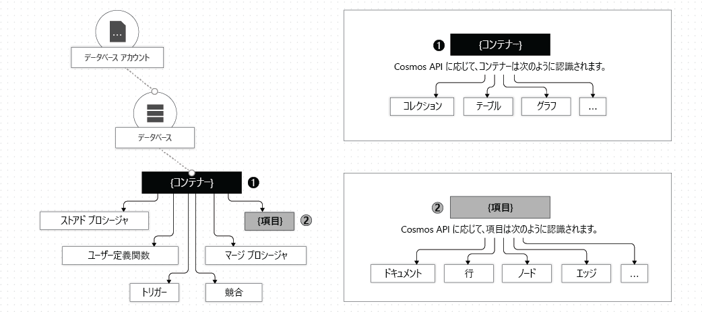

# Azure Cosmos DB のデータベース、コンテナー、項目の操作

Azure サブスクリプションで [Azure Cosmos DB アカウント](account-overview.md)を作成した後は、そのアカウントでデータベース、コンテナー、および項目を作成して、データを管理できます。 この記事では、これらの各エンティティについて説明します。 

次の画像は、Azure Cosmos DB アカウントのさまざまなエンティティの階層を示しています。

## Azure Cosmos データベース

ご利用のアカウントの下に、1 つまたは複数の Azure Cosmos データベースを作成できます。 データベースは名前空間に似ています。 データベースは、一連の Azure Cosmos コンテナーを管理する単位です。 次の表は、Azure Cosmos データベースがどのように、API 固有のさまざまなエンティティにマップされてるかを示しています。

| Azure Cosmos エンティティ | SQL API | Cassandra API | MongoDB 用 Azure Cosmos DB API | Gremlin API | テーブル API |
| --- | --- | --- | --- | --- | --- |
|Azure Cosmos データベース | Database | キースペース | Database | Database | NA |

> [!NOTE]
> Table API アカウントでは、最初のテーブルを作成すると、自分の Azure Cosmos アカウント内に既定のデータベースが自動的に作成されます。

### Azure Cosmos データベースに対する操作

Azure Cosmos API を使用して、次の表で示しているように Azure Cosmos データベースとやりとりできます。

| Operation | Azure CLI | SQL API | Cassandra API | MongoDB 用 Azure Cosmos DB API | Gremlin API | テーブル API |
| --- | --- | --- | --- | --- | --- | --- |
|すべてのデータベースを列挙する| はい | はい | はい (データベースはキースペースにマップされる) | はい | NA | NA |
|データベースを読み込む| はい | はい | はい (データベースはキースペースにマップされる) | はい | NA | NA |
|新しいデータベースの作成| はい | はい | はい (データベースはキースペースにマップされる) | はい | NA | NA |
|データベースを更新する| はい | はい | はい (データベースはキースペースにマップされる) | はい | NA | NA |

## Azure Cosmos コンテナー

Azure Cosmos コンテナーは、プロビジョニング スループットとストレージの両方に関するスケーラビリティの単位です。 コンテナーは水平方向にパーティション分割され、その後、複数のリージョン間でレプリケートされます。 コンテナーに追加した項目と、コンテナーに対してプロビジョニングしたスループットは、パーティション キーに基づいて一連の論理パーティションにわたって自動的に分散されます。 パーティション分割とパーティション キーの詳細については、[データのパーティション分割](partition-data.md)に関するページを参照してください。 

Azure Cosmos コンテナーを作成するときには、次のいずれかのモードでスループットを構成します。

* **専用プロビジョニング スループット モード**: コンテナーにプロビジョニングされたスループットは、そのコンテナー専用に予約され、SLA によってバックアップされます。 詳細については、[Azure Cosmos コンテナーのスループットをプロビジョニングする方法](how-to-provision-container-throughput.md)に関するページを参照してください。

* **共有プロビジョニング スループット モード**: これらのコンテナーでは、同じデータベース内の他のコンテナー (専用プロビジョニング スループットで構成されたコンテナーを除く) とプロビジョニング スループットを共有します。 つまり、データベース上のプロビジョニング スループットは、すべての "共有スループット" コンテナー間で共有されます。 詳細については、[Azure Cosmos データベースのスループットをプロビジョニングする方法](how-to-provision-database-throughput.md)に関するページを参照してください。

> [!NOTE]
> 共有および専用のスループットを構成できるのは、データベースとコンテナーを作成する場合のみになります。 コンテナーを作成した後に専用スループット モードから共有スループット モード (またはその逆) に切り替えるには、新しいコンテナーを作成して、その新しいコンテナーにデータを移行する必要があります。 データの移行は、Azure Cosmos DB の変更フィード機能を使用して行うことができます。

Azure Cosmos コンテナーでは、コンテナーを専用または共有のどちらのプロビジョニング スループット モードで作成していても、柔軟にスケーリングできます。

Azure Cosmos コンテナーは、スキーマに依存しない、項目のコンテナーです。 コンテナー内の項目には、任意のスキーマを含めることができます。 たとえば、人物を表す項目と自動車を表す項目を*同じコンテナー*に配置できます。 既定では、コンテナーに追加するすべての項目に自動的にインデックスが付けられ、明示的なインデックスやスキーマ管理は必要とされません。 コンテナーで[インデックス作成ポリシー](index-overview.md)を構成することによって、インデックス作成の動作をカスタマイズできます。 

Azure Cosmos コンテナー内の選択された項目、またはコンテナー全体に対して [Time to Live (TTL)](time-to-live.md) を設定することによって、それらの項目をシステムから正常に消去できます。 Azure Cosmos DB では、項目の有効期限が切れるとそれらが自動的に削除されます。 これによって、コンテナーに対して実行されるクエリにより、固定されたバインド内の有効期限切れの項目が返されないことも保証されます。 詳細については、[コンテナーでの TTL の構成](how-to-time-to-live.md)に関するページを参照してください。

[変更フィード](change-feed.md)を使用して、コンテナーの論理パーティションごとに管理されている操作ログにサブスクライブできます。 変更フィードでは、項目の前後のイメージと共に、コンテナーに対して実行されたすべての更新のログが提供されます。 詳細については、[変更フィードを使用した待ち受け型のアプリケーションの構築](serverless-computing-database.md)に関するページを参照してください。 また、コンテナーの変更フィード ポリシーを使用することで、変更フィードの保有期間を構成することもできます。 

ご利用の Azure Cosmos コンテナーには、[ストアド プロシージャ、トリガー、ユーザー定義関数 (UDF)](stored-procedures-triggers-udfs.md)、[マージ プロシージャ](how-to-manage-conflicts.md)を登録できます。 

Azure Cosmos コンテナーで[一意キー制約](unique-keys.md)を指定できます。 一意キー ポリシーを作成することで、論理パーティション キーごとに、1 つまたは複数の値の一意性を確保します。 一意キー ポリシーを使用してコンテナーを作成する場合、一意キー制約で指定されている値と重複する値を持つ新しい項目や更新された項目を作成することはできません。 詳細については、[一意キーの制約](unique-keys.md)に関するページを参照してください。

Azure Cosmos コンテナーは、以下の表に示すように API 固有のエンティティに特化されます。

| Azure Cosmos エンティティ | SQL API | Cassandra API | MongoDB 用 Azure Cosmos DB API | Gremlin API | テーブル API |
| --- | --- | --- | --- | --- | --- |
|Azure Cosmos コンテナー | コレクション | テーブル | コレクション | Graph | テーブル |

### Azure Cosmos コンテナーのプロパティ

Azure Cosmos コンテナーには、一連のシステム定義のプロパティがあります。 使用する API によっては、一部のプロパティが直接公開されない場合があります。 次の表は、システム定義のプロパティの一覧を示しています。

| システム定義のプロパティ | システム生成またはユーザー構成可能 | 目的 | SQL API | Cassandra API | MongoDB 用 Azure Cosmos DB API | Gremlin API | テーブル API |
| --- | --- | --- | --- | --- | --- | --- | --- |
|\_id | システム生成 | コンテナーの一意識別子 | はい | いいえ | いいえ | いいえ | いいえ |
|\_etag | システム生成 | オプティミスティック同時実行制御に使用されるエンティティ タグ | はい | いいえ | いいえ | いいえ | いいえ |
|\_ts | システム生成 | コンテナーの最終更新時のタイムスタンプ | はい | いいえ | いいえ | いいえ | いいえ |
|\_self | システム生成 | コンテナーのアドレス指定可能な URI | はい | いいえ | いいえ | いいえ | いいえ |
|id | ユーザー構成可能 | コンテナーのユーザーが定義した一意の名前 | はい | はい | はい | はい | はい |
|indexingPolicy | ユーザー構成可能 | インデックスのパス、インデックスの種類、インデックス モードを変更する機能を提供します | はい | いいえ | いいえ | いいえ | はい |
|TimeToLive | ユーザー構成可能 | 設定した期間後にコンテナーから自動的に項目を削除する機能を提供します。 詳細については、[Time to Live](time-to-live.md) に関するページを参照してください。 | はい | いいえ | いいえ | いいえ | はい |
|changeFeedPolicy | ユーザー構成可能 | コンテナー内の項目に加えられた変更の読み取りに使用されます。 詳細については、[変更フィード](change-feed.md)に関するページを参照してください。 | はい | いいえ | いいえ | いいえ | はい |
|uniqueKeyPolicy | ユーザー構成可能 | 論理パーティション内の 1 つまたは複数の値の一意性を確保するために使用されます。 詳細については、[一意キー制約](unique-keys.md)に関するページを参照してください。 | はい | いいえ | いいえ | いいえ | はい |

### Azure Cosmos コンテナーに対する操作

Azure Cosmos コンテナーでは、いずれかの Azure Cosmos API を使用する場合、以下の操作をサポートします。

| Operation | Azure CLI | SQL API | Cassandra API | MongoDB 用 Azure Cosmos DB API | Gremlin API | テーブル API |
| --- | --- | --- | --- | --- | --- | --- |
| データベース内のコンテナーを列挙する | はい | はい | はい | はい | NA | NA |
| コンテナーを読み取る | はい | はい | はい | はい | NA | NA |
| 新しいコンテナーを作成する | はい | はい | はい | はい | NA | NA |
| コンテナーを更新する | はい | はい | はい | はい | NA | NA |
| コンテナーを削除する | はい | はい | はい | はい | NA | NA |

## Azure Cosmos 項目

使用する API に応じて、Azure Cosmos 項目では、コレクション内のドキュメント、テーブル内の行、グラフ内のノードまたはエッジのいずれかを表すことができます。 次の表は、API 固有のエンティティと Azure Cosmos 項目との間のマッピングを示しています。

| Cosmos エンティティ | SQL API | Cassandra API | MongoDB 用 Azure Cosmos DB API | Gremlin API | テーブル API |
| --- | --- | --- | --- | --- | --- |
|Azure Cosmos 項目 | ドキュメント | 行 | ドキュメント | ノードまたはエッジ | Item |

### 項目のプロパティ

Azure Cosmos のどの項目にも、以下のシステム定義プロパティがあります。 使用する API に応じて、一部は直接公開されない場合があります。

| システム定義のプロパティ | システム生成またはユーザー構成可能| 目的 | SQL API | Cassandra API | MongoDB 用 Azure Cosmos DB API | Gremlin API | テーブル API |
| --- | --- | --- | --- | --- | --- | --- | --- |
|\_id | システム生成 | 項目の一意識別子 | はい | いいえ | いいえ | いいえ | いいえ |
|\_etag | システム生成 | オプティミスティック同時実行制御に使用されるエンティティ タグ | はい | いいえ | いいえ | いいえ | いいえ |
|\_ts | システム生成 | 項目の最終更新のタイムスタンプ | はい | いいえ | いいえ | いいえ | いいえ |
|\_self | システム生成 | 項目のアドレス指定可能な URI | はい | いいえ | いいえ | いいえ | いいえ |
|id | 使用できるのは | 論理パーティション内のユーザーが定義した一意の名前。 ユーザーが ID を指定しない場合、システムによって ID が自動生成されます。 | はい | はい | はい | はい | はい |
|任意のユーザー定義のプロパティ | ユーザー定義 | API のネイティブ表現 (JSON、BSON、CQL など) で表されるユーザー定義のプロパティ | はい | はい | はい | はい | はい |

### 項目に対する操作

Azure Cosmos 項目では、次の操作をサポートします。 Azure Cosmos API のいずれかを使用して操作を実行できます。

| Operation | Azure CLI | SQL API | Cassandra API | MongoDB 用 Azure Cosmos DB API | Gremlin API | テーブル API |
| --- | --- | --- | --- | --- | --- | --- |
| 挿入、置換、削除、アップサート、読み取り | いいえ | 可能 | はい | はい | はい | はい |

## 次の手順

次のタスクと概念について説明します。

* [Azure Cosmos データベース上でのスループットをプロビジョニングする](how-to-provision-database-throughput.md)
* [Azure Cosmos コンテナー上でのスループットをプロビジョニングする](how-to-provision-container-throughput.md)
* [論理パーティションの使用](partition-data.md)
* [Azure Cosmos コンテナーの TTL を構成する](how-to-time-to-live.md)
* [変更フィードを使用して待ち受け型のアプリケーションを構築する](change-feed.md)
* [Azure Cosmos コンテナーの一意キー制約を構成する](unique-keys.md)
