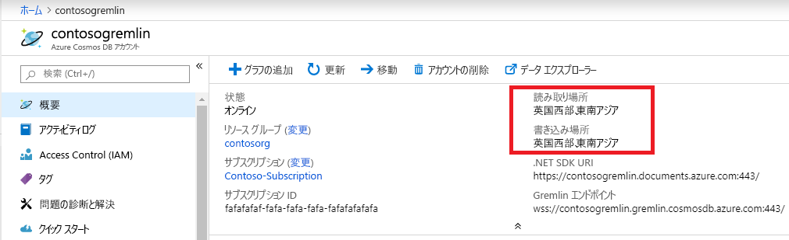

# <a name="regional-endpoints-for-azure-cosmos-db-graph-account"></a>Azure Cosmos DB Graph アカウントのリージョン エンドポイント
Azure Cosmos DB Graph データベースは[グローバルに分散](distribute-data-globally.md)されているため、アプリケーションは複数の読み取りエンドポイントを使用できます。 複数の場所で書き込みアクセスが必要なアプリケーションでは、[マルチマスター](how-to-multi-master.md)機能を有効にする必要があります。

複数のリージョンを選択する理由:
1. **水平方向の読み取りのスケーラビリティ** - アプリケーションの負荷が増えたときに読み取りトラフィックを異なる Azure リージョンにルーティングすることが賢明な場合があります。
2. **低待ち時間** - 読み取りおよび書き込みトラフィックを最も近い Azure リージョンにルーティングすることで、各トラバーサルのネットワーク待ち時間オーバーヘッドを減らすことができます。

**データの保存場所**要件は、Cosmos DB アカウントに Azure Resource Manager ポリシーを設定することで達成されます。 顧客は、Cosmos DB のデータの複製先のリージョンを制限できます。

## <a name="traffic-routing"></a>トラフィックのルーティング

Cosmos DB Graph データベース エンジンは複数のリージョンで実行されており、そのそれぞれに複数のクラスターが含まれています。 各クラスターには数百台のマシンがあります。 Cosmos DB グラフ アカウントの DNS CNAME *accountname.gremlin.cosmos.azure.com* は、クラスターの DNS A レコードに解決されます。 ロードバランサーの単一の IP アドレスによって、内部クラスターのトポロジが隠されます。

Cosmos DB Graph アカウントのすべてのリージョンに対して、リージョンの DNS CNAME レコードが作成されます。 リージョン エンドポイントの形式は *accountname-region.gremlin.cosmos.azure.com* です。 リージョン エンドポイントのリージョン セグメントは、[Azure リージョン](https://azure.microsoft.com/global-infrastructure/regions)名からすべてのスペースを削除することによって取得されます。 たとえば、`"contoso"` グローバル データベース アカウントの `"East US 2"` リージョンの DNS CNAME は、*contoso-eastus2.gremlin.cosmos.azure.com* になります

TinkerPop Gremlin クライアントは、単一のサーバーで動作するように設計されています。 アプリケーションでは、読み取りおよび書き込みトラフィックにグローバルな書き込み可能 DNS CNAME を使用できます。 リージョン対応アプリケーションでは、読み取りトラフィックにリージョン エンドポイントを使用する必要があります。 特定のリージョンが書き込みを受け入れるように構成されている場合にのみ、書き込みトラフィックにリージョン エンドポイントを使用します。 

> [!NOTE]
> Cosmos DB Graph エンジンは、書き込みリージョンへのトラフィックをプロキシ処理することによって、読み取りリージョンで書き込み操作を受け入れることができます。 読み取り専用リージョンに書き込みを送信することは、トラバーサルの待ち時間が長くなり、将来の制限の対象となるため、推奨されません。

グローバル データベース アカウントの CNAME は、常に有効な書き込みリージョンを指します。 書き込みリージョンのサーバー側のフェールオーバー中、Cosmos DB は、新しいリージョンを指すようにグローバル データベース アカウントの CNAME を更新します。 フェールオーバー後にアプリケーションがトラフィックの再ルーティングを処理できない場合は、グローバル データベース アカウントの DNS CNAME を使用する必要があります。

> [!NOTE]
> Cosmos DB は、呼び出し元の地理的な距離に基づいてトラフィックをルーティングしません。 アプリケーションの固有のニーズに応じて適切なリージョンを選択するのは、各アプリケーションの責任です。

## <a name="portal-endpoint-discovery"></a>ポータル エンドポイントの検出

Azure Cosmos DB Graph アカウントのリージョンの一覧を取得するのに最も簡単な方法は、Azure portal の [概要] ブレードを使用する方法です。 この方法は、リージョンを頻繁に変更しないアプリケーションや、アプリケーションの構成を使用して一覧を更新する手段を備えるアプリケーションに有効です。



次の例は、リージョンの Gremlin エンドポイントにアクセスするための一般的な原則を示しています。 アプリケーションでは、トラフィックを送信するリージョンの数と、インスタンス化される対応する Gremlin クライアントの数を考慮する必要があります。

```csharp
// Example value: Central US, West US and UK West. This can be found in the overview blade of you Azure Cosmos DB Gremlin Account. 
// Look for Write Locations in the overview blade. You can click to copy and paste.
string[] gremlinAccountRegions = new string[] {"Central US", "West US" ,"UK West"};
string gremlinAccountName = "PUT-COSMOSDB-ACCOUNT-NAME-HERE";
string gremlinAccountKey = "PUT-ACCOUNT-KEY-HERE";
string databaseName = "PUT-DATABASE-NAME-HERE";
string graphName = "PUT-GRAPH-NAME-HERE";

foreach (string gremlinAccountRegion in gremlinAccountRegions)
{
  // Convert preferred read location to the form "[acountname]-[region].gremlin.cosmos.azure.com".
  string regionalGremlinEndPoint = $"{gremlinAccountName}-{gremlinAccountRegion.ToLowerInvariant().Replace(" ", string.Empty)}.gremlin.cosmos.azure.com";

  GremlinServer regionalGremlinServer = new GremlinServer(
    hostname: regionalGremlinEndPoint, 
    port: 443,
    enableSsl: true,
    username: "/dbs/" + databaseName + "/colls/" + graphName,
    password: gremlinAccountKey);

  GremlinClient regionalGremlinClient = new GremlinClient(
    gremlinServer: regionalGremlinServer,
    graphSONReader: new GraphSON2Reader(),
    graphSONWriter: new GraphSON2Writer(),
    mimeType: GremlinClient.GraphSON2MimeType);
}
```

## <a name="sdk-endpoint-discovery"></a>SDK エンドポイントの検出

アプリケーションでは、[Azure Cosmos DB SDK](sql-api-sdk-dotnet.md) を使用して、Graph アカウントの読み取りおよび書き込みの場所を検出できます。 これらの場所は、サーバー側の手動再構成または自動フェールオーバーによりいつでも変更できます。

TinkerPop Gremlin SDK には、Cosmos DB Graph データベース アカウントのリージョンを検出するための API がありません。 実行時のエンドポイント検出が必要なアプリケーションでは、プロセス空間で 2 つの別個の SDK をホストする必要があります。

```csharp
// Depending on the version and the language of the SDK (.NET vs Java vs Python)
// the API to get readLocations and writeLocations may vary.
IDocumentClient documentClient = new DocumentClient(
    new Uri(cosmosUrl),
    cosmosPrimaryKey,
    connectionPolicy,
    consistencyLevel);

DatabaseAccount databaseAccount = await cosmosClient.GetDatabaseAccountAsync();

IEnumerable<DatabaseAccountLocation> writeLocations = databaseAccount.WritableLocations;
IEnumerable<DatabaseAccountLocation> readLocations = databaseAccount.ReadableLocations;

// Pick write or read locations to construct regional endpoints for.
foreach (string location in readLocations)
{
  // Convert preferred read location to the form "[acountname]-[region].gremlin.cosmos.azure.com".
  string regionalGremlinEndPoint = location
    .Replace("http:\/\/", string.Empty)
    .Replace("documents.azure.com:443/", "gremlin.cosmos.azure.com");
  
  // Use code from the previous sample to instantiate Gremlin client.
}
```

## <a name="next-steps"></a>次のステップ
* Azure Cosmos DB で[データベース アカウント制御を管理する方法](how-to-manage-database-account.md)
* Azure Cosmos DB での[高可用性](high-availability.md)
* [Azure Cosmos DB でのグローバル分散 - 内部のしくみ](global-dist-under-the-hood.md)
* Azure Cosmos DB の [Azure CLI サンプル](cli-samples.md)
