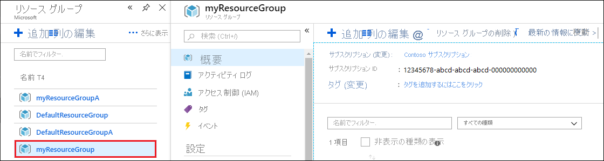
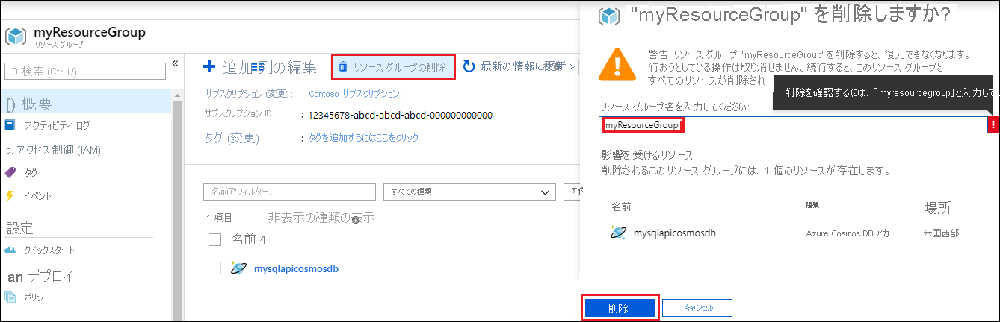

アプリと Azure Cosmos DB アカウントの使用を完了したら、それ以上料金がかからないように、作成した Azure リソースを削除できます。 リソースを削除するには、次の手順に従います。

1. Azure portal の検索バーで、「**リソース グループ**」を検索して選択します。

2. 一覧から、このクイック スタートで作成したリソース グループを選択します。  

   

2. リソース グループの **[概要]** ページで、**[リソース グループの削除]** を選択します。

      

3. 次のウィンドウで、削除するリソース グループの名前を入力し、**[削除]** を選択します。

