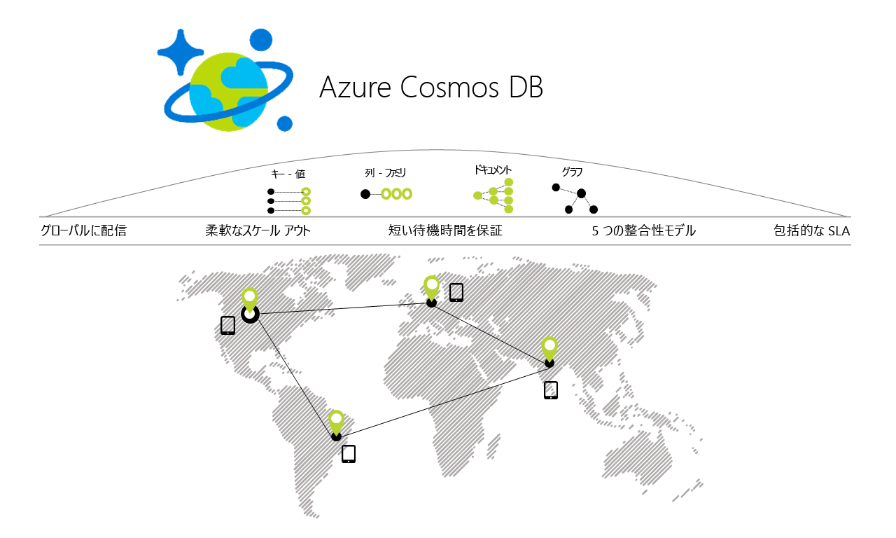

# Azure Cosmos DB の概要

Azure Cosmos DB は、Microsoft のグローバルに分散されたマルチモデル データベース サービスです。 Azure Cosmos DB では、ボタンを 1 つクリックするだけで Azure のリージョンをいくつでもまたいでスループットとストレージを柔軟かつ個別にスケールできます。 このサービスは包括的な[サービス レベル アグリーメント](https://aka.ms/acdbsla) (SLA) により、スループット、待ち時間、可用性、整合性が保証されています。この点は、他のどのデータベース サービスにもないメリットです。 Azure サブスクリプションを必要とせず、課金や契約もなしに [Azure Cosmos DB を無料で試す](https://azure.microsoft.com/try/cosmosdb/)ことができます。

> [!div class="nextstepaction"]
> [Azure Cosmos DB を無料で試す](https://azure.microsoft.com/try/cosmosdb/)

## 主な機能
Azure Cosmos DB は、グローバルに分散された複数モデルのデータベース サービスであるため、スケーラブルで応答性に優れたアプリケーションをグローバルなスケールで簡単に構築できます。

* **ターンキー グローバル配信**
    * [ボタンをクリック](tutorial-global-distribution-sql-api.md)して、任意の数の [Azure リージョン](https://azure.microsoft.com/regions/)に[データを配布](distribute-data-globally.md)できます。 これにより、ユーザーの近くにデータを配置でき、顧客の待ち時間を最小限に抑えることができます。 
    * Azure Cosmos DB のマルチホーム API を使用すると、アプリは最も近いリージョンを常に把握し、最も近いデータ センターに要求を送信します。 これはすべて構成を変更せずにできます。 書き込みリージョンと必要な数の読み取りリージョンを設定し、残りは自動的に処理されます。
    * Azure Cosmos DB データベースのリージョンを追加および削除するとき、アプリケーションを再展開する必要はなく、マルチホーム API 機能によりアプリケーションの高可用性が維持されます。

* **データに対するアクセスとクエリのため、各種のデータ モデルと人気の API をサポート**
    * Azure Cosmos DB の基盤となるアトム レコード シーケンス (ARS) ベースのデータ モデルでは、ドキュメント、グラフ、キーと値、テーブル、列ファミリの各データ モデルなど、複数のデータ モデルをネイティブでサポートします。
    * 次のデータ モデルの API は SDK でサポートされており、複数の言語で利用できます。
        * [SQL API](sql-api-introduction.md): 豊富な SQL クエリ機能を備えたスキーマのない JSON データベース エンジン。
        * [MongoDB API](mongodb-introduction.md): Azure Cosmos DB データベースを利用する非常にスケーラブルな*サービスとしての MongoDB*。 MongoDB の既存のライブラリ、ドライバー、ツール、およびアプリケーションと互換性があります。
        * [Cassandra API](cassandra-introduction.md): Azure Cosmos DB データベースを利用するグローバルに分散されたサービスとしての Cassandra。 [Apache Cassandra](https://cassandra.apache.org/) の既存のライブラリ、ドライバー、ツール、およびアプリケーションと互換性があります。
        * 
  [Gremlin API](graph-introduction.md): フル マネージドの、水平方向にスケーラブルなグラフ データベース サービス。Open Graph API (Apache Gremlin の [Apache TinkerPop 仕様](http://tinkerpop.apache.org/)に基づきます) をサポートする緊密に接続されたデータセットを使用するアプリケーションを簡単に構築して実行できます。
        * [テーブル API](table-introduction.md): 既存の Azure テーブル ストレージ アプリケーションに高度な機能 (自動インデックス作成、低待機時間の保証、グローバルな分散など) を提供する、キーと値のデータベース サービス。アプリを変更する必要はありません。
        * 他のデータ モデルおよび API も近日対応予定です。

* **世界中のどこでも、必要に応じて、スループットとストレージを柔軟に独立してスケール**
    * [秒単位](request-units.md)の粒度でデータベースのスループットを簡単にスケールし、必要なときにいつでも変更できます。 
    * ストレージ サイズを[透過的かつ自動的に](partition-data.md)スケールできるため、現在も将来も変わらずサイズに関する要件に対応できます。

* **応答性に優れたミッション クリティカルなアプリケーションを構築**
    * Azure Cosmos DB では、お客様に対してエンドツーエンドの待ち時間を 99% の確率で低水準にとどめることを保証しています。 
    * 一般的な 1 KB の項目であれば、エンドツーエンドの待ち時間は読み取りが 10 ミリ秒未満、インデックス付きの書き込みが 15 ミリ秒未満となる確率が 99% です (同じ Azure リージョンを対象とする場合に限ります)。 待ち時間の中央値はこれよりも大幅に低く、5 ミリ秒未満です。

* **"常時オン" の可用性の確保**
    * すべての単一リージョン データベース アカウントに対しては 99.99% の可用性 SLA、およびすべてのマルチリージョン データベース アカウントに対しては 99.999% の読み取り可用性を提供します。
    * 可用性とパフォーマンスをさらに高めるために、任意の数の [Azure リージョン](https://azure.microsoft.com/regions)に展開できます。
    * リージョンに優先順位を動的に設定します。また、データ損失ゼロを保証している 1 つ以上のリージョンで[障害のシミュレーション](regional-failover.md)を行って、(データベースだけでなく) アプリ全体のエンド ツー エンドの可用性をテストします。 

* **グローバルに分散されたアプリケーションを正しく作成**
    * 明確に定義された実用的でわかりやすい 5 種類の[整合性モデル](consistency-levels.md)により、SQL のような厳密な整合性から、緩やかな NoSQL のような結果整合性 (およびその 2 つの中間) に至るまで、幅広く対応できます。 
  
* **返金保証**
    * ミッション クリティカルなデータの可用性、待ち時間、スループット、整合性に対し、業界をリードする、財務的に裏付けられた、包括的な[サービス レベル アグリーメント](https://aka.ms/acdbsla) (SLA) が提供されます。 

* **データベース スキーマ/インデックスの管理が不要**
    * データベースのスキーマやインデックスの管理に関して心配する必要はなく、アプリケーションのスキーマをすばやく反復処理できます。
    * Azure Cosmos DB のデータベース エンジンは、完全にスキーマ フリーとなっています。取り込んだデータにはすべて自動でインデックスが作成されるため、スキーマやインデックスの指定が求められることはありません。さらに、クエリもきわめて高速です。 

* **保有コストを削減**
    * 非マネージド ソリューションまたはオンプレミスの NoSQL ソリューションの 5 から 10 倍のコスト効果を実現しました。
    * AWS DynamoDB や Google Spanner の 3 分の 1 の価格です。

## 機能の比較

Azure Cosmos DB では、従来のリレーショナル データベースと非リレーショナル データベースのどちらにも最適な機能を用意しています。

| 機能 | リレーショナル データベース   | 非リレーショナル (NoSQL) データベース |    Azure Cosmos DB |
| --- | --- | --- | --- |
| グローバル配信 | いいえ  | いいえ  | あり (30 以上のリージョンでターンキー配信、マルチホーム API を使用した場合)|
| 水平スケール | いいえ  | [はい] | あり (ストレージとスループットを個別に調整できます) | 
| 待ち時間の保証 | いいえ  | [はい] | あり (読み取りが 10 ミリ秒未満、書き込みが 15 ミリ秒未満となる確率が 99% です) | 
| 高可用性 | いいえ  | [はい] | あり (Azure Cosmos DB は常時オンで、明確に定義された PACELC のトレードオフがあり、自動および手動のフェールオーバー オプションを備えています)|
| データモデル + API | リレーショナル + SQL | マルチモデル + OSS API | マルチモデル + SQL + OSS API (近日追加予定) |
| SLA | [はい] | いいえ  | あり (待ち時間、スループット、整合性、可用性に関する包括的 SLA) |

## Azure Cosmos DB の恩恵を受けるソリューション

さまざまなデータについて、リアルタイムに近い応答時間と[グローバル](distribute-data-globally.md)な規模で膨大な量の読み書きを処理する必要のある [Web、モバイル、ゲーム、IoT アプリケーション](use-cases.md)は、Azure Cosmos DB の [保証された](https://azure.microsoft.com/support/legal/sla/cosmos-db/)高可用性、高スループット、短い待機時間、調整可能な整合性の恩恵を受けます。 Azure Cosmos DB を [IoT とテレマティック](use-cases.md#iot-and-telematics)、[小売りとマーケティング](use-cases.md#retail-and-marketing)、[ゲーム](use-cases.md#gaming)、および [Web アプリとモバイル アプリ](use-cases.md#web-and-mobile-applications)にどのように適用できるかをご確認ください。

## 次の手順
以下のクイック スタートのいずれかに従って、実際に Azure Cosmos DB を使ってみましょう。

* [Azure Cosmos DB SQL API を使ってみる](create-sql-api-dotnet.md)
* [Azure Cosmos DB MongoDB API を使ってみる](create-mongodb-nodejs.md)
* [Azure Cosmos DB Cassandra API を使ってみる](create-cassandra-dotnet.md)
* [Azure Cosmos DB Gremlin API を使ってみる](create-graph-dotnet.md)
* [Azure Cosmos DB Table API を使ってみる](create-table-dotnet.md)

> [!div class="nextstepaction"]
> [Azure Cosmos DB を無料で試す](https://azure.microsoft.com/try/cosmosdb/)
