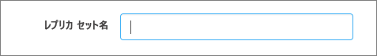

# MongoDB Compass を使用して Azure Cosmos DB の MongoDB 用 API に接続する 

このチュートリアルでは、Cosmos DB にデータを保存および管理するときに [MongoDB Compass](https://www.mongodb.com/products/compass) を使用する方法を説明します。 このチュートリアルでは、Azure Cosmos DB の MongoDB 用 API を使用します。 ご存じない方に説明すると、Compass は MongoDB の GUI です。 データの管理と共に、データの視覚化、アドホック クエリの実行によく使用されます。 

Cosmos DB は、Microsoft のグローバルに分散されたマルチモデル データベース サービスです。 ドキュメント、キー/値、およびグラフ データベースをすばやく作成したり、クエリを実行したりでき、そのすべてで、Cosmos DB の中核にあるグローバル配信および水平スケール機能が活用されます。

## 前提条件 
Robo 3T を使用して Cosmos DB アカウントに接続するには、次のことを行う必要があります。

* [Compass](https://www.mongodb.com/download-center/compass?jmp=hero) をダウンロードしてインストールする
* Cosmos DB [接続文字列](connect-mongodb-account.md)情報を取得する

## Cosmos DB の MongoDB 用 API に接続する 
Cosmos DB アカウントを Compass に接続するには、次の手順を実行します。

1. [こちら](connect-mongodb-account.md)の手順を使用して、Azure Cosmos DB の MongoDB 用 API で構成された Cosmos アカウントの接続情報を取得します。

    ![[接続文字列] ブレードのスクリーンショット](./media/mongodb-compass/mongodb-compass-connection.png)

2. Cosmos DB の **[プライマリ/セカンダリ接続文字列]** の横にある **[クリップボードにコピー]** というボタンをクリックします。 このボタンをクリックすると、接続文字列全体がクリップボードにコピーされます。 

    ![[クリップボードにコピー] ボタンのスクリーンショット](./media/mongodb-compass/mongodb-connection-copy.png)

3. デスクトップ/マシンで Compass を開き、 **[Connect]\(接続\)** をクリックし、 **[Connect to]\(接続先\)** をクリックします。 

4. Compass によって自動的にクリップボード内の接続文字列が検出され、それを使用して接続するかどうかが確認されます。 次のスクリーンショットで示すように、 **[Yes]\(はい\)** をクリックします。

    

5. 上の手順で **[Yes]\(はい\)** をクリックすると、接続文字列の詳細が自動的に入力されます。 **[Replica Set Name]\(レプリカ セット名\)** フィールドに自動的に入力された値を削除して、空白のままにします。 

    

6. ページの下部にある **[Connect]\(接続\)** をクリックします。 お使いの Cosmos DB アカウントとデータベースが MongoDB Compass 内に表示されます。

## 次のステップ

- Azure Cosmos DB の MongoDB 用 API と共に [Studio 3T を使用する](mongodb-mongochef.md)方法を学習します。
- Azure Cosmos DB の MongoDB 用 API を使用した MongoDB の[サンプル](mongodb-samples.md)を調査します。