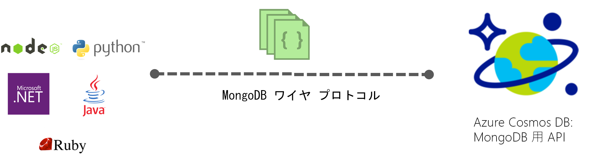

# Azure Cosmos DB の概要: MongoDB API

[Azure Cosmos DB](../cosmos-db/introduction.md) は、ミッション クリティカルなアプリケーション向けの、Microsoft のグローバル分散型マルチモデル データベース サービスです。 Azure Cosmos DB は、[ターン キー グローバル分散](distribute-data-globally.md)、[スループットとストレージの世界規模でのエラスティック スケーリング](partition-data.md)、99 パーセンタイルの 1 桁ミリ秒の待機時間を提供し、高可用性を保証します。これらはすべて[業界最高レベルの SLA](https://azure.microsoft.com/support/legal/sla/cosmos-db/) によってサポートされています。 Azure Cosmos DB は、[データのインデックスを自動的に作成](http://www.vldb.org/pvldb/vol8/p1668-shukla.pdf)します。スキーマとインデックスの管理に対処する必要はありません。 Azure Cosmos DB はマルチモデルであり、ドキュメント、キーと値、グラフ、列指向の各データ モデルをサポートします。 

 

[MongoDB](https://docs.mongodb.com/manual/introduction/) 向けに作成されたアプリのデータ ストアとして Azure Cosmos DB データベースを使用できます。 つまり、既存の[ドライバー](https://docs.mongodb.org/ecosystem/drivers/)を使用することで、MongoDB 用に記述されたアプリケーションが Azure Cosmos DB と通信し、MongoDB データベースではなく Azure Cosmos DB データベースを使用できるようになりました。 多くの場合、接続文字列を変更するだけで、MongoDB から Azure Cosmos DB に使用を切り替えることができます。 この機能を使用すると、既にある MongoDB のスキルとツールを無駄にすることなく、Azure Cosmos DB とその[包括的な業界トップレベルの SLA](https://azure.microsoft.com/support/legal/sla/cosmos-db) によって、グローバル配布の MongoDB データベース アプリケーションを簡単に作成し、Azure クラウドで実行することができます。

**MongoDB の互換性**: Azure Cosmos DB では MongoDB ワイヤ プロトコルが実装されているので、既にある MongoDB のノウハウ、アプリケーション コード、ツールを活用できます。 MongoDB を使用してアプリケーションを開発し、グローバルに分散されたフル マネージドの Azure Cosmos DB サービスを使用して運用環境にデプロイできます。 サポートされているバージョンについて詳しくは、「[MongoDB のプロトコル サポート](mongodb-feature-support.md#mongodb-protocol-support)」をご覧ください。

## MongoDB 用の Azure Cosmos DB を使用するメリット

**スループットとストレージのスケールを柔軟に調整:** アプリケーションのニーズに合わせて MongoDB データベースを簡単にスケールアップまたはスケールダウンできます。 データはソリッドステート ディスク (SSD) に格納されるため、予測可能かつ低いレイテンシが期待できます。 Azure Cosmos DB は、実質的に無制限のストレージ サイズとプロビジョニング スループットにスケーリングできる MongoDB コレクションをサポートしています。 アプリケーションの成長に合わせて Azure Cosmos DB のスケールを臨機応変に拡張し、予測したとおりのパフォーマンスをシームレスに確保することができます。 

**複数リージョンのレプリケーション**: Azure Cosmos DB は、MongoDB アカウントに関連付けられているすべてのリージョンにデータを透過的にレプリケートします。これにより、整合性、可用性、パフォーマンスを所定のレベルで確保して、これらのトレードオフを実現しながら、データへのグローバル アクセスを必要とするアプリケーションを開発できます。 Azure Cosmos DB は、マルチホーミング API を使用した透過的なリージョン内フェールオーバーを提供します。また、スループットとストレージを世界規模で弾力的にスケールすることもできます。 詳細については、[データのグローバル分散](distribute-data-globally.md)に関するページを参照してください。

**サーバー管理が不要**: MongoDB データベースは管理およびスケールが不要です。 Azure Cosmos DB はフル マネージドのサービスです。つまり、インフラストラクチャまたは仮想マシンを自分で管理する必要がありません。 Azure Cosmos DB は、30 を超える [Azure リージョン](https://azure.microsoft.com/regions/services/)で使用できます。

**調整可能な整合性レベル:** Azure Cosmos DB はマルチモデルの API をサポートしているので、一貫性設定をアカウント レベルに適用でき、一貫性の強制は API ごとに制御されます。 MongoDB 3.6 まではセッションの一貫性の概念がなかったため、セッションの一貫性を使用するために MongoDB API アカウントを設定すると、MongoDB API を使用したときに一貫性が Eventual にダウングレードされます。 MongoDB API アカウントに read-your-own-write (RYOW) の保証が必要な場合、アカウントの既定の一貫性レベルは Strong または Bounded Stateless に設定する必要があります。 詳細については、[整合性レベルを使用して可用性とパフォーマンスを最大化する方法](consistency-levels.md)に関するページを参照してください。

| Azure Cosmos DB の既定の一貫性レベル |   Mongo API (3.4) |
|---|---|
|Eventual| Eventual |
|一貫性のあるプレフィックス| 一貫性のある順序の Eventual |
|Session| 一貫性のある順序の Eventual |
|Bounded Staleness| Strong |
| Strong | Strong |

**自動インデックス作成:** 既定では、Azure Cosmos DB は MongoDB データベースのドキュメント内のすべてのプロパティのインデックスを自動的に作成するので、スキーマや、セカンダリ インデックスの作成は不要です。 また、Azure Cosmos DB では、一意なインデックスの機能により、既に自動でインデックスが作成されているドキュメントの任意のフィールドに対して一意性制約を設定することができます。

**エンタープライズ グレード**: Azure Cosmos DB では、ローカルとリージョンで障害が発生した場合に 99.99% の可用性とデータ保護を実現する、複数のローカル レプリカがサポートされます。 Azure Cosmos DB には、エンタープライズ グレードの[コンプライアンス認定](https://www.microsoft.com/trustcenter)とセキュリティ機能があります。 

詳細については、Azure Cosmos DB シニア プログラム マネージャーの Aleksey Savateyev による次のビデオをご覧ください。

> [!VIDEO https://channel9.msdn.com/Events/Connect/2017/T136/player]
> 

## ファースト ステップ

MongoDB のクイックスタートに従って、Azure Cosmos DB アカウントを作成し、Azure Cosmos DB を使用するために既存の MongoDB アプリケーションを移行するか、新しいアプリケーションを構築します。

* [既存の Node.js MongoDB Web アプリを移行する](create-mongodb-nodejs.md)。
* [.NET と Azure Portal による MongoDB API Web アプリの構築](create-mongodb-dotnet.md)
* [Java と Azure Portal による MongoDB API コンソール アプリの構築](create-mongodb-java.md)

## 次の手順

Azure Cosmos DB の MongoDB API に関する情報は、Azure Cosmos DB ドキュメント全体に組み込まれていますが、開始するためのいくつかのヒントを次に示します。

* [MongoDB アカウントへの接続](connect-mongodb-account.md)に関するチュートリアルに従って、アカウントの接続文字列の情報を取得する方法について学習します。
* 「[Azure Cosmos DB での Studio 3T (MongoChef) の使用](mongodb-mongochef.md)」のチュートリアルに従って、Studio 3T で Azure Cosmos DB データベースと MongoDB アプリの間の接続を作成する方法を学習します。
* [MongoDB のプロトコル対応 Azure Cosmos DB へのデータ移行](mongodb-migrate.md) に関するチュートリアルに従って、データを MongoDB データベース用 API にインポートします。
* [Robomongo](mongodb-robomongo.md) を使用して、MongoDB 用 API アカウントに接続します。
* [GetLastRequestStatistics コマンドと Azure Portal のメトリック](set-throughput.md#GetLastRequestStatistics)を使用して、操作で使用している RU の数を確認する方法について学習します。
* [グローバル分散アプリの読み取り設定を構成する](../cosmos-db/tutorial-global-distribution-mongodb.md)方法について学習します。
