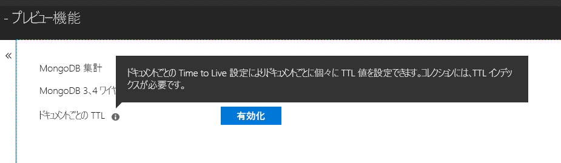

# <a name="expire-data-with-azure-cosmos-dbs-api-for-mongodb"></a>Azure Cosmos DB の MongoDB 用 API でデータを期限切れにする

Time to Live (TTL) 機能により、データベースはデータを自動的に期限切れにすることができます。 Azure Cosmos DB の MongoDB 用 API では、Cosmos DB の中核的な TTL 機能が利用されます。 コレクション全体に既定の TTL 値を設定するモードと、ドキュメントごとに個別の TTL 値を設定するモードの 2 つのモードがサポートされています。 Cosmos DB の MongoDB 用 API における TTL インデックスとドキュメントごとの TTL 値を管理するロジックは、[Cosmos DB におけるロジックと同じです](../cosmos-db/mongodb-indexing.md)。

## <a name="ttl-indexes"></a>TTL インデックス
コレクション全体に対して TTL を有効にするには、["TTL インデックス" (Time to Live インデックス)](../cosmos-db/mongodb-indexing.md) を作成する必要があります。 TTL インデックスは、"expireAfterSeconds" 値を含む _ts フィールドのインデックスです。

例:
```JavaScript
globaldb:PRIMARY> db.coll.createIndex({"_ts":1}, {expireAfterSeconds: 10})
{
        "_t" : "CreateIndexesResponse",
        "ok" : 1,
        "createdCollectionAutomatically" : true,
        "numIndexesBefore" : 1,
        "numIndexesAfter" : 4
}
```

上記の例のコマンドでは、TTL 機能を使用するインデックスを作成します。 インデックスが作成されると、データベースによって、そのコレクション内の、この 10 秒間に変更されていないドキュメントが自動的に削除されます。 

> [!NOTE]
> **_ts** は Cosmos DB に固有のフィールドであり、MongoDB クライアントからアクセスすることはできません。 予約された (システム) プロパティであり、ドキュメントの最終変更日時のタイムスタンプを含んでいます。
>
    
C# の例: 

```csharp
var options = new CreateIndexOptions {ExpireAfter = TimeSpan.FromSeconds(10)}; 
var field = new StringFieldDefinition<BsonDocument>("_ts"); 
var indexDefinition = new IndexKeysDefinitionBuilder<BsonDocument>().Ascending(field); 
await collection.Indexes.CreateOneAsync(indexDefinition, options); 
``` 

## <a name="set-time-to-live-value-for-a-document"></a>ドキュメントの Time to Live 値の設定 
ドキュメントごとの TTL 値もサポートされています。 ドキュメントには、ルート レベルのプロパティである "ttl" (小文字) が含まれている必要があります。また、前述の TTL インデックスがそのコレクションに対して作成されている必要があります。 ドキュメントに設定された TTL 値は、コレクションの TTL 値よりも優先されます。

TTL 値は int32 である必要があります。 または、int32 に収まる int64、あるいは int32 に収まる小数部を持たない double を指定します。 これらの仕様に準拠していない TTL プロパティ値を使用することもできますが、ドキュメントの有効な TTL 値としては扱われません。

ドキュメントの TTL 値は省略可能です。TTL 値のないドキュメントをコレクションに挿入できます。  この場合、コレクションの TTL 値が適用されます。 

次のドキュメントには有効な TTL 値があります。 ドキュメントが挿入されると、ドキュメントの TTL 値がコレクションの TTL 値よりも優先されます。 そのため、ドキュメントは 20 秒後に削除されます。  

```JavaScript 
globaldb:PRIMARY> db.coll.insert({id:1, location: "Paris", ttl: 20.0}) 
globaldb:PRIMARY> db.coll.insert({id:1, location: "Paris", ttl: NumberInt(20)}) 
globaldb:PRIMARY> db.coll.insert({id:1, location: "Paris", ttl: NumberLong(20)}) 
```

次のドキュメントには無効な TTL 値があります。 ドキュメントは挿入されますが、ドキュメントの TTL 値は適用されません。 そのため、コレクションの TTL 値が使用され、ドキュメントは 10 秒後に削除されます。 

```JavaScript 
globaldb:PRIMARY> db.coll.insert({id:1, location: "Paris", ttl: 20.5}) //TTL value contains non-zero decimal part. 
globaldb:PRIMARY> db.coll.insert({id:1, location: "Paris", ttl: NumberLong(2147483649)}) //TTL value is greater than Int32.MaxValue (2,147,483,648). 
``` 

## <a name="how-to-activate-the-per-document-ttl-feature"></a>ドキュメントごとの TTL 機能をアクティブにする方法

ドキュメントごとの TTL 機能は、Azure Cosmos DB の MongoDB 用 API でアクティブにできます。

 

## <a name="next-steps"></a>次の手順
* [TTL を使用して Azure Cosmos DB 内のデータを自動的に期限切れにします。](../cosmos-db/time-to-live.md)
* [Azure Cosmos DB の MongoDB 用 API を使用して構成された Cosmos データベースのインデックスを作成します。](../cosmos-db/mongodb-indexing.md)
