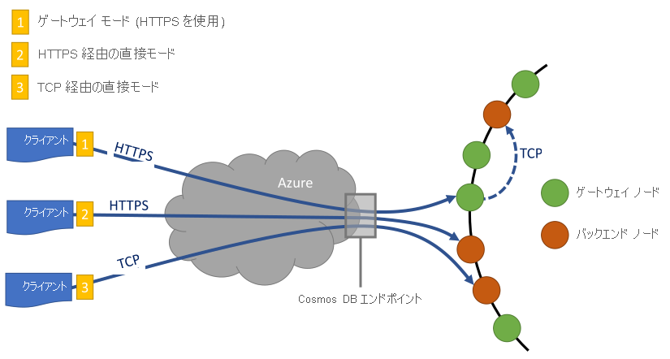

> [!div class="op_single_selector"]
> * [Async Java](performance-tips-async-java.md)
> * [Java](performance-tips-java.md)
> * [.NET](performance-tips.md)
> 
> 

# <a name="performance-tips-for-azure-cosmos-db-and-net"></a>Azure Cosmos DB と .NET のパフォーマンスに関するヒント

Azure Cosmos DB は、高速で柔軟性に優れた分散データベースです。待機時間とスループットが保証されており、シームレスにスケーリングできます。 Azure Cosmos DB でデータベースをスケーリングするために、アーキテクチャを大きく変更したり、複雑なコードを記述したりする必要はありません。 スケールアップとスケールダウンは、API 呼び出しか [SDK メソッド呼び出し](set-throughput.md#set-throughput-sdk)を 1 回行うだけで簡単に実行できます。 ただし、Azure Cosmos DB にはネットワーク呼び出しによってアクセスするため、[SQL .NET SDK](documentdb-sdk-dotnet.md) を使うと、最高のパフォーマンスを実現するためにクライアント側の最適化を行うことができます。

データベースのパフォーマンスを向上させる場合は、 以下のオプションを検討してください。

## <a name="networking"></a>ネットワーク
<a id="direct-connection"></a>

1. **接続ポリシー: 直接接続モードを使用する**

    クライアントが Azure Cosmos DB に接続する方法は、特に監視対象となるクライアント側の待機時間の観点から、パフォーマンスに重要な影響を及ぼします。 クライアントの接続ポリシーを構成する際に使用できる 2 つの主要な構成設定として、接続 "*モード*" と[接続 "*プロトコル*"](#connection-protocol) があります。  次の 2 つのモードが用意されています。

   * ゲートウェイ モード (既定値)
      
     ゲートウェイ モードは構成済みの既定のモードであり、すべての SDK プラットフォームでサポートされています。 ゲートウェイ モードでは標準の HTTPS ポートと単一のエンドポイントを使用するため、ファイアウォールの厳しい制限がある企業ネットワーク内でアプリケーションを実行する場合は、ゲートウェイ モードが最適な選択肢です。 ただし、パフォーマンスのトレードオフとして、Gateway モードでは、Azure Cosmos DB に対してデータの読み取りまたは書き込みを行うたびに、追加のネットワーク ホップが必要になります。 そのため、ネットワーク ホップ数が少ない直接モードの方がパフォーマンスが向上します。 Azure Functions や従量課金プランを使用する場合など、ソケット接続の数に制限がある環境でアプリケーションを実行する場合、Gateway 接続モードも推奨されます。 

   * 直接モード

     直接モードは、TCP および HTTPS プロトコル経由の接続をサポートします。 現在、直接モードは Windows プラットフォームの .NET Standard 2.0 においてのみサポートされています。 直接モードを利用するときは、次の 2 つのプロトコル オプションがあります。

    * TCP
    * HTTPS

    ゲートウェイ モードを使用している場合、Azure Cosmos DB はポート 443 を使用し、MongoDB API は 10250、10255、および 10256 ポートを使用します。 10250 ポートは geo レプリケーションなしで既定の MongoDB インスタンスにマップされ、10255/10256 ポートは geo レプリケーション機能付きで MongoDB インスタンスにマップされます。 直接モードで TCP を使用する場合は、Azure Cosmos DB が動的 TCP ポートを使用するため、ゲートウェイ ポートに加えてポート範囲 10000 ～ 20000 を開いておく必要があります。 これらのポートが開いていない場合に TCP を使用しようとすると、[503 サービスを利用できません] エラーが表示されます。 次の表は、さまざまな API で使用可能な接続モードと、各 API のサービス ポート ユーザーを示しています。

    |接続モード  |サポートされるプロトコル  |サポートされる SDK  |API/サービス ポート  |
    |---------|---------|---------|---------|
    |ゲートウェイ  |   HTTPS    |  すべての SDK    |   SQL(443), Mongo(10250, 10255, 10256), Table(443), Cassandra(443), Graph(443)    |
    |直接    |    HTTPS     |  .Net と Java SDK    |    SQL(443)   |
    |直接    |     TCP    |  .Net SDK    | 10,000 ～ 20,000 の範囲内のポート |

    Azure Cosmos DB は、HTTPS を介したシンプルなオープン RESTful プログラミング モデルを提供します。 さらに、RESTful な通信モデルである効率的な TCP プロトコルも用意されており、.NET クライアント SDK を通じて使用できます。 Direct TCP と HTTPS は、どちらも最初の認証とトラフィックの暗号化で SSL を使用します。 最適なパフォーマンスを実現するために、可能であれば TCP プロトコルを使用します。

    接続モードは、ConnectionPolicy パラメーターを使用して DocumentClient インスタンスの作成時に構成されます。 直接モードを使用する場合、ConnectionPolicy パラメーター内でプロトコルも設定できます。

    ```csharp
    var serviceEndpoint = new Uri("https://contoso.documents.net");
    var authKey = new "your authKey from the Azure portal";
    DocumentClient client = new DocumentClient(serviceEndpoint, authKey,
    new ConnectionPolicy
    {
        ConnectionMode = ConnectionMode.Direct,
        ConnectionProtocol = Protocol.Tcp
    });
    ```

    TCP は直接モードでのみサポートされるため、ゲートウェイ モードを使用する場合は、ゲートウェイとの通信に HTTPS プロトコルが常に使用され、ConnectionPolicy の Protocol 値は無視されます。

    

2. **OpenAsync を呼び出して最初の要求での開始時の待機時間を回避する**

    既定では、最初の要求でアドレス ルーティング テーブルを取得する必要があるため、最初の要求の待機時間が長くなります。 最初の要求でこの開始時の待機時間を回避するには、次のように初期化中に OpenAsync() を 1 回呼び出します。

        await client.OpenAsync();
   <a id="same-region"></a>
3. **パフォーマンスを確保するために同じ Azure リージョン内にクライアントを併置する**

    可能であれば、Azure Cosmos DB を呼び出すアプリケーションを Azure Cosmos DB データベースと同じリージョンに配置します。 大ざっぱな比較ですが、Azure Cosmos DB の呼び出しは、同じリージョン内であれば 1 ～ 2 ミリ秒以内で完了するのに対し、米国西部と米国東部との間では待ち時間が 50 ミリ秒を超えます。 要求がクライアントから Azure データセンターの境界まで流れるときに使用されるルートに応じて、この待機時間が要求ごとに異なる可能性があります。 最短の待機時間は、プロビジョニングされた Azure Cosmos DB エンドポイントと同じ Azure リージョン内に呼び出し元アプリケーションを配置することによって実現されます。 使用可能なリージョンの一覧については、「 [Azure のリージョン](https://azure.microsoft.com/regions/#services)」を参照してください。

    
   <a id="increase-threads"></a>
4. **スレッド/タスクの数を増やす**

    Azure Cosmos DB の呼び出しはネットワーク経由で行われるため、クライアント アプリケーションで要求間の待機時間をできるだけ短くするために、要求の並列処理の次数を変えることが必要な場合があります。 たとえば、.NET の [タスク並列ライブラリ](https://msdn.microsoft.com//library/dd460717.aspx)を使用する場合、Azure Cosmos DB に対する読み取りタスクまたは書き込みタスクを 100 件単位で作成してください。

## <a name="sdk-usage"></a>SDK の使用例
1. **最新の SDK をインストールする**

    Azure Cosmos DB SDK は、最適なパフォーマンスを提供するために頻繁に改善されています。 [Azure Cosmos DB SDK](documentdb-sdk-dotnet.md) のページを参照して、最新の SDK を確認し、改善点を確認してください。
2. **アプリケーションの有効期間中はシングルトン Azure Cosmos DB クライアントを使用する**

    各 DocumentClient インスタンスはスレッド セーフであり、直接モードで動作しているときには効率的な接続管理とアドレスのキャッシュが実行されます。 DocumentClient による効率的な接続管理とパフォーマンスの向上を実現するために、アプリケーションの有効期間中は、AppDomain ごとに DocumentClient の単一のインスタンスを使用することをお勧めします。

   <a id="max-connection"></a>
3. **ゲートウェイ モードを使用するときはホストあたりの System.Net MaxConnections を増やす**

    Gateway モードを使用するときは Azure Cosmos DB の要求は HTTPS/REST を介して行われ、ホスト名または IP アドレスごとの既定の接続数の制限の対象となります。 場合によっては、Azure Cosmos DB に対する複数の同時接続をクライアント ライブラリが活かすためには、MaxConnections を 100 ～ 1000 に増やす必要があります。 .NET SDK 1.8.0 以降では、[ServicePointManager.DefaultConnectionLimit](https://msdn.microsoft.com/library/system.net.servicepointmanager.defaultconnectionlimit.aspx) の既定値は 50 です。この値を変更するには、[Documents.Client.ConnectionPolicy.MaxConnectionLimit](https://msdn.microsoft.com/library/azure/microsoft.azure.documents.client.connectionpolicy.maxconnectionlimit.aspx) をより大きな値に設定します。   
4. **パーティション分割コレクションに対する並列クエリを調整する**

     SQL .NET SDK Version 1.9.0 以降では、並列クエリがサポートされています。この機能を使用すると、パーティション分割コレクションにクエリを並列的に実行できます (詳細については、「[SDK の操作](sql-api-partition-data.md#working-with-the-azure-cosmos-db-sdks)」と、関連する[コード例](https://github.com/Azure/azure-documentdb-dotnet/blob/master/samples/code-samples/Queries/Program.cs)を参照してください)。 並列クエリは、シリアル クエリよりもクエリの待機時間とスループットを向上させるように設計されています。 並列クエリには、ユーザーが要件に合わせて調整できる 2 つのパラメーターが用意されています。(a) MaxDegreeOfParallelism は、並列でクエリを実行できるパーティションの最大数を制御します。(b) MaxBufferedItemCount は、プリフェッチされる結果の数を制御します。

    (a) "***MaxDegreeOfParallelism の調整\:***" 並列クエリは、複数のパーティションに並列にクエリを実行することによって機能します。 ただし、個々のパーティション分割されたコレクションからのデータは、クエリごとに順番に取得されます。 そのため、MaxDegreeOfParallelism をパーティションの数に設定すると、その他のすべてのシステムの条件が変わらなければ、クエリのパフォーマンスを最大にできる可能性が最大になります。 パーティションの数が不明な場合は、MaxDegreeOfParallelism に大きな数を設定できます。システムが最小値 (パーティションの数、ユーザー指定の入力) を MaxDegreeOfParallelism として選択します。

    並列クエリが最も有効に機能するのは、クエリに対するデータがすべてのパーティションに均等に分散している場合であることに注意する必要があります。 パーティション分割されたコレクションが、クエリによって返されるすべてまたは大部分のデータがわずかな数のパーティション (最悪の場合は 1 つのパーティション) に集中するように分割されている場合、クエリのパフォーマンスに関してこれらのパーティションがボトルネックになるでしょう。

    (b) "***MaxBufferedItemCount の調整\:***" 並列クエリは、結果の現在のバッチがクライアントによって処理されている間に結果をプリフェッチするように設計されています。 プリフェッチは、クエリの全体的な遅延の削減に役立ちます。 MaxBufferedItemCount は、プリフェッチされる結果の量を制限するパラメーターです。 MaxBufferedItemCount を、返される結果の予期される数 (またはそれ以上の数) に設定すると、クエリに対するプリフェッチの効果が最大になります。

    プリフェッチは MaxDegreeOfParallelism とは無関係に同じように動作し、すべてのパーティションからのデータに対して単一のバッファーが存在します。  
5. **サーバー側の GC を有効にする**

    ガベージ コレクションの頻度を減らした方がよい場合もあります。 .NET では、 [gcServer](https://msdn.microsoft.com/library/ms229357.aspx) を true に設定します。
6. **RetryAfter 間隔でバックオフを実装する**

    パフォーマンス テストでは、調整される要求の割合がわずかになるまで負荷を上げる必要があります。 スロットル状態になった場合、クライアント アプリケーション側でバックオフ値を適用し、サーバー側によって指定された再試行間隔のスロットル時間を後退させるようにしてください。 バックオフにより、再試行までの待ち時間を最小限に抑えることができます。 再試行ポリシーは、SQL [.NET](sql-api-sdk-dotnet.md) および [Java](sql-api-sdk-java.md) のバージョン 1.8.0 以降、[Node.js](sql-api-sdk-node.md) および [Python](sql-api-sdk-python.md) のバージョン 1.9.0 以降、および [.NET Core](sql-api-sdk-dotnet-core.md) SDK のサポートされているすべてのバージョンでサポートされています。 詳細については、「[予約されたスループット上限の超過](request-units.md#RequestRateTooLarge)」および [RetryAfter](https://msdn.microsoft.com/library/microsoft.azure.documents.documentclientexception.retryafter.aspx) に関するページを参照してください。
    
    .NET SDK のバージョン 1.19 以降では、次の例のように、追加の診断情報をログに記録し、待ち時間に関する問題をトラブルシューティングするメカニズムがあります。 読み取り待ち時間の長い要求についての診断文字列をログに記録できます。 取得した診断文字列は、特定の要求に対して 429 が確認された回数を把握するのに役立ちます。
    ```csharp
    ResourceResponse<Document> readDocument = await this.readClient.ReadDocumentAsync(oldDocuments[i].SelfLink);
    readDocument.RequestDiagnosticsString 
    ```
    
7. **クライアント ワークロードをスケールアウトする**

    高スループット レベル (1 秒あたりの要求ユニット数が 50,000 超) でテストを行っている場合、コンピューターが CPU 使用率またはネットワーク使用率の上限に達したことでクライアント アプリケーションがボトルネックになることがあります。 この状態に達しても、クライアント アプリケーションを複数のサーバーにスケールアウトすることで引き続き同じ Azure Cosmos DB アカウントで対応できます。
8. **ドキュメント URI をキャッシュして読み取り待機時間を減らす**

    最適な読み取りパフォーマンスを実現するために、できる限りドキュメント URI をキャッシュします。 リソースを作成するときに resourceid をキャッシュするロジックを定義する必要があります。 Resourceid ベースの参照は名前ベースの参照よりも高速であるため、これらの値をキャッシュすると、パフォーマンスが向上します。 

   <a id="tune-page-size"></a>
1. **パフォーマンスを向上させるために、クエリ/読み取りフィードのページ サイズを調整する**

    読み取りフィード機能 (ReadDocumentFeedAsync など) を使用してドキュメントの一括読み取りを実行したときや、SQL クエリを発行したときに、結果セットが大きすぎる場合、セグメント化された形式で結果が返されます。 既定では、100 項目または 1 MB (先に達した方) のチャンク単位で結果が返されます。

    該当するすべての結果を取得するために必要なネットワーク ラウンド トリップの回数を減らすために、[x-ms-max-item-count](https://docs.microsoft.com/rest/api/cosmos-db/common-cosmosdb-rest-request-headers) 要求ヘッダーを使用して、ページ サイズを最大 1,000 まで増やすことができます。 ごく少数の結果のみを表示する必要がある場合は (ユーザー インターフェイスやアプリケーション API が一度に 10 件しか結果を返さない場合など)、読み取りとクエリに使用されるスループットを減らすために、ページ サイズを 10 に減らすこともできます。

    また、使用可能な Azure Cosmos DB SDK を使用してページ サイズを設定することもできます。  例: 

        IQueryable<dynamic> authorResults = client.CreateDocumentQuery(documentCollection.SelfLink, "SELECT p.Author FROM Pages p WHERE p.Title = 'About Seattle'", new FeedOptions { MaxItemCount = 1000 });
10. **スレッド/タスクの数を増やす**

    「ネットワーク」の「[スレッド/タスクの数を増やす](#increase-threads)」を参照してください。

11. **64 ビット ホスト プロセスを使用する**

    SQL SDK は、SQL .NET SDK バージョン 1.11.4 以降を使用している場合に、32 ビット ホスト プロセスで動作します。 ただし、クロス パーティション クエリを使用する場合は、パフォーマンス向上のために 64 ビット ホスト プロセスを使用することをお勧めします。 次の種類のアプリケーションでは 32 ビット ホスト プロセスが既定で使用されるため、64 ビットに変更するには、アプリケーションの種類に基づいて次の手順に従ってください。

    - 実行可能なアプリケーションの場合、これは **[ビルド]** タブの **[プロジェクトのプロパティ]** ウィンドウで **[32 ビットを優先]** オプションをオフにすることで実行できます。

    - VSTest ベースのテスト プロジェクトの場合、**Visual Studio テスト** メニュー オプションから **[テスト]**->**[テストの設定]**->**[Default Processor Architecture as X64 (X64 としての既定のプロセッサ アーキテクチャ)]** の順に選択することで実行できます。

    - ローカルでデプロイされた ASP.NET Web アプリケーションの場合、**[ツール]**->**[オプション]**->**[プロジェクトおよびソリューション]**->**[Web プロジェクト]** の順に選択して、**[Web サイトおよびプロジェクト用 IIS Express の 64 ビット バージョンを使用する]** をチェックすることで実行できます。

    - Azure にデプロイされた ASP.NET Web アプリケーションの場合、Azure Portal の **[アプリケーションの設定]** で、**[Platform as 64-bit (64 ビットとしてのプラットフォーム)]** を選択することで実行できます。

## <a name="indexing-policy"></a>インデックス作成ポリシー
 
1. **インデックス作成から未使用のパスを除外して書き込みを高速化する**

    Cosmos DB のインデックス作成ポリシーでは、パスのインデックス作成 (IndexingPolicy.IncludedPaths および IndexingPolicy.ExcludedPaths) を使用して、インデックス作成に含める/除外するドキュメント パスを指定できます。 インデックス作成コストはインデックス付きの一意のパスの数に直接関係するため、パスのインデックス作成を使用すると、クエリ パターンが事前にわかっているシナリオで書き込みパフォーマンスが向上し、インデックス ストレージを削減できます。  たとえば、次のコードは、ワイルドカード "*" を使用してドキュメントのセクション全体 (別名 サブツリーとも呼ばれます) をインデックス作成から除外する方法を示しています。

    ```csharp
    var collection = new DocumentCollection { Id = "excludedPathCollection" };
    collection.IndexingPolicy.IncludedPaths.Add(new IncludedPath { Path = "/*" });
    collection.IndexingPolicy.ExcludedPaths.Add(new ExcludedPath { Path = "/nonIndexedContent/*");
    collection = await client.CreateDocumentCollectionAsync(UriFactory.CreateDatabaseUri("db"), excluded);
    ```

    詳細については、[Azure Cosmos DB インデックス作成ポリシー](indexing-policies.md)に関するページをご覧ください。

## <a name="throughput"></a>Throughput
<a id="measure-rus"></a>

1. **測定と調整によって 1 秒あたりの要求ユニットの使用量を削減する**

    Azure Cosmos DB には、UDF、ストアド プロシージャ、トリガーを使ったリレーショナル クエリや階層クエリなど、さまざまなデータベース操作が用意されています。これらの操作はすべて、データベース コレクション内のドキュメントに対して実行できます。 これらの操作のそれぞれに関連付けられたコストは、操作を完了するために必要な CPU、IO、およびメモリに応じて異なります。 ハードウェア リソースの管理について考える代わりに、各種のデータベース操作を実行しアプリケーション要求を処理するのに必要なリソースに関する単一の測定単位として要求単位 (RU) を考えることができます。

    コンテナーごとに設定された[要求ユニット](request-units.md)の数に基づいて、スループットをプロビジョニングします。 要求単位の消費は、1 秒あたりのレートとして評価されます。 コンテナーのプロビジョニング済み要求ユニット レートを超過したアプリケーションは、レートがそのコンテナーにプロビジョニングされているレベルを下回るまで制限されます。 アプリケーションでより高いスループットが必要になった場合は、追加の要求ユニットをプロビジョニングしてスループットを増やすことができます。 

    クエリの複雑さは、操作で消費される要求ユニット数に影響します。 述語の数、述語の特性、UDF 数、ソース データ セットのサイズのすべてがクエリ操作のコストに影響します。

    操作 (作成、更新、または削除) のオーバーヘッドを測定するには、[x-ms-request-charge](https://docs.microsoft.com/rest/api/cosmos-db/common-cosmosdb-rest-response-headers) ヘッダー (あるいは、.NET SDK の ResourceResponse<T> または FeedResponse<T> の同等の RequestCharge プロパティ) を調べて、これらの操作で使用される要求ユニット数を測定します。

    ```csharp
    // Measure the performance (request units) of writes
    ResourceResponse<Document> response = await client.CreateDocumentAsync(collectionSelfLink, myDocument);
    Console.WriteLine("Insert of document consumed {0} request units", response.RequestCharge);
    // Measure the performance (request units) of queries
    IDocumentQuery<dynamic> queryable = client.CreateDocumentQuery(collectionSelfLink, queryString).AsDocumentQuery();
    while (queryable.HasMoreResults)
         {
              FeedResponse<dynamic> queryResponse = await queryable.ExecuteNextAsync<dynamic>();
              Console.WriteLine("Query batch consumed {0} request units", queryResponse.RequestCharge);
         }
    ```             

    このヘッダーで返される要求の使用量は、プロビジョニングしたスループット (2000 RU/秒) の一部です。 たとえば、上記のクエリが 1 KB のドキュメントを 1000 個返した場合、この操作のコストは 1000 になります。 そのため、後続の要求をレート制限する前に、サーバーは 1 秒以内にこのような要求を 2 つだけ受け付けます。 詳細については、[要求ユニット](request-units.md)に関する記事および[要求ユニット計算ツール](https://www.documentdb.com/capacityplanner)のページを参照してください。
<a id="429"></a>
2. **レート制限と大きすぎる要求レートに対処する**

    クライアントがアカウントの予約済みスループットを超えようとしても、サーバーでパフォーマンスの低下が発生することはなく、予約済みのレベルを超えてスループット容量が使用されることもありません。 サーバーはいち早く RequestRateTooLarge (HTTP 状態コード 429) で要求を終了させ、要求を再試行するまでにユーザーが待機しなければならない時間 (ミリ秒) を示す [x-ms-retry-after-ms](https://docs.microsoft.com/rest/api/cosmos-db/common-cosmosdb-rest-response-headers) ヘッダーを返します。

        HTTP Status 429,
        Status Line: RequestRateTooLarge
        x-ms-retry-after-ms :100

    SDK はすべてこの応答を暗黙的にキャッチし、サーバーが指定した retry-after ヘッダーを優先して要求を再試行します。 アカウントに複数のクライアントが同時アクセスしている状況でなければ、次回の再試行は成功します。

    複数のクライアントが要求レートを常に上回った状態で累積的に動作している場合、現在クライアントによって内部的に 9 に設定されている既定の再試行回数では不十分な可能性があります。この場合、クライアントは状態コード 429 を含む DocumentClientException をアプリケーションにスローします。 既定の再試行回数は、ConnectionPolicy インスタンスで RetryOptions を設定することで変更できます。 既定では、要求レートを超えて要求が続行されている場合に、30 秒の累積待機時間を過ぎると、状態コード 429 を含む DocumentClientException が返されます。 これは、現在の再試行回数が最大再試行回数 (既定値の 9 またはユーザー定義の値) より少ない場合でも発生します。

    自動再試行動作により、ほとんどのアプリケーションの回復性とユーザービリティが向上しますが、パフォーマンス ベンチマークの実行時 (特に待機時間の測定時) に問題が生じることがあります。  実験でサーバー スロットルが発生し、クライアント SDK によって警告なしに再試行が行われると、クライアントが監視する待機時間が急増します。 パフォーマンスの実験中に待機時間が急増するのを回避するには、各操作で返される使用量を測定し、予約済みの要求レートを下回った状態で要求が行われていることを確認します。 詳細については、 [要求ユニット](request-units.md)に関する記事を参照してください。
3. **スループットを向上させるためにサイズの小さいドキュメントに合わせて設計する**

    特定の操作の要求の使用量 (要求処理コスト) は、ドキュメントのサイズに直接関係します。 サイズの大きいドキュメントの操作は、サイズの小さいドキュメントの操作よりもコストがかかります。

## <a name="next-steps"></a>次の手順
少数のクライアント コンピューターでの高パフォーマンス シナリオで Azure Cosmos DB の評価に使用するサンプル アプリケーションについては、[Azure Cosmos DB のパフォーマンスとスケールのテスト](performance-testing.md)に関するページを参照してください。

また、スケーリングと高パフォーマンスのためのアプリケーションの設計の詳細については、[Azure Cosmos DB でのパーティション分割とスケーリング](partition-data.md)に関するページをご覧ください。
