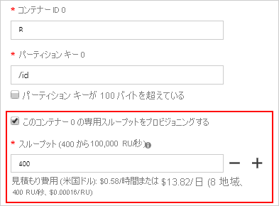

# コンテナーとデータベースのスループットのプロビジョニング

Azure Cosmos データベースは、一連のコンテナーの管理の単位です。 データベースは、スキーマに依存しない一連のコンテナーで構成されます。 Azure Cosmos コンテナーは、スループットとストレージの両方のスケーラビリティの単位です。 コンテナーは、Azure リージョン内の一連のマシン全体で水平方向にパーティション分割され、Azure Cosmos アカウントに関連付けられているすべての Azure リージョンに分散されます。

Azure Cosmos DB では、2 つの細分性でスループットをプロビジョニングできます。
 
- Azure Cosmos コンテナー
- Azure Cosmos データベース

## コンテナーでスループットを設定する  

Azure Cosmos コンテナーに対してプロビジョニングされたスループットは、そのコンテナー専用に予約されます。 コンテナーは、常にプロビジョニング済みスループットを受け取ります。 コンテナーのプロビジョニング済みスループットは、SLA によって料金が保証されます。 コンテナーでスループットを構成する方法については、「[Azure Cosmos コンテナー上でのスループットをプロビジョニングする](how-to-provision-container-throughput.md)」を参照してください。

コンテナー上にプロビジョニング済みのスループットに関する設定は、最も頻繁に使用されるオプションです。 [要求ユニット (RU)](request-units.md) を使用して任意の量のスループットをプロビジョニングすることにより、コンテナーのスループットをエラスティックにスケーリングできます。 

Azure Cosmos コンテナーにプロビジョニングされたスループットは、コンテナーのすべての論理パーティションに一様に分散されます。 論理パーティションのスループットを選択的に指定することはできません。 コンテナーの 1 つ以上の論理パーティションが物理パーティションによってホストされているため、物理パーティションはそのコンテナーにのみ属し、そのコンテナーにプロビジョニングされたスループットをサポートします。 

論理パーティション上で実行されているワークロードによって、その論理パーティションに割り当てられている量より多くのスループットが消費されている場合、ユーザーの操作のレートが制限されます。 レートの制限が発生した場合は、コンテナー全体のプロビジョニング済みスループットを増やすか、操作を再試行することができます。 パーティション分割の詳細については、[論理パーティション](partition-data.md)に関するページをご覧ください。

コンテナーのパフォーマンスを保証する必要がある場合は、コンテナーの単位でスループットを構成することをお勧めします。

次のイメージは、物理パーティションによって、コンテナーの 1 つ以上の論理パーティションをホストする方法を示しています。

## データベースでスループットを設定する

Azure Cosmos データベースでスループットをプロビジョニングすると、スループットはデータベースのすべてのコンテナーで共有されます。 例外は、データベース内の特定のコンテナーでプロビジョニング済みスループットを指定した場合です。 データベースレベルのプロビジョニング済みスループットを複数のコンテナーで共有することは、マシンのクラスター上でデータベースをホストすることと似ています。 データベース内のすべてのコンテナーによって、コンピューターで使用可能なリソースが共有されるため、必然的に、特定のコンテナーで予想どおりのパフォーマンスを得ることはできません。 データベース上のプロビジョニング済みスループットを構成する方法については、[Azure Cosmos データベース上のプロビジョニング済みスループットの構成](how-to-provision-database-throughput.md)に関するページを参照してください。

Azure Cosmos データベースにスループットを設定することで、そのデータベースに対してプロビジョニング済みのスループットを常時利用できることが保証されます。 データベース内のすべてのコンテナーによってプロビジョニング済みスループットが共有されるため、Azure Cosmos DB データベースでは、そのデータベース内の特定のコンテナーに対して、予測可能なスループットは保証されません。 特定のコンテナーが受け取ることができるスループットの部分は、次に依存します。

* コンテナーの数。
* さまざまなコンテナーのパーティション キーの選択。
* コンテナーのさまざまな論理パーティション間のワークロードの分散。 

複数のコンテナーでスループットを共有するが、スループットを特定のコンテナー専用にしたくない場合は、データベースでスループットを構成することをお勧めします。 

次に、データベース レベルでスループットをプロビジョニングすることが望ましい例を示します。

* データベースのプロビジョニング済みスループットを一連のコンテナーで共有することは、マルチテナント アプリケーションに便利です。 各ユーザーを、個別の Azure Cosmos コンテナーによって表すことができます。

* 一連のコンテナーでデータベースのプロビジョニング済みスループットを共有することは、ホストされている NoSQL データベース (MongoDB、Cassandra など) を、VM のクラスターやオンプレミスの物理サーバーから、Azure Cosmos DB へ移行する場合に便利です。 Azure Cosmos データベースで構成されているプロビジョニング済みスループットは、MongoDB や Cassandra クラスターのコンピューティング キャパシティと論理的に同等のものである (ただしコスト効率や柔軟性が高い) と考えてください。  

スループットがプロビジョニング済みのデータベース内に作成されるコンテナーはすべて、[パーティション キー](partition-data.md)を使用して作成する必要があります。 特定の時点で、データベース内のコンテナーに割り当てられているスループットは、そのコンテナーのすべての論理パーティションに分散されます。 データベースに対して構成されたプロビジョニング済みスループットを共有するコンテナーがある場合は、特定のコンテナーや論理パーティションにスループットを選択して適用することはできません。 

論理パーティションのワークロードによって、特定の論理パーティションに割り当てられている量より多くのスループットが消費されている場合、ユーザーの操作のレートが制限されます。 レートの制限が発生した場合は、データベース全体のスループットを増やすか、または操作を再試行することができます。 パーティション分割の詳細については、[論理パーティション](partition-data.md)に関するページをご覧ください。

データベースにプロビジョニング済みのスループットを共有する異なるコンテナーに属する複数の論理パーティションは、1 つの物理パーティションでホストできます。 コンテナーの 1 つの論理パーティションは、常に物理パーティション内で範囲指定されますが、データベースのプロビジョニング済みスループットを共有する *C* 個のコンテナーにまたがる *L* 個の論理パーティションを *R* 個の物理パーティションにマッピングしてホストできます。 

次の図は、物理パーティションで、データベース内のさまざまなコンテナーに属する 1 つ以上の論理パーティションをホストできる方法を示しています。

## データベースとコンテナーでスループットを設定する

2 つのモデルを組み合わせることができます。 データベースとコンテナーの両方でスループットをプロビジョニングできます。 次の例に、Azure Cosmos データベースとコンテナーでスループットをプロビジョニングする方法を示します。

* *K* RU のプロビジョニング済みスループットで、*Z* という名前の Azure Cosmos データベースを作成できます。 
* 次に、データベース内に *A*、*B*、*C*、*D*、*E* という名前の 5 つのコンテナーを作成します。 コンテナー B を作成するときに、必ず **[Provision dedicated throughput for this container]\(このコンテナーの専用スループットをプロビジョニングする\)** オプションを有効にし、このコンテナーにプロビジョニングされているスループットの "*P*" RU を明示的に構成します。 共有および専用のスループットを構成できるのは、データベースとコンテナーを作成する場合のみであることに注意してください。 

   

* *K* RU のスループットは、*A*、*C*、*D*、*E* の 4 つのコンテナーにわたって共有されます。使用可能なスループットの正確な量は、*A*、*C*、*D*、*E* のそれぞれで異なります。 個々のコンテナーのスループットに対する SLA はありません。
* コンテナー *B* は常に *P* RU のスループットを取得することが保証されます。 それは SLA によって裏付けられます。

## データベースまたはコンテナーのスループットを更新する

Azure Cosmos コンテナーまたはデータベースを作成した後に、プロビジョニング済みのスループットを更新できます。 データベースまたはコンテナーで構成できる最大のプロビジョニング済みスループットに制限はありません。 最小のプロビジョニング済みスループットは、次の要因によって異なります。 

* これまでコンテナーに格納された最大データ サイズ
* これまでコンテナーにプロビジョニングした最大スループット
* これまで共有スループットでデータベースに作成した Azure Cosmos コンテナーの最大数。 

コンテナーまたはデータベースの最小スループットは、SDK を使用してプログラムで取得するか、Azure portal でその値を表示することができます。 .NET SDK を使用する場合、[DocumentClient.ReplaceOfferAsync](https://docs.microsoft.com/dotnet/api/microsoft.azure.documents.client.documentclient.replaceofferasync?view=azure-dotnet) メソッドで、プロビジョニング済みスループット値をスケールできます。 Java SDK を使用する場合、[RequestOptions.setOfferThroughput](sql-api-java-samples.md#offer-examples) メソッドを使用して、プロビジョニング済みスループット値をスケールできます。 

.NET SDK を使用する場合、[DocumentClient.ReadOfferAsync](https://docs.microsoft.com/dotnet/api/microsoft.azure.documents.client.documentclient.readofferasync?view=azure-dotnet) メソッドを使用して、コンテナーまたはデータベースの最小スループットを取得できます。 

コンテナーまたはデータベースのプロビジョニング済みスループットはいつでもスケールできます。 スループットを向上させるためにスケール操作を実行すると、必要なリソースをプロビジョニングするためのシステム タスクが原因で、より長い時間がかかる場合があります。 スケール操作の状態は、Azure portal で、または SDK を使用してプログラムで確認できます。 .NET SDK を使用する場合は、`DocumentClient.ReadOfferAsync` メソッドを使用して、スケール操作の状態を取得できます。

## モデルの比較

|**パラメーター**  |**データベースにプロビジョニングされたスループット**  |**コンテナーにプロビジョニングされたスループット**|
|---------|---------|---------|
|最小 RU |400 (最初の 4 個のコンテナーの後は、コンテナーを追加するごとに少なくとも 100 RU/秒が必要になります。) |400|
|コンテナーあたりの最小 RU|100|400|
|最大 RU|無制限、データベース上。|無制限、コンテナー上。|
|特定のコンテナーに割り当てられた、または使用可能な RU|保証はありません。 特定のコンテナーに割り当てられる RU は、プロパティに依存します。 スループットを共有するコンテナーのパーティション キーの選択、ワークロードの分散、コンテナーの数などのプロパティです。 |コンテナー上に構成されるすべての RU は、そのコンテナー専用に予約されます。|
|コンテナーの最大ストレージ|無制限。|無制限。|
|コンテナーの論理パーティションあたりの最大スループット|10,000 RU|10,000 RU|
|コンテナーの論理パーティションあたりの最大ストレージ (データ + インデックス)|10 GB|10 GB|

## 次の手順

* [論理パーティション](partition-data.md)の詳細を確認する。
* [Azure Cosmos コンテナーのスループットをプロビジョニングする](how-to-provision-container-throughput.md)方法を確認する。
* [Azure Cosmos データベースのスループットをプロビジョニングする](how-to-provision-database-throughput.md)方法を確認する。

