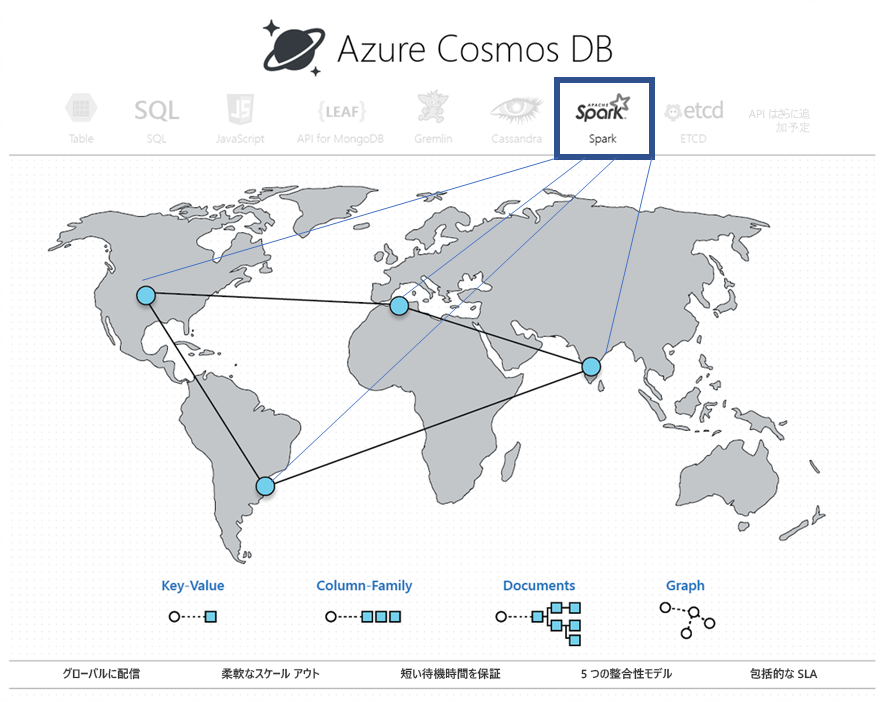

# Azure Cosmos DB での Apache Spark を使用した組み込み運用分析 (プレビュー) 

Azure Cosmos DB での Apache Spark の組み込みサポートにより、Azure Cosmos アカウントに保存されているデータに対する分析を Apache Spark から実行できます。 また、グローバルに分散された Cosmos データベースで Apache Spark ジョブを直接実行する処理がネイティブにサポートされます。 このような機能があることで、開発者、データ エンジニア、データ サイエンティストは **OLTP と OLAP/HTAP** という両方のワークロードを実行する柔軟性、拡張性、パフォーマンスに優れたデータ プラットフォームとして Azure Cosmos DB を使用できます。 

Spark コンピューティングは、Azure Cosmos アカウントに関連付けられたすべての Azure リージョンで自動的に使用できます。 Spark ジョブは、Azure Cosmos DB のマルチマスター機能を使用し、各リージョンでのローカル レプリカに対して書き込みやクエリを行えます。 

> [!NOTE]
> 現在、Azure Cosmos DB での Apache Spark の組み込みサポートは、制限付きのプレビュー段階です。 プレビューに申し込むには、[プレビューのためのサインアップ](https://portal.azure.com/?feature.customportal=false#create/Microsoft.DocumentDB) ページに移動してください。 

Azure Cosmos DB での Apache Spark のサポートには、次の利点があります。

* 地理的に分散されているユーザーやデータに関する分析情報を最短で得られます。

* ソリューションのアーキテクチャをシンプルにして[総保有コスト](total-cost-ownership.md) (TCO) を下げることができます。 システムに与えられるデータ処理コンポーネントの数は最小限であり、その間で不要なデータ移動が回避されます。

* [セキュリティ](secure-access-to-data.md)、[コンプライアンス](compliance.md)、すべてのデータを管理下に置く監査境界が作成されます。

* 厳格な SLA に支援される "常時オン" あるいは[可用性の高い](high-availability.md)エンドユーザー分析が提供されます。

 
Azure Cosmos DB での Apache Spark のサポートを利用することで、AI とディープ ラーニングのモデル、予測分析、おすすめ候補、IoT、カスタマー 360、詐欺検出、テキスト センチメント、クリックストリーム分析などのソリューションを構築してデプロイできます。 これらのソリューションは Azure Cosmos DB データに対して直接動作します。

データベース サービスの外側に出たり、コンピューティング サービスを追加したりする必要なく、Azure Cosmos DB でバッチおよびストリーミング ETL ジョブを設定できます。 ETL ジョブを実行し、ジョブの完了時、規模を戻す必要があるとき、コンピューティング環境の規模をエラスティックに変更できます。

Azure Cosmos DB での Apache Spark のサポートでは、Apache Spark ランタイムで組み込みの機械学習がサポートされます。 このランタイムには、Spark MLLib、Microsoft Machine Learning for Spark、Azure Machine Learning、Cognitive Services が含まれています。 このような機能により、データ サイエンティスト、データ エンジニア、データ アナリストは、短い時間と低いコストで、Azure Cosmos DB 内に直接、機械学習モデルを構築し、運用できます。

## 主な利点

### 世界中に分散され、待ち時間の短い運用分析と AI

世界中に分散されている Azure Cosmos データベースの Apache Spark を利用することで、世界中の分析情報を短時間で得ることができるようになりました。 Azure Cosmos DB は、3 つの主要な手法により、**世界中に分散された待ち時間の短い運用分析**をエラスティックなスケールで可能にします。

* Azure Cosmos データベースは世界中に分散しているため、データはすべてローカルで、すなわち、データのプロデューサー (ユーザーなど) がいる場所で取り込まれます。 クエリはデータのプロデューサーとコンシューマーの所在地に関係なく、両方にとって最も近いローカル レプリカに対して実行されます。 

* 分析クエリはすべて、データ パーティション内に保管されているインデックス付きデータで直接実行されています。不要なデータ移動は必要ありません。 

* Spark は Azure Cosmos DB と併設されるため、中間的な変換とデータ移動が少なくなります。その結果、パフォーマンスと拡張性が向上します。

### Apache Spark の統一サーバーレス体験

マルチモデル データベースの Azure Cosmos DB では、OSS API 向けのサポートが拡張されました。**Apache Spark の統一サーバーレス体験**にキー/値、ドキュメント、グラフ、列ファミリー データ モデルが与えられるようになりました。 MongoDB、Cassandra、Gremlin、Etcd、SQL API を利用することで、さまざまなデータ モデルがサポートされます。すべて同じ基礎データ上で動作します。 

Azure Cosmos DB での Apache Spark のサポートにより、Scala、Python、Java で記述されたアプリケーションをネイティブにサポートできるほか、SQL 用に緊密に統合された複数のライブラリを使用できます。 そのようなライブラリには、([Spark SQL](https://spark.apache.org/sql/))、機械学習 (Spark [MLlib](https://spark.apache.org/mllib/))、ストリーム処理 ([Spark Structured Streaming](https://spark.apache.org/streaming/))、グラフ処理 (Spark [GraphFrames]( https://docs.databricks.com/spark/latest/graph-analysis/graphframes/user-guide-python.html)) があります。 これらのツールにより、さまざまなユース ケースに Apache Spark を簡単に利用できます。 Spark や Spark クラスターを扱う必要はありません。 同じ基礎データ上で同時に、使い慣れた Apache Spark API と **Jupyter ノートブック**を分析と SQL API に、Cassandra など、OSS NoSQL API をトランザクション処理に使用できます。

### スキーマやインデックスの管理が不要

従来の分析データベースとは異なり、Azure Cosmos DB の場合、データ エンジニアやデータ サイエンティストは面倒なスキーマやインデックス管理を扱う必要がなくなります。 Azure Cosmos DB のデータベース エンジンは、明示的なスキーマやインデックス管理を必要としません。また、Apache Spark のクエリにすばやくサービスを提供するために取り込むすべてのデータに自動的にインデックスを付けることができます。 

### 整合性の選択肢

Apache Spark ジョブは Azure Cosmos データベースのデータ パーティションで実行されるため、クエリには [5 つの明確に定義された整合性選択肢](consistency-levels.md)が与えられます。 このような整合性モデルには柔軟性があり、厳密な整合性を選択すれば、待ち時間と高可用性で妥協することなく、機械学習アルゴリズムで最も精確な結果を提供できます。 

### SLA

Apache Spark ジョブには、業界をリードする包括的な [SLA](https://azure.microsoft.com/support/legal/sla/documentdb/v1_1/) (99.999) など、Azure Cosmos DB の長所が与えられ、個々の Apache Spark クラスターを管理するというオーバーヘッドがありません。 このような SLA には、スループット、99 パーセンタイルの待ち時間、整合性、高可用性が含まれます。 

### ワークロードの混在

Apache Spark を Azure Cosmos DB に統合することで、分離していたトランザクションと分析がつながります。この分離は、クラウドネイティブのアプリケーションを世界規模で構築するとき、顧客にとって大きな難点の 1 つでした。 

## 組み込み Jupyter Notebook のサポート

Azure Cosmos DB では、Cassandra、MongoDB、SQL、Gremlin、テーブルなど、すべての API の Jupyter Notebook をサポートします。 Jupyter Notebook は Azure Cosmos DB アカウント内で実行し、開発者エクスペリエンスを高めます。 組み込み Notebook がすべての Azure Cosmos DB API とデータ モデルをサポートしているので、対話形式でクエリを実行できます。 機械学習モデルを実行し、Azure Cosmos データベースに格納されたデータを分析することもできます。 Jupyter Notebook エクスペリエンスを使用することにより、格納されたデータを分析し、機械学習モデルをビルドおよびトレーニングし、次の図に示すように Azure portal のデータに対して推論を実行できます。

## 次の手順

* Azure Cosmos DB の長所については、[こちら](introduction.md)の概要の記事をご覧ください。
* [Azure Cosmos DB の MongoDB 用 API の概要](mongodb-introduction.md)
* [Azure Cosmos DB Cassandra API を使ってみる](cassandra-introduction.md)
* [Azure Cosmos DB Gremlin API を使ってみる](graph-introduction.md)
* [Azure Cosmos DB Table API を使ってみる](table-introduction.md)

