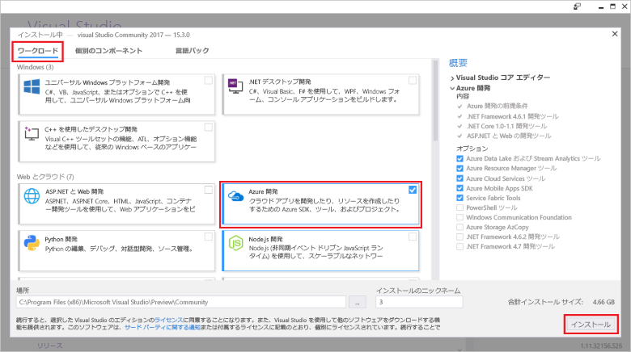

# <a name="create-an-azure-functions-http-trigger-with-an-azure-cosmos-db-input-binding"></a>Azure Cosmos DB 入力バインドで Azure Functions HTTP トリガーを作成する

Azure Cosmos DB は、スキーマレスかつサーバーレスなグローバル分散型マルチモデル データベースです。 Azure 関数はサーバーレス コンピューティング サービスで、このサービスにより、オンデマンドでコードを実行することができます。 この 2 つの Azure サービスを組み合わせることで、サーバーレス アーキテクチャの基盤が確保され、優れたアプリの構築に専念できます。コンピューティングおよびデータベースのニーズに応じて、サーバーのプロビジョニングや保守を行うことを心配する必要がありません。

このチュートリアルは、[.NET 用 Graph API クイックスタート](create-graph-dotnet.md)で作成したコードに基づいており、 [HTTP トリガー](https://github.com/MicrosoftDocs/azure-docs-pr/azure-functions/functions-bindings-http-webhook.md#http-trigger)を含む Azure 関数を追加します。 HTTP トリガーは、Azure Cosmos DB [入力バインド](https://github.com/MicrosoftDocs/azure-docs-pr/azure-functions/functions-triggers-bindings.md)を使用して、クイックスタートで作成したグラフ データベースからデータを取得します。 この特定の HTTP トリガーは、Azure Cosmos DB に対してデータのクエリを実行しますが、Azure Cosmos DB からの入力バインドを使用して、関数に必要なものすべてについてデータ入力値を取得できます。

このチュートリアルに含まれるタスクは次のとおりです。

> [!div class="checklist"]
> * Azure 関数プロジェクトを作成する 
> * HTTP トリガーを作成する
> * Azure 関数を発行する
> * Azure 関数を Azure Cosmos DB データベースに接続する

## <a name="prerequisites"></a>前提条件

- [Visual Studio 2017 バージョン 15.3](https://www.visualstudio.com/vs/preview/) (**Azure 開発**ワークロードを含む)。

    
    
- Visual Studio 2017 バージョン 15.3 をインストールするか、このバージョンにアップグレードした後、Visual Studio 2017 Tools for Azure Functions を手動で更新する必要があります。 ツールを更新するには、**[ツール]** メニューで **[拡張機能と更新プログラム]** > **[更新プログラム]** > **[Visual Studio Marketplace]** > **[Azure Functions and Web Jobs Tools]\(Azure Functions と Web ジョブのツール\)** > **[更新]** の順に選択します。

- [Graph API を使用した .NET アプリケーションのビルド](tutorial-develop-graph-dotnet.md) チュートリアルを完了するか、[azure-cosmos-db-graph-dotnet-getting-started](https://github.com/Azure-Samples/azure-cosmos-db-graph-dotnet-getting-started) GitHub リポジトリからサンプル コードを取得して、プロジェクトをビルドします。
 
## <a name="build-a-function-in-visual-studio"></a>Visual Studio で関数を構築する

1. **Azure Functions** プロジェクトをソリューションに追加します。**ソリューション エクスプローラー**でソリューション ノードを右クリックし、**[追加]** > **[新しいプロジェクト]** を選択します。 ダイアログ ボックスで **[Azure Functions]** を選択し、**PeopleDataFunctions** という名前を付けます。

   

2. Azure Functions プロジェクトを作成したら、NuGet 関連の更新およびインストールをいくつか実行します。 

    a. Functions SDK を最新の状態にするには、NuGet マネージャーを使用して、**Microsoft.NET.Sdk.Functions** パッケージを更新します。 **ソリューション エクスプローラー**でプロジェクトを右クリックし、**[NuGet パッケージの管理]** を選びます。 **[インストール]** タブで [Microsoft.NET.Sdk.Functions] を選択し、**[更新]** をクリックします。

   

    b. **[参照]** タブで、「**azure.graphs**」と入力して **Microsoft.Azure.Graphs** パッケージを検索し、**[インストール]** をクリックします。 このパッケージには、Graph API .NET クライアント SDK が含まれています。

   

    c. **[参照]** タブで、「**mono.csharp**」と入力して **Mono.CSharp** パッケージを検索し、**[インストール]** をクリックします。

   

3. 次のように、インストールしたパッケージがソリューション エクスプローラーに表示されます。 
   
   次に、コードをいくつか記述する必要があるため、新しい **Azure 関数**項目をプロジェクトに追加します。 

    a. **ソリューション エクスプローラー**で、プロジェクト ノードを右クリックし、**[追加]** > **[新しい項目]** の順に選択します。   
    b. **[新しい項目の追加]** ダイアログで、**[Visual C# アイテム]**、**[Azure 関数]** の順に選択し、プロジェクトの名前として「**Search**」と入力し、**[追加]** をクリックします。  
 
   

4. Azure 関数は HTTP 要求に応答します。したがって、この HTTP トリガー テンプレートは適切です。
   
   **[新しい Azure 関数]** ボックスで、**[HTTP トリガー]** を選択します。 この Azure 関数を "公開" したいので、**[アクセス権]** を **[匿名]** に設定します。これにより全員がアクセスできます。 **[OK]**をクリックします。

   

5. Search.cs を Azure 関数のプロジェクトに追加した後、その **using** ステートメントを、既存の using ステートメントにコピーします。

   ```csharp
   using Microsoft.Azure.Documents;
   using Microsoft.Azure.Documents.Client;
   using Microsoft.Azure.Documents.Linq;
   using Microsoft.Azure.Graphs;
   using Microsoft.Azure.WebJobs;
   using Microsoft.Azure.WebJobs.Extensions.Http;
   using Microsoft.Azure.WebJobs.Host;
   using System;
   using System.Collections.Generic;
   using System.Configuration;
   using System.Linq;
   using System.Net;
   using System.Net.Http;
   using System.Threading.Tasks;
   ```

6. 次に、Azure 関数のクラスを次のコードで置き換えます。 このコードは、Graph API を使用して、Azure Cosmos DB データベースで、すべてのユーザー、または `name` クエリ文字列パラメーターによって識別された特定のユーザーを検索します。

   ```csharp
   public static class Search
   {
       static string endpoint = ConfigurationManager.AppSettings["Endpoint"];
       static string authKey = ConfigurationManager.AppSettings["AuthKey"];

       [FunctionName("Search")]
       public static async Task<HttpResponseMessage> Run(
           [HttpTrigger(AuthorizationLevel.Anonymous, "get", "post", Route = null)]HttpRequestMessage req,
           TraceWriter log)
       {
           log.Info("C# HTTP trigger function processed a request.");

           // the person objects are free-form in structure
           List<dynamic> results = new List<dynamic>();

           // open the client's connection
           using (DocumentClient client = new DocumentClient(
               new Uri(endpoint),
               authKey,
               new ConnectionPolicy
               {
                   ConnectionMode = ConnectionMode.Direct,
                   ConnectionProtocol = Protocol.Tcp
               }))
           {
               // get a reference to the database the console app created
               Database database = await client.CreateDatabaseIfNotExistsAsync(
                   new Database
                   {
                       Id = "graphdb"
                   });

               // get an instance of the database's graph
               DocumentCollection graph = await client.CreateDocumentCollectionIfNotExistsAsync(
                   UriFactory.CreateDatabaseUri("graphdb"),
                   new DocumentCollection { Id = "graphcollz" },
                   new RequestOptions { OfferThroughput = 1000 });

               // build a gremlin query based on the existence of a name parameter
               string name = req.GetQueryNameValuePairs()
                   .FirstOrDefault(q => string.Compare(q.Key, "name", true) == 0)
                   .Value;

               IDocumentQuery<dynamic> query = (!String.IsNullOrEmpty(name))
                   ? client.CreateGremlinQuery<dynamic>(graph, string.Format("g.V('{0}')", name))
                   : client.CreateGremlinQuery<dynamic>(graph, "g.V()");

               // iterate over all the results and add them to the list
               while (query.HasMoreResults)
                   foreach (dynamic result in await query.ExecuteNextAsync())
                       results.Add(result);
           }

           // return the list with an OK response
           return req.CreateResponse<List<dynamic>>(HttpStatusCode.OK, results);
       }
   }
   ```

   コードは、基本的には、データベースをシード処理した元のコンソール アプリケーションの接続ロジックと同じで、単純なクエリを使用して、一致するレコードを取得します。

## <a name="debug-the-azure-function-locally"></a>Azure 関数をローカルでデバッグする

すべてのコードが用意できたので、Azure 関数のローカル デバッグ ツールとエミュレーターを使用して、そのコードをローカルで実行してテストできます。

1. コードを正常に実行するには、そのコードをローカルで実行できるように、Azure Cosmos DB 接続情報を使用して構成しておく必要があります。 Azure 関数を、ローカルで実行できるように local.settings.json ファイルを使用して構成する方法は、元のコンソール アプリケーションを、実行できるように App.config ファイルを使用して構成する方法とほとんど同じです。

    これを行うには、次の図に示すように、次のコード行を local.settings.json に追加し、GraphGetStarted プロジェクトの App.Config ファイルから Endpoint と AuthKey にコピーします。

   ```json
    "Endpoint": "",
    "AuthKey": ""
    ```

   

2. スタートアップ プロジェクトを新しい Functions アプリに変更します。 **ソリューション エクスプローラー**で、**[PeopleDataFunctions]** を右クリックし、**[スタートアップ プロジェクトに設定]** を選択します。

3. **ソリューション エクスプローラー**で、**PeopleDataFunctions** プロジェクトの **[依存関係]** を右クリックし、**[参照の追加]** をクリックします。 一覧から System.Configuration を選択し、**[OK]** をクリックします。

3. ここで、アプリを実行してみましょう。 F5 キーを押して、使用する準備ができているホスト済み Azure 関数コードで、ローカル デバッグ ツール func.exe を実行します。

   func.exe からの最初の出力の最後に、Azure 関数が localhost:7071 でホストされていることが示されています。 これは、クライアントでのテストに便利です。

   

4. Azure 関数をテストするには、Huachao Mao の拡張機能である [REST クライアント](https://marketplace.visualstudio.com/items?itemName=humao.rest-client)を備えた [Visual Studio Code](http://code.visualstudio.com/) を使用します。 REST クライアントは、1 回の右クリックで、ローカルまたはリモート HTTP 要求機能を提供します。 

    これを行うには、test-function-locally.http という名前の新しいファイルを作成し、次のコードを追加します。

    ```http
    get http://localhost:7071/api/Search

    get http://localhost:7071/api/Search?name=ben
   ```

    ここで、次の図に示すように、最初のコード行を右クリックし、**[要求の送信]** を選択します。

   

   ローカルで実行されている Azure 関数ヘッダー、JSON 本文コンテンツなど、すべての要素からの未加工の HTTP 応答が表示されます。

   

5. 次に、2 行目のコード行を選択し、**[要求の送信]** を選択します。 データベースにあることがわかっている値を持つ `name` クエリ文字列パラメーターを追加することで、Azure 関数が返す結果をフィルター処理できます。

   

Azure 関数が検証され、正しく機能していると思われる場合は、最後の手順として、それを Azure App Service に発行し、クラウドで実行されるように構成します。

## <a name="publish-the-azure-function"></a>Azure 関数の発行

1. **ソリューション エクスプローラー**で、プロジェクトを右クリックし、**[発行]** を選択します。

   

2. これをクラウドに発行して、公開シナリオでテストする準備ができました。 **[発行]** タブで **[Azure 関数アプリ]**、**[新規作成]** の順に選択し、Azure サブスクリプションで Azure 関数を作成して、**[発行]** をクリックします。

   

3. **[発行]** ダイアログで、次の操作を行います。
   
    a. **[アプリ名]** で、関数に一意の名前を指定します。

    b. **[サブスクリプション]** で、使用する Azure サブスクリプションを選択します。
   
    c. **[リソース グループ]** で、新しいリソース グループを作成し、アプリ名と同じ名前を使用します。
   
    d. サーバーレス Azure 関数に対して従量課金の請求方法を使用するため、**[App Service プラン]** で **[新規]** をクリックし、使用量ベースの新しい App Service プランを作成します。 **[App Service プランの構成]** ページでは既定値を使用し、**[OK]** をクリックします。
   
    e. 他の機能の実行をトリガーするために BLOB、Table、または Queue のサポートが必要な場合に備えて、**[ストレージ アカウント]** でも **[新規]** をクリックし、Azure 関数で使用する新しいストレージ アカウントを作成します。 **[ストレージ アカウント]** ページでは既定値を使用し、**[OK]** をクリックします。

    f.SAML 属性の属性名またはスキーマ リファレンスを入力します。 その後、ダイアログで **[作成]** をクリックすると、Azure サブスクリプションですべてのリソースが作成されます。 次回 Azure 関数コードを発行するときに使用される発行プロファイル (単純な XML ファイル) が、Visual Studio によってダウンロードされます。

   

    その後、関数を変更して再発行する必要がある場合、使用できる [発行] ページが Visual Studio によって表示されます。 今は、そのページに対してアクションを実行する必要はありません。

4. Azure 関数を発行したら、[Azure Portal](https://portal.azure.com/) ページで Azure 関数に移動できます。 そこに Azure 関数の **[アプリケーション設定]** リンクが表示されます。 このリンクを開いて、Azure Cosmos DB データベースに接続できるように、ユーザー データを使用してライブ Azure 関数を構成します。

   

5. さきほどコンソール アプリケーションの App.config ファイルおよび Azure 関数アプリの local.settings.json ファイルで実行したように、Azure Cosmos DB データベースへの Endpoint および AuthKey を、発行された関数に追加する必要があります。 これにより、キーを含む構成コードをチェックインする必要がなくなります。キーはポータルで構成でき、ソース コントロールには保存されません。 各値を追加するには、**[新しい設定の追加]** をクリックし、**Endpoint** と app.config の値を追加して、**[新しい設定の追加]** を再度クリックします。次に、**AuthKey** とカスタム値を追加します。 値を追加して保存すると、設定は次のようになります。

   

6. Azure サブスクリプションで Azure 関数が適切に構成されたら、再度 Visual Studio Code REST クライアントの拡張機能を使用して、公開されている Azure 関数の URL にクエリを実行できます。 次の 2 つのコード行を test-function-locally.http に追加し、各行を実行して、この関数をテストします。 URL の関数の名前は、使用している関数の名前で置き換えてください。

    ```json
    get https://peoplesearchfunction.azurewebsites.net/api/Search

    get https://peoplesearchfunction.azurewebsites.net/api/Search?name=thomas
    ```

    関数からは、Azure Cosmos DB から取得されたデータが返されます。

    


## <a name="next-steps"></a>次のステップ

このチュートリアルでは、次の手順を行いました。

> [!div class="checklist"]
> * Azure 関数プロジェクトの作成 
> * HTTP トリガーの作成
> * Azure 関数の発行
> * Azure Cosmos DB データベースへの関数の接続

これで、"概念" セクションに進み、Cosmos DB の詳細について学習できるようになりました。

> [!div class="nextstepaction"]
> [グローバル配信](distribute-data-globally.md) 

この記事は、[Brady Gaster のスキーマレスとサーバーレス](http://www.bradygaster.com/category/%20Serverless%20&%20Schemaless) ブログ シリーズのブログに基づきます。 このシリーズの他の投稿もご覧ください。
