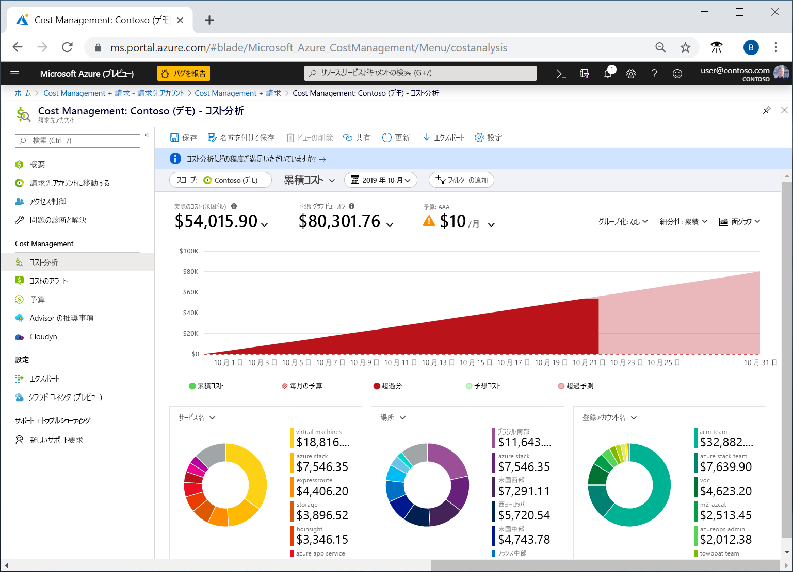
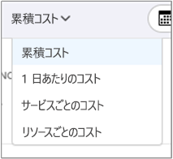
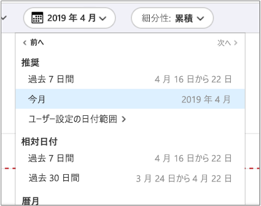
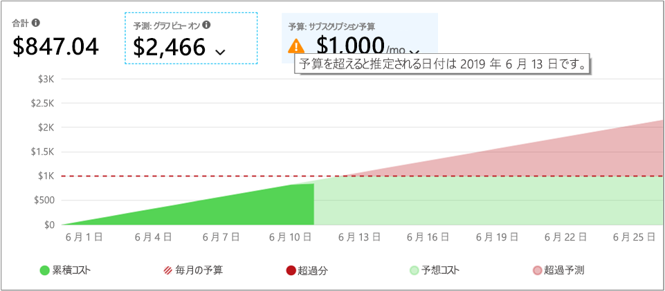
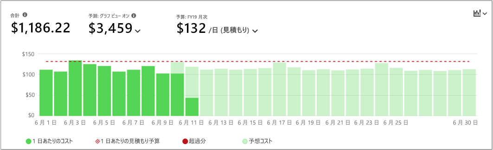
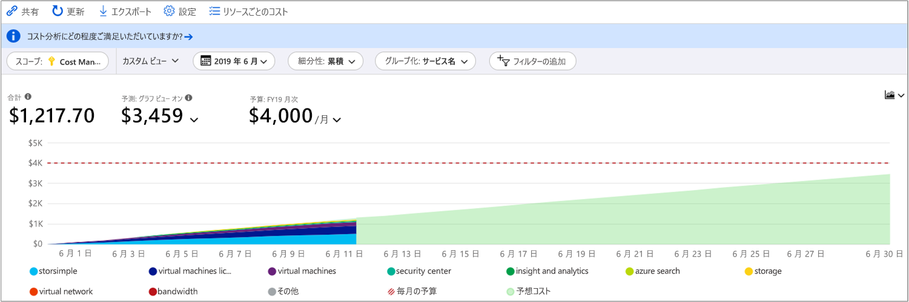
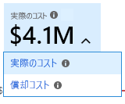
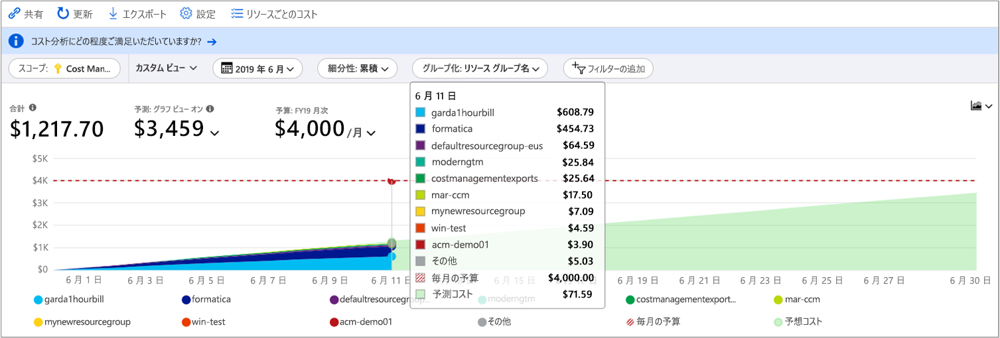
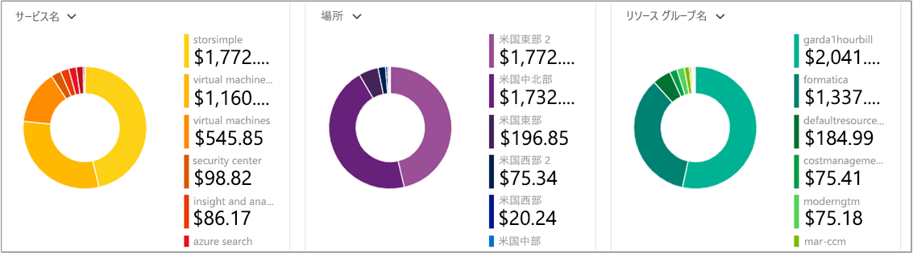
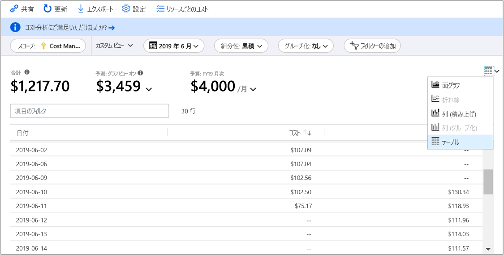

# <a name="quickstart-explore-and-analyze-costs-with-cost-analysis"></a>クイック スタート:コスト分析を使用してコストを調査および分析する

Azure コストを正しく制御して最適化するには、コストが組織内のどこで発生しているかを把握する必要があります。 また、サービスのコストがどれくらいの金額であり、どのような環境やシステムをサポートしているかを認識することも有効です。 あらゆるコストを調査することは、組織の消費パターンを正確に把握するために重要です。 消費パターンを使用して、コスト管理のメカニズム (予算など) を適用できます。

このクイック スタートでは、コスト分析を使用して組織のコストを調査および分析します。 組織ごとの集計コストを表示することで、時間の経過に伴いコストがどこで発生しているかを把握したり、消費傾向を識別したりできます。 一定期間の累積コストを表示することで、予算に対する月単位、四半期ごと、場合によっては年単位のコスト傾向を見積もることができます。 予算は、財務上の制約に対処するうえで役立ちます。 また、予算は、日単位または月単位のコストを確認して、支出の不規則性を特定するために使用します。 また、さらに分析を行うか、または外部システムで使用するために、現在のレポートのデータをダウンロードできます。

このクイックスタートでは、次の方法について説明します。

- コスト分析でコストを確認する
- コスト ビューをカスタマイズする
- コスト分析データをダウンロードする


## <a name="prerequisites"></a>前提条件

コスト分析では、さまざまな種類の Azure アカウントがサポートされています。 サポートされているアカウントの種類の完全な一覧については、「[Understand Cost Management data (Cost Management データの概要)](understand-cost-mgt-data.md)」を参照してください。 コスト データを表示するには、少なくとも Azure アカウントの読み取りアクセス許可が必要です。

Azure Cost Management データに対するアクセス権の割り当てについては、[データへのアクセス許可の割り当て](../../cost-management/assign-access-acm-data.md)に関するページを参照してください。

## <a name="sign-in-to-azure"></a>Azure へのサインイン

- Azure Portal ( https://portal.azure.com ) にサインインします。

## <a name="review-costs-in-cost-analysis"></a>コスト分析でコストを確認する

コスト分析でコストを確認するには、Azure portal でスコープを開き、メニューで **[コスト分析]** を選択します。 たとえば、 **[サブスクリプション]** に移動し、一覧からサブスクリプションを選択して、メニューから **[コスト分析]** を選択します。 コスト分析で別のスコープに切り替えるには、 **[スコープ]** ピルを使用します。 スコープの詳細については、「[Understand and work with scopes (スコープを理解して使用する)](understand-work-scopes.md)」を参照してください。

選択したスコープは、データの統合とコスト情報へのアクセスの制御のために、Cost Management 全体を通して使用されます。 スコープを使用する場合は、複数選択を行いません。 代わりに、他のユーザーがロールアップする、より大きなスコープを選択してから、必要な入れ子のスコープにフィルターで絞り込みます。 ユーザーによっては、複数の入れ子になったスコープをカバーする単一の親スコープにアクセスできない場合があるため、このアプローチを理解することは重要です。

初期のコスト分析ビューには、次の領域が含まれています。

**累積コスト ビュー**: 定義済みのコスト分析ビューの構成が表されます。 各ビューには、日付範囲、細分性、グループ化、フィルターの設定が含まれます。 既定のビューでは現在の請求期間に対する累積コストが示されますが、他の組み込みビューに変更できます。 詳しくは、「[コスト ビューをカスタマイズする](#customize-cost-views)」をご覧ください。

**実際のコスト**: 当月の合計使用量と購入コストが表示されます。この値が計上されて請求書で示されます。

**予測**: 選択した期間に対する合計予想コストが表示されます。 (予測はプレビューです。)

**予算**: 選択したスコープの計画的な使用制限が示されます (使用可能な場合)。

**細分性の累積**: 請求期間の開始から始めて、日単位のコストの総集計が示されます。 請求先アカウントまたはサブスクリプションのための[予算を作成](tutorial-acm-create-budgets.md)した後、予算に対する消費傾向をすばやく確認できます。 日付の上にカーソルを置くと、その日までの累積コストが表示されます。

**ピボット (ドーナツ) グラフ**: 総コストを一般的な標準プロパティのセット別に分割する動的ピボットが提供されます。 当月のコストが、大きいものから小さいものの順に表示されます。 これらのピボット グラフは、別のピボットを選択することによっていつでも変更できます。 コストは、既定では、サービス (測定カテゴリ)、場所 (リージョン)、および子スコープによって分類されます。 たとえば、登録アカウントは請求先アカウントの下、リソース グループはサブスクリプションの下、リソースはリソース グループの下です。



### <a name="understand-forecast"></a>予測について

コスト予測では、選択した期間における推定コストの予測が表示されます。 このモデルは、時系列回帰モデルに基づいています。 コストを正確に予測するために、少なくとも 10 日間のコストと使用状況の最新データが必要です。 指定の期間に対して、予測モデルでは、予測期間のトレーニング データの同等の部分が必要です。 たとえば、3 か月の予測には、少なくとも 3 か月間のコストと使用状況の最新データが必要です。

このモデルでは、最大 6 か月間のトレーニング データを使用して、1 年間のコストを予測します。 予測が変更されるには、少なくとも 7 日間のトレーニング データが必要です。 予測は、コストや使用パターンにおける急増や急減など、大幅な変化に基づいています。 予測では、 **[Group by]\(グループ化\)** プロパティ内の項目ごとに個々の予測が生成されることはありません。 合計の累積コストの予測のみが提供されます。 複数の通貨を使用する場合、モデルではコストの予測が米国ドルでのみ提供されます。


## <a name="customize-cost-views"></a>コスト ビューをカスタマイズする

コスト分析には、最も一般的な目標に合わせて最適化された 4 つの組み込みビューがあります。

表示 | 答える質問の例
--- | ---
累積コスト | 今月のこれまでの出費はどれくらいですか。 予算内に収まるでしょうか。
1 日あたりのコスト | 過去 30 日間の 1 日あたりのコストに増加はみられましたか。
サービスごとのコスト | 過去 3 回分の請求書で月間使用量はどのように推移しましたか。
リソースごとのコスト | 今月はこれまで、どのリソースに最もコストがかかっていますか。



ただし、より深い分析が必要な多くのケースが存在します。 カスタマイズは、ページの一番上の日付の選択から始まります。

コスト分析では、既定では当月のデータが示されます。 一般的な日付範囲にすばやく切り替えるには、日付セレクターを使用します。 例としては、過去 7 日間、先月、今年、またはカスタムの日付範囲があります。 従量課金制サブスクリプションには、現在の請求期間や最後の請求書のように、カレンダーの月に制約されない請求期間に基づいた日付範囲も含まれます。 メニューの上部にある **<前へ** および **次へ>** リンクを使用して、それぞれ前の期間または次の期間にジャンプします。 たとえば、 **[< 前へ]** を使用すると、**最後の 7 日間**から、**8 から 14 日前**、**15 から 21 日前**というように、順番に切り替わります。



コスト分析では、既定では**累積**コストも示されます。 累積コストには前の数日に加えて、各日のすべてのコストが含まれており、日単位の集計コストの絶えず増加するビューが表示されます。 このビューは、選択された時間範囲の間、予算に対してどのような傾向があるかを示すように最適化されています。

予算オーバーの可能性を明らかにするには、予測グラフ ビューを使用します。 予算オーバーの可能性がある場合は、予想される支出超過が赤で示されます。 グラフにもインジケーター シンボルが表示されます。 シンボルをポイントすると、予算をオーバーする推定日が表示されます。



毎日のコストを示す**日単位**のビューもあります。 日単位のビューには、増加の傾向は示されません。 このビューは、不規則性をコストの急上昇または日ごとの低下として示すように設計されています。 予算を選択した場合、日単位のビューにも日単位の予算の見積もりが表示されます。

日単位のコストが、常に見積もられた日単位の予算を上回っている場合は、月単位の予算を超えることを予測できます。 見積もられた日単位の予算は、低いレベルで予算を視覚化するために役立つ手段です。 日単位のコストに変動があるときは、見積もられた日単位の予算と月単位の予算の比較の正確性が低くなります。

支出の予測を有効にした場合の最近の支出の日単位表示を次に示します。


支出予測を無効にすると、将来の日付の予想支出は表示されません。 また、過去の期間のコストを調べるときは、コスト予測は表示されません。

一般に、8 から 12 時間以内の消費リソースのデータまたは通知を見ることができます。


共通のプロパティで**グループ化**してコストを明細化し、最も寄与した要因を識別します。 たとえば、リソース タグでグループ化するには、グループ化の基準とするタグ キーを選択します。 タグの値ごとのコスト明細が表示され、そのタグが適用されていないリソースについては別途セグメントが表示されます。

ほとんどの [Azure リソースでは、タグ付けがサポートされています](../../azure-resource-manager/management/tag-support.md)。 ただし、一部のタグは Cost Management および請求で使用できません。 また、リソース グループのタグはサポートされていません。 タグのサポートは、タグがリソースに適用された "*後*" にレポートされた使用状況に適用されます。 タグは、過去のコスト データには適用されません。

Azure タグ ポリシーを使用してコスト データの可視性を向上させる方法については、[Azure Cost Management でタグ ポリシーを確認する方法](https://www.youtube.com/watch?v=nHQYcYGKuyw)に関するビデオをご覧ください。

今月の Azure サービス コストの表示を次に示します。



既定では、コスト分析では計上されて請求書に表示されるすべての使用量と購入コストが示されます (**実績コスト** とも呼ばれます)。 実際コストを表示することは、請求書を調整するために最適です。 ただし、支出の異常やその他のコスト変化を監視している場合、購入コストの急増は警告を示す可能性があります。 予約購入コストが原因の急増を平坦化するには、**償却コスト**に切り替えます。



償却コストでは、予約購入が日単位に分割されて、予約期間全体に分配されます。 たとえば、1 月 1 日に 365 ドルで購入したのではなく、1 月 1 日から 12 月 31 日までの毎日 1.00 ドルずつ購入したように表示されます。 基本の償却に加えて、これらのコストは予約を使用した特定のリソースに再割り当てされて関連付けられます。 たとえば、その 1 日あたり 1.00 ドルの料金が 2 つの仮想マシン間で分割された場合、その日には 2 つの 0.50 ドルの料金が表示されます。 予約の一部がその日に利用されていない場合、該当する仮想マシンに関連付けられた 0.50 ドルの料金が 1 つ表示され、もう 1 つの 0.50 ドルの料金には料金種類 `UnusedReservation` が表示されます。 未使用予約コストは償却コスト表示のときにだけ表示できることに注意してください。

コスト表示方法の変更のため、実績コスト表示と償却コスト表示では表示される合計の値が異なることに注意することが重要です。 一般に、予約購入の月の合計コストは償却コストを表示すると減少し、予約購入の後の月は増加します。 償却は予約購入でのみ使用でき、この時点では Azure Marketplace 購入には適用されません。

次の図では、リソース グループ名が示されています。 タグでグループ化してタグ別に合計コストを表示したり、 **[リソースごとのコスト]** ビューを使って特定のリソースのすべてのタグを表示したりできます。



特定の属性によってコストをグループ化すると、上位 10 個のコスト要因が高いものから順に表示されます。 10 個を超える場合、上位 9 個のコスト要因と、 **[その他]** グループが表示されます。このグループは、残りのすべてのグループをまとめて表しています。 タグでグループ化すると、タグ キーが適用されていないコストについて **[タグなし]** グループが表示されます。 タグなしのコストがタグ付きのコストより高い場合でも、 **[タグなし]** は常に最後になります。 タグの値が 10 個以上ある場合、タグなしのコストは、 **[その他]** に含められます。 テーブル ビューに切り替え、細分性を **[なし]** に変更して、すべての値が最高コストから最低コストまで順位付けされていることを確認します。

クラシックの仮想マシン、ネットワーク、およびストレージ リソースでは、詳細な課金データは共有されません。 それらは、コストをグループ化する場合、**クラシック サービス**としてマージされます。

メイン グラフの下のピボット グラフには、選択された期間やフィルターに対応するコストの全体像が把握しやすいよう各種のグループが表示されます。 プロパティまたはタグを選択すると、あらゆるディメンションに基づく集計コストが表示されます。



任意のビューの完全なデータ セットを表示することができます。 適用したすべての選択またはフィルターが、表示されるデータに影響します。 完全なデータセットを表示するには、**グラフの種類**の一覧を選択して、 **[テーブル]** ビューを選択します。




## <a name="understanding-grouping-and-filtering-options"></a>グループ化とフィルタリングのオプションの概要

次の表では、いくつかの最も一般的なグループ化とフィルタリングのオプションと、それをどのようなときに使うかを示します。

| プロパティ | 使用する場合 | Notes |
| --- | --- | --- |
| **可用性ゾーン** | AWS のコストを可用性ゾーン別にします。 | AWS スコープと管理グループに対してのみ適用できます。 Azure データは可用性ゾーンを含んでおらず、"**該当なし**" として表示されます。 |
| **請求期間** | PAYG のコストを請求月別にします。 | 請求対象となる PAYG 料金の正確な表現を取得するには、 **[請求期間]** を使用します。 カスタムの日付範囲に絞り込む場合は、請求期間の前後 2 日を余分に追加してください。 請求期間とまったく同じ日付に制限すると、請求書と一致しません。 コストは、請求期間に含まれるすべての請求書から表示されます。 特定の請求書に絞り込むには、 **[請求書 ID]** を使用します。 該当するのは PAYG サブスクリプションのみです。EA と MCA は歴月ごとに請求されます。 EA/MCA アカウントでは、日付の選択や月単位の細分性でカレンダーの月を使用して、同じ目的を実現できます。 |
| **料金タイプ** | 使用、購入、返金、および未使用予約のコストに分割します。 | 予約購入と返金は、実際のコストのときにだけ使用でき、償却コストを使用するときは使用できません。 未使用予約コストは、償却コスト表示のときにのみ使用できます。 |
| **部門** | コストを EA 部門別にします。 | EA および管理グループに対してのみ使用できます。 PAYG サブスクリプションには部門が存在せず、"**該当なし**" または "**未割り当て**" として表示されます。 |
| **登録アカウント** | EA アカウント所有者でコストを分割します。 | EA の課金アカウント、部門、管理グループに対してのみ使用できます。 PAYG サブスクリプションには EA 登録アカウントが存在せず、"**該当なし**" または "**未割り当て**" として表示されます。 |
| **頻度** | 使用ベース、1 回限り、および定期的なコストに分割します。 | |
| **請求書 ID** | コストを請求書別にします。 | 未請求の料金にはまだ請求書 ID は存在せず、EA コストに請求書の詳細が含まれていないため、"**該当なし**" として表示されます。  |
| **測定** | コストを使用量メーター別にします。 | 購入と Marketplace の使用は "**該当なし**" として表示されます。 購入を特定するには「**料金タイプ**」を、Marketplace の料金を特定するには「**パブリッシャーの種類**」を参照してください。 |
| **操作** | AWS コストを操作別にします。 | AWS スコープと管理グループに対してのみ適用できます。 Azure データは操作を含んでおらず、"**該当なし**" として表示されます。代わりに **[測定]** を使用してください。 |
| **価格モデル** | コストをオンデマンド、予約、スポット使用別にします。 | 購入は、"**オンデマンド**" として表示されます。 "**該当なし**" が表示された場合に、その使用量が予約なのか、オンデマンドでの使用量なのかを調べるには、 **[予約]** でグループ化します。また、購入を特定するには **[料金タイプ]** でグループ化します。
| **プロバイダー** | コストを AWS と Azure に分割します。 | 管理グループに対してのみ使用できます。 |
| **パブリッシャーの種類** | AWS、Azure、Marketplace のコストに分割します。 |  |
| **予約** | 予約でコストを分割します。 | 予約に関連付けられていない使用量または購入は、"**該当なし**" として表示されます。 その他の Azure、AWS、Marketplace の購入を特定するには、 **[パブリッシャーの種類]** でグループ化してください。 |
| **リソース** | リソースでコストを分割します。 | 購入は、EA/PAYG 課金アカウントまたは MCA 課金プロファイル レベルで適用され、特定のリソースには関連付けられないため、"**該当なし**" として表示されます。 その他の Azure、AWS、Marketplace の購入を特定するには、 **[パブリッシャーの種類]** でグループ化してください。 |
| **リソース グループ** | リソース グループでコストを分割します。 | 購入、サブスクリプションに関連付けられていないテナント リソース、リソース グループにデプロイされていないサブスクリプション リソース、クラシック リソースは、リソース グループを持たないため、"**その他**"、"**クラシック サービス**"、" **$system**"、"**該当なし**" のいずれかとして表示されます。 |
| **リソースの種類** | リソースの種類でコストを分割します。 | 購入とクラシック サービスは、Azure Resource Manager リソースの種類を持たないため、"**その他**"、"**クラシック サービス**"、"**該当なし**" のいずれかとして表示されます。 |
| **リソースの場所** | コストを場所別またはリージョン別にします。 | 購入と Marketplace の使用は、"**未割り当て**"、"**不明**"、"**マッピング解除済み**"、"**該当なし**" のいずれかとして表示されます。 |
| **サービス名**または**測定カテゴリ** | Azure サービスでコストを分割します。 | 購入と Marketplace の使用は "**該当なし**" または "**未割り当て**" として表示されます。 |
| **サービス レベル**または**測定サブカテゴリ** | Azure 利用状況の測定のサブ分類でコストを分割します。 | 購入と Marketplace の使用は "**該当なし**" または "**未割り当て**" として表示されます。 |
| **サブスクリプション** | コストを Azure サブスクリプションおよび AWS 連結アカウント別にします。 | 購入とテナント リソースは "**該当なし**" として表示されることがあります。 |
| **Tag** | 特定のタグ キーのタグ値でコストを分割します。 | 購入、サブスクリプションに関連付けられていないテナント リソース、リソース グループにデプロイされていないサブスクリプション リソース、クラシック リソースには、タグを使用できません。 一部のサービスでは、使用量データにタグが含まれないことに注意してください。 [リソースの種類ごとのタグのサポート](https://docs.microsoft.com/azure/azure-resource-manager/management/tag-support)に関するページを参照してください。 |

用語について詳しくは、「[Azure の利用状況と請求金額ファイル内の用語について](../understand/understand-usage.md)」をご覧ください。


## <a name="saving-and-sharing-customized-views"></a>カスタマイズされたビューの保存と共有

コスト分析を Azure portal のダッシュボードにピン留めするか、またはコスト分析へのリンクをコピーすることで、カスタマイズされたビューを保存して他のユーザーと共有します。

コスト分析をピン留めするには、右上隅にあるピン アイコンを選択します。 コスト分析をピン留めすると、メイン グラフまたはテーブル ビューだけが保存されます。 他のユーザーがタイルにアクセスできるようにするには、ダッシュボードを共有します。 ダッシュボードの構成だけが共有され、基になるデータには他のユーザーはアクセスできないことに注意してください。 コストへのアクセス権がないのに、共有ダッシュボードにアクセスすると、"アクセス拒否" メッセージが表示されます。

コスト分析へのリンクを共有するには、ブレードの上部にある **[共有]** を選択します。 カスタム URL が表示され、この特定のスコープに対するこの特定のビューが開かれます。 コストへのアクセス権がない場合にこの URL を受け取ると、"アクセス拒否" メッセージが表示されます。

サポートされている各スコープに対するコストへのアクセス許可について詳しくは、「[スコープを理解して使用する](understand-work-scopes.md)」をご覧ください。

## <a name="automation-and-offline-analysis"></a>自動化とオフライン分析

詳細な分析、独自のデータとの結合、独自のシステムへの統合などのために、データをダウンロードすることが必要になる場合があります。 Cost Management では、いくつかのオプションが提供されています。 まず、コスト分析で得られるようなアドホックの概要が必要な場合は、必要なビューを作成します。 次に、 **[エクスポート]** を選択し、 **[データを CSV にダウンロード]** または **[データを Excel にダウンロード]** を選択してダウンロードします。 Excel のダウンロードでは、スコープ、クエリ構成、合計、生成日など、ダウンロードの生成に使用したビューについての追加コンテキストが提供されます。

完全な未集計のデータセットが必要な場合は、課金アカウントからダウンロードします。 次に、ポータルの左側のナビゲーション ウィンドウにあるサービスの一覧から、 **[コストの管理と請求]** に移動します。 該当する場合は、課金アカウントを選択します。 **[使用量 + 請求金額]** に移動し、対象の請求期間の **[ダウンロード]** アイコンをクリックします。

コスト データを自動的に受け取る場合も、同じようにします。 動的フィルタリング、グループ化、集計などの高度な分析のためには [Query API](/rest/api/cost-management/query) を使用し、完全な未集計のデータセットの場合は [UsageDetails API](/rest/api/consumption/usageDetails) を使用します。 これらの API の一般提供 (GA) バージョンは 2019-01-01 です。 これらの API 内で予約購入および Marketplace 購入のプレビューにアクセスするには、**2019-04-01-preview** を使用します。

たとえば、次に示すのは、料金タイプ (使用量、購入、返金)、パブリッシャーの種類 (Azure、Marketplace)、リソース グループ (購入の場合は空)、予約 (該当しない場合は空) で分割した償却コストの集計ビューです。

```
POST https://management.azure.com/{scope}/providers/Microsoft.CostManagement/query?api-version=2019-04-01-preview
Content-Type: application/json

{
  "type": "AmortizedCost",
  "timeframe": "Custom",
  "timePeriod": { "from": "2019-04-01", "to": "2019-04-30" },
  "dataset": {
    "granularity": "None",
    "aggregation": {
      "totalCost": { "name": "PreTaxCost", "function": "Sum" }
    },
    "grouping": [
      { "type": "dimension", "name": "ChargeType" },
      { "type": "dimension", "name": "PublisherType" },
      { "type": "dimension", "name": "Frequency" },
      { "type": "dimension", "name": "ResourceGroup" },
      { "type": "dimension", "name": "SubscriptionName" },
      { "type": "dimension", "name": "SubscriptionId" },
      { "type": "dimension", "name": "ReservationName" },
      { "type": "dimension", "name": "ReservationId" },
    ]
  },
}
```

集計する必要がなく、完全な生のデータセットを取得する場合は、次のようになります。

```
GET https://management.azure.com/{scope}/providers/Microsoft.Consumption/usageDetails?metric=AmortizedCost&$filter=properties/usageStart+ge+'2019-04-01'+AND+properties/usageEnd+le+'2019-04-30'&api-version=2019-04-01-preview
```

計上される購入を表示するために実際のコストが必要な場合は、**type**/**metric** を **ActualCost** に変更します。 これらの API について詳しくは、[Query](/rest/api/cost-management/query) API と [UsageDetails](/rest/api/consumption/usageDetails) API のドキュメントをご覧ください。 公開されているドキュメントは GA バージョンのものです。 ただし、新しい type/metric 属性と変更されたプロパティ名を除けば、*2019-04-01-preview* API バージョンでも同じように動作することに注意してください。 (プロパティ名の詳細については以下を参照してください。)

Cost Management API は、上記のリソースのすべてのスコープで機能します: Azure RBAC アクセスによるリソース グループ、サブスクリプション、管理グループ、EA ポータル アクセスによる EA 課金アカウント (登録)、部門、登録アカウント。 スコープ ID の決定方法やアクセスの管理方法など、スコープについて詳しくは、「[スコープを理解して使用する](understand-work-scopes.md)」をご覧ください。

## <a name="next-steps"></a>次のステップ

最初のチュートリアルに進み、予算の作成と管理の方法を学習してください。

> [!div class="nextstepaction"]
> [予算を作成して管理する](tutorial-acm-create-budgets.md)
