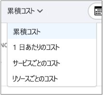
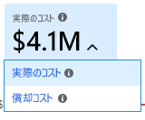
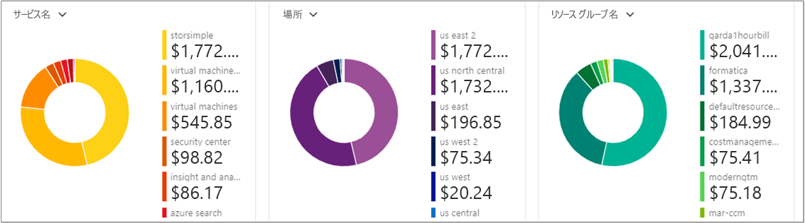
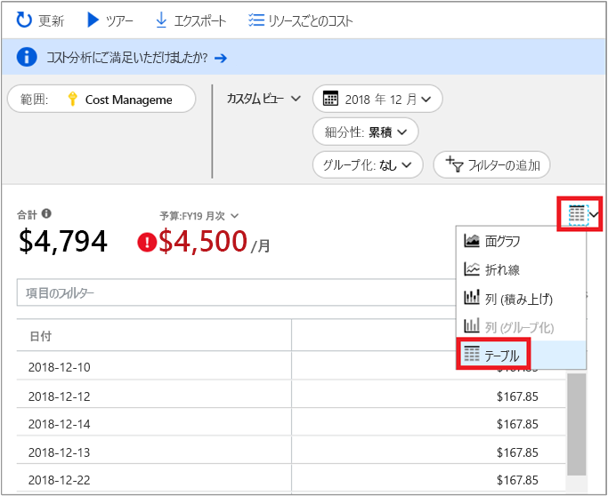

# <a name="quickstart-explore-and-analyze-costs-with-cost-analysis"></a>クイック スタート:コスト分析を使用してコストを調査および分析する

Azure コストを正しく制御して最適化するには、コストが組織内のどこで発生しているかを把握する必要があります。 また、サービスのコストがどれくらいの金額であり、どのような環境やシステムをサポートしているかを認識することも有効です。 あらゆるコストを調査することは、組織の消費パターンを正確に把握するために重要です。 消費パターンは、コスト管理のメカニズム (予算など) を適用するために使用できます。

このクイック スタートでは、コスト分析を使用して組織のコストを調査および分析します。 組織ごとの集計コストを表示することで、時間の経過に伴いコストがどこで発生しているかを把握したり、消費傾向を識別したりできます。 一定期間の累積コストを表示することで、予算に対する月単位、四半期ごと、場合によっては年単位のコスト傾向を見積もることができます。 予算は、財務上の制約に対処するうえで役立ちます。 また、予算は、日単位または月単位のコストを確認して、支出の不規則性を特定するために使用します。 また、さらに分析を行うか、または外部システムで使用するために、現在のレポートのデータをダウンロードできます。

このクイックスタートでは、次の方法について説明します。

- コスト分析でコストを確認する
- コスト ビューをカスタマイズする
- コスト分析データをダウンロードする


## <a name="prerequisites"></a>前提条件

コスト分析では、さまざまな種類の Azure アカウントがサポートされています。 サポートされているアカウントの種類の完全な一覧については、「[Understand Cost Management data (Cost Management データの概要)](understand-cost-mgt-data.md)」を参照してください。 コスト データを表示するには、少なくとも Azure アカウントの読み取りアクセス許可が必要です。

[Enterprise Agreement (EA)](https://azure.microsoft.com/pricing/enterprise-agreement/) のお客様の場合、コスト データを表示するには、次に示す 1 つ以上のスコープへの読み取りアクセス権が必要です。

- 請求先アカウント
- 部署
- 登録アカウント
- 管理グループ
- サブスクリプション
- リソース グループ

Cost Management データに対するアクセス権割り当ての詳細については、[データへのアクセスの割り当て](assign-access-acm-data.md)に関するページを参照してください。

## <a name="sign-in-to-azure"></a>Azure へのサインイン

- Azure Portal ( https://portal.azure.com ) にサインインします。

## <a name="review-costs-in-cost-analysis"></a>コスト分析でコストを確認する

コスト分析でコストを確認するには、Azure portal でスコープを開き、メニューで **[コスト分析]** を選択します。 たとえば、 **[サブスクリプション]** に移動し、一覧からサブスクリプションを選択して、メニューから **[コスト分析]** を選択します。 コスト分析で別のスコープに切り替えるには、 **[スコープ]** ピルを使用します。 スコープの詳細については、「[Understand and work with scopes (スコープを理解して使用する)](understand-work-scopes.md)」を参照してください。

選択したスコープは、データの統合とコスト情報へのアクセスの制御のために、Cost Management 全体を通して使用されます。 スコープを使用する場合は、複数選択を行いません。 代わりに、他のユーザーがロールアップする、より大きなスコープを選択してから、必要な入れ子のスコープにフィルターで絞り込みます。 ユーザーによっては、複数の入れ子になったスコープをカバーする単一の親スコープにアクセスできない場合があるため、このアプローチを理解することは重要です。

初期のコスト分析ビューには、次の領域が含まれています。

**累積コスト ビュー** – 定義済みのコスト分析ビューの構成を表します。 各ビューには、日付範囲、細分性、グループ化、フィルターの設定が含まれます。 既定のビューでは現在の請求期間に対する累積コストが示されますが、他の組み込みビューに変更できます。 詳しくは、「[コスト ビューをカスタマイズする](#customize-cost-views)」をご覧ください。

**実際のコスト** – 当月の合計使用量と購入コストが表示されます。この値が計上されて請求書で示されます。

**予測** – 選択した期間に対する合計予想コストが表示されます (予測はプレビューです)。

**[予算]** – 選択されたスコープの計画的な使用制限を示します (使用可能な場合)。

**細分性の累積** – 請求期間の開始から始めて、日単位のコストの総集計が示されます。 請求先アカウントまたはサブスクリプションのための[予算を作成](tutorial-acm-create-budgets.md)した後、予算に対する消費傾向をすばやく確認できます。 日付の上にカーソルを置くと、その日までの累積コストが表示されます。

**[ピボット (ドーナツ) グラフ]** – 総コストを一般的な標準プロパティのセット別に分割する動的ピボットを提供します。 これらは、当月の最も多いコストから最も少ないコストまでを示します。 これらのピボット グラフは、別のピボットを選択することによっていつでも変更できます。 コストは、既定では、サービス (測定カテゴリ)、場所 (リージョン)、および子スコープによって分類されます。 たとえば、請求先アカウントの下の登録アカウント、サブスクリプションの下のリソース グループ、およびリソース グループの下のリソースです。


## <a name="customize-cost-views"></a>コスト ビューをカスタマイズする

コスト分析には、最も一般的な目標に合わせて最適化された 4 つの組み込みビューがあります。

表示 | 答える質問の例
--- | ---
累積コスト | 今月のこれまでの出費はどれくらいですか。 予算内に収まるでしょうか。
1 日あたりのコスト | 過去 30 日間の 1 日あたりのコストに増加はみられましたか。
サービスごとのコスト | 過去 3 回分の請求書で月間使用量はどのように推移しましたか。
リソースごとのコスト | 今月はこれまで、どのリソースに最もコストがかかっていますか。



ただし、より深い分析が必要な多くのケースが存在します。 カスタマイズは、ページの一番上の日付の選択から始まります。

コスト分析では、既定では当月のデータが示されます。 一般的な日付範囲にすばやく切り替えるには、日付セレクターを使用します。 例としては、過去 7 日間、先月、今年、またはカスタムの日付範囲があります。 従量課金制サブスクリプションには、現在の請求期間や最後の請求書のように、カレンダーの月に制約されない請求期間に基づいた日付範囲も含まれます。 メニューの上部にある **<前へ** および **次へ>** リンクを使用して、それぞれ前の期間または次の期間にジャンプします。 たとえば、 **<PREVIOUS** を使用すると、最後の 7 日間から 8 ～ 14 日前に、次は 15 ～ 21 日前に、というように順番に切り替わります。


コスト分析では、既定では**累積**コストも示されます。 累積コストには前の数日に加えて、各日のすべてのコストが含まれており、日単位の集計コストの絶えず増加するビューが表示されます。 このビューは、選択された時間範囲の間、予算に対してどのような傾向があるかを示すように最適化されています。

予測グラフ ビューを使用すると、予算オーバーの可能性を明らかにできます。 予算オーバーの可能性がある場合は、予想される支出超過が赤で示されます。 グラフにもインジケーター シンボルが表示されます。 シンボルをポイントすると、予算をオーバーする推定日が表示されます。


毎日のコストを示す**日単位**のビューもあります。 日単位のビューには、増加の傾向は示されません。 このビューは、不規則性をコストの急上昇または日ごとの低下として示すように設計されています。 予算を選択した場合、日単位のビューでは、日単位の予算の見積もりがどうなっているかも示されます。 日単位のコストが、常に見積もられた日単位の予算を上回っている場合は、月単位の予算を超えることを予測できます。 見積もられた日単位の予算は、単純に、低いレベルで予算を視覚化するために役立つ手段です。 日単位のコストに変動があるときは、見積もられた日単位の予算と月単位の予算の比較の正確性が低くなります。

支出の予測を有効にした場合の最近の支出の日単位表示を次に示します。


支出予測を無効にすると、将来の日付の予想支出は表示されません。 また、過去の期間のコストを調べるときは、コスト予測は表示されません。

一般に、8 ～ 12 時間以内の消費リソースのデータまたは通知を見ることができます。


共通のプロパティで**グループ化**してコストを明細化し、最も寄与した要因を識別します。 たとえば、リソース タグでグループ化するには、グループ化の基準とするタグ キーを選択します。 タグの値ごとのコスト明細が表示され、そのタグが適用されていないリソースについては別途セグメントが表示されます。

ほとんどの [Azure リソースではタグ付けがサポート](../azure-resource-manager/tag-support.md)されていますが、一部のタグは Cost Management および請求で使用できません。 また、リソース グループのタグはサポートされていません。 Cost Management でサポートされるのは、リソースにタグが直接適用された日付以降のリソース タグだけです。 Azure タグ ポリシーを使用してコスト データの可視性を向上させる方法については、[Azure Cost Management でタグ ポリシーを確認する方法](https://www.youtube.com/watch?v=nHQYcYGKuyw)に関するビデオをご覧ください。

今月の Azure サービス コストの表示を次に示します。


既定では、コスト分析では計上されて請求書に表示されるすべての使用量と購入コストが示されます (**実績コスト** とも呼ばれます)。 実際コストを表示することは、請求書を調整するために最適です。ただし、支出の異常やその他のコスト変化を監視している場合、購入コストの急増は警告を示す可能性があります。 予約購入コストが原因の急増を平坦化するには、**償却コスト**に切り替えます。 



償却コストでは、予約購入が日単位に分割されて、予約期間全体に分配されます。 たとえば、1 月 1 日に 365 ドルで購入したのではなく、1 月 1 日から 12 月 31 日までの毎日 1 ドルずつ購入したように表示されます。 基本の償却に加えて、これらのコストは予約を使用した特定のリソースに再割り当てされて関連付けられます。 たとえば、その 1 日あたり 1 ドルの料金が 2 つの仮想マシン間で分割された場合、その日には 2 つの 0.50 ドルの料金が表示されます。 予約の一部がその日に利用されていない場合、該当する仮想マシンに関連付けられた 0.50 ドルの料金が 1 つ表示され、もう 1 つの 0.50 ドルの料金には料金種類 `UnusedReservation` が表示されます。 未使用予約コストは償却コスト表示のときにだけ表示できることに注意してください。

コスト表示方法の変更のため、実績コスト表示と償却コスト表示では表示される合計の値が異なることに注意することが重要です。 一般に、予約購入の月の合計コストは償却コストを表示すると減少し、予約購入の後の月は増加します。 償却は予約購入でのみ使用でき、この時点では Marketplace 購入には適用されません。

次の図では、リソース グループ名が示されています。 タグでグループ化してタグ別に合計コストを表示したり、 **[リソースごとのコスト]** ビューを使って特定のリソースのすべてのタグを表示したりできます。


特定の属性によってコストをグループ化すると、上位 10 個のコスト要因が高いものから順に表示されます。 10 個を超える場合、上位 9 個のコスト要因と、 **[その他]** グループが表示されます。このグループに、残りのすべてのグループが含まれます。 また、タグでグループ化する場合、タグ キーが適用されていないコストについて **[タグなし]** というグループも表示されることがあります。 タグなしのコストがタグ付きのコストより高い場合でも、 **[タグなし]** は常に最後になります。 タグの値が 10 個以上ある場合、タグなしのコストは、 **[その他]** に含められます。

"*クラシック*" の仮想マシン、ネットワーク、およびストレージ リソースは、詳細な課金データを共有しません。 それらは、コストをグループ化する場合、**クラシック サービス**としてマージされます。

メイン グラフの下のピボット グラフには、選択された期間やフィルターに対応するコストの全体像が把握しやすいよう各種のグループが表示されます。 プロパティまたはタグを選択すると、あらゆるディメンションに基づく集計コストが表示されます。



任意のビューの完全なデータ セットを表示することができます。 適用したすべての選択またはフィルターが、表示されるデータに影響します。 完全なデータ セットを表示するには、**グラフの種類**の一覧をクリックして、 **[テーブル]** ビューをクリックします。




## <a name="understanding-grouping-and-filtering-options"></a>グループ化とフィルタリングのオプションの概要

次の表では、いくつかの最も一般的なグループ化とフィルタリングのオプションと、それをどのようなときに使うかを示します。

| プロパティ | いつ使用するか |
| --- | --- |
| **請求期間** | コストを請求月別にします。 カレンダー月にバインドされていない従量課金制と開発/テスト サブスクリプションの場合に重要です。 EA/MCA アカウントでは、日付の選択や月単位の細分性でカレンダーの月を使用して、同じ目的を実現できます。 |
| **料金タイプ** | 使用、購入、返金、および未使用予約のコストに分割します。 予約購入と返金は、アクション コストのときにだけ使用でき、償却コストでは使用できません。 未使用予約コストは、償却コスト表示のときにのみ使用できます。 |
| **クラウド** | コストを AWS と Azure に分割します。 AWS コストは管理グループ、外部請求アカウント、および外部サブスクリプションからのみ利用できます。 |
| **部門** / **請求書セクション** | コストを EA 部門または MCA 請求書セクションで分割します。 EA/MCA 課金アカウントおよび MCA 課金プロファイルに対してのみ使用できます。 |
| **登録アカウント** | EA アカウント所有者でコストを分割します。 EA 課金アカウントおよび部門に対してのみ使用できます。 |
| **頻度** | 使用ベース、1 回限り、および定期的なコストに分割します。 |
| **測定** | Azure 利用状況の測定でコストを分割します。 Azure の利用状況に対してのみ使用できます。 すべての購入や Marketplace の使用状況は、"指定なし" または "未割り当て" と表示されます。 |
| **パブリッシャーの種類** | AWS、Azure、Marketplace のコストに分割します。 |
| **予約** | 予約でコストを分割します。 予約が含まれないすべての使用量は、"指定なし" と表示されます。 |
| **リソース** | リソースでコストを分割します。 すべての購入は、EA/PAYG 課金アカウント レベルまたは MCA 課金プロファイル レベルで適用されるため、"指定なし" と表示されます。  |
| **リソース グループ** | リソース グループでコストを分割します。 クラシック以外の使用量に対してのみ使用できます。 クラシック リソース使用量は "その他" と表示され、購入は "指定なし" と表示されます。 |
| **リソースの種類** | リソースの種類でコストを分割します。 クラシック以外の使用量に対してのみ使用できます。 クラシック リソース使用量は "その他" と表示され、購入は "指定なし" と表示されます。 |
| **サービス名**または**測定カテゴリ** | Azure サービスでコストを分割します。 Azure の利用状況に対してのみ使用できます。 すべての購入や Marketplace の使用状況は、"指定なし" または "未割り当て" と表示されます。 |
| **サービス レベル**または**測定サブカテゴリ** | Azure 利用状況の測定のサブ分類でコストを分割します。 Azure の利用状況に対してのみ使用できます。 すべての購入や Marketplace の使用状況は、"指定なし" または "未割り当て" と表示されます。 |
| **サブスクリプション** | サブスクリプションでコストを分割します。 すべての購入は、"指定なし" と表示されます。 |
| **Tag** | 特定のタグ キーのタグ値でコストを分割します。 |

用語について詳しくは、「[Azure の利用状況と請求金額ファイル内の用語について](../billing/billing-understand-your-usage.md)」をご覧ください。


## <a name="saving-and-sharing-customized-views"></a>カスタマイズされたビューの保存と共有

コスト分析を Azure portal のダッシュボードにピン留めするか、またはコスト分析へのリンクをコピーすることで、カスタマイズされたビューを保存して他のユーザーと共有します。 

コスト分析をピン留めするには、右上隅にあるピン アイコンをクリックします。 コスト分析をピン留めすると、メイン グラフまたはテーブル ビューが選択されている場合に、それらだけが保存されます。 他のユーザーがタイルにアクセスできるようにするには、ダッシュボードを共有します。 ダッシュボードの構成だけが共有され、基になるデータには他のユーザーはアクセスできないことに注意してください。 コストへのアクセス権がないユーザーが共有ダッシュボードにアクセスすると、アクセス拒否メッセージが表示されます。

コスト分析へのリンクを共有するには、ブレードの上部にある **[共有]** コマンドをクリックします。 カスタム URL が表示され、この特定のスコープに対するこの特定のビューが開かれます。 コストへのアクセス権がないユーザーが URL を受け取ると、アクセス拒否メッセージが表示されます。 

サポートされている各スコープに対するコストへのアクセス許可について詳しくは、「[スコープを理解して使用する](understand-work-scopes.md)」をご覧ください。

## <a name="automation-and-offline-analysis"></a>自動化とオフライン分析

詳細な分析、独自のデータとの結合、独自のシステムへの統合などのために、データをダウンロードすることが必要になる場合があります。 Cost Management では、いくつかのオプションが提供されています。 まず、コスト分析で得られるようなアドホックの概要が必要な場合は、必要なビューを作成し、 **[エクスポート]** をクリックして **[データを CSV にダウンロード]** または **[データを Excel にダウンロード]** を選択することでダウンロードします。 Excel のダウンロードでは、スコープ、クエリ構成、合計、生成日など、ダウンロードの生成に使用したビューについての追加コンテキストが提供されます。

完全な未集計のデータセットが必要な場合は、課金アカウントからダウンロードします。 ポータルの左側のナビゲーションにあるサービスの一覧で、[コストの管理と請求] に移動し、該当する場合は課金アカウントを選択し、[使用量 + 請求金額] を選択して、対象の請求期間のダウンロード アイコンをクリックします。

コスト データの取得を自動化する必要がある場合は、同じような方法があります。動的フィルタリング、グループ化、集計などの高度な分析のためには [Query API](/rest/api/cost-management/query) を使用し、完全な未集計のデータセットの場合は [UsageDetails API](/rest/api/consumption/usageDetails) を使用します。 これらの API の GA バージョンは、2019-01-01 です。 これらの API 内で予約購入および Marketplace 購入のプレビューにアクセスするには、**2019-04-01-preview** を使用します。 

たとえば、料金タイプ (使用量、購入、返金)、パブリッシャーの種類 (Azure、Marketplace)、リソース グループ (購入の場合は空)、予約 (該当しない場合は空) で分割した償却コストの集計ビューを取得するものとします。

```
POST https://management.azure.com/{scope}/providers/Microsoft.CostManagement/query?api-version=2019-04-01-preview
Content-Type: application/json
 
{
  "type": "AmortizedCost",
  "timeframe": "Custom",
  "timePeriod": { "from": "2019-04-01", "to": "2019-04-30" },
  "dataset": {
    "granularity": "None",
    "aggregation": {
      "totalCost": { "name": "PreTaxCost", "function": "Sum" }
    },
    "grouping": [
      { "type": "dimension", "name": "ChargeType" },
      { "type": "dimension", "name": "PublisherType" },
      { "type": "dimension", "name": "Frequency" },
      { "type": "dimension", "name": "ResourceGroup" },
      { "type": "dimension", "name": "SubscriptionName" },
      { "type": "dimension", "name": "SubscriptionId" },
      { "type": "dimension", "name": "ReservationName" },
      { "type": "dimension", "name": "ReservationId" },
    ]
  },
}
```

集計する必要がなく、完全な生のデータセットを取得する場合は、次のようになります。

```
GET https://management.azure.com/{scope}/providers/Microsoft.Consumption/usageDetails?metric=AmortizedCost&$filter=properties/usageStart+ge+'2019-04-01'+AND+properties/usageEnd+le+'2019-04-30'&api-version=2019-04-01-preview
```

計上される購入を表示するために実際のコストが必要な場合は、**type**/**metric** を **ActualCost** に変更します。 これらの API について詳しくは、[Query](/rest/api/cost-management/query) API と [UsageDetails](/rest/api/consumption/usageDetails) API のドキュメントをご覧ください。 公開されているドキュメントは GA バージョンのものですが、新しい type/metric 属性と変更されたプロパティ名を除けば、2019-04-01-preview API バージョンでも同じように動作することに注意してください。 (プロパティ名の詳細については以下を参照。)
 
Cost Management API は、上記のリソースのすべてのスコープで機能します。 つまり、Azure RBAC アクセスによるリソース グループ、サブスクリプション、管理グループや、EA ポータル アクセスによる EA 課金アカウント (登録)、部門、登録アカウントなどです。 スコープ ID の決定方法やアクセスの管理方法など、スコープについて詳しくは、「[スコープを理解して使用する](understand-work-scopes.md)」をご覧ください。

## <a name="next-steps"></a>次の手順

最初のチュートリアルに進み、予算の作成と管理の方法を学習してください。

> [!div class="nextstepaction"]
> [予算を作成して管理する](tutorial-acm-create-budgets.md)
