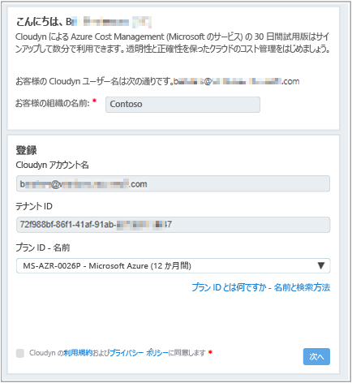
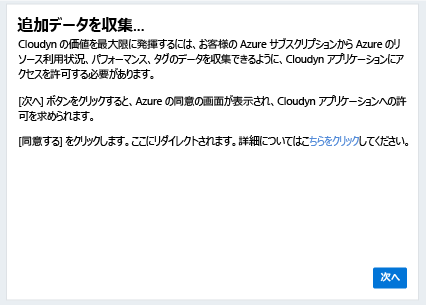
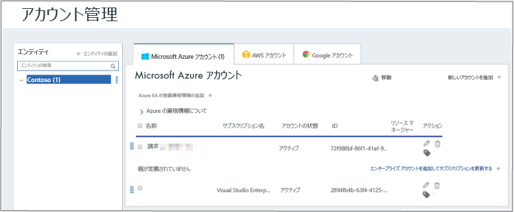

# 個別の Azure サブスクリプションを登録し、コスト データを確認する

Azure サブスクリプションを使用して、Azure Cost Management に登録します。 この登録によって、Cloudyn ポータルにアクセスできるようになります。 このクイック スタートでは、Cloudyn 試用版サブスクリプションの作成に必要な登録プロセスと、Cloudyn ポータルへのサインインについて詳しく説明します。 コスト データの表示を今すぐに開始する方法についても説明します。

## Azure へのサインイン

- Azure Portal (http://portal.azure.com) にサインインします。

## Azure Cost Management に登録する

1. Azure Portal で、サービスの一覧の **[Cost Management + Billing]\(コスト管理 + 課金\)** をクリックします。
2. **[概要]** の **[コスト管理]** をクリックします。  
    
3. **[コスト管理]** ページで **[Go to Cost Management]\(コスト管理に移動\)** をクリックし、新しいウィンドウで [Cloudyn registration]\(Cloudyn 登録\) ページを開きます。
4. [Cloudyn ポータル試用版の登録] ページで、会社名を入力し、**[Azure Individual Subscription Owner]\(Azure サブスクリプションの個人所有者\)** を選択し、**[次へ]** をクリックします。 お使いのアカウント名とテナント ID が、自動的にフォームに追加されます。  
    
5. お使いのサブスクリプションに関連付けられた **[Offer ID - Name]\(オファー ID - 名前\)** を選択します。 お使いのレート ID とサブスクリプションの対応が不明な場合は、Azure の請求書を確認して**オファー ID** を調べることができます。
6. 使用条件に同意し、情報を検証して **[次へ]** をクリックします。
7. **[Gather additional data]\(追加データを収集する\)** ページで、**[次へ]** をクリックし、Cloudyn を承認して Azure リソース データを収集します。 収集されたデータには、お客様のサブスクリプションの使用状況、パフォーマンス、請求、サブスクリプションからのタグ データなどが含まれています。  
    
8. お使いのブラウザーで、Cloudyn のサインイン ページに移動します。 Azure サブスクリプションの資格情報でサインインします。
9. **[Go to Cloudyn]\(Cloudyn に移動\)** をクリックして、Cloudyn ポータルを開くと、**[Accounts Management]\(アカウント管理\)** ページに、Azure サブスクリプション アカウント情報が表示されます。  
    

Azure サブスクリプションの登録に関するチュートリアル ビデオを見るには、[Azure Cost Management で使用するディレクトリ GUID とレート ID の検索](https://youtu.be/PaRjnyaNGMI)に関するページを参照してください。

[!INCLUDE [cost-management-create-account-view-data](../../includes/cost-management-create-account-view-data.md)]

## 次の手順

このクイックスタートでは、Azure のサブスクリプション情報を使用して、Cost Management に登録しました。 また、Cloudyn ポータルにサインインし、コスト データの確認を開始しました。 Azure Cost Management については、Cost Management のチュートリアルで続きを説明します。

> [!div class="nextstepaction"]
> [使用状況とコストを確認する](./tutorial-review-usage.md)
