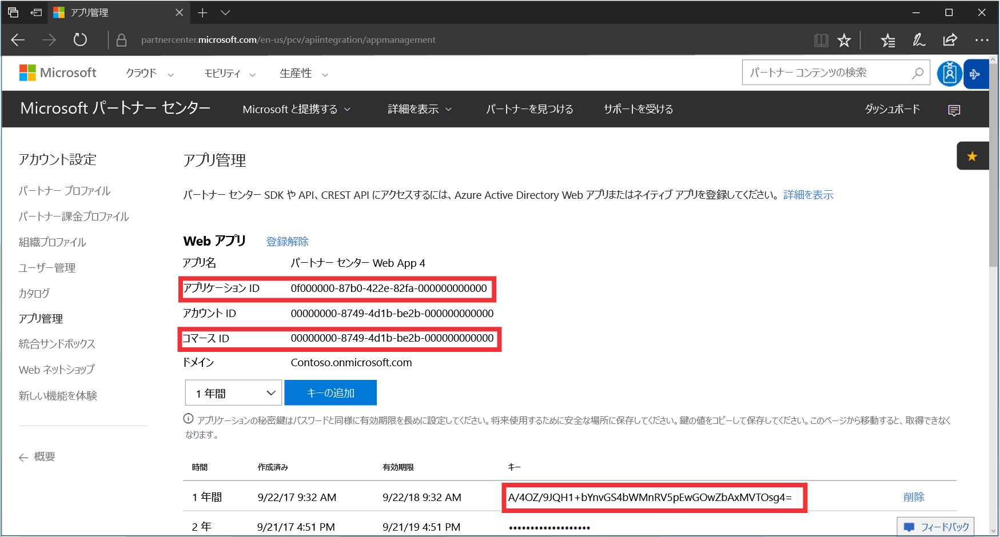
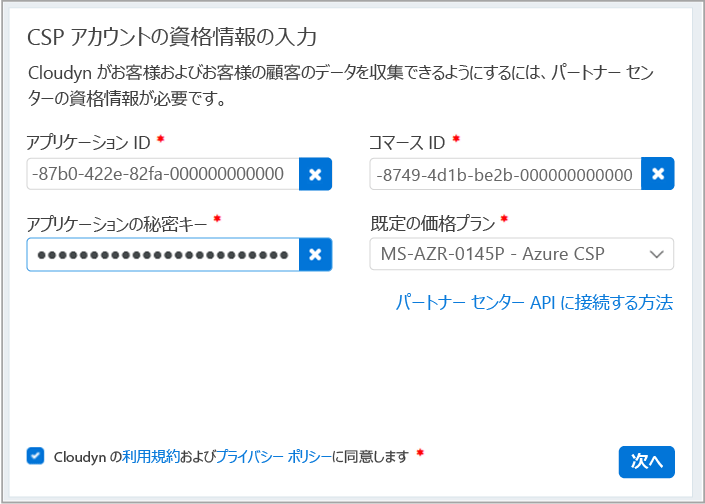

# CSP パートナー プログラムに登録してコスト データを確認する

CSP パートナーであれば、Azure Cost Management に登録できます。 この登録によって、Cloudyn ポータルにアクセスできるようになります。 このクイック スタートでは、Cloudyn 試用版サブスクリプションの作成に必要な登録プロセスと、Cloudyn ポータルへのサインインについて詳しく説明します。 コスト データの表示を今すぐに開始する方法についても説明します。

>[!NOTE]

>Cloudyn 登録を完了できるのは、CSP 直接パートナーと CSP 間接プロバイダーだけです。
>
>認証とデータ アクセスには、パートナー センター API の構成が必要です。 API アクセスをプロビジョニングするには、パートナー センターのグローバル管理者アカウントが必要です。
詳細については、[パートナー センター API への接続](https://msdn.microsoft.com/library/partnercenter/mt709136.aspx)に関する記事を参照してください。
>
>CSP 間接リセラーは、CSP 間接プロバイダーが Cloudyn に登録した後で、Cloudyn にアクセスできるようになります。 その後、CSP 間接リセラーは、Cloudyn アクセスを Azure のお客様とサブスクリプションに提供できます。

## Azure へのサインイン

- Azure Portal ( http://portal.azure.com ) にサインインします。

## Azure Cost Management に登録する

1. Azure Portal で、サービスの一覧の **[Cost Management + Billing]\(コスト管理 + 課金\)** をクリックします。
2. **[概要]** の **[コスト管理]** をクリックします。  
    
3. **[コスト管理]** ページで **[Go to Cost Management]\(コスト管理に移動\)** をクリックし、新しいウィンドウで [Cloudyn registration]\(Cloudyn 登録\) ページを開きます。
4. Cloudyn ポータル試用版登録のページで、会社名を入力し、**[Microsoft CSP Partner Program Administrator]\(Microsoft CSP パートナー プログラム管理者\)** を選択し、**[次へ]** をクリックします。  
5. **[アプリケーション ID]**、**[Commerce ID]\(コマース ID\)**、**[Application Secret key]\(アプリケーションの秘密鍵\)** を入力し、**[Default Pricing Plan]\(既定の料金プラン\)** を選択します。 手元に情報がない場合は、パートナー センター ポータル ([https://partnercenter.microsoft.com](https://partnercenter.microsoft.com)) にプライマリ管理者アカウントでサインインして、次の手順を実行します。
  1. **ダッシュボード**に移動して**設定**の記号をクリックし、**[パートナーの設定]** をクリックして **[アプリの管理]** をクリックします。
  2. 以前に Web アプリを作成したことがある場合は、この手順をスキップします。 作成したことがない場合は、**[Web アプリ]** セクションの **[新規 Web アプリの追加]** をクリックします。
  3. ご自分の Web アプリケーションから、**アプリ ID** の GUID をコピーします。
  4. ご自分の Web アプリケーションから、**Commerce ID** の GUID をコピーします。
  5. キーの有効期間は、必要に応じて、1 年または 2 年を選択します。 **[キーの追加]** を選択し、秘密鍵の値をコピーして保存します。  
    
  6. Cloudyn の登録ページに戻って、情報を貼り付けます。  
      
6. 使用条件に同意し、情報を検証します。 **[次へ]** をクリックし、Cloudyn を承認して Azure リソース データを収集します。 収集されたデータには、お客様のサブスクリプションの使用状況、パフォーマンス、請求、サブスクリプションからのタグ データなどが含まれています。  
7. **[Invite other stakeholders]\(その他の関係者を招待\)** の下に電子メール アドレスを入力することで、ユーザーを追加できます。 完了したら、**[次へ]** をクリックします。 請求データをすべて Cloudyn に追加するには、約 2 時間かかります。
8. **[Go to Cloudyn]\(Cloudyn に移動\)** をクリックして Cloudyn ポータルを開くと、**[Cloud Accounts Management]\(クラウド アカウント管理\)** ページに、登録された CSP アカウント情報が表示されます。

## Cloudyn で間接 CSP アクセスを構成する

既定で Partner Center API は直接 CSP にのみアクセスできます。 ただし、直接 CSP プロバイダーは、Cloudyn のエンティティ グループを使用して、間接 CSP 顧客またはパートナーのアクセスを構成できます。

間接 CSP 顧客またはパートナーのアクセスを有効にするには、「[試用版の登録を作成する](#create-a-trial-registration)」の手順に従って試用版の登録を設定します。 次に、以下の手順を完了して、Cloudyn エンティティ グループを使用して間接 CSP データをセグメント化します。 次に、エンティティ グループに適切なユーザーのアクセス許可を割り当てます。

1. [エンティティの作成](tutorial-user-access.md#create-and-manage-entities)に関する情報を参照して、エンティティ グループを作成します。
2. 「[Assigning subscriptions to Cost Entities](https://support.cloudyn.com/hc/en-us/articles/115005139425-Video-Assigning-subscriptions-to-Cost-Entities)」(サブスクリプションをコスト エンティティに割り当てる) の手順に従って実行します。 間接 CSP 顧客のアカウントとその Azure サブスクリプションを、以前に作成したエンティティに関連付けます。
3. 「[Create a user with admin access](tutorial-user-access.md#create-a-user-with-admin-access)」(管理者アクセス権をユーザーを作成する) の手順に従って、管理者アクセス権を使用してユーザー アカウントを作成します。 次に、間接アカウント用に以前に作成した特定のエンティティに対して、ユーザー アカウントが管理者アクセス権を持っていることを確認します。

間接 CSP パートナーは、パートナー用に作成されたアカウントを使用して Cloudyn ポータルにサインインします。

[!INCLUDE [cost-management-create-account-view-data](../../includes/cost-management-create-account-view-data.md)]

## 次の手順

このクイックスタートでは、CSP 情報を使用して、Cost Management に登録しました。 また、Cloudyn ポータルにサインインし、コスト データの確認を開始しました。 Azure Cost Management については、Cost Management のチュートリアルで続きを説明します。

> [!div class="nextstepaction"]
> [使用状況とコストを確認する](./tutorial-review-usage.md)
