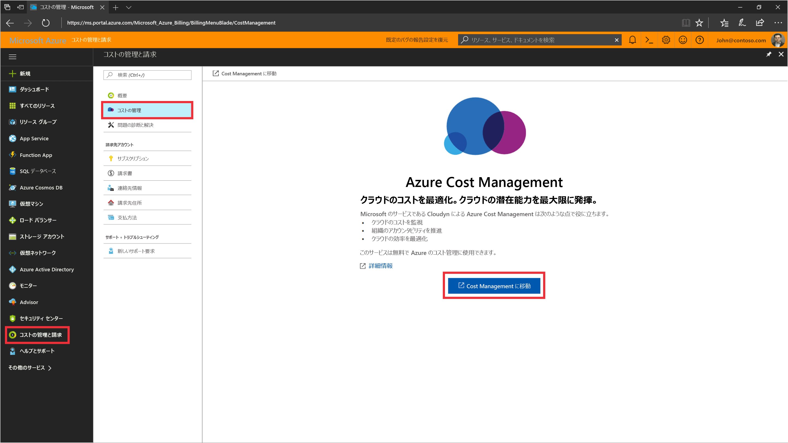
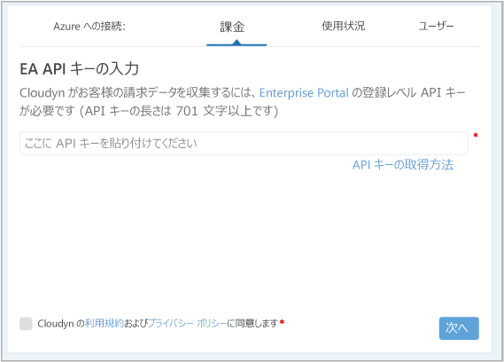

# Azure エンタープライズ契約を登録してコスト データを表示する

Azure エンタープライズ契約を使用して、Azure Cost Management に登録します。 この登録によって、Cloudyn ポータルにアクセスできるようになります。 このクイック スタートでは、Cloudyn 試用版サブスクリプションの作成に必要な登録プロセスと、Cloudyn ポータルへのサインインについて詳しく説明します。 コスト データの表示を今すぐに開始する方法についても説明します。

## Azure にログインする

- Azure Portal (http://portal.azure.com) にログインします。

## Azure Cost Management に登録する

1. Azure Portal で、サービスの一覧の **[Cost Management + Billing]\(コスト管理 + 課金\)** をクリックします。
2. **[概要]** の **[コスト管理]** をクリックします。  
    
3. **[コスト管理]** ページで **[コスト管理に移動]** をクリックします。新しいウィンドウに Cloudyn 登録ページが開きます。
4. Cloudyn ポータルの試用登録ページで、会社名を入力し、**[Azure Enterprise Enrollment Administrator]\(Azure エンタープライズ登録管理者\)** を選択します。  
    
5. エンタープライズ登録の API キーを入力します。 キーが手元にない場合は、[[エンタープライズ ポータル]](https://ea.azure.com) リンクをクリックし、次の手順を実行します。
  1. Azure Enterprise Web サイトにサインインし、**[レポート]** をクリックします。**[API アクセス キー]** をクリックし、主キーをコピーします。  
    
  3. 登録ページに戻って、API キーを貼り付けます。
6. 使用条件に同意し、キーを検証します。 **[次へ]** をクリックし、Cloudyn で Azure リソース データを収集することを承認します。 収集されるデータには、使用状況、パフォーマンス、課金、サブスクリプションのタグ データが含まれます。  
    
7. **[Invite other stakeholders]\(その他の関係者を招待\)** の下に、電子メール アドレスを入力することで、ユーザーを追加できます。 完了したら、**[次へ]** をクリックします。 Azure の登録のサイズによっては、すべての課金データが Cloudyn に追加されるまでに最大 24 時間かかることがあります。
8. **[Cloudyn に移動]** をクリックして、Cloudyn ポータルを開くと、**[Cloud Accounts Management]\(クラウド アカウント管理\)** ページに、登録した EA アカウント情報が表示されます。

Enterprise Agreement の登録に関するチュートリアル ビデオを見るには、[Azure Cost Management で使用する EA 登録 ID と API キーの検索方法](https://youtu.be/u_phLs_udig)に関するページを参照してください。

[!INCLUDE [cost-management-create-account-view-data](../../includes/cost-management-create-account-view-data.md)]

## 次の手順

このクイック スタートでは、Azure エンタープライズ契約情報を使用して、Cost Management に登録しました。 また、Cloudyn ポータルにサインインし、コスト データの確認を開始しました。 Azure Cost Management については、Cost Management のチュートリアルで続きを説明します。

> [!div class="nextstepaction"]
> [使用状況とコストを確認する](./tutorial-review-usage.md)
