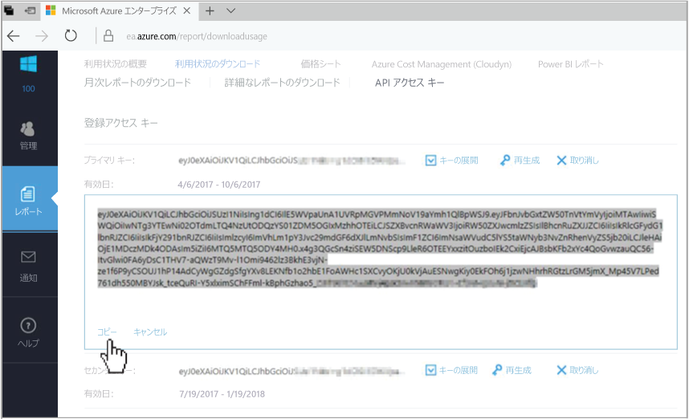
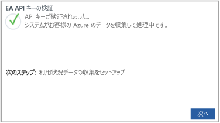

# Azure エンタープライズ契約を登録してコスト データを表示する

エンタープライズ契約を使用して、Cloudyn に登録します。 この登録によって、Cloudyn ポータルにアクセスできるようになります。 このクイック スタートでは、Cloudyn 試用版サブスクリプションの作成に必要な登録プロセスと、Cloudyn ポータルへのサインインについて詳しく説明します。 コスト データの表示を今すぐに開始する方法についても説明します。

Azure Cost Management には Cloudyn と同様の機能があります。 Azure Cost Management は、Azure のネイティブのコスト管理ソリューションです。 このソリューションにより、コストを分析し、予算を作成して管理し、データをエクスポートし、最適化のための推奨事項を検討して対処することで、費用を節約できます。 詳細については、「[Azure Cost Management](overview-cost-mgt.md)」を参照してください。

## Azure へのサインイン

- Azure Portal ( https://portal.azure.com ) にサインインします。

## Cloudyn に登録する

1. Azure Portal で、サービスの一覧の **[Cost Management + Billing]\(コスト管理 + 課金\)** をクリックします。
2. **[概要]** の **[Cloudyn]** をクリックします｡  
    ![Azure portal に表示される [Cloudyn] ページ](./media/quick-register-ea/cost-mgt-billing-service.png)
3. **[Cloudyn]** ページで **[Cloudyn に移動]** をクリックします。新しいウィンドウで Cloudyn 登録ページが開きます。
4. Cloudyn ポータルの試用登録ページで、会社名を入力し、**[Azure Enterprise Enrollment Administrator]\(Azure エンタープライズ登録管理者\)** を選択します。  
5. エンタープライズ登録の API キーを入力します。 キーが手元にない場合は、[[エンタープライズ ポータル]](https://ea.azure.com) リンクをクリックし、次の手順を実行します。  
    ![[課金] タブで、API キーを貼り付けます](./media/quick-register-ea/trial-reg.png)
  1. Azure Enterprise Web サイトにサインインし、**[レポート]** をクリックします。**[API アクセス キー]** をクリックし、主キーをコピーします。  
    
  3. 登録ページに戻って、API キーを貼り付けます。
6. 使用条件に同意し、キーを検証します。 **[次へ]** をクリックし、Cloudyn で Azure リソース データを収集することを承認します。 収集されたデータには、お客様のサブスクリプションの使用状況、パフォーマンス、請求、サブスクリプションからのタグ データなどが含まれています。  
    
7. **[Invite other stakeholders]\(その他の関係者を招待\)** の下に電子メール アドレスを入力することで、ユーザーを追加できます。 完了したら、**[次へ]** をクリックします。 Azure の登録のサイズによっては、すべての課金データが Cloudyn に追加されるまでに最大 24 時間かかることがあります。
8. **[Cloudyn に移動]** をクリックして、Cloudyn ポータルを開くと、**[Cloud Accounts Management]\(クラウド アカウント管理\)** ページに、登録した EA アカウント情報が表示されます。

エンタープライズ契約の登録に関するチュートリアル ビデオを見るには、「[Cloudyn で使用する EA 登録 ID と API キーを見つける方法](https://youtu.be/u_phLs_udig)」を参照してください。

[!INCLUDE [cost-management-create-account-view-data](../../includes/cost-management-create-account-view-data.md)]

## 次の手順

このクイック スタートでは、Azure エンタープライズ契約情報を使用して、Cloudyn に登録しました。 また、Cloudyn ポータルにサインインし、コスト データの確認を開始しました。 Cloudyn に関する詳細は、Cloudyn のチュートリアルに進んでください。

> [!div class="nextstepaction"]
> [使用状況とコストを確認する](./tutorial-review-usage.md)
