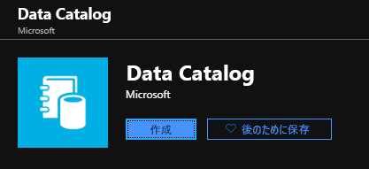
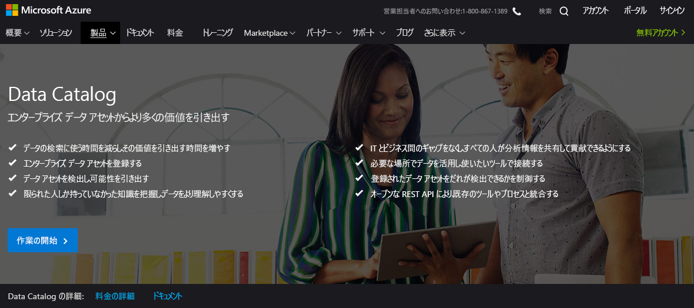
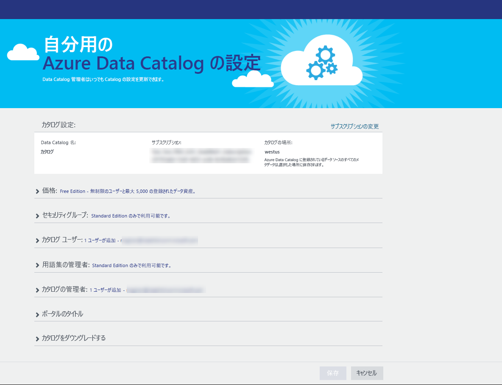
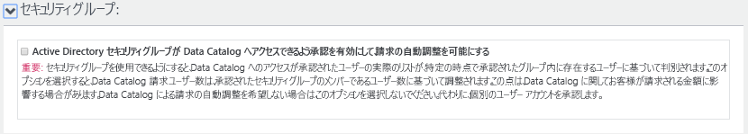
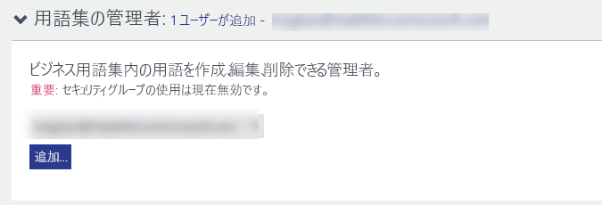
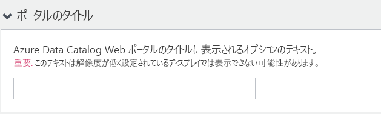
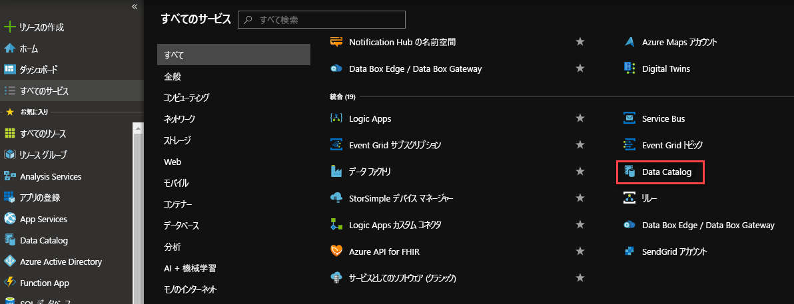
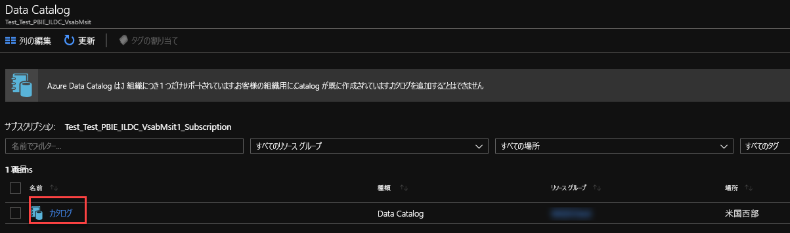
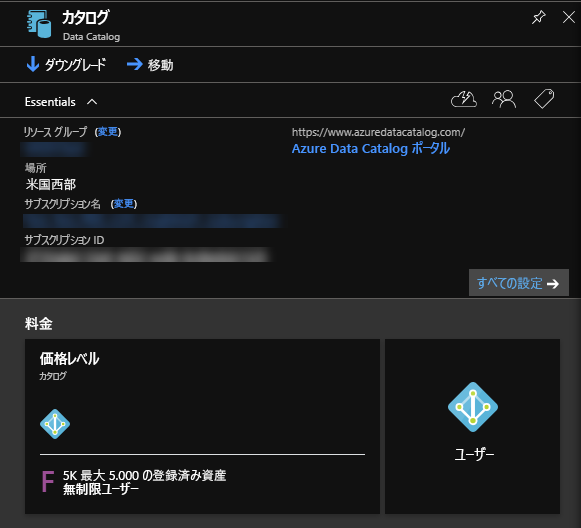
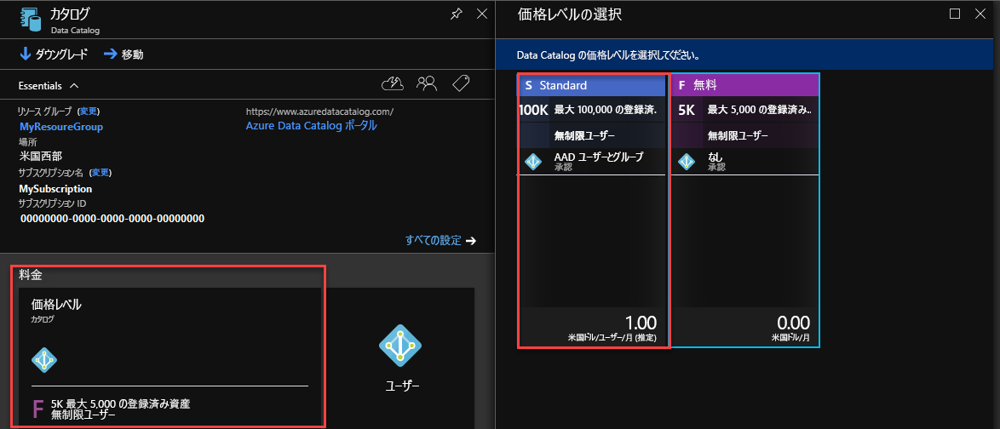

# クイック スタート:Azure データ カタログを作成する

Azure Data Catalog は、フル マネージドのクラウド サービスで、エンタープライズ データ資産の登録システムと検出システムとして機能します。 詳細については、「 [Azure Data Catalog とは何ですか](overview.md)」を参照してください。

このクイック スタートでは、Azure Data Catalog の作成の開始を支援します。

Azure サブスクリプションがない場合は、開始する前に[無料アカウント](https://azure.microsoft.com/free/?WT.mc_id=A261C142F)を作成してください。

## 前提条件

> [!Note]
> Azure のセキュリティ要件により、Azure Data Catalog にはトランスポート層セキュリティ (TLS) 1.2 が適用されています。 TLS 1.0 と TLS 1.1 が無効になっています。 コンピューターが TLS 1.2 用に更新されていない場合、登録ツールの実行中にエラーが発生することがあります。 TLS 1.2 用にコンピューターを更新するには、[Transport Layer Security (1.2) の有効化](https://docs.microsoft.com/mem/configmgr/core/plan-design/security/enable-tls-1-2)に関するページを参照してください。

開始するには、以下が必要です。

* [Microsoft Azure](https://azure.microsoft.com/) サブスクリプション。
* 自分の [Azure Active Directory テナント](../active-directory/fundamentals/active-directory-access-create-new-tenant.md)を用意する必要があります。

Data Catalog をセットアップするには、Azure サブスクリプションの所有者または共同所有者であることが必要です。

## データ カタログの作成

組織 (Azure Active Directory ドメイン) ごとにプロビジョニングできるデータ カタログは 1 つだけです。 そのため、この Azure Active Directory ドメインに属している、Azure サブスクリプションの所有者または共同所有者が既にカタログを作成している場合、複数の Azure サブスクリプションを所有していても、もう一度カタログを作成することはできません。 データ カタログが Azure Active Directory ドメイン内のユーザーによって作成されているかどうかをテストするには、 [Azure Data Catalog ホーム ページ](http://azuredatacatalog.com) に移動し、カタログが表示されるかどうかを確認してください。 カタログが既に作成されている場合は、以下の手順をスキップし、次のセクションに進んでください。

1. [Azure portal](https://portal.azure.com) >  **[リソースの作成]** の順に移動し、 **[データ カタログ]** を選択します。

    

2. データ カタログの**名前**、使用する**サブスクリプション**、カタログの**場所**、および**価格レベル**を指定します。 **[作成]** を選択します。

3. [Azure Data Catalog ホーム ページ](http://azuredatacatalog.com) に移動し、 **[データの発行]** をクリックします。

   

   [Data Catalog サービス ページ](https://azure.microsoft.com/services/data-catalog)で **[はじめる]** を選択して、Data Catalog ホーム ページに移動することもできます。

   

4. **[設定]** ページに移動します。

    

5. **[価格]** を展開し、Azure Data Catalog の**エディション** (Free または Standard) を確認します。

    

6. 価格レベルとして *Standard* エディションを選択した場合は、 **[セキュリティ グループ]** を展開し、Active Directory セキュリティ グループが Data Catalog にアクセスできるように承認を有効にしたり、請求の自動調整を有効にしたりすることができます。

    

7. **[カタログ ユーザー]** を展開し、 **[追加]** をクリックしてデータ カタログのユーザーを追加します。 自身はこのグループに自動的に追加されます。

    

8. 価格レベルとして *Standard* エディションを選択した場合は、 **[用語集の管理者]** を展開し、 **[追加]** をクリックして、用語集の管理者ユーザーを追加できます。 自身はこのグループに自動的に追加されます。

    

9. **[カタログの管理者]** を展開し、 **[追加]** をクリックしてデータ カタログの他の管理者を追加します。 自身はこのグループに自動的に追加されます。

    

10. **[ポータルのタイトル]** を展開し、ポータルのタイトルに表示されるテキストを追加します。

    

11. **[設定]** ページの作業を完了したら、 **[発行]** ページに移動します。

    

## Azure ポータルでのデータ カタログの検索

1. Web ブラウザーの別のタブまたは別の Web ブラウザー ウィンドウで、 [Azure Portal](https://portal.azure.com) に移動し、前の手順でデータ カタログを作成する際に使用したのと同じアカウントでサインインします。

2. **[すべてのサービス]** を選択し、 **[Data Catalog]** をクリックします。

    

    作成したデータ カタログが表示されます。

    

3. 作成したカタログをクリックします。 ポータルに **[Data Catalog]** ブレードが表示されます。

   

4. データ カタログのプロパティが表示され、更新することができます。 たとえば、 **[価格レベル]** をクリックし、エディションを変更します。

    

## 次のステップ

このクイック スタートでは、組織の Azure Data Catalog を作成する方法を学習しました。 これで、データ カタログにデータ ソースを登録できるようになりました。

> [!div class="nextstepaction"]
> [Azure Data Catalog でのデータ ソースの登録](data-catalog-how-to-register.md)
