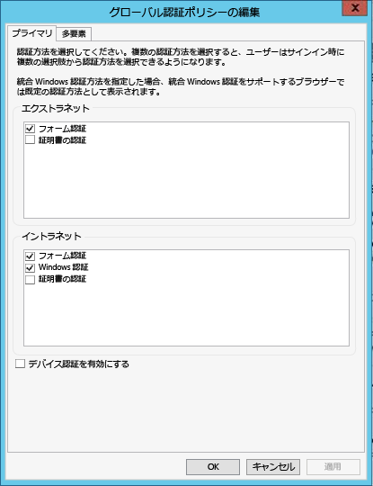

# Azure Data Catalog の前提条件

Azure Data Catalog をセットアップする前に、いくつかのことに注意する必要があります。 このプロセスにはそれほど時間はかからないので、ご安心ください。

## Azure サブスクリプション
Data Catalog をセットアップするには、Azure サブスクリプションの所有者または共同所有者であることが必要です。

Azure サブスクリプションは、Data Catalog のようなクラウド サービス リソースへのアクセスを整理するために役立ちます。 さらに、リソースの使用状況の報告、課金、および支払い方法の制御にも役立ちます。 サブスクリプションごとに異なる課金および支払いを設定することができるため、部門別、プロジェクト別、支社別などで、異なるサブスクリプションやプランを利用することができます。 すべてのクラウド サービスがサブスクリプションに属しているため、Data Catalog をセットアップする前に、サブスクリプションが必要です。 詳細については、 [アカウント、サブスクリプション、管理ロールの管理](../active-directory/users-groups-roles/directory-assign-admin-roles.md)に関するページを参照してください。

## Azure Active Directory
Data Catalog をセットアップするには、Azure Active Directory (Azure AD) ユーザー アカウントでサインインする必要があります。

Azure AD は、企業がクラウドとオンプレミス環境の両方で ID とアクセスを簡単に管理できるサービスです。 ユーザーは、任意のクラウドおよびオンプレミス Web アプリケーションへのシングル サインインのために、1 つの職場または学校アカウントを使用できます。 Data Catalog は、Azure AD を使用してサインインを認証します。 詳細については、「[Azure Active Directory とは](../active-directory/fundamentals/active-directory-whatis.md)」を参照してください。

> [!NOTE]
> [Azure Portal](http://portal.azure.com/) を使用すると、個人の Microsoft アカウント、または Azure Active Directory の職場や学校のアカウントを使用してサインインできます。 Azure Portal または [Data Catalog ポータル](http://www.azuredatacatalog.com) を使用して Data Catalog を設定するには、個人用アカウントではなく、Azure Active Directory アカウントを使用してサインインする必要があります。
>
>

## Active Directory ポリシーの構成
Data Catalog ポータルにはサインインできるものの、データ ソース登録ツールにサインインしようとするとエラー メッセージが表示され、サインインできないという状況に直面することがあります。 このエラー動作は、企業ネットワーク上にいる場合、または企業ネットワークの外部から接続している場合にのみ発生することがあります。

データ ソース登録ツールは、フォーム認証を使用して、Active Directory に対するユーザーの資格情報を検証します。 サインインを成功させるためには、Active Directory 管理者が、グローバル認証ポリシーでフォーム認証を有効にする必要があります。

グローバル認証ポリシーでは、次のスクリーンショットに示すように、イントラネット接続とエクストラネット接続で個別に認証を有効にすることができます。 サインイン エラーは、接続元のネットワークで、フォーム認証が有効にされていない場合に発生する可能性があります。

 

## 次の手順
詳細については、「 [認証ポリシーの構成](https://technet.microsoft.com/library/dn486781.aspx)」を参照してください。
