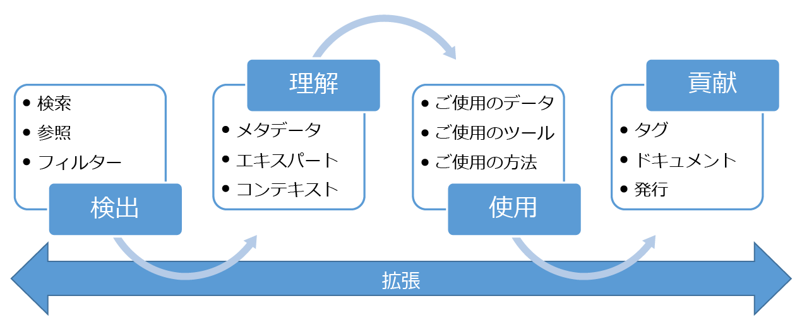

# Azure Data Catalog とは何ですか

Azure Data Catalog は、フル マネージド クラウド サービスです。 ユーザーは必要なデータ ソースを発見し、発見したデータ ソースを理解することができます。 同時に、Data Catalog は、組織が既存の投資からより多くの価値を引き出すことを支援します。

Data Catalog を使用すると、すべてのユーザー (アナリスト、データ サイエンティスト、または開発者) が、データ ソースを検出し、理解して利用することができます。 Data Catalog には、メタデータと注釈のクラウド ソーシング モデルが含まれています。 それは、組織のすべてのユーザーが、自分の知識を共有し、データのコミュニティとカルチャを構築するための単一の中心となる場所です。

## データの利用者にとっての検出の難しさ

従来、エンタープライズ データ ソースの検出は、仲間の知識に基づいた組織的プロセスでした。 自社の情報資産から最大の価値を引き出すことを望んでいる企業にとって、この方法には多数の課題が伴っています。

* 別のプロセスの一部としてたまたま発見するまで、データ ソースが存在することに気付かないことがあります。 データ ソースを登録する中心的な場所はありません。
* データ ソースの場所を知らない限り、クライアント アプリケーションを使用してデータに接続することができません。 データを利用するには、接続文字列またはパスを知っている必要があります。
* データ ソースのドキュメントの場所を知らない限り、データの使用目的を理解することができません。 データ ソースとドキュメントはさまざまな場所に存在し、さまざまな方法で利用されることがあります。
* 情報資産について疑問がある場合、データを担当している専門家またはチームを見つけて、オフラインで接触する必要があります。 データとその使用に関する分析観点を持っているエキスパートとの間に明確なつながりは存在しません。
* データ ソースへのアクセスを要求するプロセスを理解しない限り、データ ソースとそのドキュメントを検出できても、必要なデータにアクセスすることはできません。

## データの作成者にとっての検出の難しさ

データの利用者が直面する課題は前述のとおりですが、情報資産の作成と保守を担当するユーザーも固有の課題を抱えています。

* 記述メタデータを使用してデータ ソースに注釈を付けることは、多くの場合、報われない努力になります。 通常、クライアント アプリケーションは、データ ソースに格納されている説明を無視します。
* データ ソースのドキュメントの作成は、多くの場合、報われない努力になります。 ドキュメントをデータ ソースと同期させることは、継続的な責務です。 最新でないものとして認識されたドキュメントはユーザーに信頼されない可能性があります。
* データ ソースのドキュメントの作成と管理は、複雑で時間がかかる仕事です。 データ ソースを使用するすべてのユーザーがドキュメントを利用できるように準備することは、この仕事をさらに困難にする可能性があります。
* データ ソースへのアクセスを制限し、データの利用者がアクセス権の要求方法を確実に理解するようにすることは、いまだに解決されていない課題です。

複雑に絡み合うこれらの課題は、エンタープライズ データの利用と理解を推奨し促進することを望んでいる企業にとって、大きな障壁となっています。

## Azure Data Catalog が解決するもの

Data Catalog はこれまでに述べた問題の解決を目指して設計されており、企業は、Data Catalog によって、既存の情報資産から最大の価値を引き出すことができます。 Data Catalog は、データを管理しているユーザーが、データ ソースを容易に検出し、把握できるようにします。

Data Catalog は、データ ソースを登録できるクラウドベースのサービスを提供しています。 データは元の場所に残りますが、メタデータのコピーと、データ ソースの場所に対する参照が Data Catalog に追加されます。 このメタデータのインデックスも作成されるので、検索で簡単に各データ ソースを見つけられるようになり、データ ソースを検出するユーザーが理解しやすくなります。

データ ソースを登録すると、そのメタデータを強化できるようになります。 メタデータは、それを登録したユーザーまたは社内の他のユーザーが追加することができます。 すべてのユーザーが、記述、タグ、その他のメタデータ (ドキュメントやデータ ソースへのアクセス要求のプロセスなど) を指定してデータ ソースに注釈を設定できます。 この記述メタデータによって、データ ソースから登録される構造メタデータ (列名やデータ型など) が補足されます。

データ ソースとその用途の検出することは、ソースの登録の主な目的です。 企業ユーザーは、ビジネス インテリジェンス、アプリケーション開発、データ サイエンス、または適切なデータが必要な他のタスクを行うためにデータを必要とすることがあります。 これらのユーザーは、Data Catalog の検出機能を使用して、各自のニーズを満たすデータをすぐに見つけ出し、データを理解してそれが目的に適合するかどうかを評価し、各自が選択したツールでデータ ソースを開いてデータを利用することができます。 

同時に、ユーザーは、登録されているデータ ソースに対してタグ付けやドキュメント作成、注釈付けを行うことで、カタログを充実させることができます。 ユーザーは、新しいデータ ソースを登録することもできます。このデータ ソースを、カタログ ユーザーのコミュニティで検出し、理解し、利用することができます。

## Data Catalog についてさらに理解を深める

Data Catalog の機能の詳細については、以下のページを参照してください。

* [データ ソースの登録方法](data-catalog-how-to-register.md)
* [データ ソースの探索方法](data-catalog-how-to-discover.md)
* [データ ソースに注釈を付ける方法](data-catalog-how-to-annotate.md)
* [データ ソースの文書化の方法](data-catalog-how-to-documentation.md)
* [データ ソースへの接続方法](data-catalog-how-to-connect.md)
* [ビッグ データを操作する方法](data-catalog-how-to-big-data.md)
* [データ資産を管理する方法](data-catalog-how-to-manage.md)
* [ビジネス用語集を設定する方法](data-catalog-how-to-business-glossary.md)
* [よく寄せられる質問](data-catalog-frequently-asked-questions.md)

## 次のステップ

Data Catalog の使用を開始するには:

* [クイック スタート: Azure データ カタログを作成する](data-catalog-get-started.md)
* [Azure Data Catalog を開く](https://www.azuredatacatalog.com)