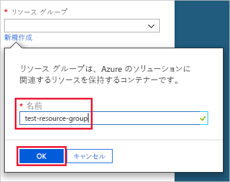
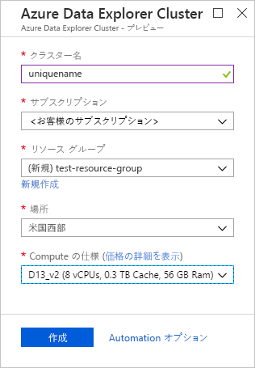
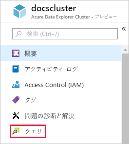
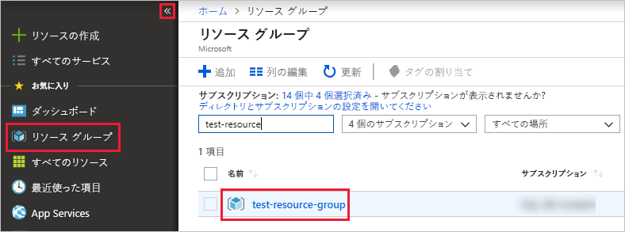

# クイック スタート: Azure Data Explorer クラスターとデータベースを作成する

Azure Data Explorer は、ログと利用統計情報データのための高速で拡張性に優れたデータ探索サービスです。 Azure Data Explorer を使用するには、最初に "*クラスター*" を作成し、そのクラスター内に 1 つまたは複数の "*データベース*" を作成します。 その後、クエリを実行できるように、データをデータベースに "*取り込み*" (読み込み) ます。 このクイック スタートでは、クラスターとデータベースを 1 つずつ作成します。 データを取り込む方法は、後の記事で示します。

Azure サブスクリプションをお持ちでない場合は、開始する前に[無料の Azure アカウント](https://azure.microsoft.com/free/)を作成してください。

## Azure ポータルにサインインします。

[Azure Portal](https://portal.azure.com/) にサインインします。

## クラスターの作成

コンピューティング リソースとストレージ リソースの定義済みセットを使って、Azure リソース グループ内に Azure Data Explorer クラスターを作成します。

1. ポータルの左上隅にある **[リソースの作成]** ボタン (+) を選択します。

1. *Azure Data Explorer* を検索します。

   

1. **[Azure Data Explorer]** で、画面の下部にある **[作成]** を選択します。

1. クラスターの一意名を入力し、サブスクリプションを選択して、*test-resource-group* という名前のリソース グループを作成します。

    

1. フォームに次の情報を入力します。

   

    **設定** | **推奨値** | **フィールドの説明**
    |---|---|---|
    | クラスター名 | 一意のクラスター名 | クラスターを識別する一意の名前を選択します。 たとえば、*mytestcluster* などです。 指定したクラスター名に、ドメイン名 *[region].kusto.windows.net* が付加されます。 名前に使用できるのは、小文字と数字だけです。 3 文字以上 22 文字以内にする必要があります。
    | サブスクリプション | 該当するサブスクリプション | クラスターに使用する Azure サブスクリプションを選択します。|
    | リソース グループ | *test-resource-group* | 新しいリソース グループを作成します。 |
    | Location | *[米国西部]* | このクイック スタートでは *[米国西部]* を選択します。 運用システムでは、ニーズに最も適したリージョンを選択します。
    | Compute specification (コンピューティングの仕様) | *D13_v2* | このクイック スタートでは最低価格の仕様を選択します。 実稼働環境システムでは、ニーズに最も適した仕様を選択します。
    | | |

1. **[作成]** を選択して、クラスターをプロビジョニングします。 通常、プロビジョニングには約 10 分かかります。 プロビジョニング プロセスを監視するには、ツール バーの **[通知]** を選択します。

    

1. プロセスが完了したら、**[通知]** を選択し、**[リソースに移動]** を選択します。

    

## データベースを作成する

プロセスの 2 番目のステップであるデータベースの作成を行う準備ができました。

1. **[概要]** タブで **[データベースの作成]** を選択します。

    

1. フォームに次の情報を入力します。

    

    **設定** | **推奨値** | **フィールドの説明**
    |---|---|---|
    | データベース名 | *TestDatabase* | データベース名はクラスター内で一意である必要があります。
    | 保持期間 | *3650* | クエリにデータを使用できることが保証される期間です。 期間は、データが取り込まれた時点から測定されます。
    | Cache period (キャッシュ期間) | *31* | 頻繁にクエリされるデータが長期ストレージではなく SSD ストレージまたは RAM で利用できるように保持される期間です。
    | | | |

1. **[保存]** を選択してデータベースを作成します。 通常、作成にかかる時間は 1 分未満です。 プロセスが完了すると、クラスターの **[概要]** タブに表示が戻ります。

## データベースで基本コマンドを実行する

クラスターとデータベースができたので、クエリとコマンドを実行できます。 まだデータベースにデータは存在しませんが、それでもツールの動作は確認できます。

1. 自分のクラスターで **[クエリ]** を選択します。

    

1. コマンド `.show databases` をクエリ ウィンドウに貼り付けた後、**[実行]** を選択します。

    

    結果セットには、クラスター内の唯一のデータベースである **TestDatabase** が表示されます。

1. コマンド `.show tables` をクエリ ウィンドウに貼り付けた後、ウィンドウでそのコマンドを選択します。 **[実行]** を選択します。

    まだテーブルがないため、このコマンドでは空の結果セットが返されます。 このシリーズの次の記事で、テーブルを追加します。

## クラスターを停止して再起動する

ビジネス ニーズに応じて、クラスターを停止して再起動できます。

1. クラスターを停止するには、**[概要]** タブの上部にある **[停止]** を選択します。

    クラスターを停止すると、データをクエリに使用できず、新しいデータを取り込むことはできません。

1. クラスターを再起動するには、**[概要]** タブの上部にある **[開始]** を選択します。

    クラスターを再起動したとき、利用できるようになるまでに約 10 分かかります (もともとプロビジョンされていたときなど)。 データをホット キャッシュに読み込むにはさらに時間がかかります。  

## リソースのクリーンアップ

他のクイック スタートやチュートリアルを行う場合は、作成したリソースをそのままにします。 行わない場合は、**test-resource-group** をクリーンアップしてコストが発生しないようにします。

1. Azure Portal の左端で **[リソース グループ]** を選択し、作成したリソース グループを選択します。  

    左側のメニューが折りたたまれている場合は、  をクリックして展開します。

   

1. **test-resource-group** で **[リソース グループの削除]** を選択します。

1. 新しいウィンドウで、削除するリソース グループの名前 (*test-resource-group*) を入力し、**[削除]** を選択します。

## 次の手順

> [!div class="nextstepaction"]
> [クイック スタート: イベント ハブから Azure Data Explorer にデータを取り込む](ingest-data-event-hub.md)

