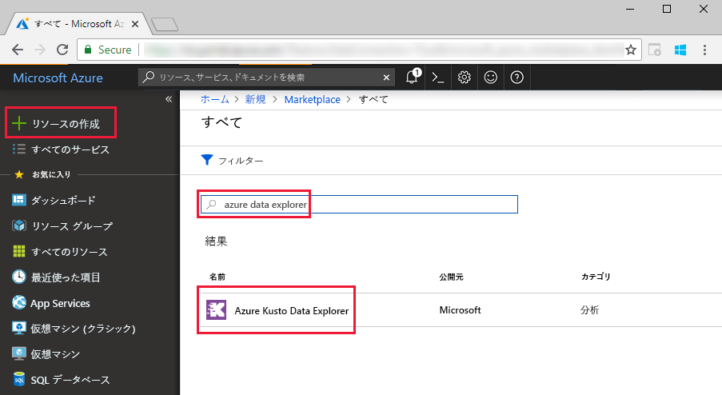
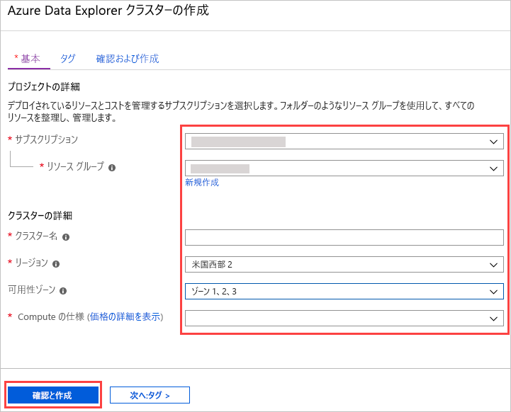
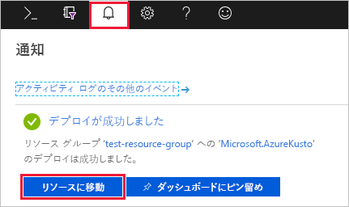
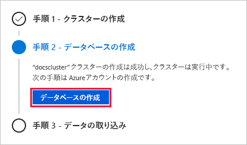
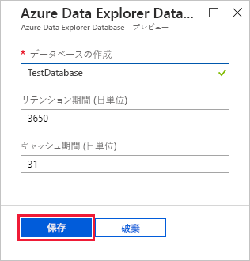
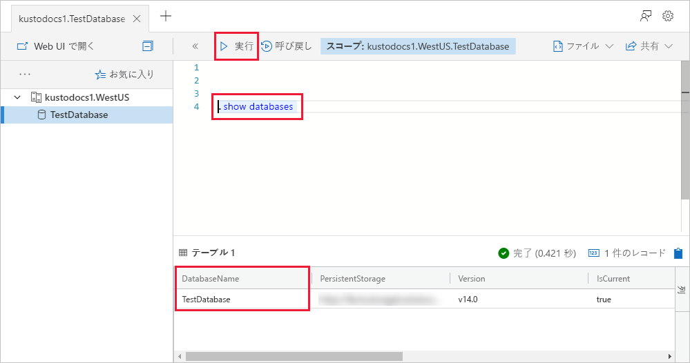

# クイック スタート:Azure Data Explorer クラスターとデータベースを作成する

> [!div class="op_single_selector"]
> * [ポータル](create-cluster-database-portal.md)
> * [CLI](create-cluster-database-cli.md)
> * [PowerShell](create-cluster-database-powershell.md)
> * [C#](create-cluster-database-csharp.md)
> * [Python](create-cluster-database-python.md)
>  

Azure Data Explorer は、ログと利用統計情報データのための高速で拡張性に優れたデータ探索サービスです。 Azure Data Explorer を使用するには、最初にクラスターを作成し、そのクラスター内に 1 つまたは複数のデータベースを作成します。 その後、クエリを実行できるように、データをデータベースに取り込み (読み込み) ます。 このクイック スタートでは、クラスターとデータベースを 1 つずつ作成します。

Azure サブスクリプションをお持ちでない場合は、開始する前に[無料の Azure アカウント](https://azure.microsoft.com/free/)を作成してください。

## Azure portal にサインインします

[Azure Portal](https://portal.azure.com/) にサインインします。

## クラスターの作成

コンピューティング リソースとストレージ リソースの定義済みセットを使って、Azure リソース グループ内に Azure Data Explorer クラスターを作成します。

1. ポータルの左上隅にある **[リソースの作成]** ボタン (+) を選択します。

1. *Azure Data Explorer* を検索します。

   

1. **[Azure Data Explorer]** で、画面の下部にある **[作成]** を選択します。

1. 次の情報を基本クラスターの詳細として入力します。

   

    **設定** | **推奨値** | **フィールドの説明**
    |---|---|---|
    | Subscription | 該当するサブスクリプション | クラスターに使用する Azure サブスクリプションを選択します。|
    | Resource group | 該当するリソース グループ | 既存のリソース グループを使用するか、新しいリソース グループを作成します。 |
    | クラスター名 | 一意のクラスター名 | クラスターを識別する一意の名前を選択します。 指定したクラスター名に、ドメイン名 *[region].kusto.windows.net* が付加されます。 名前に使用できるのは、小文字と数字だけです。 4 文字以上 22 文字以内にする必要があります。
    | リージョン | *米国西部*または*米国西部 2* | このクイックスタートでは、*米国西部*または*米国西部 2* (可用性ゾーンを使用している場合) を選択します。 運用システムでは、ニーズに最も適したリージョンを選択します。
    | 可用性ゾーン | *1*、*2*、および/または *3* | ゾーン冗長がサポートされているリージョンの場合は、インスタンスを配置するゾーンを選択します (省略可能)。 クラスター ノードは、既定で同じデータ センターに作成されます。 同じリージョン内のさまざまな可用性ゾーンにクラスター インスタンスを配置するには、[Azure Availability Zones](/azure/availability-zones/az-overview) を使用します。 複数の可用性ゾーンを選択することで、単一障害点を排除し、高可用性を確保することができます。 
    | Compute specification (コンピューティングの仕様) | *D13_v2* | このクイック スタートでは最低価格の仕様を選択します。 実稼働環境システムでは、ニーズに最も適した仕様を選択します。
    | | |

1. **[確認と作成]** を選択してクラスターの詳細を確認し、 **[作成]** を選択してクラスターをプロビジョニングします。 通常、プロビジョニングには約 10 分かかります。

1. デプロイが完了したら、 **[リソースに移動]** を選択します。

    

## データベースを作成する

プロセスの 2 番目のステップであるデータベースの作成を行う準備ができました。

1. **[概要]** タブで **[データベースの作成]** を選択します。

    

1. フォームに次の情報を入力します。

    

    **設定** | **推奨値** | **フィールドの説明**
    |---|---|---|
    | データベース名 | *TestDatabase* | データベース名はクラスター内で一意である必要があります。
    | 保持期間 | *3650* | クエリにデータを使用できることが保証される期間 (日数) です。 期間は、データが取り込まれた時点から測定されます。
    | Cache period (キャッシュ期間) | *31* | 頻繁にクエリされるデータが、長期ストレージではなく SSD ストレージまたは RAM で利用できるように保持される期間 (日数) です。
    | | | |

1. **[作成]** を選択してデータベースを作成します。 通常、作成にかかる時間は 1 分未満です。 プロセスが完了すると、クラスターの **[概要]** タブに表示が戻ります。

## データベースで基本コマンドを実行する

クラスターとデータベースができたので、クエリとコマンドを実行できます。 まだデータベースにデータは存在しませんが、それでもツールの動作は確認できます。

1. 自分のクラスターで **[クエリ]** を選択します。 `.show databases` コマンドをクエリ ウィンドウに貼り付けた後、 **[実行]** を選択します。

    

    結果セットには、クラスター内の唯一のデータベースである **TestDatabase** が表示されます。

1. `.show tables` コマンドをクエリ ウィンドウに貼り付け、 **[実行]** を選択します。

    まだテーブルがないため、このコマンドでは空の結果セットが返されます。 このシリーズの次の記事で、テーブルを追加します。

## クラスターを停止して再起動する

ビジネス ニーズに応じて、クラスターを停止して再起動できます。

1. クラスターを停止するには、 **[概要]** タブの上部にある **[停止]** を選択します。

    クラスターを停止すると、データをクエリに使用できず、新しいデータを取り込むことはできません。

1. クラスターを再起動するには、 **[概要]** タブの上部にある **[開始]** を選択します。

    クラスターが再起動された場合、(初回のプロビジョニング同様) 利用できるようになるまでに約 10 分かかります。 データをホット キャッシュに読み込むにはさらに時間がかかります。  

## リソースのクリーンアップ

他のクイック スタートやチュートリアルを行う場合は、作成したリソースをそのままにします。 それ以外の場合は、コストの発生を回避するためにリソース グループをクリーンアップします。

1. Azure portal で、左端の **[リソース グループ]** を選択し、自分の Data Explorer クラスターが含まれているリソース グループを選択します。  

1. **[リソース グループの削除]** を選択して、リソース グループ全体を削除します。 既存のリソース グループを使用している場合は、Data Explorer クラスターだけを選択できます。

## 次の手順

> [!div class="nextstepaction"]
> [クイック スタート:イベント ハブから Azure Data Explorer にデータを取り込む](ingest-data-event-hub.md)

