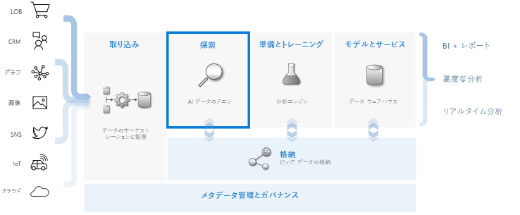
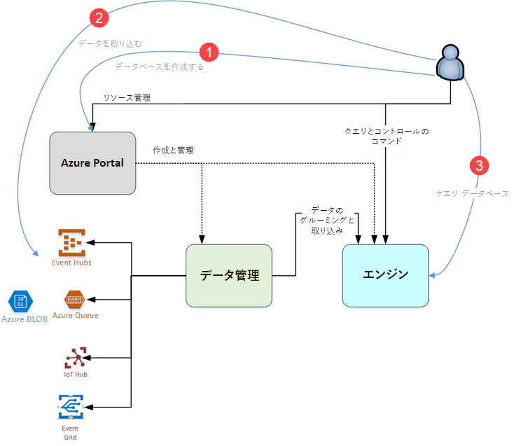

# Azure Data Explorerとは

Azure Data Explorer は、ログと利用統計情報データのための高速で拡張性に優れたデータ探索サービスです。 最新のソフトウェアによって生成される多数のデータ ストリームを処理できるので、データを収集、保存、分析できます。 Azure データ エクスプローラーは、Web サイト、アプリケーション、IoT デバイスなどのデータ ソースの大量の多様なデータの分析に最適です。 このデータは、診断、監視、報告、機械学習、付加的分析の各種機能に利用されます。 Azure Data Explorer を利用することでこのデータの取り込みがシンプルになり、データに対する複雑なクエリやアドホック クエリを数秒で実行できます。

## Azure データ エクスプローラーを唯一無二の存在にしている要素は何ですか?

- テラバイト単位のデータに数分でスケール アップします。データ探索を高速で繰り返し、関連する分析情報を見つけることができます。

- 高性能なデータ分析のために最適化された画期的なクエリ言語を提供します。

- 大量の異種データ (構造化データと非構造化データ) を分析します。

- 他のサービスと組み合わせることで、包括的で対話型の高性能データ分析ソリューションを提供します。それにより、まさに必要としているものを構築し、デプロイすることができます。

## データ ウェアハウスのワークフロー

Azure データ エクスプローラーは他の主要なサービスと統合され、データの収集、取り込み、保管、インデックス作成、クエリ実行、視覚化を含むエンドツーエンド ソリューションを提供します。 テラバイト単位の多様な未加工データでフローの **EXPLORE** ステップを実行することで、データ ウェアハウスにおいて中心的な役割を果たします。

Azure データ エクスプローラーは、イベント ハブなどの一般サービスへの接続、.NET や Python など、SDK を利用したプログラミングによる取り込み、探索目的でのエンジンへの直接アクセスなど、さまざまな取り込み手法に対応しています。 Azure データ エクスプローラーは分析サービスやモデル化サービスと統合され、データをさらに分析したり、視覚化したりできます。

## Azure データ エクスプローラーのフロー

次は、Azure データ エクスプローラーの使用をさまざまな側面から見た図です。

Azure データ エクスプローラーの使用は一般的に次のパターンに従います。

1. **データベースの作成:** *クラスター*を作成し、そのクラスターで 1 つまたは複数の*データベース*を作成します。 [クイック スタート: Azure データ エクスプローラー クラスターとデータベースを作成する](create-cluster-database-portal.md)

1. **データの取り込み:** クエリを実行できるように、データをデータベース テーブルに読み込みます。 [クイック スタート: イベント ハブから Azure Data Explorer にデータを取り込む](ingest-data-event-hub.md)

1. **クエリ データベース:** Microsoft の Web アプリケーションを使用し、クエリを実行して結果を確認し、共有します。 これは Azure portal で利用できます。また、スタンドアロン アプリケーションとして利用できます。 さらに、(SDK を利用して) プログラミングでクエリを送信したり、REST API エンドポイントにクエリを送信したりできます。 [クイック スタート: Azure データ エクスプローラーでデータのクエリを実行する](web-query-data.md)

## クエリの利用

Azure データ エクスプローラーのクエリは読み取り専用の要求であり、データを処理し、その処理の結果を返します。データやメタデータが修正されることはありません。 分析を完了するまでクエリの微調整を続けます。 このプロセスは、Azure Data Explorer を利用してアドホック クエリを非常に速く実行できるようになるため、簡単になります。

Azure データ エクスプローラーでは、大量の構造化データ、半構造化データ (JSON に似た、入れ子にされた型)、非構造化データ (フリーテキスト) が等しく処理されます。 特定のテキスト語句を検索したり、特定のイベントを見つけたり、構造化データにメトリックスタイルの計算を実行したりできます。 Azure データ エクスプローラーは、自由形式のテキスト フィールドから実行時に値を抽出することで、構造化されていないテキスト ログの領域と構造化されている数字や次元の領域の橋渡しとなります。 データ探索は、高速のテキスト インデックス作成、列ストア、時系列操作を組み合わせることで簡素化されます。

Azure Data Explorer の機能は、[Azure Monitor ログ](/azure/log-analytics/)、[Application Insights](/azure/application-insights/)、[Time Series Insights](/azure/time-series-insights/)、[Windows Defender Advanced Threat Protection](/windows/security/threat-protection/windows-defender-atp/windows-defender-advanced-threat-protection/) など、その高性能なクエリ言語を基盤に構築された他のサービスにより拡張されます。

## フィードバック

Azure データ エクスプローラーとそのクエリ言語に関するフィードバックをお待ちしております。次の方法をご利用ください。

- 質問する
  - [Stack Overflow](https://stackoverflow.com/questions/tagged/azure-data-explorer)
  - [Microsoft Tech Community](https://techcommunity.microsoft.com/t5/Azure-Data-Explorer/bd-p/Kusto)
  - [MSDN](https://social.msdn.microsoft.com/Forums/en-US/home?forum=AzureKusto)
- [ユーザーの声で製品について提案する](https://aka.ms/AzureDataExplorer.UserVoice)

## 次のステップ

[クイック スタート: Azure データ エクスプローラー クラスターとデータベースを作成する](create-cluster-database-portal.md)

[クイック スタート: イベント ハブから Azure Data Explorer にデータを取り込む](ingest-data-event-hub.md)

[クイック スタート: Azure データ エクスプローラーでデータのクエリを実行する](web-query-data.md)
