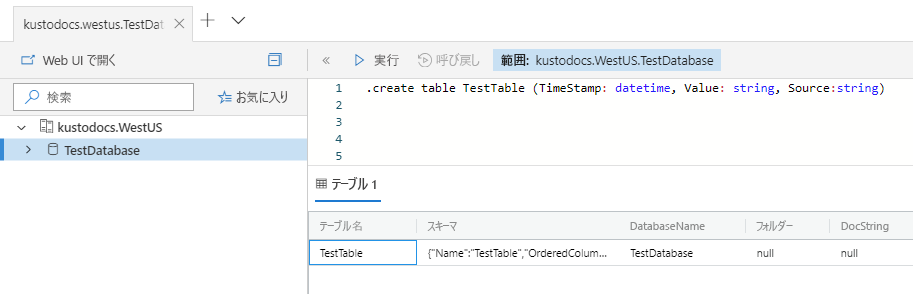
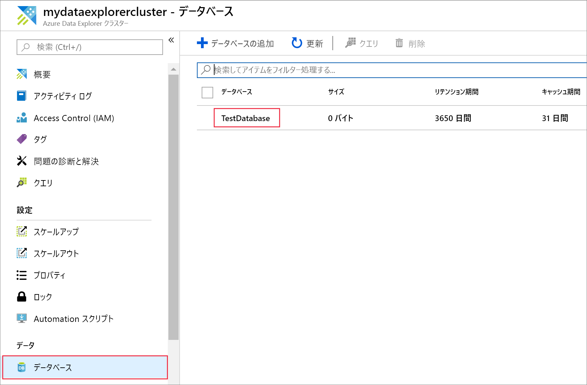
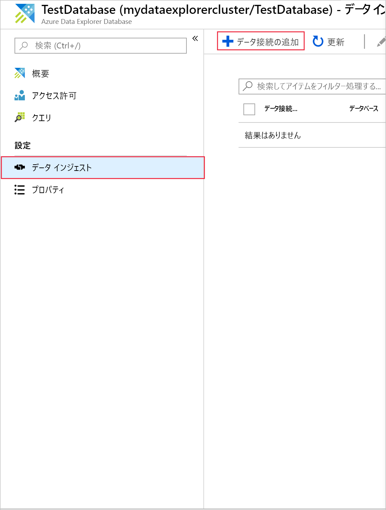
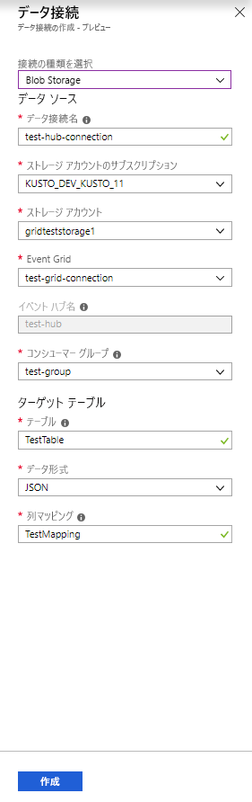
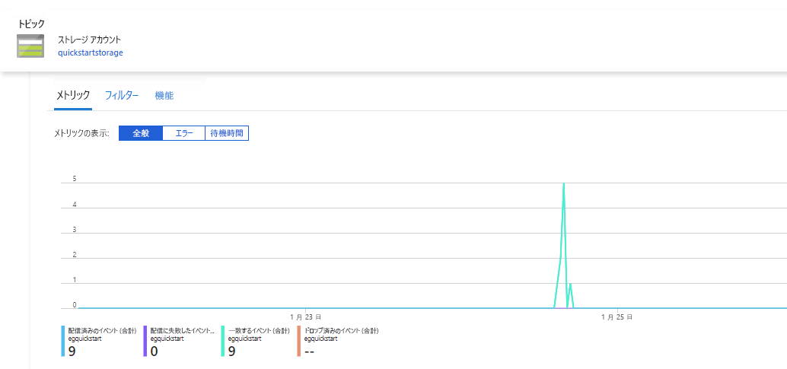
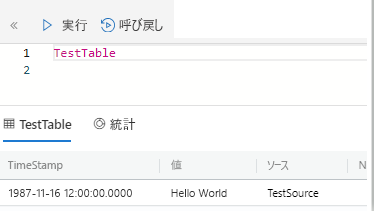
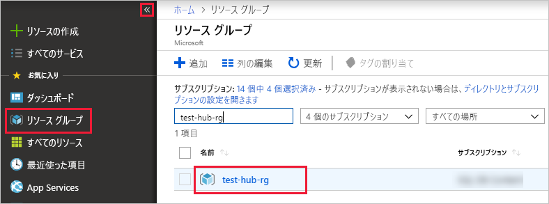

# <a name="ingest-blobs-into-azure-data-explorer-by-subscribing-to-event-grid-notifications"></a>Event Grid の通知をサブスクライブすることで Azure Data Explorer に BLOB を取り込む

Azure Data Explorer は、ログと利用統計情報のための高速でスケーラブルなデータ探索サービスです。 BLOB コンテナーに書き込まれた BLOB からの継続的な取り込み (データの読み込み) を実行できます。 

この記事では、[Azure Event Grid](/azure/event-grid/overview) サブスクリプションの設定方法、およびイベント ハブを使用して Azure Data Explorer にイベントをルーティングする方法について説明します。 まずは、Azure Event Hubs に通知を送信する イベント グリッド サブスクリプションを持つストレージ アカウントが必要です。 次に、Event Grid データ接続を作成して、システム全体のデータ フローを確認します。

## <a name="prerequisites"></a>前提条件

* Azure サブスクリプション。 [無料の Azure アカウント](https://azure.microsoft.com/free/)を作成します。
* [クラスターとデータベース](create-cluster-database-portal.md)。
* [ストレージ アカウント](https://docs.microsoft.com/azure/storage/common/storage-quickstart-create-account?tabs=azure-portal)。
* [イベント ハブ](https://docs.microsoft.com/azure/event-hubs/event-hubs-create)。

## <a name="create-an-event-grid-subscription-in-your-storage-account"></a>お使いのストレージ アカウント内に Event Grid サブスクリプションを作成する

1. Azure portal でストレージ アカウントを検索します。
1. **[イベント]**  >  **[イベント サブスクリプション]** を選択します。

    ![アプリケーションの [クエリ] リンク](media/ingest-data-event-grid/create-event-grid-subscription.png)

1. **[基本]** タブの **[イベント サブスクリプションの作成]** ウィンドウで、次の値を指定します。

    **設定** | **推奨値** | **フィールドの説明**
    |---|---|---|
    | Name | *test-grid-connection* | 作成するイベント グリッドの名前。|
    | イベント スキーマ | *Event Grid スキーマ* | イベント グリッドで使用するスキーマ。 |
    | トピックの種類 | *ストレージ アカウント* | イベント グリッド トピックの種類。 |
    | トピックのリソース | *gridteststorage* | ご利用のストレージ アカウントの名前。 |
    | すべてのイベントの種類をサブスクライブする | *オフ* | すべてのイベントの通知は取得しません。 |
    | 定義済みのイベントの種類 | *作成された BLOB* | 通知を取得する特定のイベント。 |
    | エンドポイントの種類 | *Event Hubs* | イベントの送信先であるエンドポイントの種類。 |
    | エンドポイント | *test-hub* | 作成したイベント ハブ。 |
    | | |

1. 特定のコンテナーからのファイルを追跡する場合は、 **[追加機能]** タブを選択します。 次のように、通知用のフィルターを設定します。
    * **[次で始まるサブジェクト]** フィールドは、BLOB コンテナーの*リテラル* プレフィックスです。 適用されるパターンは *startswith* であるため、複数のコンテナーにまたがることができます。 ワイルドカードは使用できません。
     次のように設定する "*必要があります*"。 *`/blobServices/default/containers/`* [コンテナーのプレフィックス]
    * **[Subject Ends With]\(指定の値で終わる件名\)** フィールドは、BLOB の "*リテラル*" サフィックスです。 ワイルドカードは使用できません。

## <a name="create-a-target-table-in-azure-data-explorer"></a>Azure データ エクスプローラーでターゲット テーブルを作成する

Azure Data Explorer で、Event Hubs のデータの送信先となるテーブルを作成します。 前提条件で準備したクラスターとデータベース内にテーブルを作成します。

1. Azure portal のクラスターで、 **[クエリ]** を選択します。

    ![アプリケーションの [クエリ] リンク](media/ingest-data-event-grid/query-explorer-link.png)

1. 次のコマンドをウィンドウにコピーし、 **[実行]** を選択して、取り込んだデータを受け取るテーブル (TestTable) を作成します。

    ```Kusto
    .create table TestTable (TimeStamp: datetime, Value: string, Source:string)
    ```

    

1. 次のコマンドをウィンドウにコピーし、 **[実行]** を選択して、テーブル (TestTable) の列名とデータ型に受信 JSON データをマップします。

    ```Kusto
    .create table TestTable ingestion json mapping 'TestMapping' '[{"column":"TimeStamp","path":"$.TimeStamp"},{"column":"Value","path":"$.Value"},{"column":"Source","path":"$.Source"}]'
    ```

## <a name="create-an-event-grid-data-connection-in-azure-data-explorer"></a>Azure Data Explorer でイベント グリッド データ接続を作成する

次に、Azure Data Explorer からイベント グリッドに接続して、BLOB コンテナーに流れ込むデータがテスト テーブルにストリーミングされるようにします。

1. ツールバーの **[通知]** を選択して、イベント ハブのデプロイが成功したことを確認します。

1. 作成したクラスターの **[データベース]**  >  **[TestDatabase]** を選択します。

    

1. **[データ インジェスト]**  >  **[データ接続の追加]** を選択します。

    

1.  次の接続の種類を選択します:**Blob Storage**。

1. フォームに次の情報を入力し、 **[作成]** を選択します。

    

     データ ソース:

    **設定** | **推奨値** | **フィールドの説明**
    |---|---|---|
    | データ接続名 | *test-hub-connection* | Azure Data Explorer で作成する接続の名前。|
    | ストレージ アカウントのサブスクリプション | サブスクリプション ID | ストレージ アカウントが存在するサブスクリプション ID。|
    | ストレージ アカウント | *gridteststorage* | 作成済みのストレージ アカウントの名前。|
    | Event Grid | *test-grid-connection* | 作成したイベント グリッドの名前。 |
    | イベント ハブ名 | *test-hub* | 作成したイベント ハブ。 このフィールドは、イベント グリッドを選択すると、自動的にデータが入力されます。 |
    | コンシューマー グループ | *test-group* | 作成したイベント ハブに定義されているコンシューマー グループ。 |
    | | |

    ターゲット テーブル:

     **設定** | **推奨値** | **フィールドの説明**
    |---|---|---|
    | テーブル | *TestTable* | **TestDatabase** に作成したテーブル。 |
    | データ形式 | *JSON* | サポートされている形式は、Avro、CSV、JSON、MULTILINE JSON、PSV、SOH、SCSV、TSV、および TXT です。 サポートされている圧縮オプションは、Zip と GZip です。 |
    | 列マッピング | *TestMapping* | **TestDatabase** に作成したマッピング。受信 JSON データを **TestTable** の列名とデータ型にマッピングします。|
    | | |
    
## <a name="generate-sample-data"></a>サンプル データを作成する

Azure Data Explorer とストレージ アカウントが接続されたので、サンプル データを作成して BLOB ストレージにアップロードできます。

Azure Storage リソースを操作するいくつかの基本的な Azure CLI コマンドを発行する、簡単なシェル スクリプトを使用します。 このスクリプトは、ストレージ アカウントに新しいコンテナーを作成し、そのコンテナーに既存ファイルを (BLOB として) アップロードしてから、コンテナー内の BLOB を一覧表示します。 [Azure Cloud Shell](https://docs.microsoft.com/azure/cloud-shell/overview) を使用して、このスクリプトをポータルで直接実行できます。

ファイルにデータを保存し、このスクリプトでそれをアップロードします。

```Json
{"TimeStamp": "1987-11-16 12:00","Value": "Hello World","Source": "TestSource"}
```

```bash
#!/bin/bash
### A simple Azure Storage example script

    export AZURE_STORAGE_ACCOUNT=<storage_account_name>
    export AZURE_STORAGE_KEY=<storage_account_key>

    export container_name=<container_name>
    export blob_name=<blob_name>
    export file_to_upload=<file_to_upload>
    export destination_file=<destination_file>

    echo "Creating the container..."
    az storage container create --name $container_name

    echo "Uploading the file..."
    az storage blob upload --container-name $container_name --file $file_to_upload --name $blob_name

    echo "Listing the blobs..."
    az storage blob list --container-name $container_name --output table

    echo "Done"
```

## <a name="review-the-data-flow"></a>データ フローの確認

> [!NOTE]
> Azure Data Explorer には、インジェスト プロセスを最適化することを目的とした、データ インジェストの集計 (バッチ処理) ポリシーがあります。
既定では、ポリシーは 5 分間に構成されます。
このポリシーは、必要に応じて、後で変更できます。 この記事では、数分間の待機時間が発生する可能性があります。

1. アプリの実行中に Azure portal でイベント グリッドを確認すると、アクティビティの急上昇が見られます。

    

1. これまでにデータベースに届いたメッセージ数を確認するには、テスト データベースで次のクエリを実行します。

    ```Kusto
    TestTable
    | count
    ```

1. メッセージの内容を表示するには、テスト データベースに対して次のクエリを実行します。

    ```Kusto
    TestTable
    ```

    結果は次のようになります。

    

## <a name="clean-up-resources"></a>リソースのクリーンアップ

このイベント グリッドを今後使用する予定がない場合は、コストが発生しないように **test-hub-rg** をクリーンアップします。

1. Azure Portal の左端で **[リソース グループ]** を選択し、作成したリソース グループを選択します。  

    左側のメニューが折りたたまれている場合は、  をクリックして展開します。

   

1. **test-resource-group** で **[リソース グループの削除]** を選択します。

1. 新しいウィンドウで、削除するリソース グループの名前 (*test-hub-rg*) を入力し、 **[削除]** を選択します。

## <a name="next-steps"></a>次の手順

* [Azure Data Explorer でデータのクエリを実行する](web-query-data.md)
