# <a name="quickstart-ingest-data-from-event-hub-into-azure-data-explorer"></a>クイック スタート:イベント ハブから Azure Data Explorer にデータを取り込む

Azure Data Explorer は、ログと利用統計情報データのための高速で拡張性に優れたデータ探索サービスです。 Azure データ エクスプローラーには、Event Hubs からの取り込み (データの読み込み)、ビッグ データのストリーミング プラットフォーム、イベント取り込みサービスの機能があります。 Event Hubs は、1 秒あたり数百万件のイベントをほぼリアルタイムで処理できます。 このクイック スタートでは、イベント ハブを作成し、Azure データ エクスプローラーからイベント ハブに接続し、システムでデータ フローを確認します。

## <a name="prerequisites"></a>前提条件

* Azure サブスクリプションをお持ちでない場合は、開始する前に[無料の Azure アカウント](https://azure.microsoft.com/free/)を作成してください。

* [テスト用のクラスターとデータベース](create-cluster-database-portal.md)

* データを生成してイベント ハブに送信する[サンプル アプリ](https://github.com/Azure-Samples/event-hubs-dotnet-ingest)

* サンプル アプリを実行する [Visual studio 2017 Version 15.3.2 以降](https://www.visualstudio.com/vs/)

## <a name="sign-in-to-the-azure-portal"></a>Azure ポータルにサインインします。

[Azure Portal](https://portal.azure.com/) にサインインします。

## <a name="create-an-event-hub"></a>イベント ハブの作成

このクイック スタートでは、サンプル データを生成してイベント ハブに送信します。 最初の手順は、イベント ハブの作成です。 Azure portal で Azure Resource Manager テンプレートを使用してこの処理を行います。

1. 次のボタンを使用してデプロイを開始します。 この記事の手順の残り部分を実行できるように、別のタブまたはウィンドウでリンクを開くことをお勧めします。

    [](https://portal.azure.com/#create/Microsoft.Template/uri/https%3A%2F%2Fraw.githubusercontent.com%2FAzure%2Fazure-quickstart-templates%2Fmaster%2F201-event-hubs-create-event-hub-and-consumer-group%2Fazuredeploy.json)

    **[Deploy to Azure]\(Azure へのデプロイ\)** ボタンをクリックして Azure portal に移動し、デプロイ フォームに入力します。

    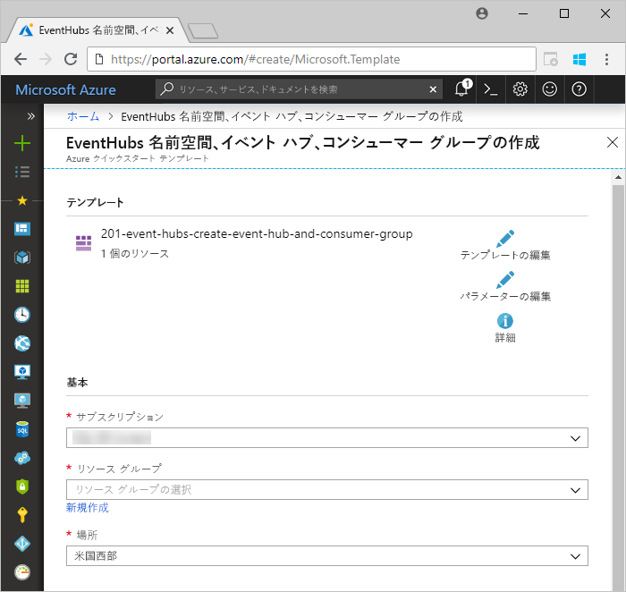

1. イベント ハブを作成するサブスクリプションを選択し、*test-hub-rg* というリソース グループを作成します。

    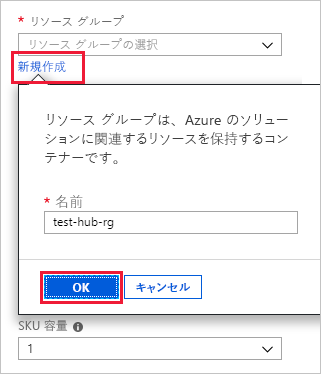

1. フォームに次の情報を入力します。

    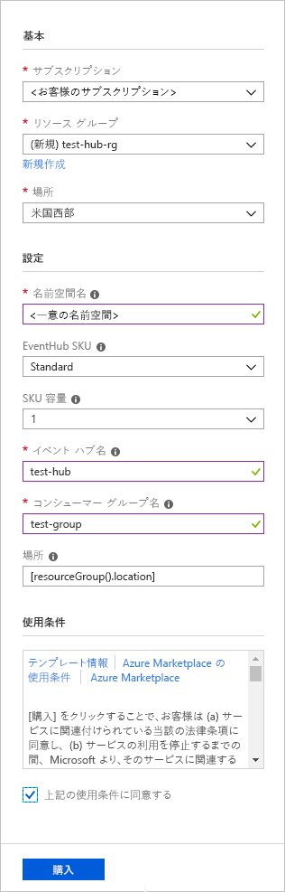

    次の表に記載されていない設定については、既定値のままにしてください。

    **設定** | **推奨値** | **フィールドの説明**
    |---|---|---|
    | サブスクリプション | 該当するサブスクリプション | イベント ハブに使用する Azure サブスクリプションを選択します。|
    | リソース グループ | *test-hub-rg* | 新しいリソース グループを作成します。 |
    | 場所 | *[米国西部]* | このクイック スタートでは *[米国西部]* を選択します。 運用システムでは、ニーズに最も適したリージョンを選択します。 最良のパフォーマンスを得るためには、Kusto クラスターと同じ場所にイベント ハブの名前空間を作成します (高スループットのイベント ハブの名前空間に最も重要です)。
    | 名前空間名 | 一意の名前空間名 | 名前空間を識別する一意の名前を選択します。 たとえば、*mytestnamespace* と指定します。 指定した名前にドメイン名 *servicebus.windows.net* が付加されます。 この名前には、文字、数字、ハイフンのみを含めることができます。 名前の先頭は英字、末尾は英字または数字にする必要があります。 値の長さは 6 から 50 文字にする必要があります。
    | イベント ハブ名 | *test-hub* | イベント ハブは、固有のスコープ コンテナーを提供する名前空間以下にあります。 イベント ハブ名は、名前空間内で一意にする必要があります。 |
    | コンシューマー グループ名 | *test-group* | コンシューマー グループを使用すると、複数の使用アプリケーションがそれぞれイベント ストリーム ビューを持つことができるようになります。 |
    | | |

1. **[購入]** を選択して、サブスクリプション内にリソースを作成することを確認します。

1. プロビジョニング プロセスを監視するには、ツール バーの **[通知]** を選択します。 デプロイが完了するまでには数分かかることがありますが、すぐに次の手順に進むこともできます。

    

## <a name="create-a-target-table-in-azure-data-explorer"></a>Azure データ エクスプローラーでターゲット テーブルを作成する

次は、Event Hubs からデータを送信する先のテーブルを Azure データ エクスプローラーで作成します。 「**前提条件**」でプロビジョニングしたクラスターとデータベースにテーブルを作成します。

1. Azure portal でクラスターに移動し、**[クエリ]** を選択します。

    ![アプリケーションの [クエリ] リンク](media/ingest-data-event-hub/query-explorer-link.png)

1. 次のコマンドをウィンドウにコピーし、**[実行]** を選択します。

    ```Kusto
    .create table TestTable (TimeStamp: datetime, Name: string, Metric: int, Source:string)
    ```

    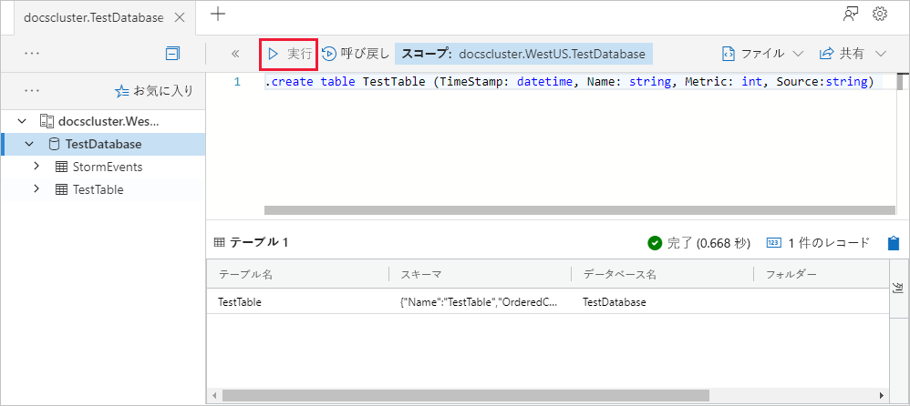

1. 次のコマンドをウィンドウにコピーし、**[実行]** を選択します。

    ```Kusto
    .create table TestTable ingestion json mapping 'TestMapping' '[{"column":"TimeStamp","path":"$.timeStamp","datatype":"datetime"},{"column":"Name","path":"$.name","datatype":"string"},{"column":"Metric","path":"$.metric","datatype":"int"},{"column":"Source","path":"$.source","datatype":"string"}]'
    ```
    このコマンドによって、受信 JSON データがテーブル (TestTable) の列名とデータ型にマップされます。

## <a name="connect-to-the-event-hub"></a>イベント ハブへの接続

ここで、Azure Data Explorer からイベント ハブに接続します。 この接続が確立されると、イベント ハブに送られてくるデータが、この記事の前の方で作成したテスト テーブルにストリームとして送られます。

1. ツールバーの **[通知]** を選択して、イベント ハブのデプロイが成功したことを確認します。

1. 作成したクラスターの **[データベース]**、**[TestDatabase]** の順に選択します。

    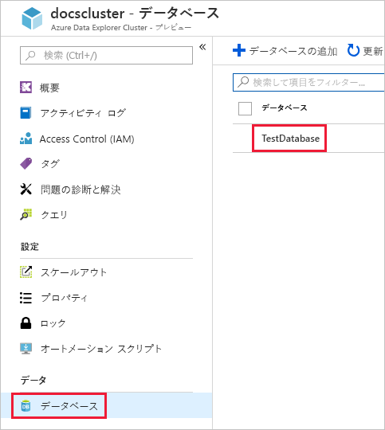

1. **[データ インジェスト]**、**[データ接続の追加]** の順に選択します。

    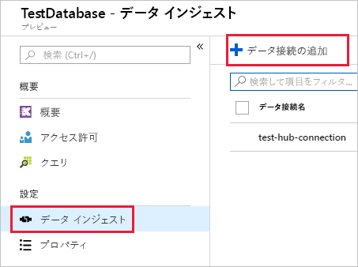

1. フォームに次の情報を入力し、**[作成]** を選択します。

    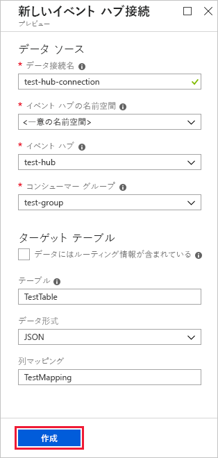

    **設定** | **推奨値** | **フィールドの説明**
    |---|---|---|
    | データ接続名 | *test-hub-connection* | Azure データ エクスプローラーで作成する接続の名前。|
    | イベント ハブの名前空間 | 一意の名前空間名 | 以前に選択した、名前空間を識別する名前。 |
    | イベント ハブ | *test-hub* | 作成したイベント ハブ。 |
    | コンシューマー グループ | *test-group* | 作成したイベント ハブに定義されているコンシューマー グループ。 |
    | ターゲット テーブル | **[My data includes routing info]\(データにルーティング情報が含まれている\)** をオフのままにしておきます。 | ルーティングには、"*静的*" と "*動的*" という 2 つのオプションがあります。 このクイック スタートでは、静的ルーティングを使用し、テーブル名、ファイル形式、およびマッピングを指定します。 動的ルーティングを使用することもでき、その場合は必要なルーティング情報をデータに含めます。 |
    | テーブル | *TestTable* | **TestDatabase** に作成したテーブル。 |
    | データ形式 | *JSON* | JSON 形式と CSV 形式がサポートされています。 |
    | 列マッピング | *TestMapping* | **TestDatabase** に作成したマッピング。受信 JSON データを **TestTable** の列名とデータ型にマッピングします。|
    | | |

## <a name="copy-the-connection-string"></a>接続文字列のコピー

前提条件の一覧にある[サンプル アプリ](https://github.com/Azure-Samples/event-hubs-dotnet-ingest)を実行する場合は、イベント ハブの名前空間用の接続文字列が必要です。

1. 作成したイベント ハブ名前空間で、**[共有アクセス ポリシー]**、**[RootManageSharedAccessKey]** の順に選択します。

    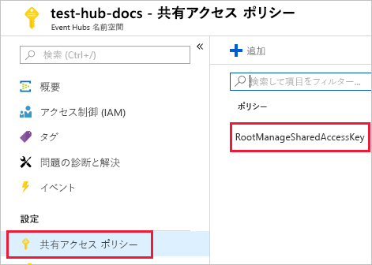

1. **[接続文字列 - 主キー]** をコピーします これを、次のセクションで貼り付けます。

    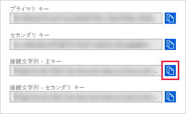

## <a name="generate-sample-data"></a>サンプル データを作成する

Azure Data Explorer とイベント ハブが接続されたので、ダウンロードした[サンプル アプリ](https://github.com/Azure-Samples/event-hubs-dotnet-ingest)を使用してデータを生成します。

1. Visual Studio でサンプル アプリ ソリューションを開きます。

1. *program.cs* ファイルで、`connectionString` 定数をイベント ハブ名前空間からコピーした接続文字列に変更します。

    ```csharp
    const string eventHubName = "test-hub";
    // Copy the connection string ("Connection string-primary key") from your Event Hub namespace.
    const string connectionString = @"<YourConnectionString>";
    ```

1. アプリケーションをビルドし、実行します。 アプリからイベント ハブにメッセージが送信され、10 秒ごとに状態が出力されます。

1. アプリからいくつかメッセージが送信されたら、イベント ハブとテスト テーブルへのデータの流れを確認するという次の手順に進みます。

## <a name="review-the-data-flow"></a>データ フローの確認

データを生成するアプリを使用して、そのデータがイベント ハブからクラスター内のテーブルに送信されるのを確認できるようになりました。

1. アプリの実行中に Azure portal でイベント ハブを確認すると、アクティビティの急上昇が見られます。

    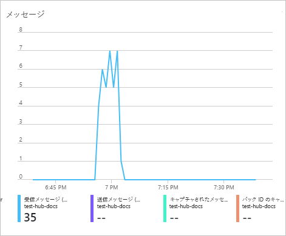

1. メッセージ 99 に達したら、サンプル アプリに戻って停止します。

1. これまでにデータベースに届いたメッセージ数を確認するには、テスト データベースで次のクエリを実行します。

    ```Kusto
    TestTable
    | count
    ```

1. メッセージの内容を表示するには、次のクエリを実行します。

    ```Kusto
    TestTable
    ```

    結果は次のようになります。

    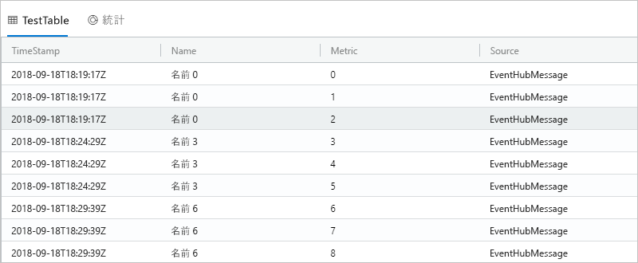

## <a name="clean-up-resources"></a>リソースのクリーンアップ

このイベント ハブを今後使用する予定がない場合は、コストが発生しないように **test-hub-rg** をクリーンアップします。

1. Azure Portal の左端で **[リソース グループ]** を選択し、作成したリソース グループを選択します。  

    左側のメニューが折りたたまれている場合は、  をクリックして展開します。

   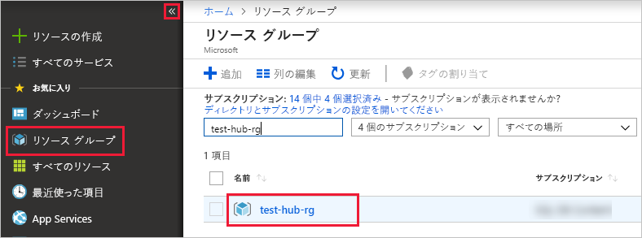

1. **test-resource-group** で **[リソース グループの削除]** を選択します。

1. 新しいウィンドウで、削除するリソース グループの名前 (*test-hub-rg*) を入力し、**[削除]** を選択します。

## <a name="next-steps"></a>次の手順

> [!div class="nextstepaction"]
> [クイック スタート: Azure Data Explorer でデータのクエリを実行する](web-query-data.md)
