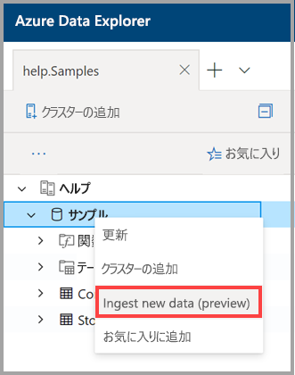

# ワンクリックでのインジェストを使用して Azure Data Explorer にデータを取り込む

この記事では、JSON 形式または CSV 形式の新しいテーブルを簡単に取り込むワンクリックでのインジェストを使用する方法について説明します。 ストレージまたはローカル ファイルから既存のテーブルまたは新しいテーブルに、データを取り込むことができます。 直感的なワンクリック ウィザードを使用して、データを数分以内に取り込みます。 その後、Azure Data Explorer Web UI を使用して、テーブルの編集やクエリの実行を行うことができます。

## 前提条件

* Azure サブスクリプションをお持ちでない場合は、開始する前に[無料の Azure アカウント](https://azure.microsoft.com/free/)を作成してください。
* [アプリケーション](https://dataexplorer.azure.com/)にサインインします。
* [Azure Data Explorer クラスターとデータベース](create-cluster-database-portal.md)を作成します。
* [Web UI にサインイン](https://dataexplorer.azure.com/)して、[クラスターへの接続を追加](/azure/data-explorer/web-query-data#add-clusters)します。

## 新しいデータを取り込む

1. Web UI の左側のメニューで*データベース*または*テーブル*の行を右クリックし、 **[Ingest new data (Preview)]\(新しいデータの取り込み (プレビュー)\)** を選択します。

       
 
1. **[Ingest new data (preview)]\(新しいデータの取り込み (プレビュー)\)** ウィンドウで、 **[ソース]** タブを選択して、 **[プロジェクトの詳細]** を入力します。

    * **[テーブル]** には、ドロップダウン メニューから既存のテーブル名を選択するか、または **[新規作成]** を選択して新しいテーブルを作成します。
    * **[Ingestion type]\(インジェストの種類\)** には、 **[ストレージから]** または **[ファイルから]** を選択します。
      * **[ストレージから]** を選択した場合は、 **[ストレージへのリンク]** を選択して URL を追加します。 プライベート ストレージ アカウントには [BLOB SAS URL](/azure/vs-azure-tools-storage-explorer-blobs#get-the-sas-for-a-blob-container) を使用します。 
      * **[ファイルから]** を選択した場合は、 **[参照]** を選択し、ファイルをボックスにドラッグします。
    * テーブル列の構成を表示および編集するには、 **[スキーマの編集]** を選択します。
 
     

    > [!TIP]
    > **テーブル**の行で *[Ingest new data (Preview)] (新しいデータの取り込み (プレビュー))* を選択した場合は、選択したテーブル名が **[プロジェクトの詳細]** に表示されます。

1. 既存のテーブルを選択した場合は、ソース データの列をターゲット テーブルの列にマップする **[Map columns] (マップ列)** ウィンドウが開きます。 
    * テーブルからターゲット列を削除するには、 **[Omit column] (列の省略)** を使用します。
    * テーブルに新しい列を追加するには、 **[新しい列]** を使用します。

    ![[Map columns] (マップ列) ウィンドウ](media/ingest-data-one-click/one-click-map-columns-window.png)

1. **[スキーマ]** タブ内:

    * ドロップダウン メニューから **[圧縮の種類]** を選択して、 **[非圧縮]** または **[GZip]** のどちらかを選択します。
    * ドロップダウン メニューから **[データ形式]** を選択して、 **[JSON]** 、 **[CSV]** 、 **[TSV]** 、 **[SCSV]** 、 **[SOHSV]** 、 **[TSVE]** 、または **[PSV]** を選択します。 
        * **JSON** 形式を選択する場合は、1 から 10 の **[JSON levels]\(JSON レベル\)** も選択する必要があります。 このレベルは、テーブル列でのデータ表現に影響します。 
        * JSON 以外の形式を選択した場合は、ファイルの見出し行が無視されるように、 **[Include column names]\(列名を含める\)** チェック ボックスをオンにする必要があります。
    * **[マッピング名]** は自動的に設定されますが、編集できます。
    * 既存のテーブルを選択した場合は、 **[Map columns]\(マップ列\)** を選択して **[Map columns]\(マップ列\)** ウィンドウを開くことができます。

    

1. **[エディター]** ペインの上にある **v** ボタンを選択して、エディターを開きます。 エディターでは、ご自分の入力から生成された自動クエリを表示およびコピーできます。 

1. この表で、 
    * 新しい列ヘッダーを右クリックして、 **[データ型の変更]** 、 **[列名の変更]** 、 **[列の削除]** 、 **[昇順で並べ替え]** 、または　 **[降順で並べ替え]** を選択します。 既存の列で選択できるのは、データの並べ替えのみです。 
    * 編集するには、新しい列の名前をダブルクリックします。

1. テーブルおよびマッピングを作成し、データ インジェストを開始するには、 **[Start ingestion]\(インジェストの開始\)** を選択します。

     
 
## クエリ データ

1. **[Data ingestion completed]\(データ インジェストが完了しました\)** ウィンドウでは、データ インジェストが正常に終了した場合、3 つのステップすべてに緑色のチェックマークが表示されます。
 
    

1. **v** ボタンを選択してクエリを開きます。 クエリを編集するには、Web UI にコピーします。

1. 右側のメニューには、 **[Quick queries]\(クイック クエリ\)** と **[ツール]** オプションが含まれています。 

    * **[Quick queries]\(クイック クエリ\)** には、クエリの例がある Web UI へのリンクが含まれています。
    * **[ツール]** には、Web UI での **Drop コマンド**リンクが含まれており、関連する `.drop` コマンドを実行して問題をトラブルシューティングできます。

    > [!TIP]
    > `.drop` コマンドを使用すると、データが失われる可能性があります。 慎重に使用してください。

## 次のステップ

* [Azure Data Explorer の Web UI でデータのクエリを実行する](web-query-data.md)
* [Kusto クエリ言語を使用して Azure Data Explorer のクエリを作成する](write-queries.md)
